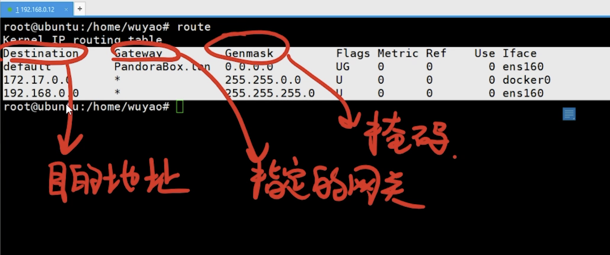
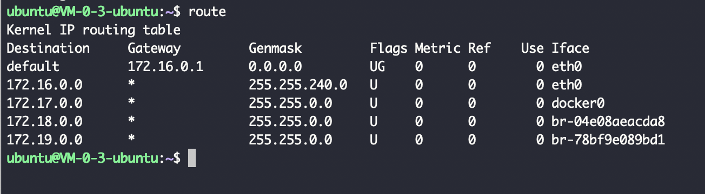
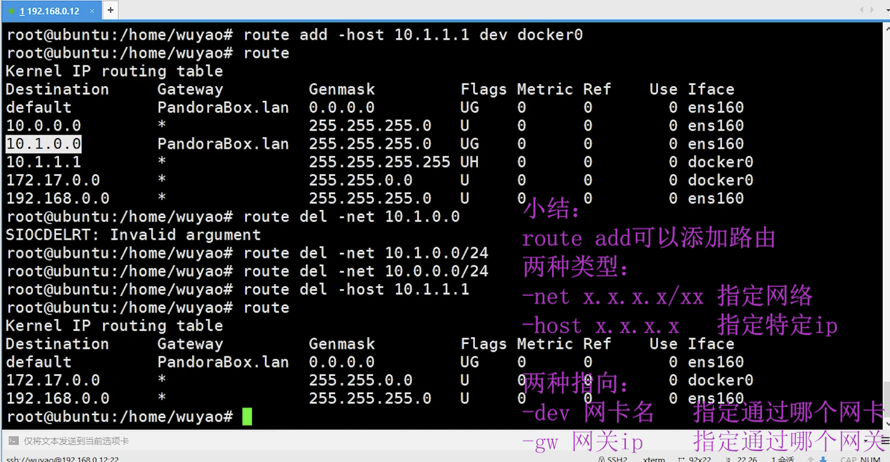
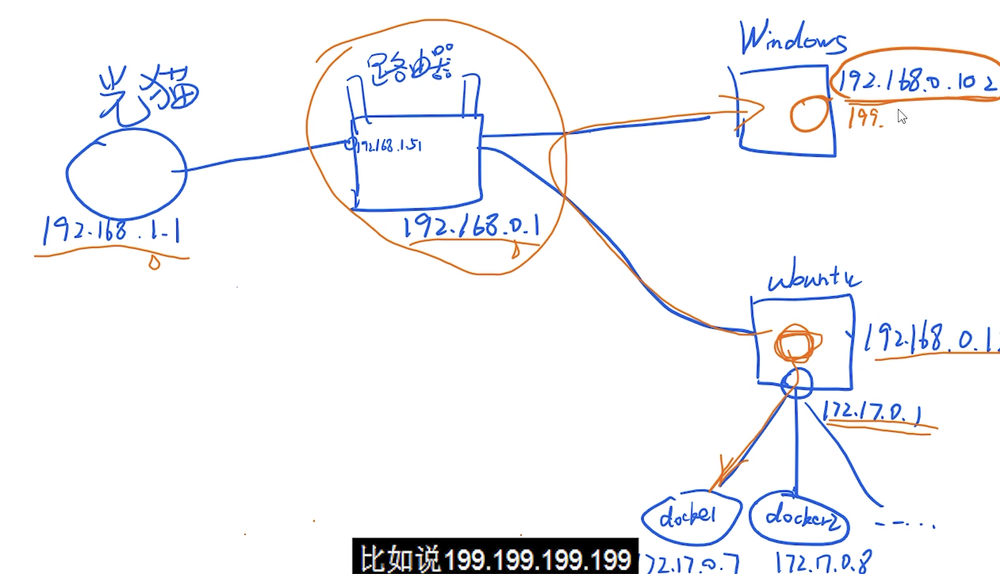

Destination:

如果不满足该列的任何一个ip,则走默认的`default`

---

Gataway:

`*`是 不指定gateway.有的系统是`0.0.0.0`,与`*`意义相同

---

Genmask:

`0.0.0.0`是不指定掩码,

`255.255.0.0`掩码了16位,172.17 开头的ip,会走这个网关

`255.255.255.0`掩码了16位,192.168.0 开头的ip都会走这个网关

当是`255.255.255.255`时,则说明指定的是具体的一个ip,掩码全掩了

---

Flasgs指定不是很重要, 可能有三种标识:

- U: used
- G: gateway
- H: host

 

Metric 是下一跳,也不重要

Ref 为被引用次数,不重要

---

Iface 是指通过哪张网卡进行数据的路由

---

`traceroute`命令比`ping`指令好用

 

