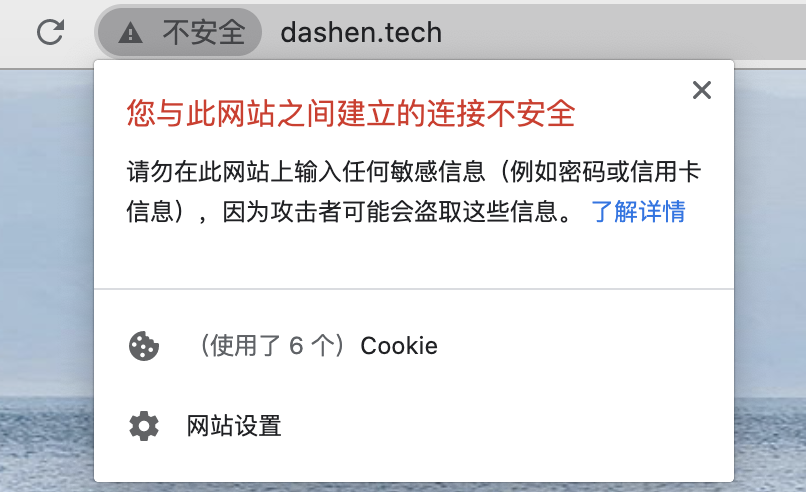
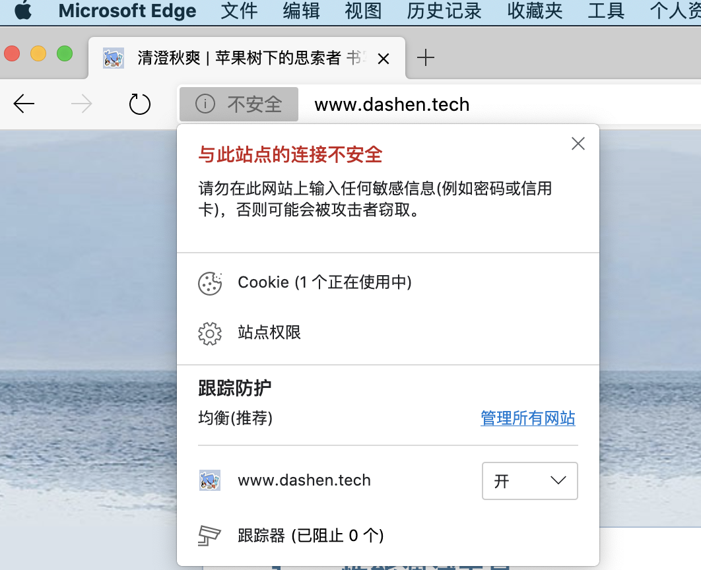
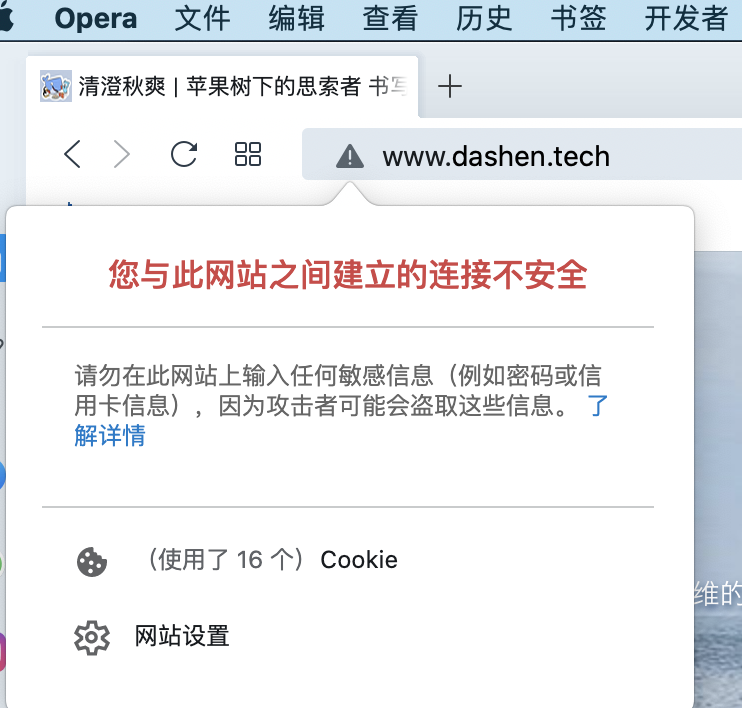
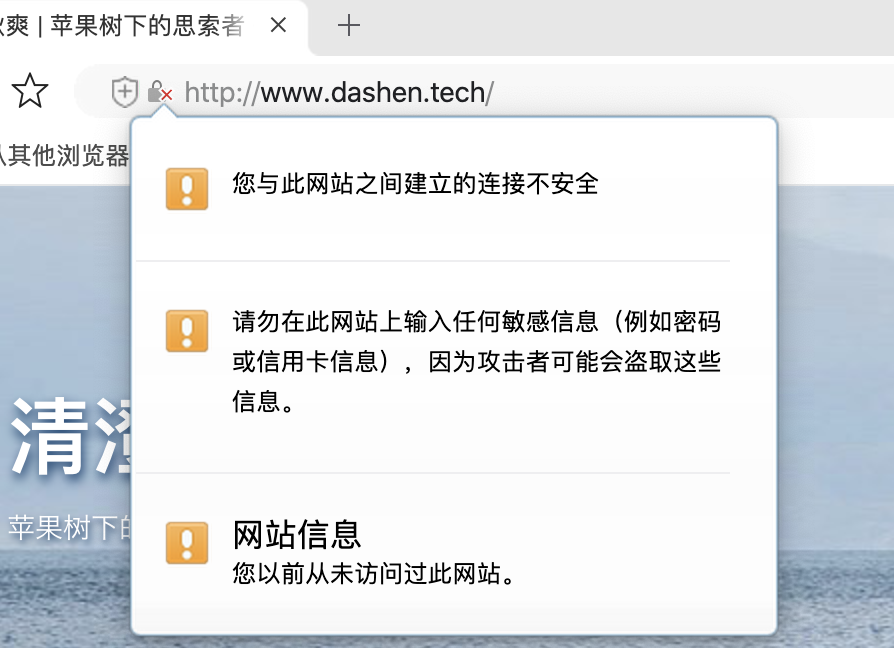
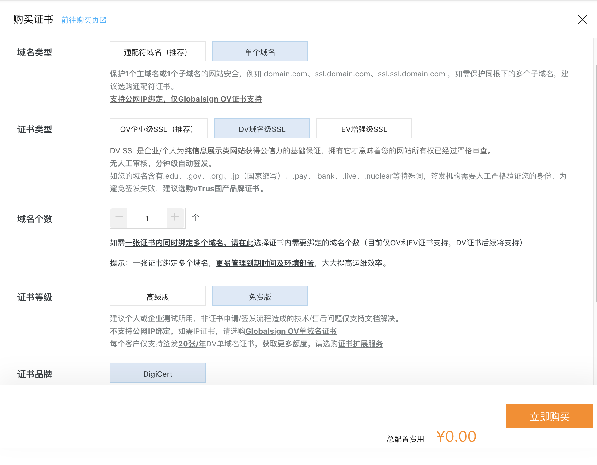
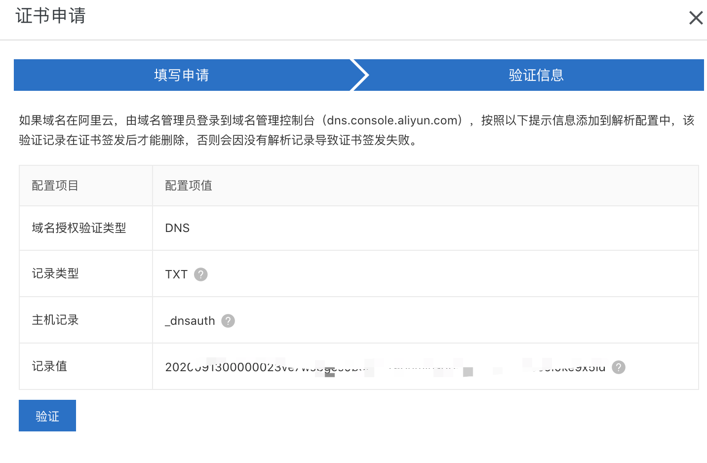
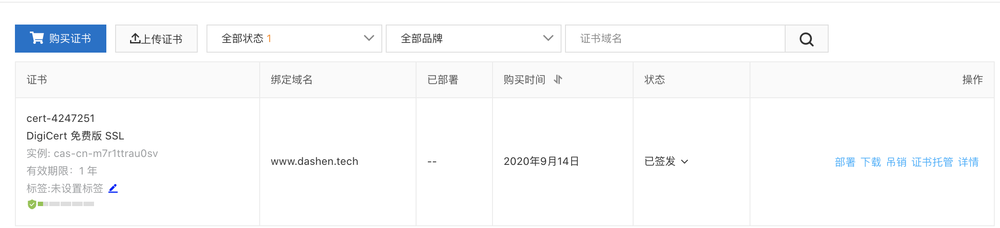
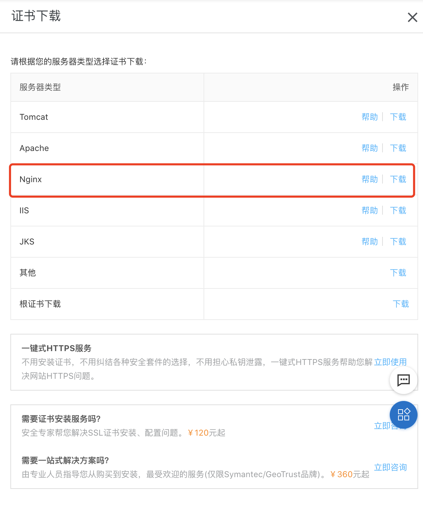
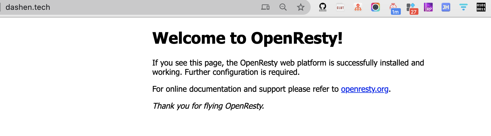
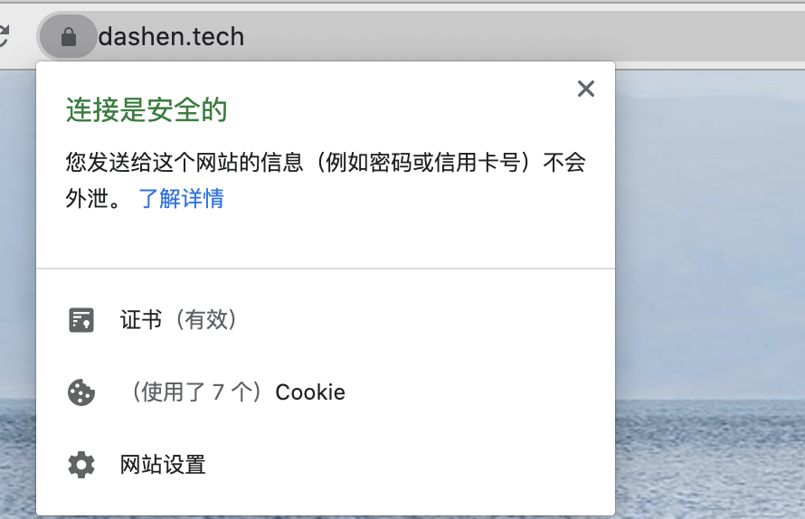

> HTTPS （全称：Hyper Text Transfer Protocol over SecureSocket Layer），是以安全为目标的 HTTP 通道，在HTTP的基础上通过传输加密和身份认证保证了传输过程的安全性。HTTPS 在HTTP 的基础下加入SSL 层，HTTPS 的安全基础是 SSL，因此加密的详细内容就需要 SSL。 HTTPS 存在不同于 HTTP 的默认端口及一个加密/身份验证层（在 HTTP与 TCP 之间），这个系统提供了身份验证与加密通讯方法。

### 现状

<br>







<br>

---

### 证书申请

<br>

除了向公有云申请证书, 也可使用 *自签名*或*openssl*生成的证书,但方便起见还是使用云厂商提供的证书.






一般免费版,只有一年有效期.到期需要重新申请&更换






<br>

---

<br>

### Nginx配置


<br>


将证书文件上传至`/usr/local/openresty/nginx/conf/cert`目录下.

<br>

博客项目当前的conf配置如下:

```java
server {
    listen      80;
    server_name dashen.tech www.dashen.tech;
    access_log  /var/log/blog.access.log main;
    error_log  /var/log/blog.error.log;

  location / {
        root        /home/ubuntu/cuishuang.github.io;
        index       index.html;
        expires     1d;
        add_header  Cache-Control public;
        access_log  off;
    }
}
```

<br>
新增启用https的配置:

```java
server {
      listen        443 ssl;                                                 
      server_name    dashen.tech www.dashen.tech;  #域名                         
      ssl_certificate      /usr/local/openresty/nginx/conf/cert/shuang_blog.pem;  #证书路径     
      ssl_certificate_key  /usr/local/openresty/nginx/conf/cert/shuang_blog.key;  #key路径             
      ssl_session_cache    shared:SSL:1m;   #s储存SSL会话的缓存类型和大小                       
      ssl_session_timeout  5m; #会话过期时间 

      access_log  /var/log/blog.access.log main;
      error_log  /var/log/blog.error.log;

location / {
        root        /home/ubuntu/cuishuang.github.io;
        index       index.html;
        expires     1d;
        add_header  Cache-Control public;
        access_log  off;
    }                                                     
  }
```

<br>

删掉之前的conf. 重启nginx,访问[https://www.dashen.tech](https://www.dashen.tech),已能正常访问.


<br>


再访问之前的网址[http://www.dashen.tech](http://www.dashen.tech),则




<br>


**配置将http访问自动跳转到https**

<br>

再增加一段配置:

```java
server {
    listen      80;
    server_name dashen.tech www.dashen.tech;
    access_log  /var/log/blog.access.log main;
    error_log  /var/log/blog.error.log;

    return      301 https://$server_name$request_uri; #这是nginx最新支持的写法

  location / {
        root        /home/ubuntu/cuishuang.github.io;
        index       index.html;
        expires     1d;
        add_header  Cache-Control public;
        access_log  off;
    }
}
```

参考: [Nginx强制跳转Https](https://www.jianshu.com/p/116fc2d08165)


再次重启nginx,这时请求[http://www.dashen.tech](http://www.dashen.tech)就可以跳转到[https://www.dashen.tech](https://www.dashen.tech)


---


但因为网站下有部分资源使用了http,所以浏览器依然没有变为安全锁,

可参考[Hexo启用https加密连接](https://note.youdao.com/web/#/file/recent/note/WEBe69d252eb353dd5ee0210d053ec0cc3a/),


也可右键查看哪些请求使用了http,将其修改为https即可~



