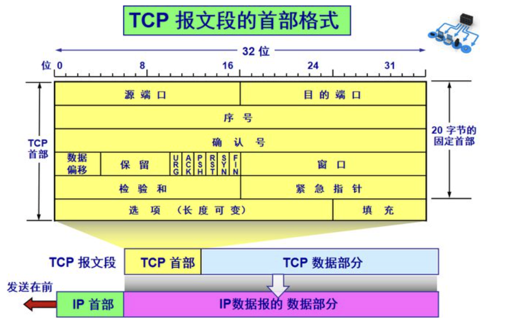

>  因特网中使用的是TCP/IP, 对 OSI 模型做了很多简化，如应用层没有对 `表示层、会话层`做严格的区分，`数据链路层和物理层`也没有做严格区分(这就是所谓的7层和4层)


### DNS

<br>


在浏览器地址栏输入 `king.dashne.tech`

在Wireshark中过滤
 `dns and ip.addr == 223.5.5.5`

（关于过滤规则，可参考 [Wireshark系列之5 显示过滤器](https://blog.51cto.com/yttitan/1737031)）


<br>


先对请求的数据包进行分析：


*从下到上*分别是 **应**用层，**传**输层，**网**络层，**数**据链路层，**物**理层


<br>

#### <font color="orange">物理层</font>

<br>


帧编号为*8194*，帧长度为76字节(满足了最小帧长 为46字节的要求，故而不会被判断为无用帧)


其他字段可参考下图([原文点此](https://blog.csdn.net/hguisu/article/details/12521597))


<br>

#### <font color="orange">数据链路层</font>


<br>

目前主要有[两种格式的以太网帧](https://blog.csdn.net/yetugeng/article/details/100516431)：Ethernet II（DIX 2.0）和IEEE 802.3

IP、ARP、EAP和QICQ协议使用Ethernet II帧结构，而STP协议则使用IEEE 802.3帧结构


给出了目的地址的Mac信息，以及源地址的Mac信息，类型


目标Mac地址，源Mac地址，类型，数据，FCS

<font size=1>

FSC即 帧校验序列，包含长度为4个字节的循环冗余校验值（CRC），由发送设备计算产生，在接收方被重新计算以确定帧在传送过程中是否被损坏

</font>


<br>

#### <font color="orange">网络层</font>


<br>


<br>

#### <font color="orange">传输层-UDP协议</font>


<br>


DNS是应用层协议，一般在传输层使用UDP协议


<br>

#### <font color="orange">应用层</font>


<br>


DNS协议的默认端口为53

<br>


响应的网络包大同小异

---


<br>


### HTTP

<br>


#### **<font color="orange">传输层-TCP协议：</font>**


<br>


三次握手协议

将报文分解成多个段进行传输，到目的地后再重新装配这些段


通过 *序号*，*确认序号*，*校验和*， 来实现可靠传输





<br>

- 序号：Sequence Number，用来解决网络包乱序（reordering）问题

- 确认序号：Acknowledgement Number，即ACK——确认收到，用来解决丢包的问题


- 窗口Window：又叫Advertised-Window，即著名的滑动窗口（Sliding Window），用于解决流控


- TCP Flag ：包的类型，主要用于操控TCP的状态机，如SYN

- Checksum：TCP数据段的校验和   

<br>


<br>

```go
Transmission Control Protocol, Src Port: 21000, Dst Port:52529, Seq: 12936, ACK 183589 Len: 17    传输控制协议TCP的内容

     Source port: 21000  源端口名称（端口号）（用于寻找发端应用进程）
     Destination port: 52529 目的端口
     Sequence number: 0    (relative sequence number)    序列号（相对序列号，此序列号用来确定传送数据的正确位置，且序列号，用来侦测丢失的包）；

    [Next sequence number: 215 (relative sequence number)] #下一个序列号

     Acknowledgement number :183589  是32位确认序号，确认其有效；
     Header length: 32 bytes        头部长度
     Flags: 0x02 (SYN)        TCP标记字段（本字段是SYN，是请求建立TCP连接）
     Window size value: 6364  流量控制的窗口大小
     Checksum: 0xf73b [correct] TCP数据段的校验和
     Options: (12 bytes) 可选项

```

  <br>


- <font color="	#4682B4">源端口和目的端口：</font> 各占2个字节，16比特的端口号加上32比特的IP地址，共同构成相当于传输层服务访问点的地址

  <br>

- <font color="	#4682B4">Seq序号：</font> 占4个字节，是本报文段所发送的数据部分第一个字节的序号。在TCP传送的数据流中，每一个字节都有一个序号。

    1、假设某时序号为300，简单的理解就是发送方告诉接收端“我发送的数据是从第300开始的”。

     2、假设起数据len=100字节，则下一个报文段的序号就是400；

  <br>

- <font color="	#4682B4">ACK 确认序号：</font> 占4字节，是期望收到对方下次发送的数据的第一个字节的序号，也就是期望收到的下一个报文段的首部中的序号；

      1、确认序号是上一次已经成功接收到数据字节序号加1。还可理解为接收端告诉发送端下一次想接收开始序号。假设某时确认序号为1000，简单理解就是接收方告诉发送方“我已经收到第999序号了，我下一次想接收的数据是从1000开始的”。

      2、由于序号字段有32 bit 长，可以对4GB的数据进行编号，这样就可保证当序号重复使用时，旧序号的数据早已在网络中消失了；

        在数据传输过程中：

         第一个报文发送：Seq1=1  ACK1=1  len1=359

         收到第一个报文回复：Seq2 =1  ACK2=Seq1+ ACK1= 360， len1=17

         下一个报文发送：Seq3=ACK2 =Seq1 （上一个发送的报文seq1 +上一个发送的报文len1）=360    ACK3=Seq1+ ACK1 =18  len3=0

         两次ACK一样：你应该发数据，但我们没有收到数据，所以你还得同样ack继续发送

  <br>

- <font color="	#4682B4">Header length首部长度（4位）：</font> 报文头长度（单位：位）/32

    1000（转化为10进制为8，8*32/8 = 32，该报文报头长度为32个字节）

    存在该字段是因为TCP报头中任选字段长度可变

    报头不包含任何任选字段则长度为20字节；4位所能表示的最大值为1111，转化为10进制为15，15*32/8 = 60，故报头最大长度为60字节

  <br>

- <font color="	#4682B4">Flag标志位：</font> Flages字段有以下几个标识：SYN, FIN, ACK, PSH, RST, URG.

      SYN：表示建立连接，

     同步序号用来发起一个连接,在建立连接时使用，<font color="#FF6347ß">当SYN=1而ACK=0时，表明这是一个连接请求报文段</font>。对方若同意建立连接，在发回的报文段中使SYN=1和ACK=1。因此，SYN=1表示这是一个连接请求或连接接受报文，而ACK的值用来区分是哪一种报文；

       ACK：ACK表示响应,确认

    序号有效,只有当ACK=1时，确认序号字段才有意义；

  
      PSH：PSH表示有DATA数据传输，

    当PSH=1时，表明请求地TCP将本报文段立即传送给其应用层，而不要等到整个缓存都填满了之后再向上交付。

      FIN：表示关闭连接

     发端完成发送任务（主动关闭）,用来释放一个连接，当FIN=1时，表明欲发送的字节串已经发完，并要求释放传输连接；

      RST：表示重建连接

    当RST=1时，表明出现严重差错，必须释放连接，然后再重建传输连接。复位比特还用来拒绝一个非法的报文段或拒绝打开一个连接；

      Nonce Sum：有效排除潜在的ECN滥用，RFC 3540

    Congestion Window Reduced（CWR）：拥塞窗口减少标志

    ECN-Echo：ECE / ECN标志


      URG: 紧急指针有效（urgentpointer） 
      
    当URG=1时，表明此报文应尽快传送，而不要按原来的排队顺序来传送。与“紧急指针”字段配合使用，紧急指针指出在本报文段中的紧      急数据的最后一个字节的序号，使接收方可以知道紧急数据共有多长；


<br>

```go
1)、、其中，ACK是可能与SYN，FIN等同时使用的，比如SYN和ACK可能同时为1，它表示的就是建立连接之后的响应，
 如果只是单个的一个SYN，它表示的只是建立连接。TCP的几次握手就是通过这样的ACK表现出来的。

2）、SYN与FIN是不会同时为1的，因为前者表示的是建立连接，而后者表示的是断开连接。

3）、RST一般是在FIN之后才会出现为1的情况，表示的是连接重置。
 一般地，当出现FIN包或RST包时，我们便认为客户端与服务器端断开了连接；而当出现SYN和SYN＋ACK包时，我们认为客户端与服务器建立了一个连接。

4）、PSH为1的情况，一般只出现在 DATA内容不为0的包中，也就是说PSH为1表示的是有真正的TCP数据包内容被传递。 
```


<br>

- <font color="	#4682B4">window窗口大小（2字节）：</font>

    TCP的流量控制由连接的每一端通过声明的窗口大小来提供。窗口大小为字节数，起始于确认序 号字段指明的值，这个值是接收端正期望接收的字节。窗口大小是一个16bit字段，因而窗口大小最大为65535字节

<br>

- <font color="#4682B4">Checksum检验和（2字节）：</font>

    检验和覆盖整个TCP报文段；强制字段，由发送端计算存储，由接收端进行验证

<br>


- <font color="#4682B4">Urgent pointer 紧急指针（2字节）：</font>

    当Urgent标志置1时，紧急指针才有效


<br>


- <font color="#4682B4">Options选项 ：</font>

    选项字段 允许每台主机设定能够接受的最大TCP载荷能力(缺省536字节) 。 


<br>


更多关于TCP的 **窗口控制**，**重传机制**，可参见 [TCP/IP第四层--传输层TCP和TPC数据报文详解](https://blog.csdn.net/hguisu/article/details/12521597)


[这一篇TCP总结，请务必收下](https://www.163.com/dy/article/G8UVBN8S0531A3HQ.html)