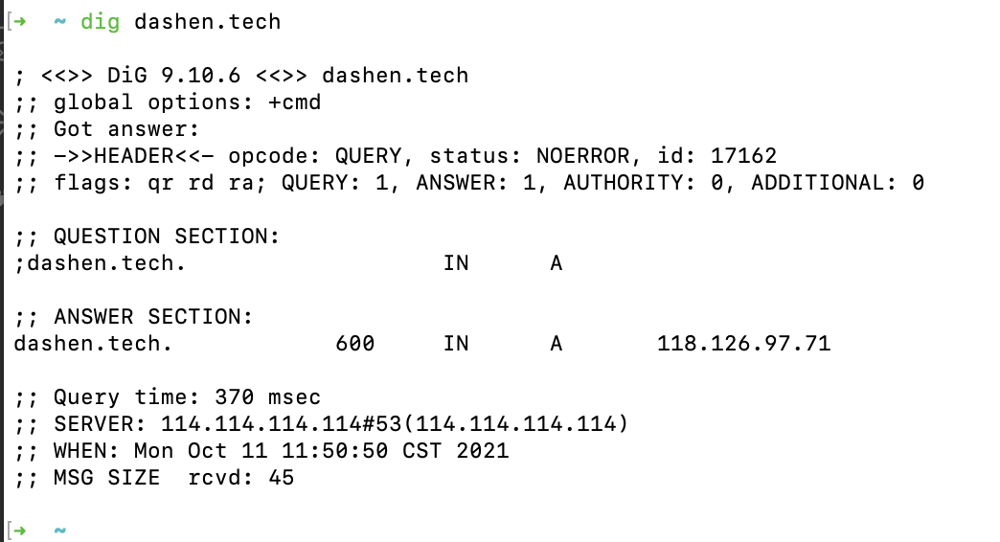
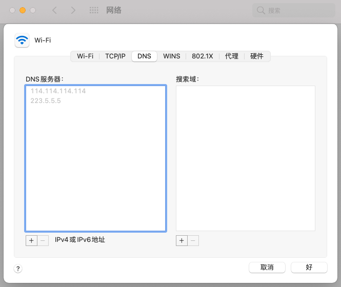
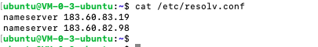
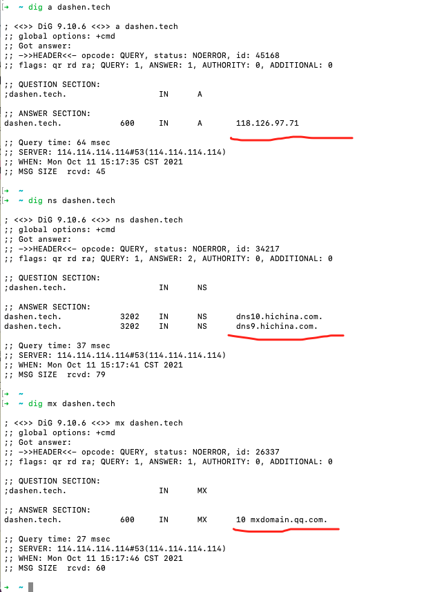

本文全篇参考自[阮一峰-DNS 原理入门](https://www.ruanyifeng.com/blog/2016/06/dns.html)，对照内容操作一遍。


<br>


### 查询过程

<br>





六段信息：


```c
dig dashen.tech

; <<>> DiG 9.10.6 <<>> dashen.tech
;; global options: +cmd
;; Got answer:
;; ->>HEADER<<- opcode: QUERY, status: NOERROR, id: 17162
;; flags: qr rd ra; QUERY: 1, ANSWER: 1, AUTHORITY: 0, ADDITIONAL: 0

;; QUESTION SECTION:
;dashen.tech.			IN	A

;; ANSWER SECTION:
dashen.tech.		600	IN	A	118.126.97.71

;; Query time: 370 msec
;; SERVER: 114.114.114.114#53(114.114.114.114)
;; WHEN: Mon Oct 11 11:50:50 CST 2016
;; MSG SIZE  rcvd: 45
```

<br>

#### <font color="orange">第一段是查询参数和统计</font>


```go
; <<>> DiG 9.10.6 <<>> dashen.tech
;; global options: +cmd
;; Got answer:
;; ->>HEADER<<- opcode: QUERY, status: NOERROR, id: 17162
;; flags: qr rd ra; QUERY: 1, ANSWER: 1, AUTHORITY: 0, ADDITIONAL: 0
```


<br>

#### <font color="orange">第二段是查询内容</font>


```go
;; QUESTION SECTION:
;dashen.tech.			IN	A
```

查询域名dashen.tech的A记录，A是address的缩写

<br>

#### <font color="orange">第三段是DNS服务器的答复 </font>


```go
;; ANSWER SECTION:
dashen.tech.		600	IN	A	118.126.97.71
```

上面结果显示，dashen.tech有四个A记录，即一个IP地址。

600是TTL值（Time to live），表示缓存时间，即600秒之内不用重新查询。


如果是`dig bilibili.com`,则为:


```go
;; ANSWER SECTION:
bilibili.com.		61	IN	A	120.92.174.135
bilibili.com.		61	IN	A	110.43.34.66
bilibili.com.		61	IN	A	119.3.238.64
```

有三个A记录

<br>

#### <font color="orange">第四段显示dashen.tech的NS记录 </font>


NS是 Name Server的缩写，即哪些服务器负责管理dashen.tech的DNS记录。


**最新的dig命令，没有了第四段，第五段的信息**


<br>

#### <font color="orange">第五段是上面四个域名服务器的IP地址 </font>


**最新的dig命令，没有了第四段，第五段的信息**


<br>

#### <font color="orange">第六段是DNS服务器的一些传输信息 </font>


```go
;; Query time: 370 msec
;; SERVER: 114.114.114.114#53(114.114.114.114)
;; WHEN: Mon Oct 11 11:50:50 CST 2016
;; MSG SIZE  rcvd: 45
```

本机的DNS服务器是114.114.114.114，查询端口是53（DNS服务器的默认端口），以及回应长度是45字节


---


<br>


### DNS服务器


<br>


本机一定要知道DNS服务器的IP地址。通过DNS服务器，才能知道某个域名的IP地址到底是什么。


DNS服务器的IP地址，可能是动态的，每次上网时由网关分配，这叫做`DHCP机制`；也有可能是事先指定的固定地址。





<br>

（Linux系统里中，DNS服务器的IP地址保存在/etc/resolv.conf文件）




DNS服务器可以用内网地址，也可以用公网的DNS服务器，如Google的8.8.8.8


<font size=1>

本机只向自己的DNS服务器查询，dig命令有一个@参数，显示向其他DNS服务器查询的结果:

```go
dig @8.8.8.8 dashen.tech           

; <<>> DiG 9.10.6 <<>> @8.8.8.8 dashen.tech
; (1 server found)
;; global options: +cmd
;; Got answer:
;; ->>HEADER<<- opcode: QUERY, status: NOERROR, id: 36114
;; flags: qr rd ra; QUERY: 1, ANSWER: 1, AUTHORITY: 0, ADDITIONAL: 1

;; OPT PSEUDOSECTION:
; EDNS: version: 0, flags:; udp: 512
;; QUESTION SECTION:
;dashen.tech.			IN	A

;; ANSWER SECTION:
dashen.tech.		600	IN	A	118.126.97.71

;; Query time: 85 msec
;; SERVER: 8.8.8.8#53(8.8.8.8)
;; WHEN: Mon Oct 11 13:56:17 CST 2016
;; MSG SIZE  rcvd: 56
```

</font>


<br>


### 域名的层级


<br>


DNS服务器怎么会知道每个域名的IP地址呢？答案是分级查询


```go
;; QUESTION SECTION:
;dashen.tech.			IN	A
```

每个域名的尾部都多了一个点, 这不是疏忽，而是所有域名的尾部，实际上都有一个根域名。


即真正的域名为 dashen.tech.root，简写为`dashen.tech.` 。因为根域名.root对于所有域名都是一样的，所以可以省略


根域名的下一级，叫做"顶级域名"（top-level domain，TLD），比如`.com`、`.net`、`.tech`；

再下一级叫做"次级域名"（second-level domain，SLD），`dashen.tech`里面的`.dashen`，这一级域名是用户可以注册的；


再下一级是主机名（host），比如`n.dashen.tech`里面的`n`，又称为"三级域名"，这是用户在自己的域里面为服务器分配的名称，是用户可以任意分配的

 即

```go

主机名.次级域名.顶级域名.根域名

n.dashen.tech.root
```


<br>


### 根域名服务器


<br>


DNS服务器根据域名的层级，进行分级查询

每一级域名都有自己的NS记录，NS记录指向该级域名的域名服务器。这些服务器知道下一级域名的各种记录。


(有点像网络的分层结构)


所谓"分级查询"，就是从根域名开始，依次查询每一级域名的NS记录，直到查到最终的IP地址，过程大致如下：

```go
从"根域名服务器"查到"顶级域名服务器"的NS记录和A记录（IP地址）
从"顶级域名服务器"查到"次级域名服务器"的NS记录和A记录（IP地址）
从"次级域名服务器"查出"主机名"的IP地址
```


DNS服务器怎么知道"根域名服务器"的IP地址?

因为 "根域名服务器"的NS记录和IP地址一般是不会变化的，所以内置在DNS服务器里面


```go
;       This file holds the information on root name servers needed to
;       initialize cache of Internet domain name servers
;       (e.g. reference this file in the "cache  .  "
;       configuration file of BIND domain name servers).
;
;       This file is made available by InterNIC 
;       under anonymous FTP as
;           file                /domain/db.cache
;           on server           FTP.INTERNIC.NET
;       -OR-                    RS.INTERNIC.NET
;
;       last update:    Feb 04, 2008
;       related version of root zone:   2008020400
;
; formerly NS.INTERNIC.NET
;
.                        3600000  IN  NS    A.ROOT-SERVERS.NET.
A.ROOT-SERVERS.NET.      3600000      A     198.41.0.4
A.ROOT-SERVERS.NET.      3600000      AAAA  2001:503:BA3E::2:30
;
; formerly NS1.ISI.EDU
;
.                        3600000      NS    B.ROOT-SERVERS.NET.
B.ROOT-SERVERS.NET.      3600000      A     192.228.79.201
;
; formerly C.PSI.NET
;
.                        3600000      NS    C.ROOT-SERVERS.NET.
C.ROOT-SERVERS.NET.      3600000      A     192.33.4.12
;
; formerly TERP.UMD.EDU
;
.                        3600000      NS    D.ROOT-SERVERS.NET.
D.ROOT-SERVERS.NET.      3600000      A     128.8.10.90
;
; formerly NS.NASA.GOV
;
.                        3600000      NS    E.ROOT-SERVERS.NET.
E.ROOT-SERVERS.NET.      3600000      A     192.203.230.10
;
; formerly NS.ISC.ORG
;
.                        3600000      NS    F.ROOT-SERVERS.NET.
F.ROOT-SERVERS.NET.      3600000      A     192.5.5.241
F.ROOT-SERVERS.NET.      3600000      AAAA  2001:500:2f::f
;
; formerly NS.NIC.DDN.MIL
;
.                        3600000      NS    G.ROOT-SERVERS.NET.
G.ROOT-SERVERS.NET.      3600000      A     192.112.36.4
;
; formerly AOS.ARL.ARMY.MIL
;
.                        3600000      NS    H.ROOT-SERVERS.NET.
H.ROOT-SERVERS.NET.      3600000      A     128.63.2.53
H.ROOT-SERVERS.NET.      3600000      AAAA  2001:500:1::803f:235
;
; formerly NIC.NORDU.NET
;
.                        3600000      NS    I.ROOT-SERVERS.NET.
I.ROOT-SERVERS.NET.      3600000      A     192.36.148.17
;
; operated by VeriSign, Inc.
;
.                        3600000      NS    J.ROOT-SERVERS.NET.
J.ROOT-SERVERS.NET.      3600000      A     192.58.128.30
J.ROOT-SERVERS.NET.      3600000      AAAA  2001:503:C27::2:30
;
; operated by RIPE NCC
;
.                        3600000      NS    K.ROOT-SERVERS.NET.
K.ROOT-SERVERS.NET.      3600000      A     193.0.14.129 
K.ROOT-SERVERS.NET.      3600000      AAAA  2001:7fd::1
;
; operated by ICANN
;
.                        3600000      NS    L.ROOT-SERVERS.NET.
L.ROOT-SERVERS.NET.      3600000      A     199.7.83.42
;
; operated by WIDE
;
.                        3600000      NS    M.ROOT-SERVERS.NET.
M.ROOT-SERVERS.NET.      3600000      A     202.12.27.33
M.ROOT-SERVERS.NET.      3600000      AAAA  2001:dc3::35
; End of File
```


上面列表中 列出了根域名（.root）的所有NS记录A.ROOT-SERVERS.NET、B.ROOT-SERVERS.NET和C.ROOT-SERVERS.NET ... M.ROOT-SERVERS.NET，以及它们的IP地址（即A记录）


所有记录的TTL值是3600000秒，相当于1000小时。即每1000小时才查询一次根域名服务器的列表。


世界上一共有十三组根域名服务器，从A.ROOT-SERVERS.NET一直到M.ROOT-SERVERS.NET。


至于为何只有13台，而不是更多，可参考 [DNS为什么查询根域名服务器只返回13个IP地址](https://blog.51cto.com/u_15127549/2660762),主要原因是`DNS包传输限制`和`DNS中UDP和TCP传输`


<br>


### 分级查询的实例


<br>


使用 **dig +trace dashen.tech** 可以显示DNS的整个分级查询过程:


```go

; <<>> DiG 9.10.6 <<>> +trace dashen.tech
;; global options: +cmd
.			1572	IN	NS	m.root-servers.net.
.			1572	IN	NS	g.root-servers.net.
.			1572	IN	NS	b.root-servers.net.
.			1572	IN	NS	k.root-servers.net.
.			1572	IN	NS	d.root-servers.net.
.			1572	IN	NS	h.root-servers.net.
.			1572	IN	NS	f.root-servers.net.
.			1572	IN	NS	j.root-servers.net.
.			1572	IN	NS	l.root-servers.net.
.			1572	IN	NS	e.root-servers.net.
.			1572	IN	NS	i.root-servers.net.
.			1572	IN	NS	a.root-servers.net.
.			1572	IN	NS	c.root-servers.net.
;; Received 239 bytes from 114.114.114.114#53(114.114.114.114) in 16 ms

tech.			172800	IN	NS	e.nic.tech.
tech.			172800	IN	NS	b.nic.tech.
tech.			172800	IN	NS	a.nic.tech.
tech.			172800	IN	NS	f.nic.tech.
tech.			86400	IN	DS	50095 8 2 83F40D01141484D8F07305E5D2E44AC5663149054C598D6E9D993C66 1686C6EE
tech.			86400	IN	DS	50095 8 1 82F72F2462DEE25B99DA2470535AD0A7D131F1EB
tech.			86400	IN	RRSIG	DS 8 1 86400 20161023170000 20161010160000 14748 . PoK6fDMO8T0AKyvodBWRAZK7Vo7Pl31PWefgfZma7TQLUPCxaxaLKZCJ D7EfmByB1f3nRWriGTlaLjiO6fKBoOePaNG0kL651fRTTfytDyjW6kXg e698gva7IzR9eocUV5FSu+bXZrKt6Hfxtmg1gSJU4MvIVGU0jPiI/GKc 52N6oc4r8kGN2Ca6HCT8bAL+bLvwTvqahYwsc43ixI+7JOpBYhw7te/B w0LhLjNP38ZSVnHiJzf3mwAGoF/Q9ub6mcruqC8Osp51J9gL60xvxai0 y/TgDLN66b8gsl2Z+62x7ViICnmxeqlwvDru3OtYmSlVx4JPp5onW9Bm 0kb/gw==
;; Received 655 bytes from 192.112.36.4#53(g.root-servers.net) in 89 ms

dashen.tech.		3600	IN	NS	dns9.hichina.com.
dashen.tech.		3600	IN	NS	dns10.hichina.com.
9btf69hmd3n6368rdfnvtq09vgqbb2th.tech. 3600 IN NSEC3 1 1 1 - 9C0LP1P9G6FET7L79F0CMUGIH2GB7GUG  NS SOA RRSIG DNSKEY NSEC3PARAM
9btf69hmd3n6368rdfnvtq09vgqbb2th.tech. 3600 IN RRSIG NSEC3 8 2 3600 20161105153518 20161006082354 50883 tech. iCObjft9FYbJ1bUd08w9wx4NR/IOnYMgc8HdRKue2iX1OdLPEfuSEHvV qo00oNOKBg4Vwkd/gh6zyCGzErS0jukA0Wooske8Ws1qHI7iLqvlAh05 OJUubLRW4WCeuVfBqLALtoqaGZCF5m0qqgWKzZKwh/QEQNK3rdZlAzbK 2rQ=
mesb2ou9l8il9h8n68m004d8e28iuq1h.tech. 3600 IN NSEC3 1 1 1 - MF0J2KO8MFRQD8VU89VHKFOBC9DISRCU  NS DS RRSIG
mesb2ou9l8il9h8n68m004d8e28iuq1h.tech. 3600 IN RRSIG NSEC3 8 2 3600 20161105050614 20161006082354 50883 tech. jYVanLMWDECIyolSk9UdCWiQZN4Hlr/Lh8dozO00+Yz6dHWGcUVaGrEl vTmZw1nU28iy/f2b7bUHvMFlOkqLRHTmzkw30YiQFxLULzeBEz22QSD/ AMrZBrNolEOkxZ9dZerRZZc80qLB1l0/LHbSNX4VENTbwwDVU8AXH+wu MW0=
;; Received 577 bytes from 212.18.248.60#53(e.nic.tech) in 243 ms

dashen.tech.		600	IN	A	118.126.97.71
;; Received 56 bytes from 106.11.141.125#53(dns9.hichina.com) in 38 ms
```

<br>


**第一段** 列出根域名.的所有NS记录，即所有根域名服务器:

```rust
; <<>> DiG 9.10.6 <<>> +trace dashen.tech
;; global options: +cmd
.			1572	IN	NS	m.root-servers.net.
.			1572	IN	NS	g.root-servers.net.
.			1572	IN	NS	b.root-servers.net.
.			1572	IN	NS	k.root-servers.net.
.			1572	IN	NS	d.root-servers.net.
.			1572	IN	NS	h.root-servers.net.
.			1572	IN	NS	f.root-servers.net.
.			1572	IN	NS	j.root-servers.net.
.			1572	IN	NS	l.root-servers.net.
.			1572	IN	NS	e.root-servers.net.
.			1572	IN	NS	i.root-servers.net.
.			1572	IN	NS	a.root-servers.net.
.			1572	IN	NS	c.root-servers.net.
;; Received 239 bytes from 114.114.114.114#53(114.114.114.114) in 16 ms

```

<br>


根据内置的根域名服务器IP地址，DNS服务器向**所有这些IP地址**发出查询请求，询问`dashen.tech` 的顶级域名服务器`tech.`的NS记录。最先回复的根域名服务器将被缓存，以后只向这台服务器发请求。


```rust
tech.			172800	IN	NS	e.nic.tech.
tech.			172800	IN	NS	b.nic.tech.
tech.			172800	IN	NS	a.nic.tech.
tech.			172800	IN	NS	f.nic.tech.
```

上面结果显示`.tech`域名的4条NS记录，同时返回的还有每一条记录对应的IP地址。

<br>

然后，DNS服务器向这些顶级域名服务器发出查询请求，询问`dashen.tech`的次级域名`dashen.tech`的NS记录:


```rust
dashen.tech.		3600	IN	NS	dns9.hichina.com.
dashen.tech.		3600	IN	NS	dns10.hichina.com.
```

上面结果显示`dashen.tech`有四条NS记录，同时返回的还有每一条NS记录对应的IP地址。

<br>


然后，DNS服务器向上面这四台NS服务器查询`.dashen.tech`的主机名

（此处`.dashen.tech`和`n.dashen.tech`等效）


```rust
dashen.tech.		600	IN	A	118.126.97.71
;; Received 56 bytes from 106.11.141.125#53(dns9.hichina.com) in 38 ms
```

上面结果显示，`dashen.tech`有`条A记录，即这四个IP地址都可以访问到网站。

并且还显示，最先返回结果的NS服务器是`dns9.hichina.com`，IP地址为106.11.141.125


<br>

### NS 记录的查询


<br>

dig命令可以单独查看每一级域名的NS记录:

```go
➜  ~ dig ns tech                      

; <<>> DiG 9.10.6 <<>> ns tech
;; global options: +cmd
;; Got answer:
;; ->>HEADER<<- opcode: QUERY, status: NOERROR, id: 6506
;; flags: qr rd ra; QUERY: 1, ANSWER: 5, AUTHORITY: 0, ADDITIONAL: 0

;; QUESTION SECTION:
;tech.				IN	NS

;; ANSWER SECTION:
tech.			488	IN	NS	b.nic.tech.
tech.			488	IN	NS	e.nic.tech.
tech.			488	IN	NS	a.nic.tech.
tech.			488	IN	NS	g.nic.tech.
tech.			488	IN	NS	f.nic.tech.

;; Query time: 295 msec
;; SERVER: 114.114.114.114#53(114.114.114.114)
;; WHEN: Mon Oct 11 14:44:06 CST 2016
;; MSG SIZE  rcvd: 106
```


```go
 dig ns dashen.tech

; <<>> DiG 9.10.6 <<>> ns dashen.tech
;; global options: +cmd
;; Got answer:
;; ->>HEADER<<- opcode: QUERY, status: NOERROR, id: 15949
;; flags: qr rd ra; QUERY: 1, ANSWER: 2, AUTHORITY: 0, ADDITIONAL: 0

;; QUESTION SECTION:
;dashen.tech.			IN	NS

;; ANSWER SECTION:
dashen.tech.		1399	IN	NS	dns9.hichina.com.
dashen.tech.		1399	IN	NS	dns10.hichina.com.

;; Query time: 47 msec
;; SERVER: 114.114.114.114#53(114.114.114.114)
;; WHEN: Mon Oct 11 14:44:15 CST 2016
;; MSG SIZE  rcvd: 79
```


<br>

### DNS的记录类型


<br>

域名与IP之间的对应关系，称为"记录"（record）。


根据使用场景，"记录"可以分成不同的类型（type），如前面的A记录和NS记录

常见的DNS记录类型如下：


```go
（1） A：地址记录（Address），返回域名指向的IP地址。

（2） NS：域名服务器记录（Name Server），返回保存下一级域名信息的服务器地址。该记录只能设置为域名，不能设置为IP地址。

（3）MX：邮件记录（Mail eXchange），返回接收电子邮件的服务器地址。

（4）CNAME：规范名称记录（Canonical Name），返回另一个域名，即当前查询的域名是另一个域名的跳转，详见下文。

（5）PTR：逆向查询记录（Pointer Record），只用于从IP地址查询域名，详见下文。

```

一般来说，为了服务的安全可靠，至少该有两条NS记录，而A记录和MX记录也可以有多条，这样就提供了服务的冗余性，防止出现单点故障。

<br>

**CNAME记录**主要用于域名的内部跳转，为服务器配置提供灵活性，用户感知不到。


<font size=1>
由于CNAME记录就是一个替换，所以域名一旦设置CNAME记录以后，就不能再设置其他记录了（比如A记录和MX记录），这是为了防止产生冲突。举例来说，foo.com指向bar.com，而两个域名各有自己的MX记录，如果两者不一致，就会产生问题。由于顶级域名通常要设置MX记录，所以一般不允许用户对顶级域名设置CNAME记录。
</font>

<br>


**PTR记录**用于从IP地址反查域名。dig命令的-x参数用于查询PTR记录:


```go
➜  ~ dig -x 192.30.252.153

; <<>> DiG 9.10.6 <<>> -x 192.30.252.153
;; global options: +cmd
;; Got answer:
;; ->>HEADER<<- opcode: QUERY, status: NOERROR, id: 56184
;; flags: qr rd ra; QUERY: 1, ANSWER: 1, AUTHORITY: 0, ADDITIONAL: 0

;; QUESTION SECTION:
;153.252.30.192.in-addr.arpa.	IN	PTR

;; ANSWER SECTION:
153.252.30.192.in-addr.arpa. 3600 IN	PTR	lb-192-30-252-153-iad.github.com.

;; Query time: 48 msec
;; SERVER: 223.5.5.5#53(223.5.5.5)
;; WHEN: Mon Oct 11 15:15:40 CST 2016
;; MSG SIZE  rcvd: 91
```


上面结果显示，192.30.252.153这台服务器的域名是lb-192-30-252-153-iad.github.com。

逆向查询的一个应用，可以防止垃圾邮件，即验证发送邮件的IP地址，是否真的有它所声称的域名


<br>


dig命令可以查看指定的记录类型:

```go
 dig a dashen.tech
 dig ns dashen.tech
 dig mx dashen.tech
```





<br>

### 其他DNS工具


<br>

whois命令可用来查看域名的注册情况:

```go
 whois dashen.tech
% IANA WHOIS server
% for more information on IANA, visit http://www.iana.org
% This query returned 1 object

refer:        whois.nic.tech

domain:       TECH

organisation: Radix FZC
address:      Directiplex
address:      Next to Andheri Subway
address:      Old Nagardas Road, Andheri (East)
address:      Mumbai - 400069
address:      India

contact:      administrative
name:         Director
organisation: Radix FZC
address:      Directiplex
address:      Next to Andheri Subway
address:      Old Nagardas Road, Andheri (East)
address:      Mumbai - 400069
address:      India
phone:        +1.4154494774
fax-no:       +91.2230797508
e-mail:       admin@radixregistry.com

contact:      technical
name:         CTO
organisation: CentralNic
address:      Saddlers House, 4th Floor
address:      44 Gutter Lane
address:      London EC2V 6BR
address:      United Kingdom
phone:        +44.2033880600
fax-no:       +44.2033880601
e-mail:       tld.ops@centralnic.com

nserver:      A.NIC.TECH 194.169.218.60 2001:67c:13cc:0:0:0:1:60
nserver:      B.NIC.TECH 185.24.64.60 2a04:2b00:13cc:0:0:0:1:60
nserver:      E.NIC.TECH 212.18.248.60 2a04:2b00:13ee:0:0:0:0:60
nserver:      F.NIC.TECH 212.18.249.60 2a04:2b00:13ff:0:0:0:0:60
ds-rdata:     50095 8 1 82F72F2462DEE25B99DA2470535AD0A7D131F1EB
ds-rdata:     50095 8 2 83F40D01141484D8F07305E5D2E44AC5663149054C598D6E9D993C661686C6EE

whois:        whois.nic.tech

status:       ACTIVE
remarks:      Registration information: http://www.radix.website

created:      2015-03-12
changed:      2016-08-26
source:       IANA

# whois.nic.tech

Domain Name: DASHEN.TECH
Registry Domain ID: D12780260-CNIC
Registrar WHOIS Server: grs-whois.hichina.com
Registrar URL:
Updated Date: 2019-11-07T06:57:51.0Z
Creation Date: 2015-11-13T09:27:03.0Z
Registry Expiry Date: 2025-11-13T23:59:59.0Z
Registrar: Alibaba Cloud Computing Ltd. d/b/a HiChina (www.net.cn)
Registrar IANA ID: 1599
Domain Status: ok https://icann.org/epp#ok
Registrant Organization: Cui Shuang
Registrant State/Province: Shan Dong
Registrant Country: CN
Registrant Email: Please query the RDDS service of the Registrar of Record identified in this output for information on how to contact the Registrant, Admin, or Tech contact of the queried domain name.
Admin Email: Please query the RDDS service of the Registrar of Record identified in this output for information on how to contact the Registrant, Admin, or Tech contact of the queried domain name.
Tech Email: Please query the RDDS service of the Registrar of Record identified in this output for information on how to contact the Registrant, Admin, or Tech contact of the queried domain name.
Name Server: DNS9.HICHINA.COM
Name Server: DNS10.HICHINA.COM
DNSSEC: unsigned
Billing Email: Please query the RDDS service of the Registrar of Record identified in this output for information on how to contact the Registrant, Admin, or Tech contact of the queried domain name.
Registrar Abuse Contact Email: domainabuse@service.aliyun.com
Registrar Abuse Contact Phone: +86.95187
URL of the ICANN Whois Inaccuracy Complaint Form: https://www.icann.org/wicf/
>>> Last update of WHOIS database:16-10-11T07:19:23.0Z <<<

# grs-whois.hichina.com

Allow only queries : com,net,cc,tv
```


<br>


[阮一峰-根域名的知识](https://www.ruanyifeng.com/blog/2018/05/root-domain.html)