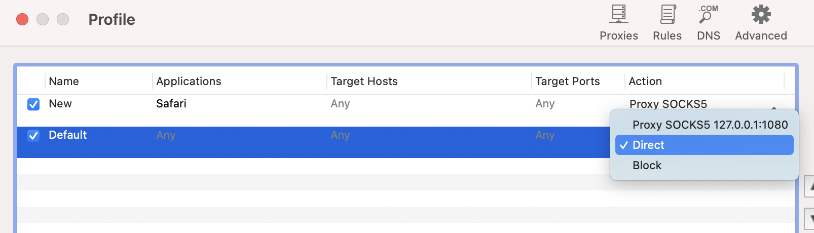
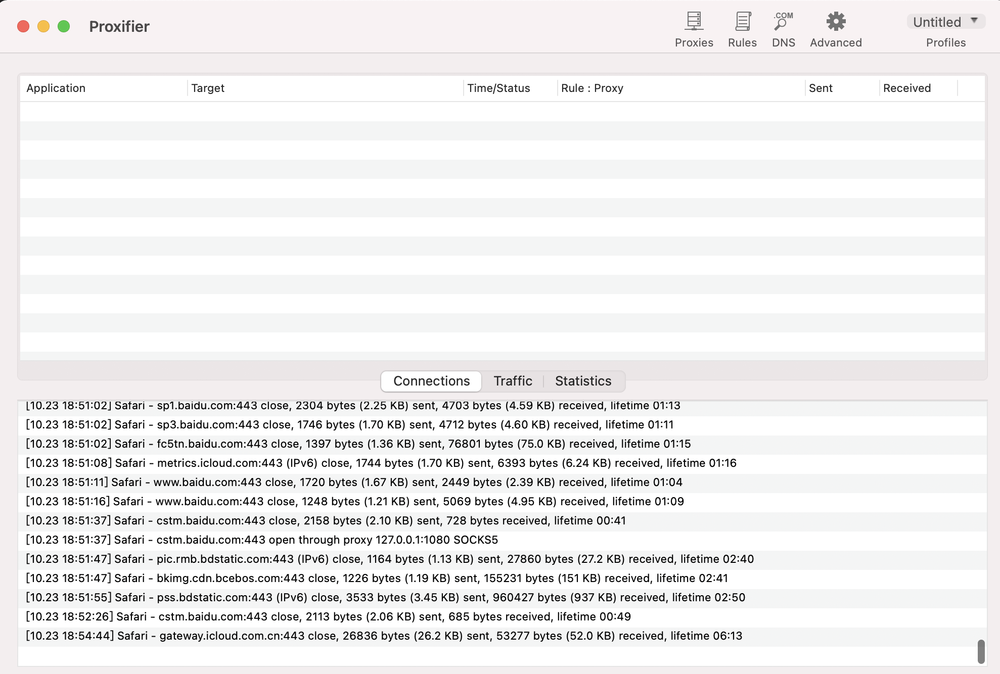

> Proxifier是一款功能非常强大的socks5客户端，可以让不支持通过代理服务器工作的网络程序能通过HTTPS或SOCKS代理或代理链

 

可以使用Proxifier,配置某个浏览器(如Safari)走代理，其他都走正常网络

首先需要开启xx软件，一般其Socks5监听地址及端口为*127.0.0.1*和*1080*

 

在Proxifier中，如下图，为Proxifier进行基础的代理设置

 

而后，新增一条Rules，设置Safari走代理

另，*Default*项配置不能移除：

 `The Default rule cannot be removed.
Proxifier uses it when all other rules do not match the connection parameters.`， 指定所有的应用， 默认Direct直连。

如果改为`Proxy SOCKS5 127.0.0.1:1080`,则所有应用都会走Socks5代理

打开Safari，则可看到，请求走了代理

在Safari中查看iP地址归属：

 

在Chrome中查看iP地址归属：

 

---

 

### 一些理论基础

 

#### socks代理和Socket有关联吗

 

**没有**

 

#### socks代理与http代理的比较

 

相较于http代理而言，socks代理工作在更底一层， 不需要知晓具体请求内容， 直接进行转发， 例如ss软件内部就使用了socks5代理技术。

socks5支持TCP、UDP网络协议，支持http,ftp等网络访问协议。而http代理只支持http/https的网络访问。

虽然看起来socks代理确实比http代理要更好一些， 但其实http代理可以被广大的软件所支持， 而socks代理的支持则稍微差一些， 所以实际上孰优孰劣就还是要根据使用场景.

 

#### socks4和socks5代理的异同

 

socks4代理只支持TCP协议，socks5代理支持TCP和UDP协议，还支持各种身份验证机制，服务器端域名解析等。socks4能干的socks5都可以干，反过来就不行了，如ICQ只能用socks5代理，而ftp可以用socks4和socks5。

 

#### Chrome浏览器设置socks5代理

 

1.升级Chrome到最新版本，安装SwitchyOmega扩展程序，右键点击SwitchyOmega扩展程序图标，点击下拉菜单中的"选项"，就进入了SwitchyOmega扩展程序选项设置功能。

2.点击上图中"新建情景模式…"，在新建情景模式名称中输入socks5代理名称，选择"代理服务器"，点"创建"按钮。

3.代理协议选择"socks5"，输入socks5代理服务器的地址和端口，点"应用选项"按钮，应用设置。

4.访问需要使用socks5代理的网站，点击SwitchyOmega扩展程序图标，下拉菜单中点击"自动切换"，然后再点击"添加条件"，设置当前网站的情景模式为socks5代理服务器，点"添加条件"按钮，应用设置。

5.鼠标移动到SwitchyOmega扩展程序图标，信息提示中会显示当前网站使用了sokcs5代理服务器，再次刷新网页，如果socks5代理服务器工作正常地话，就可以正常打开网页了。

 

---

 

参考&扩展:

[在Chrome里使用哪种代理最快？](https://zhuanlan.zhihu.com/p/21092974)

> socks/SPDY/HTTP2的多路复用本质上和HTTP 1.1想要解决的问题是一样的：省掉重复建立TCP连接的开销。只是Google在做SPDY时还额外考虑了资源优先级等等之类的问题。理论上来讲多路复用的数据链路利用效率更高。

---

[各种软件设置代理的一些方法](https://blog.mimvp.com/article/25794.html)