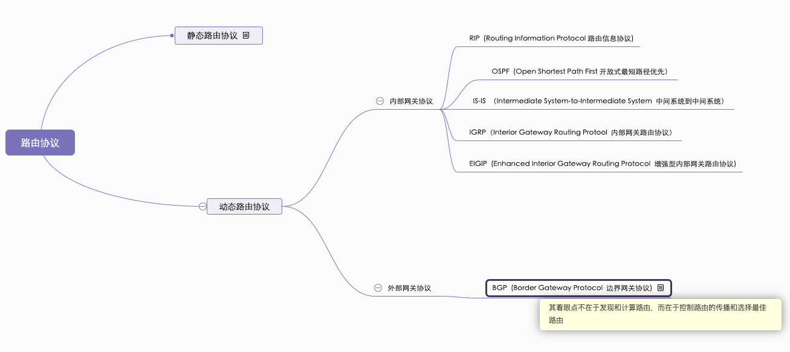

目前常用路由协议的AD优先级为：

直连路由> 静态路由 > EBGP > EIGRP > OSPF > ISIS > RIP > IBGP

 

IGRP、EIGRP是思科设计的内部网关协议，RIP和OSPF是通用的内部网关协议

> BGP机房和普通的IDC机房其实机柜和用电等成本基本上是一样的，贵的原因在于带宽，BGP是揉合了各大主流线路带宽(一般是电信+联通+移动)可以满足不同运营商的用户的访问体验；而传统IDC一般都是单线路带宽，例如电信IDC，电信的用户访问体验就很好，联通和移动访问就要差一些

 

更多阅读：

[常见的路由协议(RIP、OSPF、ISIS、BGP](https://blog.csdn.net/qq_30852577/article/details/79009003)

[23 张图详解路由协议：计算机网络的核心技术](https://www.eet-china.com/mp/a66189.html)

[既然已经有了BGP为什么还需要OSPF与RIP这一类IGP？](https://www.zhihu.com/question/411029743/answer/1528759528)

[BGP: 一个更像应用程序的路由协议](https://zhuanlan.zhihu.com/p/22031402)

[由 Facebook 事故引发的 BGP 工具探索](https://zhuanlan.zhihu.com/p/418026782)