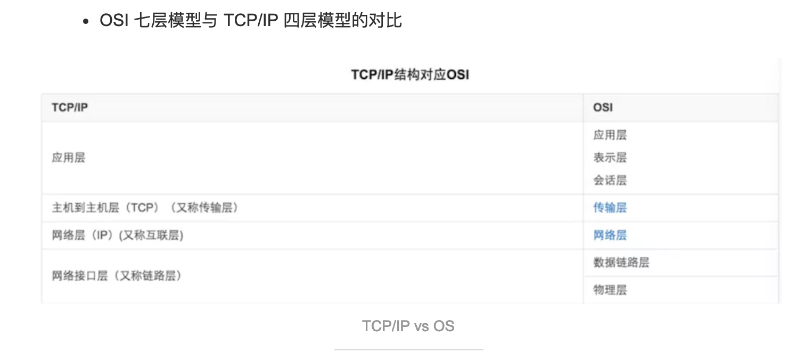
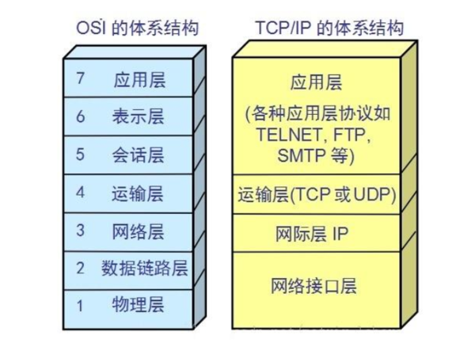

- OSI（Open System Interconnect,开放式系统互联）是ISO在推出的网络互联模型;TCP/IP是70年代中期美国国防部为其ARPANET广域网开发的网络体系结构和协议标准，以它为基础组建的INTERNET是目前国际上规模最大的计算机网络，正因为INTERNET的广泛使用，使得TCP/IP成了事实上的标准。
- 前者有7层(应表会传网数物),后者有4层(应传网链)
- TCP/IP并不是特指TCP协议和IP协议,而是指以其为代表的协议簇,即TCP/IP实际上是一组协议

 

 

[TCP/IP到底是四层还是五层可参考](https://blog.csdn.net/cc1949/article/details/79063439)

[更多可参考](http://blog.51cto.com/loveme23/11349)

---

#### 关于常问的"三次握手"和"四次分手"

- 其实理解为一次握手的三个步骤更好

- 一些讨论:
[a1](https://baijiahao.baidu.com/s?id=1614404084382122793)
[a2](https://juejin.im/post/5b29d2c4e51d4558b80b1d8c)
[a3](https://www.jianshu.com/p/092705233d37)
[a4](https://hit-alibaba.github.io/interview/basic/network/TCP.html)
[a5](https://www.zhihu.com/question/24853633)
[a6](https://github.com/jawil/blog/issues/14)

位码即tcp标志位,有6种标示:
- SYN(同步序列编号(Synchronize Sequence Numbers),synchronous建立联机)
- ACK(acknowledgement 确认)
- PSH(push传送)FIN(finish结束)
- RST(reset重置)
- URG(urgent紧急)
- Sequence number(顺序号码)
- Acknowledge number(确认号码)

