打开Wireshark,在过滤器中键入`ip.addr==118.126.97.71`, 访问[www.dashen.tech](www.dashen.tech),随后快速关闭.

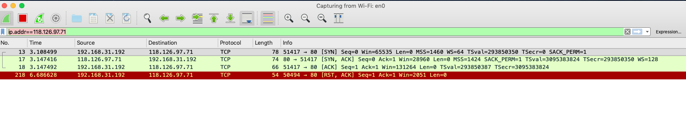

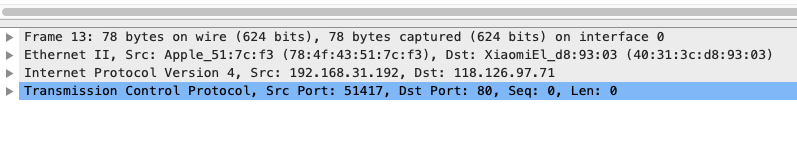

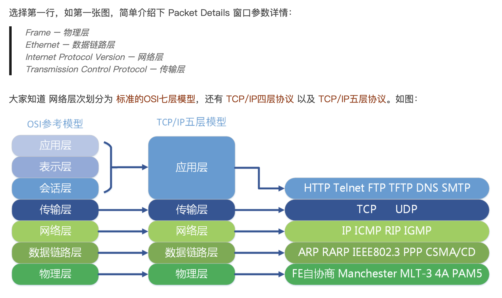

Transmission Control Protocol – 传输层是我们最为关心的;

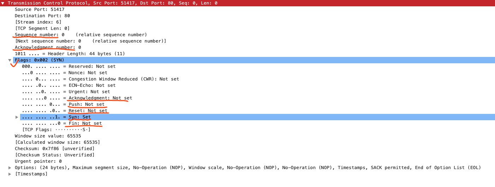

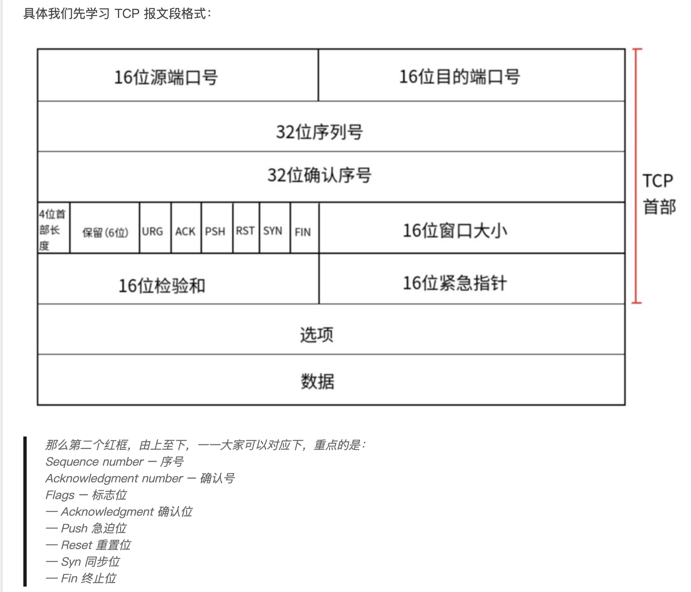

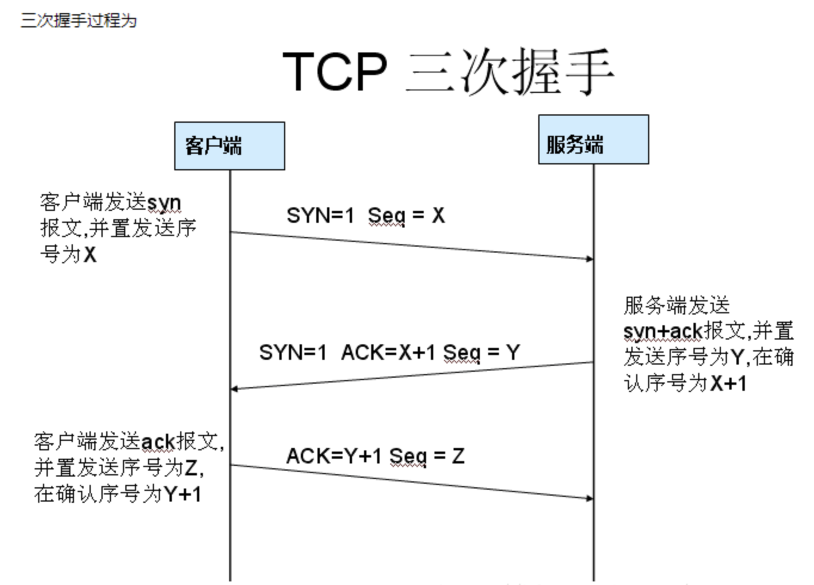

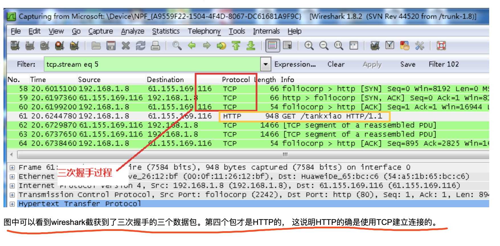

----

 

#### 第一次握手

 

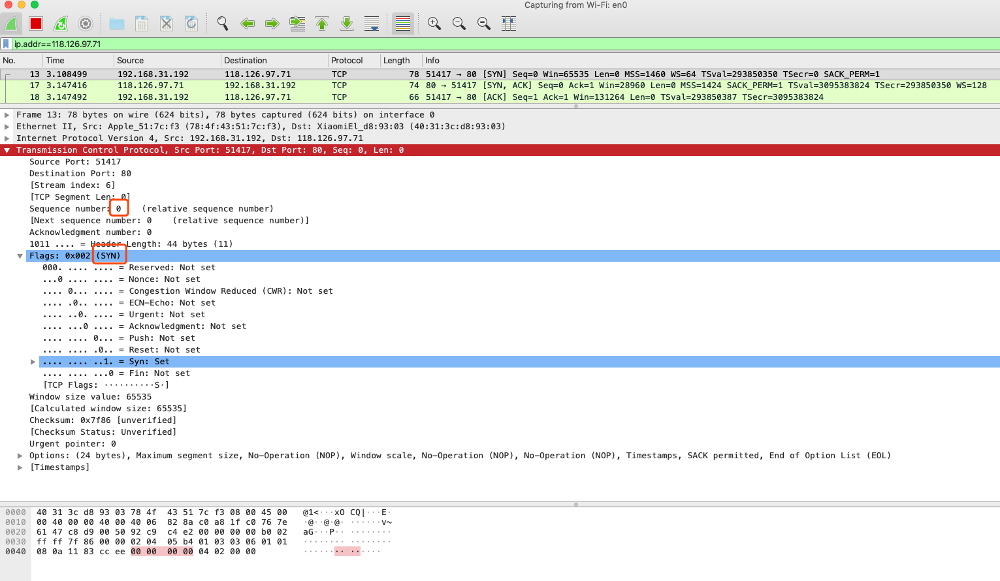

本地ip`192.168.31.192`的51417端口(客户端),请求`118.126.97.71`的80端口(服务端);

同步位SYN有值为1,序号seq为x(一般情况均为0)

`主机A发送位码为syn＝1，随机产生seq number=1234567的数据包到服务器，主机B由SYN=1知道，A要求建立联机；`

 

#### 第二次握手

 

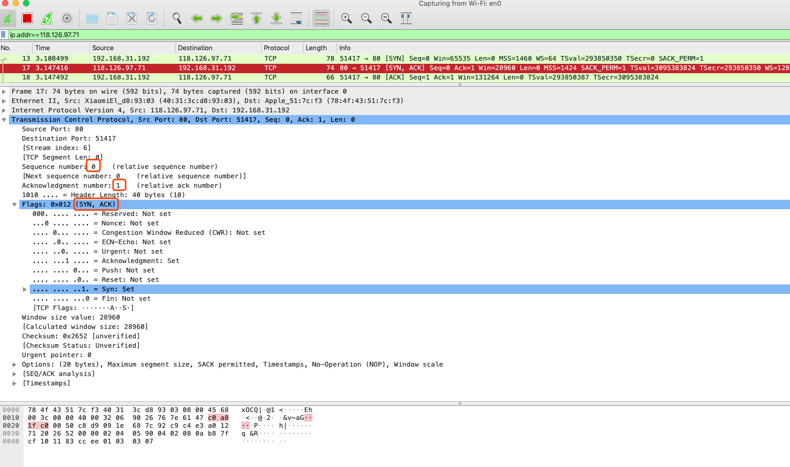

`118.126.97.71`的80端口,请求`192.168.31.192`的51417端口;

从标志位看出，同步位、确认位有值，在做应答（SYN+ACK）：SYN 同步位为 1 、Acknowledgment 确认位为 1

`主机B收到请求后要确认联机信息，向A发送ack number=(主机A的seq+1)，syn=1，ack=1，随机产生seq=7654321的包；`

 

#### 第三次握手

 

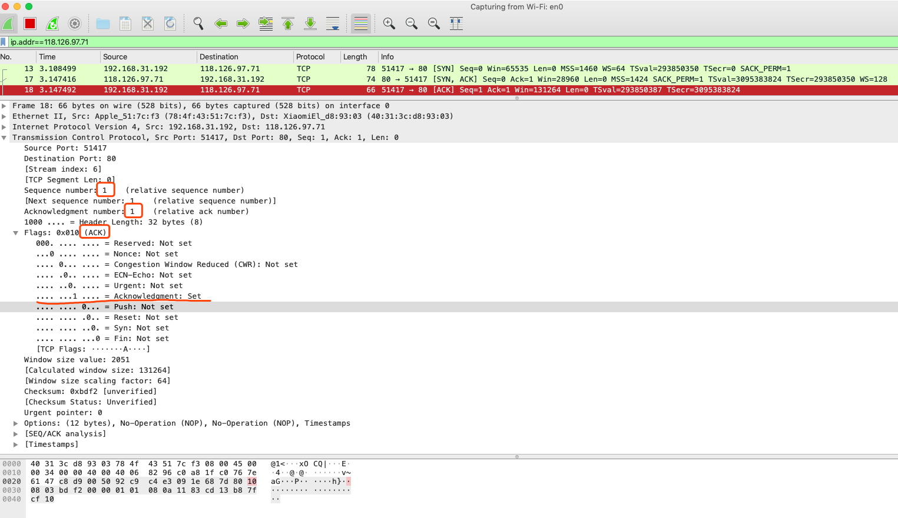

客户端再次发送确认包(ACK), SYN标志位为0,ACK标志位为1.并且把服务器发来ACK的序号字段+1,放在确定字段中发送给对方.

`主机A收到后检查ack number是否正确，即第一次发送的seq number+1，以及位码ack是否为1，若正确，主机A会再发送ack number=(主机B的seq+1)，ack=1，主机B收到后确认seq值与ack=1则连接建立成功。`

 

---

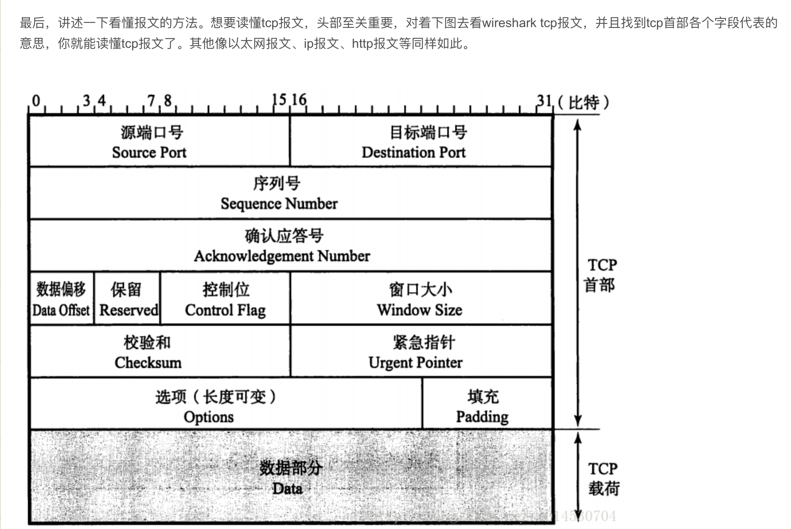

 

[相关参考1](https://www.bysocket.com/technique/1404.html)

[相关参考2](https://www.cnblogs.com/TankXiao/archive/2012/10/10/2711777.html)

[相关参考3](https://blog.csdn.net/u014530704/article/details/78842000)

[四次挥手可参考](https://blog.csdn.net/u013136708/article/details/50611072)
