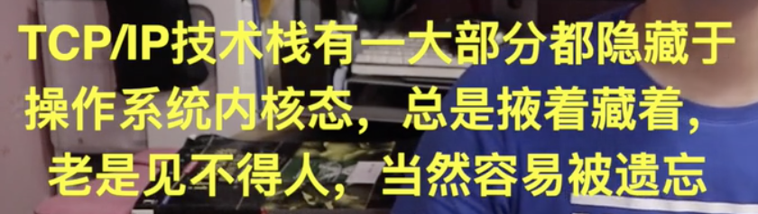
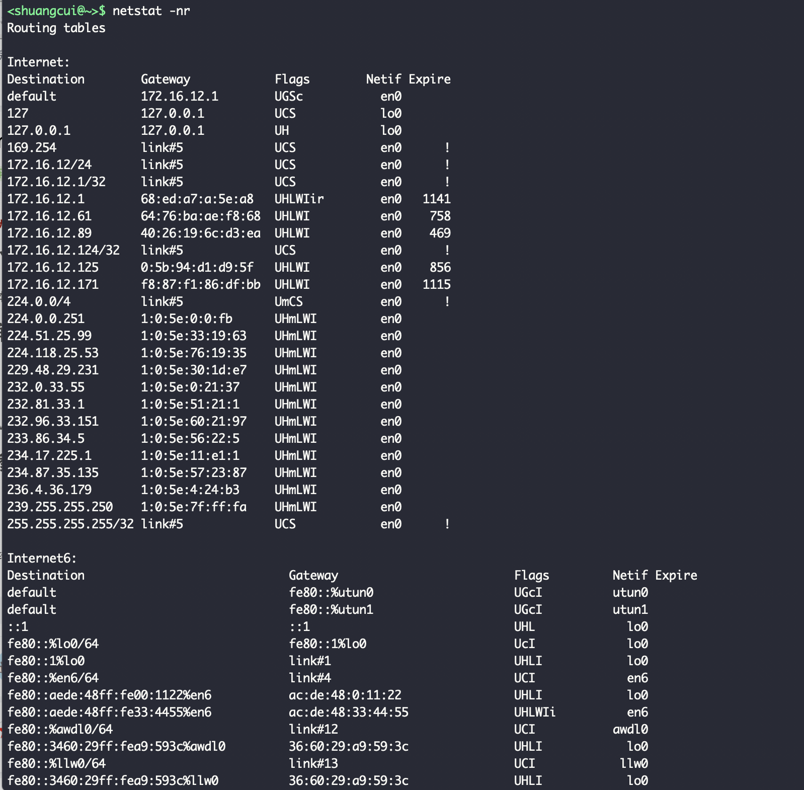
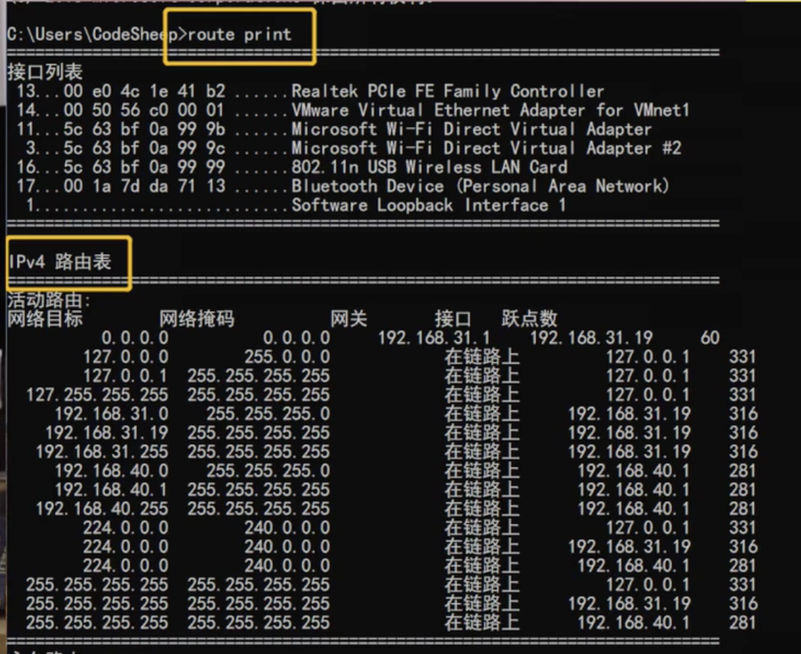

 

非常赞：[计算机网络常用知识总结！](https://mp.weixin.qq.com/s/NKyp-WgGkor-8k3-RP4Ynw)

[tcp-ip-protocol](https://github.com/zqjflash/tcp-ip-protocol)

 

<b>计算机网络主要指的就是TCP/IP协议栈</b>

TCP/IP是互联网的基石,也是互联网时代最伟大的发明

 

 

## 一. TCP/IP协议体系的认知

 

数据链路层,网络层(IP),传输层(TCP,UDP),都封装于操作系统内部,属于内核态的东西.

用户态的只有应用层,

 

## 二. 数据链路层

 

- 以太网帧的格式

 

- MTU的概念(最大传输单元)

 

- ARP协议和RARP协议(地址解析和逆地址解析)
网卡的mac地址和ip地址互查的一个机制

ARP协议, 公正来说算是链路层而不是网络层,可以算作是链路层和网络层之间的一个中间协议

ARP查询原理:

ARP缓存:

 

---

 

## 三. 网络层

 

### IP协议

 

- 掌握IP首部格式:

> 如16位分片标识,DF不分片标志,MF更多分片标志,13位片偏移,8位生存时间TTL,16位的首部检验和等

- 掌握IP分片:

> 如何避免ip分片(可以在应用层或传输层做限制)?如何确定分片的顺序?怎样确保分片全到达了接收端?

- 掌握IP选路:

即路由表,

Windows上为`route print`命令; 
Linux为`route -n`; 
Mac为`netstat -nr`

 

 

 

  

### ICMP协议

算是一个辅助协议,可以理解为网络层和其上一层即传输层之间的一个协议.在此也归为网络层里

不是太重要

掌握ICMP协议的报文格式,报文的两大分类:查询+差错,两种查询报文+5种差错报文

 

---

 

## 四. 传输层

 

### UDP协议

 

比较次要.

掌握其特点:无连接,不可靠

以及掌握其首部各个字段

 

### TCP协议(东西较多,面试考察集中在这里)

 

- 特点:可靠的,面向连接的协议

- 首部字段:序号,确认好,首部长度,窗口大小

- 可靠机制: 

TCP的连接控制机制
> 三次握手,四次挥手,同时打开,同时关闭,半关闭

TCP的流量控制机制:
> 滑动窗口,慢启动,拥塞避免,快速重传,快速恢复

TCP的超时重传机制:
> 各种定时器(4个)

- 为什么要三次握手,四次挥手?

- 为什么TCP和UDP都存在一个伪包头

---

 

## 五. 应用层

 

### DNS协议

 

域名到ip地址的解析..典型的应用层协议

- 掌握DNS协议的名字空间,

- DNS指针查询(反向查找或逆向解析)基本原理,

- DNS缓存

 

### FTP协议,网络界的活化石

 

- FTP的两条连接: 控制连接和数据连接

- 两种工作模式: PASV + PORT

- 各种FTP指令和响应码

- FTP断点续传,匿名FTP

 

### HTTP协议

 

其实东西很少

- 报文格式:请求报文,响应报文; 重点掌握请求头各种字段,响应头各种字段

- http状态码

 

### HTTPS协议

 

- https详细的握手过程

- 摘要算法,数字签名,数字证书的原理和过程

---

内容整理自:

[计算机网络该怎么学](https://www.bilibili.com/video/BV1U4411M71p)

值得一看:

[计算机网络面试题总结](https://note.youdao.com/web/#/file/WEB76f2115f8da87fa71a1344a9e28d1ab3/note/WEB3c77b5509021a544b256c58932df7793/)

 

---

 

IP 协议解决了数据包（Packet）的路由和传输，上层的 TCP 协议不再关注路由和寻址，而专注解决传输的可靠性和顺序问题

这两个协议不仅能够保证数据会从源机器的源进程发送到目标机器的目标进程中，还能保证数据的不重不漏以及发送的顺序

[为什么 TCP 协议有粘包问题](https://draveness.me/whys-the-design-tcp-message-frame/)

TCP 协议粘包问题是因为应用层协议开发者的错误设计导致的，他们忽略了 TCP 协议数据传输的核心机制 — 基于字节流，其本身不包含消息、数据包等概念，所有数据的传输都是流式的，需要应用层协议自己设计消息的边界，即消息帧（Message Framing）

 

基于 UDP 协议的应用层协议应该如何设计？会出现粘包的问题么？
有哪些应用层协议使用基于长度的分帧？又有哪些使用基于终结符的分帧？