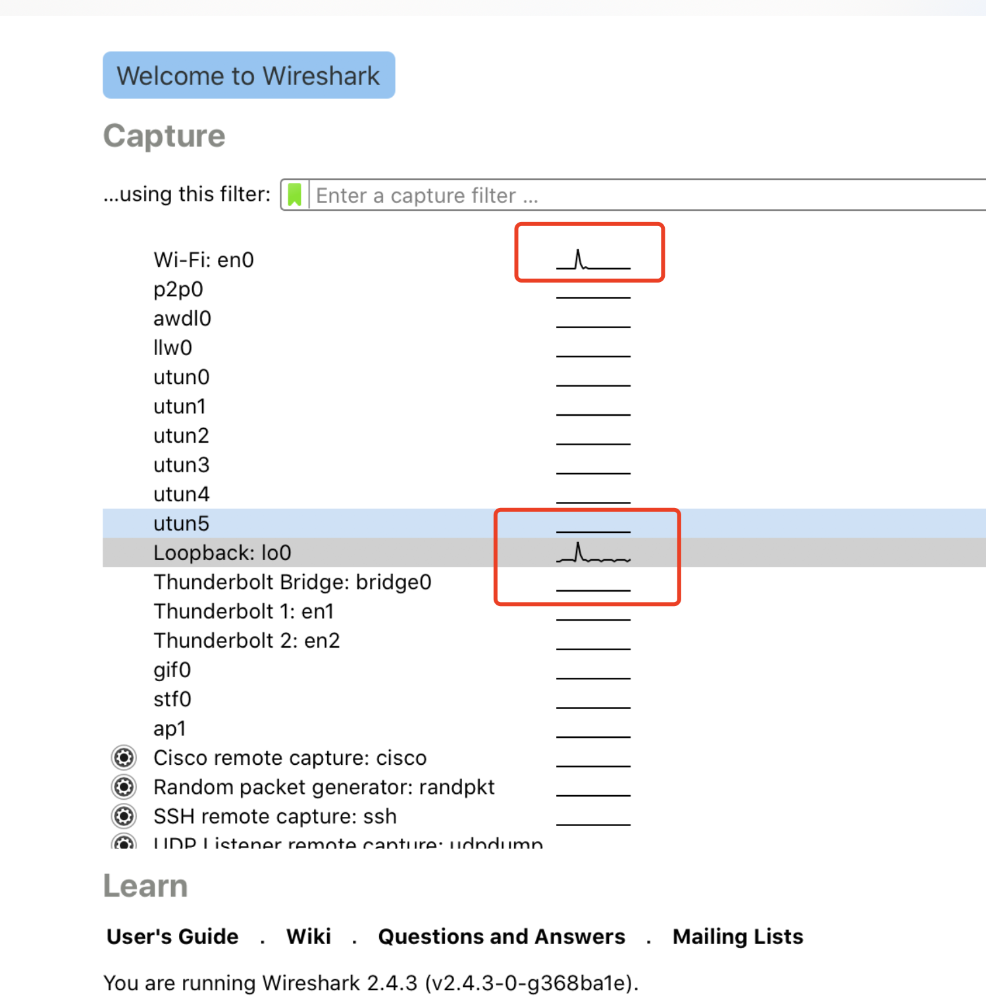
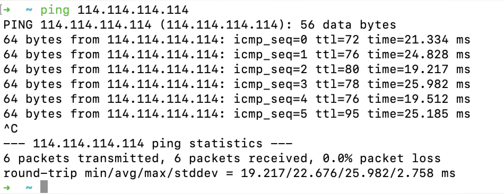
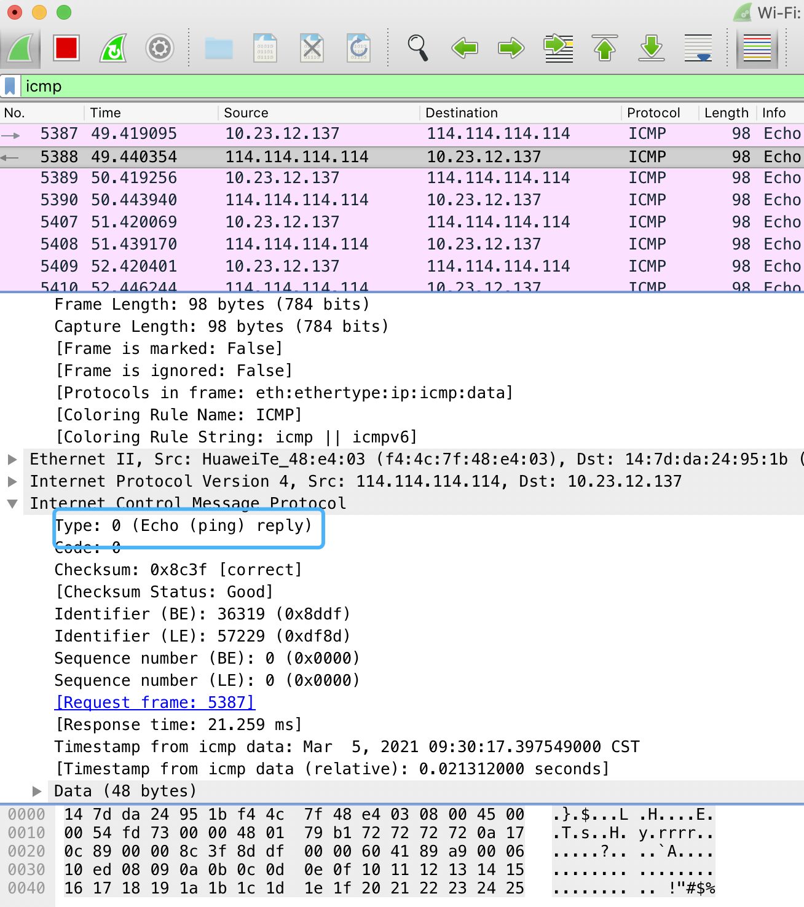
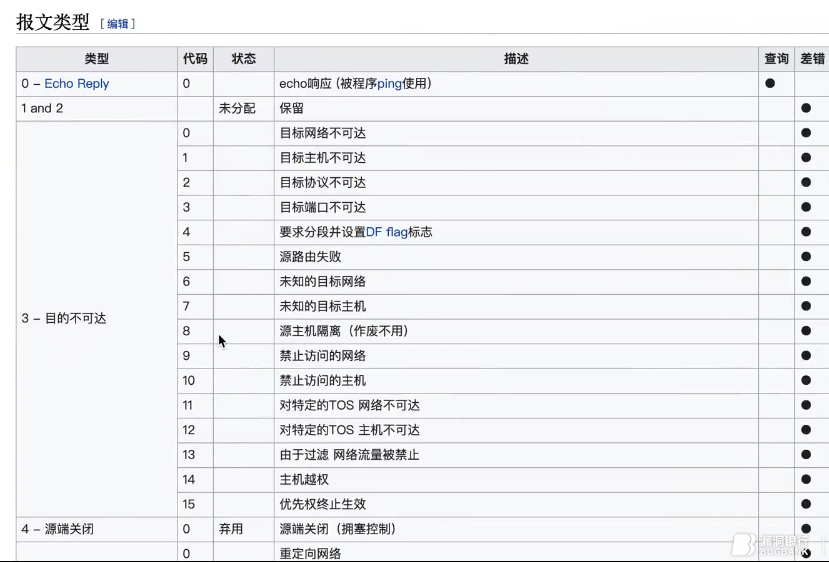
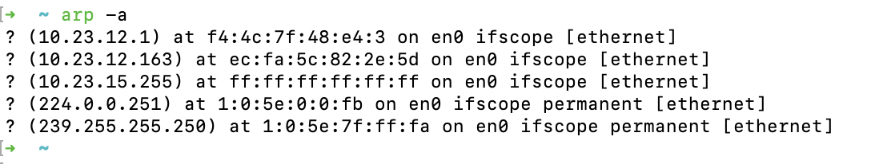
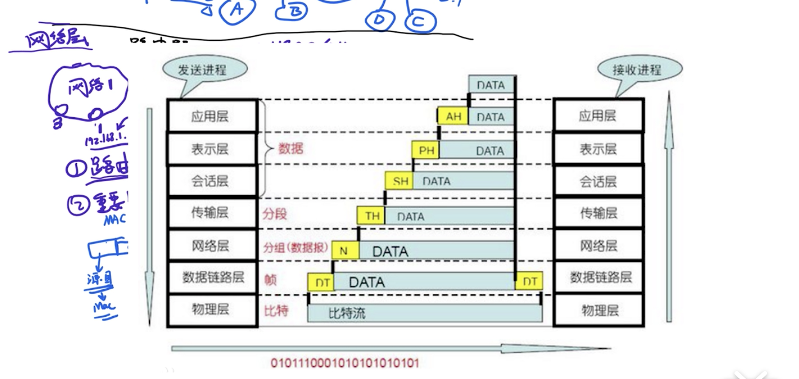

WireShark 抓包,是学习网络协议最快速,最有效的方式!

### SW:

 

[集线器（Hub）、交换机（SW）、路由器（router）对比区别](https://blog.csdn.net/zzh_AI/article/details/96868814)

集线器是在物理层; 交换机&Mac地址是在数据链路层(Mac物理地址不是在物理层!).

交换机的方式,在网络内部可以进行高效的传输,但在跨局域网时,效率较低(因为需要不停广播,而广播的效率不高)

于是有了路由器(有时也称为网关,因为是跨两个或多个网络之间的一个连接点)

路由算法到现在仍然在不断地迭代中

 

**路由器是工作在网络层的设备,交换机和网桥是数据链路层,中继器是工作在物理层上的连接设备** 

 

---

 

### ICMP协议  (Internet Control Message Protocol）

 

Internet控制报文协议

选择一块流量较大的网卡

[网际控制报文协议ICMP](https://www.bilibili.com/video/BV1eJ411h7cw)

 

---

 

### ARP协议: Address Resolution Protocol，地址解析协议

 

局域网中的数据传输不是通过网络层的 IP 地址进行路由和转发的，然而 IP 地址一般都是发送数据主机知道的唯一信息，想要在局域网中发送数据，还是需要知道它们的 MAC 地址。当我们的设备想要向其他的设备发送数据时，它会先通过 ARP(Address Resolution Protocol，地址解析协议) 在局域网中获取目的 IP 地址对应的 MAC 地址：

源主机会向当前局域网中发送 ARP 请求，目标的 MAC 地址是 FF-FF-FF-FF-FF-FF，这表示当前请求是一个广播请求，局域网内的所有设备都会收到该请求；
接收到 ARP 请求的主机都会检查目的 IP 和自己的 IP 地址是否一致；
如果 IP 地址不一致，主机会忽略当前的 ARP 请求；
如果 IP 地址一致，主机会直接向源主机发送 ARP 响应；
源主机在接收到 ARP 的响应之后，会更新本地的缓存表并继续向目的主机发送数据；

`arp -a`
 
 可查看ip和网卡的对应(绑定)关系

[ICMP与ARP协议详解](https://www.bilibili.com/video/BV1nZ4y1p7T6)

 

---

 

### NAT协议:

 

MTU:最大传输单元（Maximum Transmission Unit，MTU）

IP 协议是用于传输数据包的协议，作为网络层协议，它能提供数据的路由和寻址功能，让数据通过网络到达目的地2。不同设备之间传输数据前，需要先确定一个 IP 数据包的大小上限，即最大传输单元（Maximum transmission unit，即 MTU），MTU 是 IP 数据包能够传输的数据上限。

MTU 的值不是越大越好，更大的 MTU 意味着更低的额外开销，更小的 MTU 意味着更低的网络延迟。每一个物理设备都有自己的 MTU，两个主机之间的 MTU 依赖于底层的网络能力，它由整个链路上 MTU 最小的物理设备决定。

以太网对数据帧的限制一般都是 **1500 字节**，一般情况下，IP 主机的路径 MTU 都是 1500，去掉 IP 首部的 20 字节，如果待传输的数据大于 1480 节，那么该 IP 协议就会将数据包分片传输

 

---

 

### MSS: 最大分段大小 (Maximum segment size)

 

TCP 协议引入了最大分段大小（Maximum segment size，MSS）这一概念，它是 TCP 数据段能够携带的数据上限。在正常情况下，TCP 连接的 MSS 是 MTU - 40 字节，即 1460 字节；不过如果通信双方没有指定 MSS 的话，在默认情况下 MSS 的大小是 536 字节。

IP 协议的 MTU 是物理设备上的限制，它限制了路径能够发送数据包的上限，而 TCP 协议的 MSS 是操作系统内核层面的限制，通信双方会在三次握手时确定这次连接的 MSS。一旦确定了 MSS，TCP 协议就会对应用层交给 TCP 协议发送的数据进行拆分，构成多个数据段。

需要注意的是，IP 协议和 TCP 协议虽然都会对数据进行拆分，但是 IP 协议以数据包（Package）为单位组织数据，而 TCP 协议以数据段（Segment）为单位组织数据。

[为什么 TCP/IP 协议会拆分数据](https://draveness.me/whys-the-design-tcp-segment-ip-packet/)

 

---

 

### MSL:最长报文段寿命(Maximum segment lifetime, MSL)

 

TIME_WAIT 仅在主动断开连接的一方出现，被动断开连接的一方会直接进入 CLOSED 状态，进入 TIME_WAIT 的客户端需要等待 2 MSL 才可以真正关闭连接。TCP 协议需要 TIME_WAIT 状态的原因和客户端需要等待两个 MSL 不能直接进入 CLOSED 状态的原因是一样的：

防止延迟的数据段被其他使用相同源地址、源端口、目的地址以及目的端口的 TCP 连接收到；

保证 TCP 连接的远程被正确关闭，即等待被动关闭连接的一方收到 FIN 对应的 ACK 消息；

[为什么 TCP 协议有 TIME_WAIT 状态](https://draveness.me/whys-the-design-tcp-time-wait/)

