### 1. 安装证书

 

`Help->SSL Proxying`

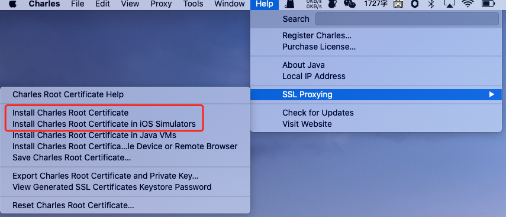 

依次

1. Install Charles Root Certificate

2. Charles Root Certificate in iOS Simulators

3. 在钥匙串中改为 *始终信任*

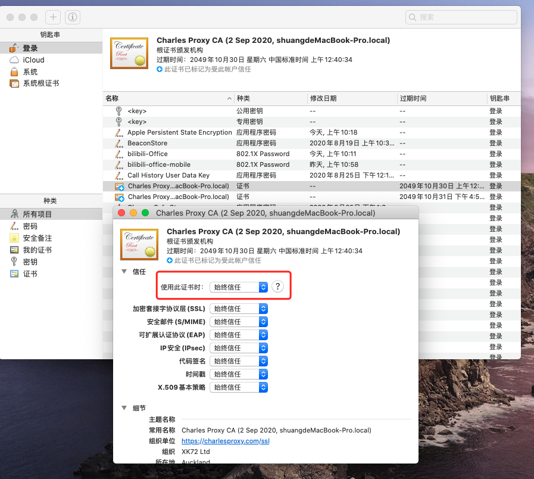 

 

---

 

### 2. 是否设置为本机代理

 

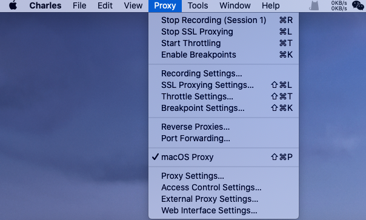 

勾选`macOS Proxy`,则Charles将被设置为系统代理,可以抓取到本机的各种网络请求

需要注意的是，Chrome 和 Firefox 浏览器默认并不使用系统的代理服务器设置，而Charles是通过将自己设置成代理服务器来完成封包截取的，所以在默认情况下无法截取 Chrome 和 Firefox 浏览器的网络通讯内容。

如果需要截取的话，在 Chrome 中设置成使用系统的代理服务器设置即可，或直接将代理服务器设置成 127.0.0.1:8888 亦可达到相同效果。

 

但其实大多数情况下,查看Web端的接口,都直接使用浏览器的控制台.

使用Charles抓包手机上的请求. 为防止在抓包时收到本机网络的干扰, 一般不要勾选.

 

---

 

### 3. 抓取手机数据

 

如下:

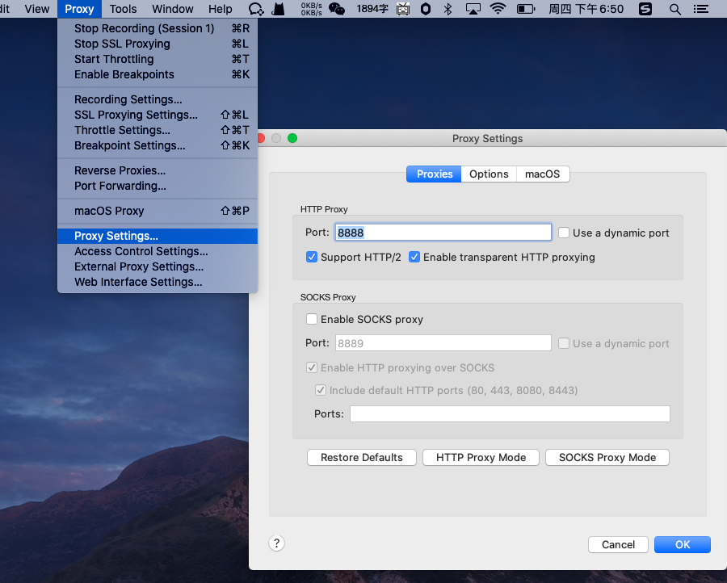 

 

然后:

1. 手机和电脑连接同一Wifi

2. 获取本机的ip地址

3. 在手机上选择`对应的Wifi->HTTP代理->手动`,服务器写电脑的ip,端口填8888

 

设置好后,Charles会弹出手机请求连接的确认,点击`Allow`,手机和电脑就建立了连接

 

---

 

### 4. 抓取手机上的Https请求

 

1.需要安装证书,模拟中间人攻击

在第一步中, `Install Charles Root Certificate`,已经安装了Charles的CA证书,而后在手机连接电脑代理情况下,按照弹窗提示,手机浏览器访问`chls.pro/ssl`,进行手机端证书下载

 

2.手机安装证书这一步常出问题,以iPhone为例,在**设置中搜索证书**,进行信任设置

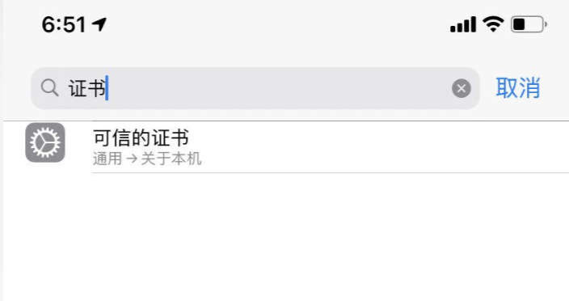 

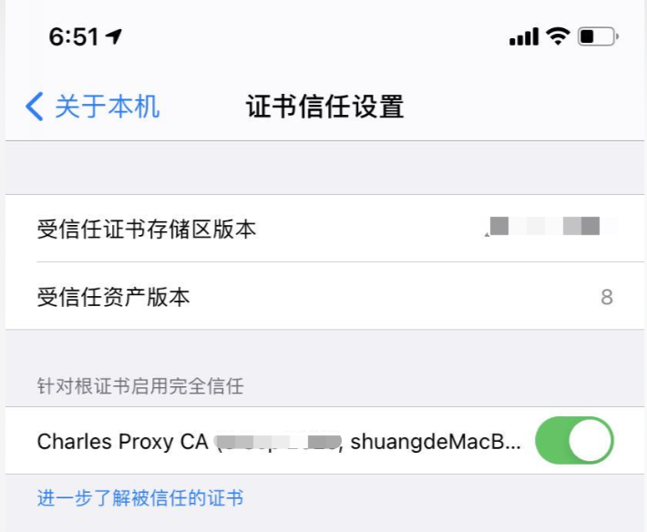 

 

 

3.回到Charles,进行`SSL Proxy`设置:

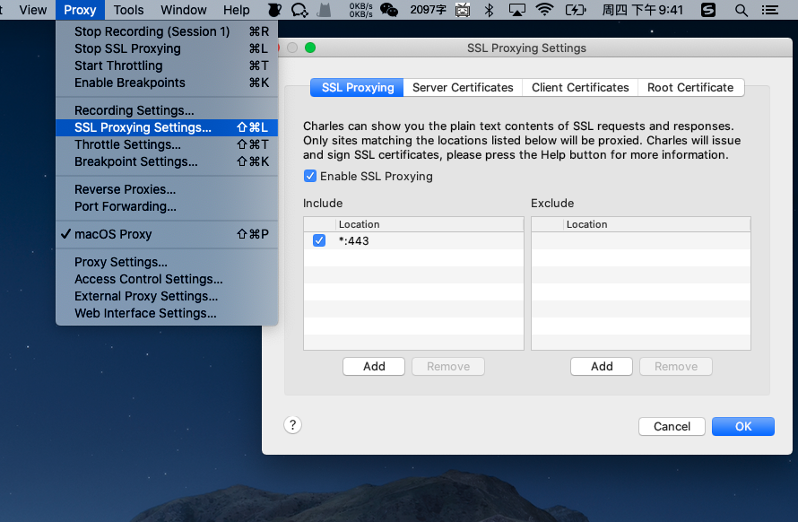 

点击`Add`,在Host中填`*`,即抓所有的https的包(也可以填写指定ip或域名,只抓取该Host下的https请求), Port填写443.

 

这是我曾经抓取过的部分https请求:

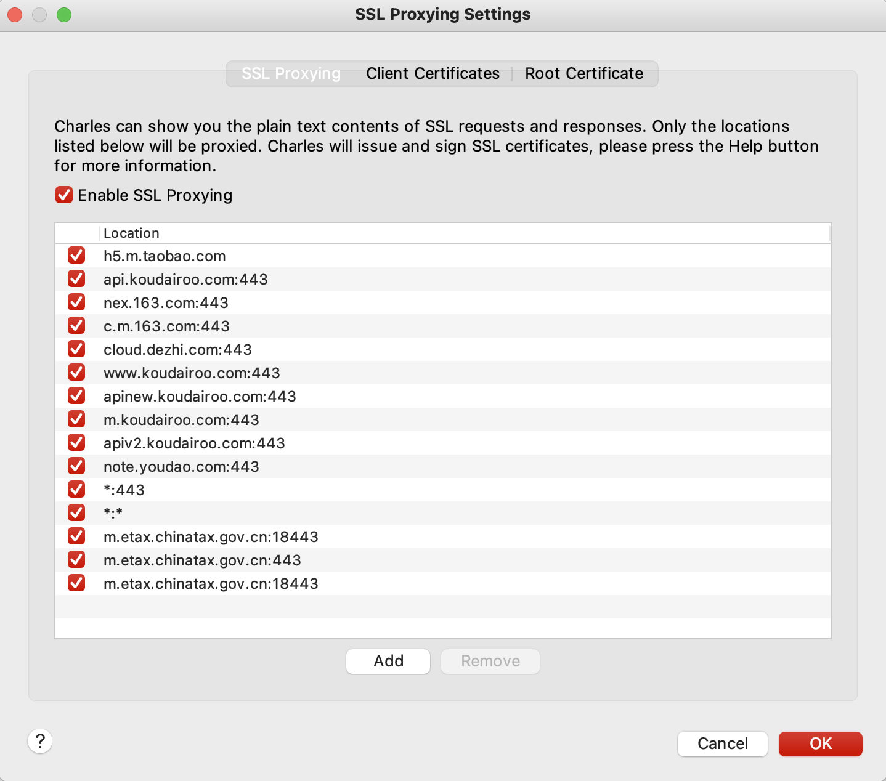 

---

 

### 5. 高阶功能

 

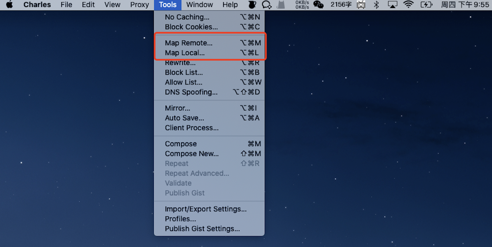 

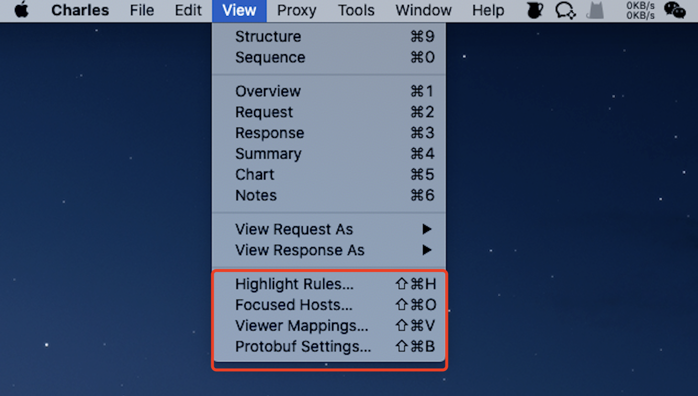 

 

#### 使用Mapping,修改手机app实际访问的接口地址

 

参见:

[charles修改访问的地址 大神之路](https://note.youdao.com/web/#/file/WEB0896a667642bd275378ce10fc0e8a0e5/note/WEBc70bd3d35e4c1bd6c33b9a16c3077da2/)

[(!!!好好好大神之路)charles神奇技能 哈哈哈哈](https://note.youdao.com/web/#/file/WEB0896a667642bd275378ce10fc0e8a0e5/note/WEB84f48562f5e2fac0d059a9f2f65131aa/)

 

这是我曾经修改的部分https请求:

哈哈哈哈

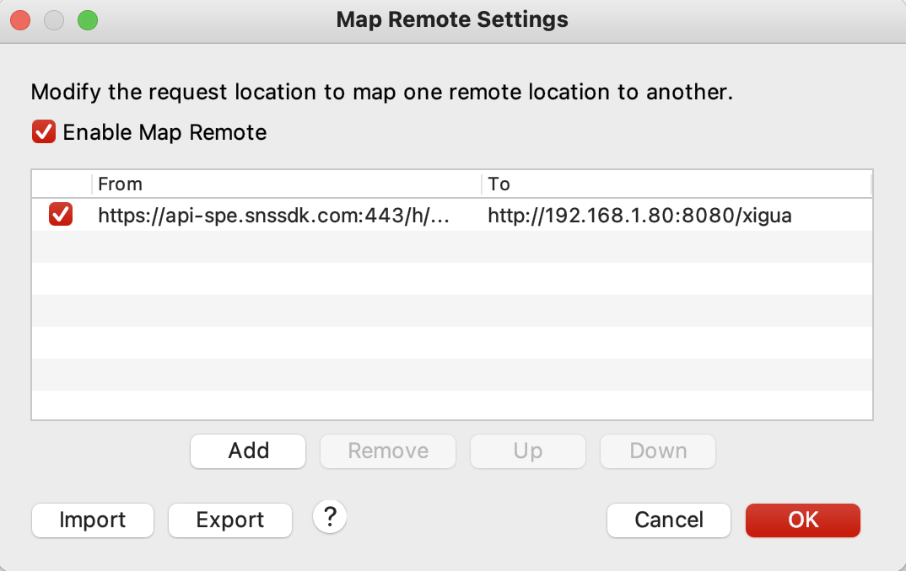 

 

---

 

参考:

[charles使用笔记](https://007sair.github.io/2018/01/17/Charles-%E5%A4%87%E5%BF%98/)