 

写代码一直使用JetBrains全家桶, 但数据库GUI工具多用Navicat. 最近Navicat好几次出现卡顿, 下载下来吃灰多时的DataGrip,就此转正上位.

但刚开始用,实在是太蹩脚了...比如Navicat上有一个筛选功能,在DataGrip上没有找到.. 

找了些[介绍资料](https://www.bilibili.com/video/BV1yW411A7Q5),掌握一些快捷键后,体验并不差.

(Notice:该资料为全英文,无字幕)

---

 

#### 选择展示"行过滤器"

 

可以书写简单的sql,按Enter执行

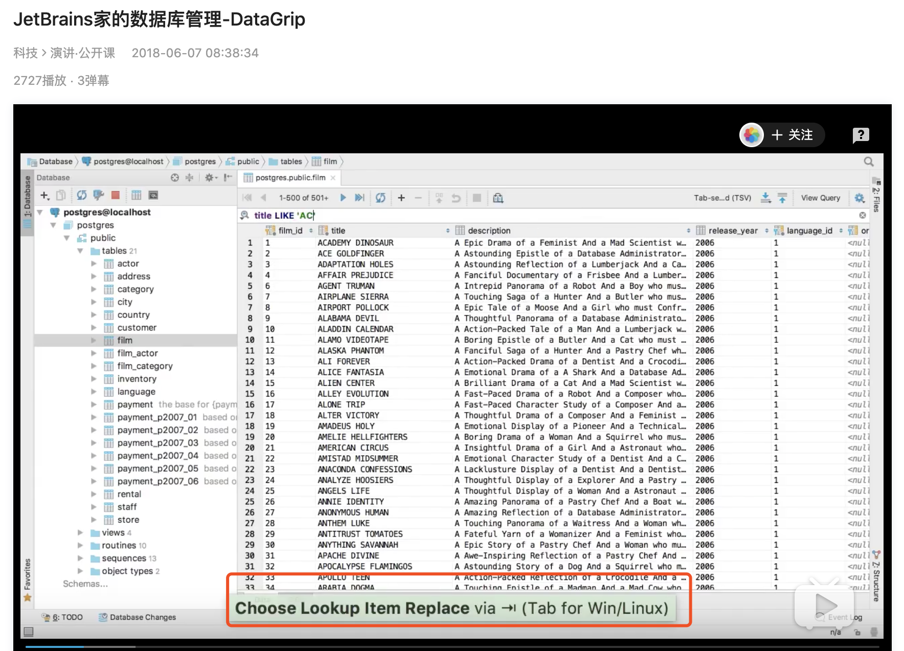

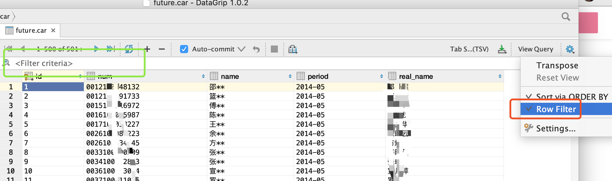

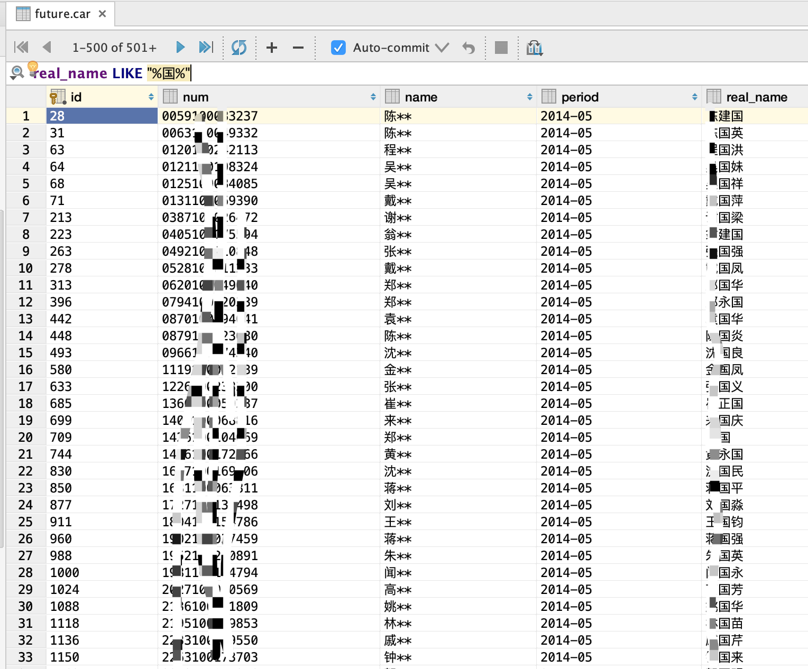

 

---

#### Command+F

 

模糊搜索全局,比Navicat强大

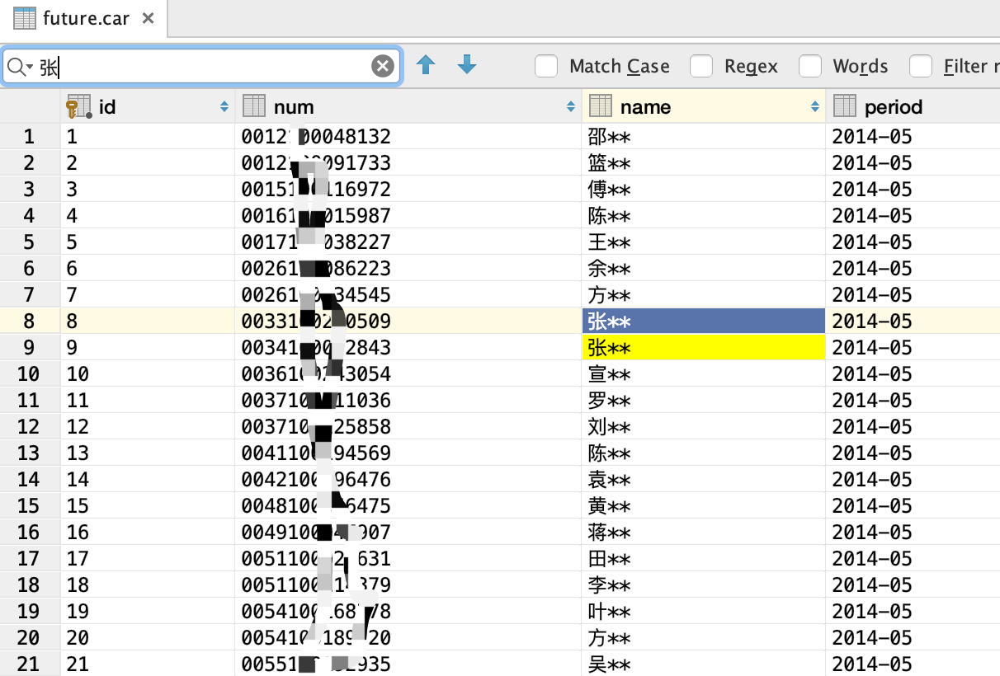

 

---

#### Control+Shift+A

 

输入transpose并选择, 则行列将倒换,

**当列数比较多时,行列切换进行视图,简直是一种神操作**

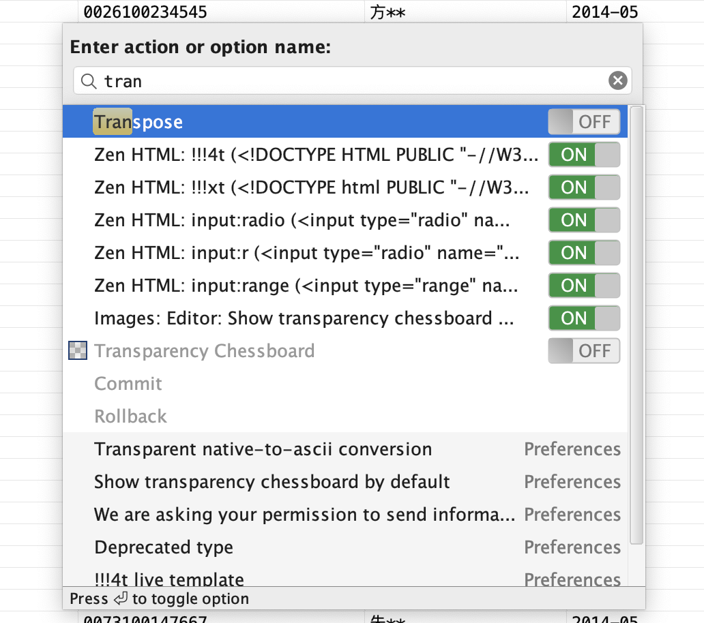

 

#### Enter/Space

 

回车键&空格键

提交&清空

 

---

#### Command+Z 及其他一些小tips

 

撤销操作,如果选了"Auto-commit",则改名了无效..

如果没选,Enter为提交的快捷键

选中某个字段,点击删除,则整行都会被删,快捷删除键为`Delete`(Win/Linux为Ctrl+Y)

`Command+N`,快速增加一行

 

#### 打开一个操作台

 

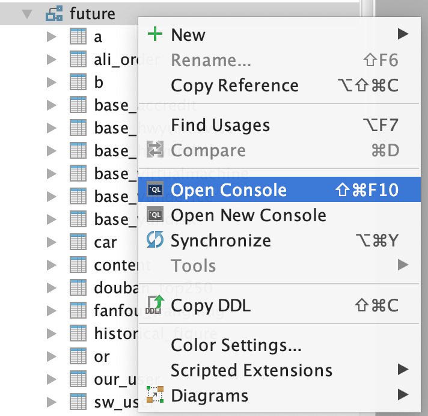

 

---

#### Option : cyclic expand word

 

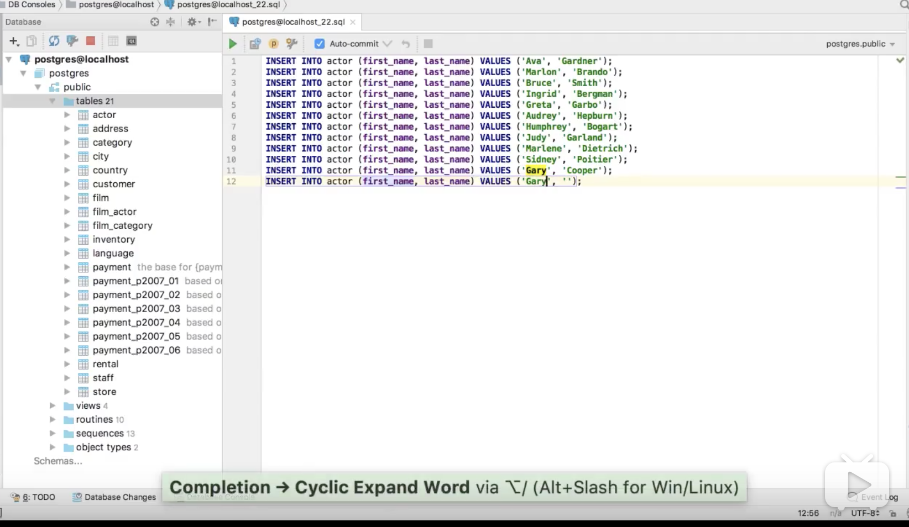

`cyclic expand word`: "循环往上/下选择单词"

参考:

[IDEA 快捷键拆解系列（六](https://www.jianshu.com/p/615b65798174)

 

---

#### Option+Enter 

 

展示潜在的可能行为

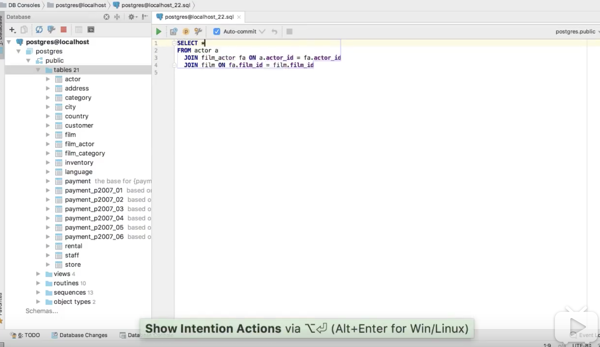

选择后,这样就能替换成所有的字段.

**之前一直有个问题,当一张20个字段的表,只需要取出其中19个字段,有一个不需要,这条sql要怎样快速地写?**

*在这里有了答案*

 

---

#### Command+Enter 执行sql语句

 

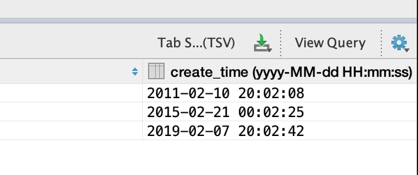

可以选择以csv或tsv或其他格式导出查出的数据

另:
- csv: 以逗号(comma)为分隔符

- tsv: 以Tab键为分隔符

 

---

#### 可以设置只执行选中的sql; 可以快速查看执行计划 以检验性能

 

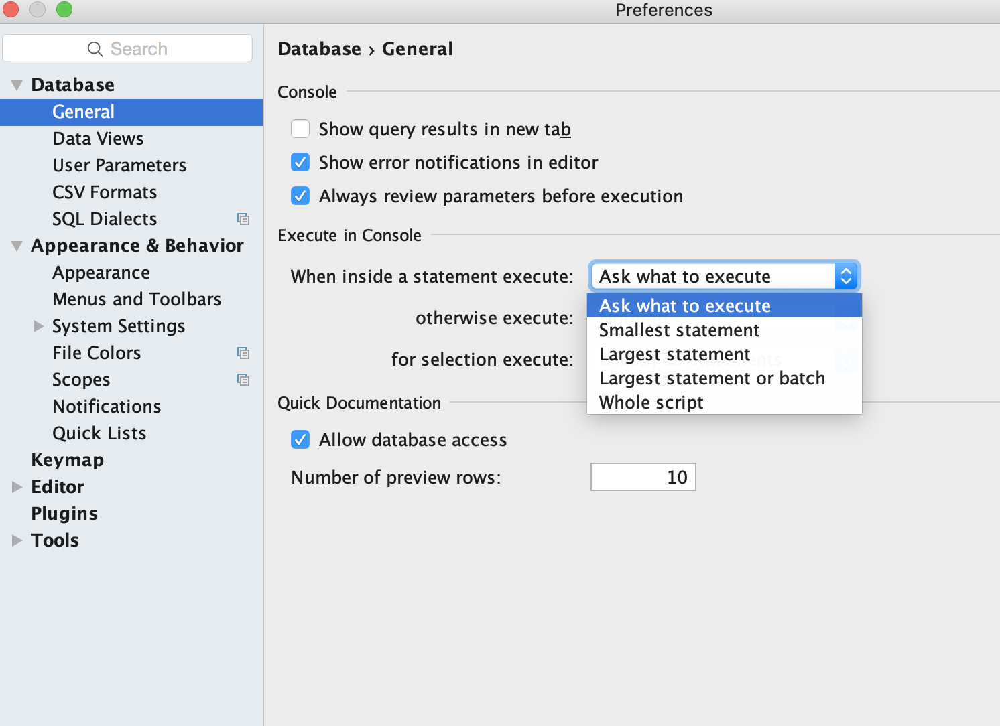

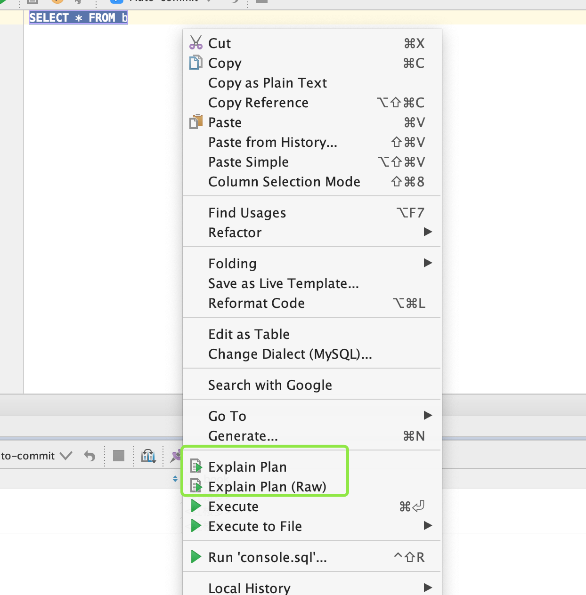

 

---

 

#### Shift+F6 :重命名

 

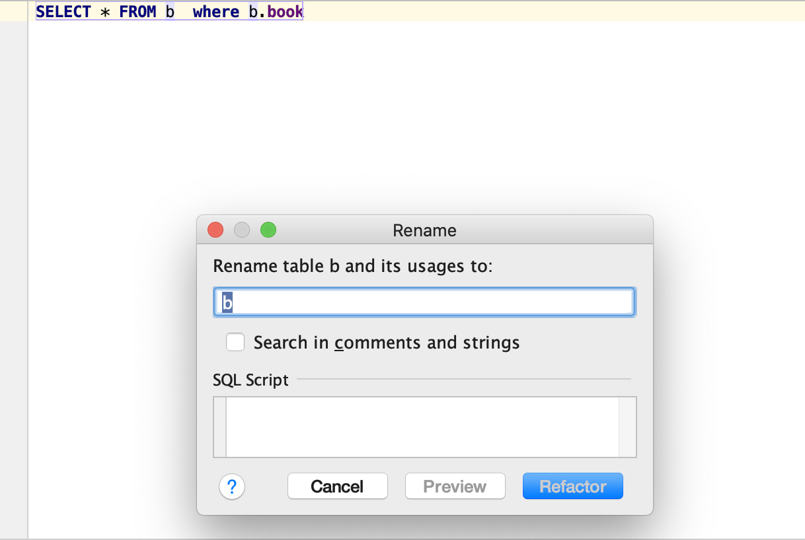

重命名某张表,及修改sql中用到这张表的部分

 

---

 

#### 可以对查询出的多个结果进行比较(点击图标)

 

---

#### 灵活易用的 导入/导出

---

#### 竖直操作

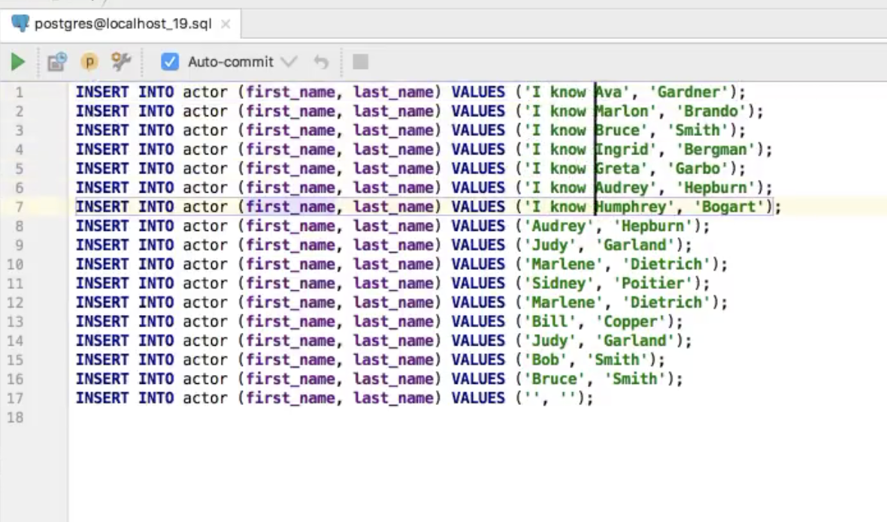

---

#### 展示历史记录

 
选中, 右键->show history

---

#### 好用且强大的导航

---

#### 所见即所得的sql语句

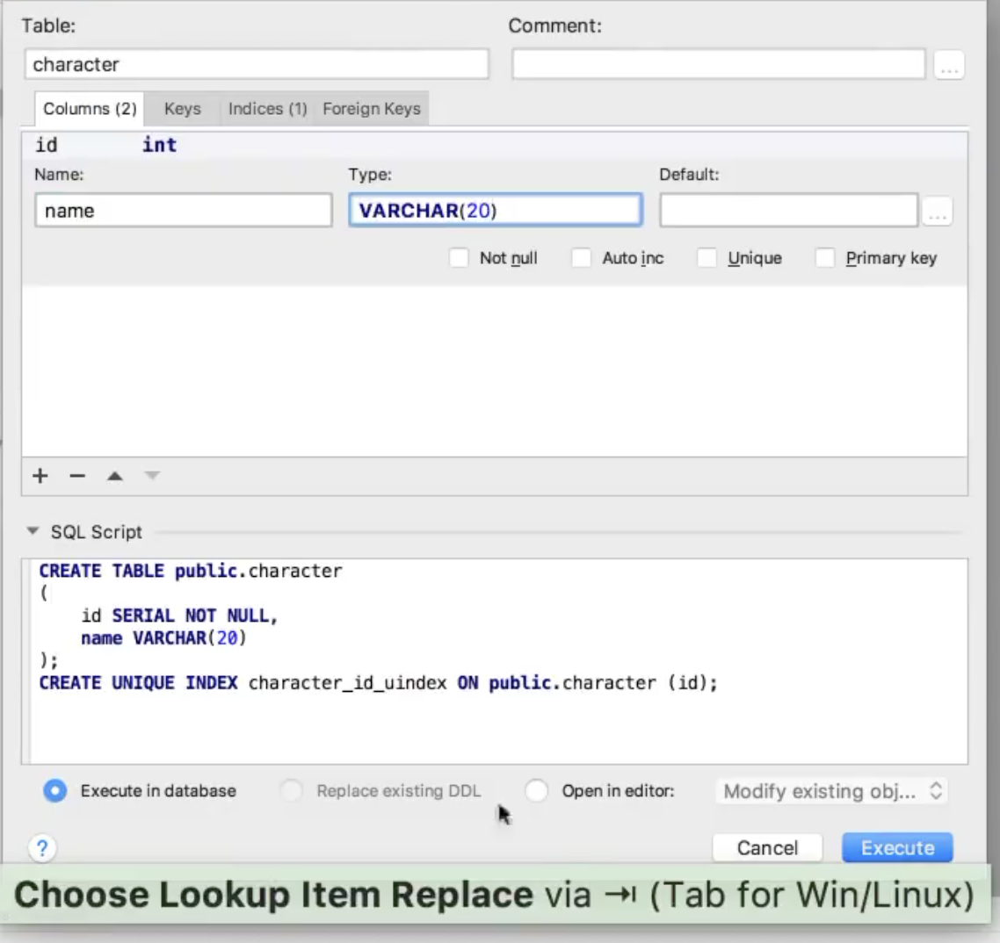

---

 

#### 直观的图表功能 

`Command + Option + Shift + U`

可以快速查看各张表之间的关系!

 

---

 

#### Shift+Shift : 强大的搜索

 

可以键入任何关键词搜索

如突发奇想,想看看有没有insert语句的模板:

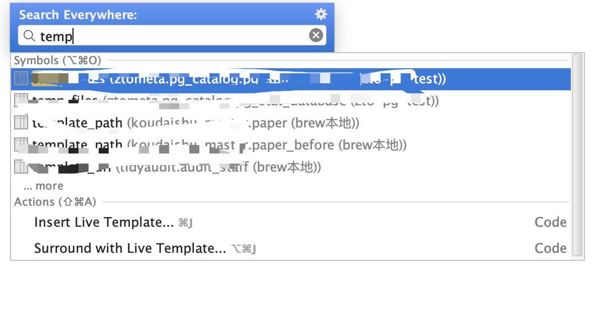

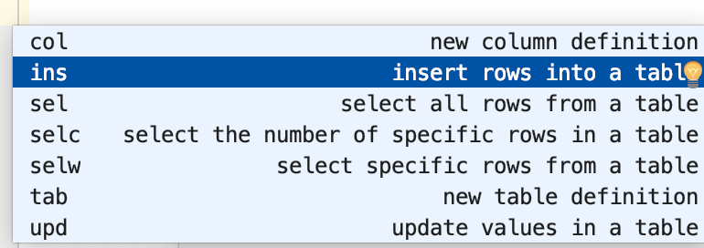

---
 

我在开往机场的最后一班地铁里, 将这段只有10几分钟视频提到的tips & tricks, 一一操作并记录. 当敲下最后一个句点,车厢里传来的到站提醒, 正好隔着耳机缓缓传来. 我快步出站,旋即混散在夜色茫茫中. 

此番如李元芳"弃刀用剑",只是工具的改变,本无大碍. 但翻看了下朋友圈"Navicat"关键词相关状态,还是有些小小感叹.

这几年来,虽然曾更换语言,从PhpStorm/PyCharm到Goland,中间还有Sublime/Atom/VS Code,  但作为服务端研发, MySQL自始至终一直相伴. 

 

正是在导航猫这个数据库GUI上, 我亲手实现了

[mysql数据库主从同步,实现读写分离](http://www.dashen.tech/2018/04/02/mysql%E6%95%B0%E6%8D%AE%E5%BA%93%E4%B8%BB%E4%BB%8E%E5%90%8C%E6%AD%A5-%E5%AE%9E%E7%8E%B0%E8%AF%BB%E5%86%99%E5%88%86%E7%A6%BB/)
 

实测了关系型数据库[事务的四种隔离级别](http://www.dashen.tech/2017/07/21/%E4%BA%8B%E5%8A%A1%E7%9A%84%E5%9B%9B%E7%A7%8D%E9%9A%94%E7%A6%BB%E7%BA%A7%E5%88%AB/),

[体验了*幻读*, 并设置隔离级别,体验了*脏读*与*不可重复读*](http://www.dashen.tech/2020/03/03/%E4%BA%B2%E6%B5%8B%E4%BD%93%E9%AA%8C%E5%85%B3%E7%B3%BB%E5%9E%8B%E6%95%B0%E6%8D%AE%E5%BA%93%E4%BA%8B%E5%8A%A1%E7%9A%84%E9%9A%94%E7%A6%BB%E7%BA%A7%E5%88%AB/)

体验了[联合索引的失效](http://www.dashen.tech/2020/02/02/%E4%BA%B2%E6%B5%8B%E4%BD%93%E9%AA%8Cmysql%E8%81%94%E5%90%88%E7%B4%A2%E5%BC%95%E7%9A%84%E5%A4%B1%E6%95%88/),
当然还有[共享锁与排它锁](http://www.dashen.tech/2018/01/12/Mysql%E4%B8%AD%E7%9A%84%E4%B9%90%E8%A7%82%E9%94%81%E5%92%8C%E6%82%B2%E8%A7%82%E9%94%81/)

总结了一些[写sql时的一些tips](http://www.dashen.tech/2016/03/14/%E5%86%99sql%E6%97%B6%E7%9A%84%E4%B8%80%E4%BA%9Btips/), 也遇到过被[盗库勒索比特币](http://www.dashen.tech/2019/07/11/%E4%B8%89%E4%B8%AA%E6%9C%88%E5%86%85%E9%81%AD%E9%81%87%E7%9A%84%E7%AC%AC%E4%BA%8C%E6%AC%A1%E6%AF%94%E7%89%B9%E5%B8%81%E5%8B%92%E7%B4%A2/)

还曾细致思考过[Year 2038 problem](http://www.dashen.tech/2019/12/02/Year-2038-problem/)

...

 

**潮落夜江斜月里, 两三星火是瓜州**,这一路从小白茕茕而来,一路失去,一路获得, 虽仍为菜鸟但心向大神. 

下一个五年, 正是我们这些人今生止此一次的机遇期. 

>就此告别吧 身后的灯火逐渐暗淡 
>每个恋家的孩子 都要扬起远行的帆 
>说声再见吧 美好的梦境不会消散 
>你的爱枕在臂弯 心脏将毕生柔软 

>亲爱的旅人 没有一条路无风无浪 
>会有孤独 会有悲伤 也会有无尽的希望 
>亲爱的旅人 这一程会短暂却又漫长 
>而一切终将 汇聚成最充盈的景象 

 

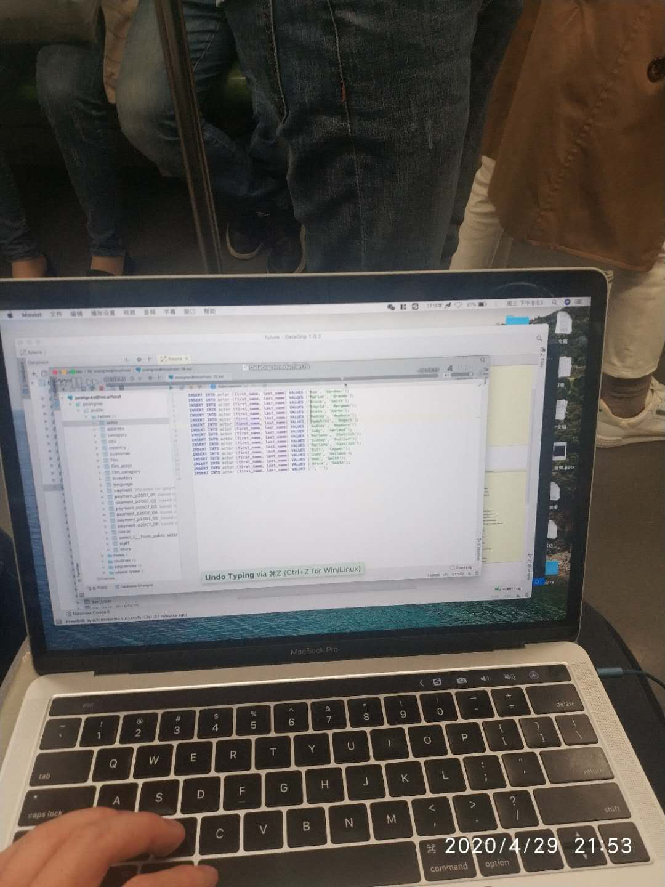

 

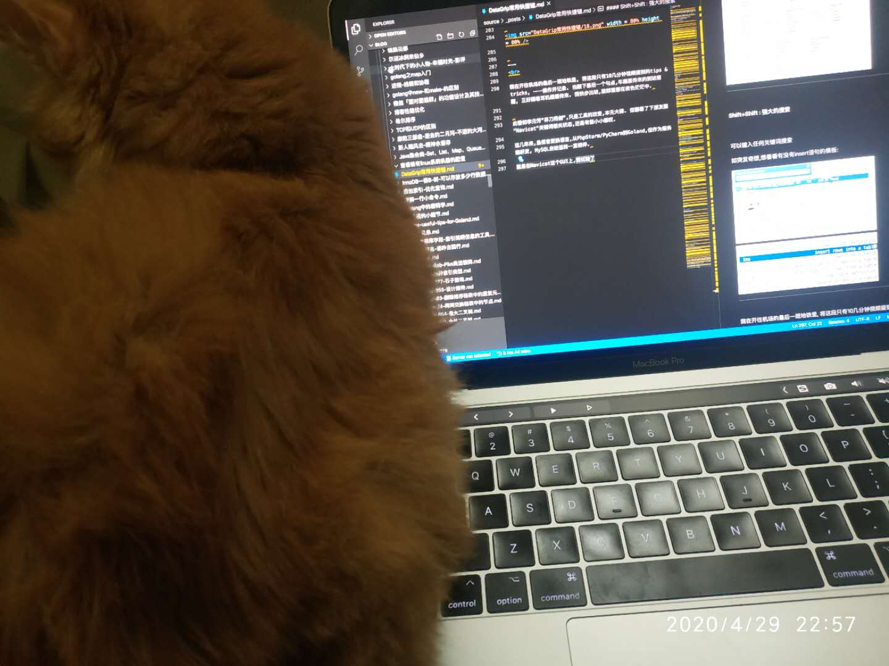

