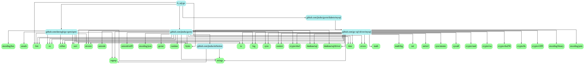

<br>


### [gotests](https://github.com/cweill/gotests)

<br>

*Generate Go tests from your source code.*

```go
go get -u github.com/cweill/gotests/...
```

<br>

`gotests -h`

<font size=1>

```go
Usage of gotests:
  -all
        generate tests for all functions and methods
  -excl string
        regexp. generate tests for functions and methods that do not match. Takes precedence over -only, -exported, and -all
  -exported
        generate tests for exported functions and methods. Takes precedence over -only and -all
  -i    print test inputs in error messages
  -nosubtests
        disable generating tests using the Go 1.7 subtests feature
  -only string
        regexp. generate tests for functions and methods that match only. Takes precedence over -all
  -parallel
        enable generating parallel subtests
  -template string
        optional. Specify custom test code templates, e.g. testify. This can also be set via environment variable GOTESTS_TEMPLATE
  -template_dir string
        optional. Path to a directory containing custom test code templates. Takes precedence over -template. This can also be set via environment variable GOTESTS_TEMPLATE_DIR
  -template_params string
        read external parameters to template by json with stdin
  -template_params_file string
        read external parameters to template by json with file
  -w    write output to (test) files instead of stdout
  ```

</font>

<br>


对  `reverse.go`:

```go
package main

import "fmt"

//
func main(){

	fmt.Println(reverseString("dashen"))

}

// reverse for string.
func reverseString(s string) string {
	rs := []rune(s)
	l := len(rs)
	for f, t := 0, l-1; f < t; f, t = f+1, t-1 {
		rs[f], rs[t] = rs[t], rs[f]
	}
	ns := string(rs)
	if l < 10 {
		for i := 0; i < 10-l; i++ {
			ns = ns + "0"
		}
	}
	return ns
}

```

<br>


执行 `gotests -all ./`

```go
Generated Test_reverseString
package main

import "testing"

func Test_main(t *testing.T) {
        tests := []struct {
                name string
        }{
                // TODO: Add test cases.
        }
        for _, tt := range tests {
                t.Run(tt.name, func(t *testing.T) {
                        main()
                })
        }
}

func Test_reverseString(t *testing.T) {
        type args struct {
                s string
        }
        tests := []struct {
                name string
                args args
                want string
        }{
                // TODO: Add test cases.
        }
        for _, tt := range tests {
                t.Run(tt.name, func(t *testing.T) {
                        if got := reverseString(tt.args.s); got != tt.want {
                                t.Errorf("reverseString() = %v, want %v", got, tt.want)
                        }
                })
        }
}


```

<br>

填充测试用例如下:

```go
package main

import "testing"

func Test_reverseString(t *testing.T) {
	type args struct {
		s string
	}
	tests := []struct {
		name string
		args args
		want string
	}{
		{"testcase1", args{"cuishuang"}, "gnauhsiuc0"},
		{"testcase2", args{"dashen"}, "nehsad0000"},
		// TODO: Add test cases.
	}
	for _, tt := range tests {
		t.Run(tt.name, func(t *testing.T) {
			if got := reverseString(tt.args.s); got != tt.want {
				t.Errorf("reverseString() = %v, want %v", got, tt.want)
			}
		})
	}
}

```

<br>


运行单元测试:

```go
=== RUN   Test_reverseString
=== RUN   Test_reverseString/testcase1
=== RUN   Test_reverseString/testcase2
--- PASS: Test_reverseString (0.00s)
    --- PASS: Test_reverseString/testcase1 (0.00s)
    --- PASS: Test_reverseString/testcase2 (0.00s)
PASS

进程完成，并显示退出代码 0
```

测试通过.


<br>


执行代码覆盖率测试如下：


`go test -cover`

```go
PASS
coverage: 90.0% of statements
ok      dashne  0.880s
```

(更多参见 [Go的测试覆盖率](https://brantou.github.io/2017/05/24/go-cover-story/))

<br>

可见,使用该工具,可以自动生成绝大部分单元测试的代码~

<br>


---


<br>


### [guru](https://pkg.go.dev/golang.org/x/tools/cmd/guru)

<br>

a tool for answering questions about Go source code.


[Using Go Guru:
an editor-integrated tool for navigating Go code](https://docs.google.com/document/d/1_Y9xCEMj5S-7rv2ooHpZNH15JgRT5iM742gJkw5LtmQ/edit#)


<br>


---

<br>


### [godepgraph](github.com/kisielk/godepgraph)

<br>

**godepgraph is a program for generating a dependency graph of Go packages.**

和[go-callvis:极其好用的Go程序调用图生成工具](https://dashen.tech/2016/04/15/go-callvis-极其好用的Go程序调用图生成工具/#go-list)类似


`godepgraph -h`

<font size=1>

```go
go get github.com/kisielk/godepgraph
```

```go
Usage of godepgraph:
  -d    (alias for -withgoroot) show dependencies of packages in the Go standard library
  -horizontal
        lay out the dependency graph horizontally instead of vertically
  -i string
        (alias for -ignorepackages) a comma-separated list of packages to ignore
  -ignorepackages string
        a comma-separated list of packages to ignore
  -ignoreprefixes string
        a comma-separated list of prefixes to ignore
  -l int
        (alias for -maxlevel) maximum level of the go dependency graph (default 256)
  -maxlevel int
        max level of go dependency graph (default 256)
  -nostdlib
        ignore packages in the Go standard library
  -novendor
        ignore packages in the vendor directory
  -o string
        (alias for -onlyprefixes) a comma-separated list of prefixes to include
  -onlyprefixes string
        a comma-separated list of prefixes to include
  -p string
        (alias for -ignoreprefixes) a comma-separated list of prefixes to ignore
  -s    (alias for -nostdlib) ignore packages in the Go standard library
  -stoponerror
        stop on package import errors (default true)
  -t    (alias for -withtests) include test packages
  -tags string
        a comma-separated list of build tags to consider satisfied during the build
  -withgoroot
        show dependencies of packages in the Go standard library
  -withtests
        include test packages
```
</font>

<br>


#### `godepgraph 某个文件或某个github项目`

<br>


会生成文字版的引用关系


<br>

如 如对于`b_sql.go`, 代码如下:


```go
package main

import (
	"fmt"
	"github.com/davecgh/go-spew/spew"
	"github.com/jinzhu/gorm"
	_ "github.com/jinzhu/gorm/dialects/mysql"
	"time"
)

func main() {

	db, err := gorm.Open("mysql", "root:12345678@/dashen?charset=utf8&parseTime=True&loc=Local")

	if err != nil {
		panic(err)
	}

	defer db.Close()

	books, err := GetBooksInfo(db, 0, 10, "*", "", "", "id < ? ", 126)

	spew.Println("books are:", books)

	books2, err2 := GetBooksInfo(db, 0, 10, "*", "", ",(select*from(select+sleep(2)union/**/select+1)a)", "id < ? ", 126)

	spew.Println("books2, err2", books2, err2)

}

type A struct {
	Id         int       `gorm:"column:id;primary_key;AUTO_INCREMENT" json:"id"`
	Name       string    `gorm:"column:name" json:"name"`
	Book       string    `gorm:"column:book" json:"book"`
	CreateTime time.Time `gorm:"column:create_time;default:CURRENT_TIMESTAMP" json:"create_time"`
}

func (A) TableName() string {
	return "a"
}

func GetBooksInfo(db *gorm.DB, offset, limit int, field, order, sort, where string, params ...interface{}) (res []*A, err error) {

	db = db.Select(field).Where(where, params...)
	if order == "" {
		order = "create_time"
	}
	if sort == "" {
		sort = "DESC"
	}
	db = db.Order(order + " " + sort)
	if limit > 0 {
		db = db.Limit(limit)
	}
	if offset > 0 {
		db = db.Offset(offset)
	}
	err = db.Find(&res).Error

	if err != nil {
		fmt.Printf("GetBooksInfo error (%+v): where (%s), params (%+v)\n", err, where, params)
		return
	}
	if res == nil {
		fmt.Printf("GetBooksInfo empty: where (%s), params (%+v)\n", where, params)
		res = make([]*A, 0)
	}
	return
}
```

<br>


执行 `godepgraph b_sql.go `:

```go
digraph godep {
splines=ortho
nodesep=0.4
ranksep=0.8
node [shape="box",style="rounded,filled"]
edge [arrowsize="0.5"]
"b_sql.go" [label="b_sql.go" color="paleturquoise" URL="https://godoc.org/b_sql.go" target="_blank"];
"b_sql.go" -> "fmt";
"b_sql.go" -> "github.com/davecgh/go-spew/spew";
"b_sql.go" -> "github.com/jinzhu/gorm";
"b_sql.go" -> "github.com/jinzhu/gorm/dialects/mysql";
"b_sql.go" -> "time";
"bytes" [label="bytes" color="palegreen" URL="https://godoc.org/bytes" target="_blank"];
"context" [label="context" color="palegreen" URL="https://godoc.org/context" target="_blank"];
"crypto/rand" [label="crypto/rand" color="palegreen" URL="https://godoc.org/crypto/rand" target="_blank"];
"crypto/rsa" [label="crypto/rsa" color="palegreen" URL="https://godoc.org/crypto/rsa" target="_blank"];
"crypto/sha1" [label="crypto/sha1" color="palegreen" URL="https://godoc.org/crypto/sha1" target="_blank"];
"crypto/sha256" [label="crypto/sha256" color="palegreen" URL="https://godoc.org/crypto/sha256" target="_blank"];
"crypto/tls" [label="crypto/tls" color="palegreen" URL="https://godoc.org/crypto/tls" target="_blank"];
"crypto/x509" [label="crypto/x509" color="palegreen" URL="https://godoc.org/crypto/x509" target="_blank"];
"database/sql" [label="database/sql" color="palegreen" URL="https://godoc.org/database/sql" target="_blank"];
"database/sql/driver" [label="database/sql/driver" color="palegreen" URL="https://godoc.org/database/sql/driver" target="_blank"];
"encoding/binary" [label="encoding/binary" color="palegreen" URL="https://godoc.org/encoding/binary" target="_blank"];
"encoding/hex" [label="encoding/hex" color="palegreen" URL="https://godoc.org/encoding/hex" target="_blank"];
"encoding/json" [label="encoding/json" color="palegreen" URL="https://godoc.org/encoding/json" target="_blank"];
"encoding/pem" [label="encoding/pem" color="palegreen" URL="https://godoc.org/encoding/pem" target="_blank"];
"errors" [label="errors" color="palegreen" URL="https://godoc.org/errors" target="_blank"];
"fmt" [label="fmt" color="palegreen" URL="https://godoc.org/fmt" target="_blank"];
"github.com/davecgh/go-spew/spew" [label="github.com/davecgh/go-spew/spew" color="paleturquoise" URL="https://godoc.org/github.com/davecgh/go-spew/spew" target="_blank"];
"github.com/davecgh/go-spew/spew" -> "bytes";
"github.com/davecgh/go-spew/spew" -> "encoding/hex";
"github.com/davecgh/go-spew/spew" -> "fmt";
"github.com/davecgh/go-spew/spew" -> "io";
"github.com/davecgh/go-spew/spew" -> "os";
"github.com/davecgh/go-spew/spew" -> "reflect";
"github.com/davecgh/go-spew/spew" -> "regexp";
"github.com/davecgh/go-spew/spew" -> "sort";
"github.com/davecgh/go-spew/spew" -> "strconv";
"github.com/davecgh/go-spew/spew" -> "strings";
"github.com/davecgh/go-spew/spew" -> "unsafe";
"github.com/go-sql-driver/mysql" [label="github.com/go-sql-driver/mysql" color="paleturquoise" URL="https://godoc.org/github.com/go-sql-driver/mysql" target="_blank"];
"github.com/go-sql-driver/mysql" -> "bytes";
"github.com/go-sql-driver/mysql" -> "context";
"github.com/go-sql-driver/mysql" -> "crypto/rand";
"github.com/go-sql-driver/mysql" -> "crypto/rsa";
"github.com/go-sql-driver/mysql" -> "crypto/sha1";
"github.com/go-sql-driver/mysql" -> "crypto/sha256";
"github.com/go-sql-driver/mysql" -> "crypto/tls";
"github.com/go-sql-driver/mysql" -> "crypto/x509";
"github.com/go-sql-driver/mysql" -> "database/sql";
"github.com/go-sql-driver/mysql" -> "database/sql/driver";
"github.com/go-sql-driver/mysql" -> "encoding/binary";
"github.com/go-sql-driver/mysql" -> "encoding/pem";
"github.com/go-sql-driver/mysql" -> "errors";
"github.com/go-sql-driver/mysql" -> "fmt";
"github.com/go-sql-driver/mysql" -> "io";
"github.com/go-sql-driver/mysql" -> "log";
"github.com/go-sql-driver/mysql" -> "math";
"github.com/go-sql-driver/mysql" -> "math/big";
"github.com/go-sql-driver/mysql" -> "net";
"github.com/go-sql-driver/mysql" -> "net/url";
"github.com/go-sql-driver/mysql" -> "os";
"github.com/go-sql-driver/mysql" -> "reflect";
"github.com/go-sql-driver/mysql" -> "sort";
"github.com/go-sql-driver/mysql" -> "strconv";
"github.com/go-sql-driver/mysql" -> "strings";
"github.com/go-sql-driver/mysql" -> "sync";
"github.com/go-sql-driver/mysql" -> "sync/atomic";
"github.com/go-sql-driver/mysql" -> "syscall";
"github.com/go-sql-driver/mysql" -> "time";
"github.com/jinzhu/gorm" [label="github.com/jinzhu/gorm" color="paleturquoise" URL="https://godoc.org/github.com/jinzhu/gorm" target="_blank"];
"github.com/jinzhu/gorm" -> "bytes";
"github.com/jinzhu/gorm" -> "context";
"github.com/jinzhu/gorm" -> "crypto/sha1";
"github.com/jinzhu/gorm" -> "database/sql";
"github.com/jinzhu/gorm" -> "database/sql/driver";
"github.com/jinzhu/gorm" -> "encoding/json";
"github.com/jinzhu/gorm" -> "errors";
"github.com/jinzhu/gorm" -> "fmt";
"github.com/jinzhu/gorm" -> "github.com/jinzhu/inflection";
"github.com/jinzhu/gorm" -> "go/ast";
"github.com/jinzhu/gorm" -> "log";
"github.com/jinzhu/gorm" -> "os";
"github.com/jinzhu/gorm" -> "reflect";
"github.com/jinzhu/gorm" -> "regexp";
"github.com/jinzhu/gorm" -> "runtime";
"github.com/jinzhu/gorm" -> "sort";
"github.com/jinzhu/gorm" -> "strconv";
"github.com/jinzhu/gorm" -> "strings";
"github.com/jinzhu/gorm" -> "sync";
"github.com/jinzhu/gorm" -> "time";
"github.com/jinzhu/gorm" -> "unicode";
"github.com/jinzhu/gorm" -> "unicode/utf8";
"github.com/jinzhu/gorm/dialects/mysql" [label="github.com/jinzhu/gorm/dialects/mysql" color="paleturquoise" URL="https://godoc.org/github.com/jinzhu/gorm/dialects/mysql" target="_blank"];
"github.com/jinzhu/gorm/dialects/mysql" -> "github.com/go-sql-driver/mysql";
"github.com/jinzhu/inflection" [label="github.com/jinzhu/inflection" color="paleturquoise" URL="https://godoc.org/github.com/jinzhu/inflection" target="_blank"];
"github.com/jinzhu/inflection" -> "regexp";
"github.com/jinzhu/inflection" -> "strings";
"go/ast" [label="go/ast" color="palegreen" URL="https://godoc.org/go/ast" target="_blank"];
"io" [label="io" color="palegreen" URL="https://godoc.org/io" target="_blank"];
"log" [label="log" color="palegreen" URL="https://godoc.org/log" target="_blank"];
"math" [label="math" color="palegreen" URL="https://godoc.org/math" target="_blank"];
"math/big" [label="math/big" color="palegreen" URL="https://godoc.org/math/big" target="_blank"];
"net" [label="net" color="palegreen" URL="https://godoc.org/net" target="_blank"];
"net/url" [label="net/url" color="palegreen" URL="https://godoc.org/net/url" target="_blank"];
"os" [label="os" color="palegreen" URL="https://godoc.org/os" target="_blank"];
"reflect" [label="reflect" color="palegreen" URL="https://godoc.org/reflect" target="_blank"];
"regexp" [label="regexp" color="palegreen" URL="https://godoc.org/regexp" target="_blank"];
"runtime" [label="runtime" color="palegreen" URL="https://godoc.org/runtime" target="_blank"];
"sort" [label="sort" color="palegreen" URL="https://godoc.org/sort" target="_blank"];
"strconv" [label="strconv" color="palegreen" URL="https://godoc.org/strconv" target="_blank"];
"strings" [label="strings" color="palegreen" URL="https://godoc.org/strings" target="_blank"];
"sync" [label="sync" color="palegreen" URL="https://godoc.org/sync" target="_blank"];
"sync/atomic" [label="sync/atomic" color="palegreen" URL="https://godoc.org/sync/atomic" target="_blank"];
"syscall" [label="syscall" color="palegreen" URL="https://godoc.org/syscall" target="_blank"];
"time" [label="time" color="palegreen" URL="https://godoc.org/time" target="_blank"];
"unicode" [label="unicode" color="palegreen" URL="https://godoc.org/unicode" target="_blank"];
"unicode/utf8" [label="unicode/utf8" color="palegreen" URL="https://godoc.org/unicode/utf8" target="_blank"];
"unsafe" [label="unsafe" color="palegreen" URL="https://godoc.org/unsafe" target="_blank"];
}

```

<br>


#### 配合dot命令生成调用关系图

<br>


➘
<font size=1 color="#00CED1">

[dot命令](https://blog.csdn.net/u012313689/article/details/53070039)是graphviz的一部分，通过编写一些类似脚本的语言，可以容易地生成流程图,


格式：dot -T<type> -o<outfile> <infile.dot>

输入文件是<infile.dot>，生成的格式由<type>指定，生成的文件是<outfile>。

 

其中-T<type>包括：

-Tps (PostScript),

-Tsvg -Tsvgz (Structured Vector Graphics), 

-Tfig (XFIG  graphics), 

-Tmif  (FrameMaker graphics),

-Thpgl (HP pen plotters),

-Tpcl (Laserjet printers),

-Tpng -Tgif (bitmap graphics),

-Tdia (GTK+ based diagrams),

-Timap (imagemap files for httpd servers for each node or edge  that  has a non-null "href" attribute.),

-Tcmapx (client-side imagemap for use in html and xhtml).

</font>

➚
  

`godepgraph b_sql.go | dot -Tsvg -o shuang.svg `




<br>


---

<br>


### [gomodifytags](https://github.com/fatih/gomodifytags)


<br>


参考 [gomodifytags:好用的struct标签操作工具](https://dashen.tech/2016/04/16/gomodifytags-%E5%A5%BD%E7%94%A8%E7%9A%84struct%E6%A0%87%E7%AD%BE%E6%93%8D%E4%BD%9C%E5%B7%A5%E5%85%B7/)


<br>


---

<br>


### [goreturns](sourcegraph.com/sqs/goreturns)


<br>

*A gofmt/goimports-like tool for Go programmers that fills in Go return statements with zero values to match the func return types*

填充方法返回类型的零值


<br>


```go
package b_demo

import "errors"

func F() (int, error) { return errors.New("foo") }
```

<br>


`goreturns 文件名.go`

```go
package b_demo

import "errors"

func F() (int, error) { return 0, errors.New("foo") }
```

<br>


---


<br>


### [depth](https://github.com/KyleBanks/depth)

<br>


*Visualize Go Dependency Trees*

`go get github.com/KyleBanks/depth/cmd/depth`


`depth -h`

```go
Usage of depth:
  -explain string
        If set, show which packages import the specified target
  -internal
        If set, resolves dependencies of internal (stdlib) packages.
  -json
        If set, outputs the depencies in JSON format.
  -max int
        Sets the maximum depth of dependencies to resolve.
  -test
        If set, resolves dependencies used for testing.
```

<br>


`depth 某个第三方库`

<br>


`depth -internal 某个官方标准库`


如:

**depth -internal strings**:

```go
strings
  ├ errors
    └ internal/reflectlite
      ├ runtime
        ├ internal/bytealg
          ├ internal/cpu
          └ unsafe
        ├ internal/cpu
        ├ runtime/internal/atomic
          └ unsafe
        ├ runtime/internal/math
          └ runtime/internal/sys
        ├ runtime/internal/sys
        └ unsafe
      └ unsafe
  ├ internal/bytealg
  ├ io
    ├ errors
    └ sync
      ├ internal/race
        └ unsafe
      ├ runtime
      ├ sync/atomic
        └ unsafe
      └ unsafe
  ├ sync
  ├ unicode
  ├ unicode/utf8
  └ unsafe
15 dependencies (15 internal, 0 external, 0 testing).
```

<br>

又如:

**depth -internal fmt**:

```go
fmt
  ├ errors
    └ internal/reflectlite
      ├ runtime
        ├ internal/bytealg
          ├ internal/cpu
          └ unsafe
        ├ internal/cpu
        ├ runtime/internal/atomic
          └ unsafe
        ├ runtime/internal/math
          └ runtime/internal/sys
        ├ runtime/internal/sys
        └ unsafe
      └ unsafe
  ├ internal/fmtsort
    ├ reflect
      ├ math
        ├ internal/cpu
        ├ math/bits
          └ unsafe
        └ unsafe
      ├ runtime
      ├ strconv
        ├ errors
        ├ internal/bytealg
        ├ math
        ├ math/bits
        └ unicode/utf8
      ├ sync
        ├ internal/race
          └ unsafe
        ├ runtime
        ├ sync/atomic
          └ unsafe
        └ unsafe
      ├ unicode
      ├ unicode/utf8
      └ unsafe
    └ sort
      └ internal/reflectlite
  ├ io
    ├ errors
    └ sync
  ├ math
  ├ os
    ├ errors
    ├ internal/oserror
      └ errors
    ├ internal/poll
      ├ errors
      ├ io
      ├ runtime
      ├ sync
      ├ sync/atomic
      ├ syscall
        ├ errors
        ├ internal/bytealg
        ├ internal/oserror
        ├ internal/race
        ├ runtime
        ├ sync
        └ unsafe
      ├ time
        ├ errors
        ├ runtime
        ├ sync
        ├ syscall
        └ unsafe
      └ unsafe
    ├ internal/syscall/execenv
      └ syscall
    ├ internal/syscall/unix
      ├ syscall
      └ unsafe
    ├ internal/testlog
      └ sync/atomic
    ├ io
    ├ runtime
    ├ sync
    ├ sync/atomic
    ├ syscall
    ├ time
    └ unsafe
  ├ reflect
  ├ strconv
  ├ sync
  └ unicode/utf8
29 dependencies (29 internal, 0 external, 0 testing).
```


<br>

---

<br>

### [interface](https://github.com/mvdan/interfacer)

<br>

实用价值不高~


<br>


---

<br>


### [safesql](https://github.com/stripe/safesql)


<br>

*SafeSQL是Go的静态分析工具，可以防止SQL注入*

可用来分析项目中可能存在的sql注入隐患


<br>

---

<br>


### [aligncheck && structcheck &&varcheck](https://gitlab.com/opennota/check)


<br>

```go
go get -u gitlab.com/opennota/check/cmd/aligncheck
go get -u gitlab.com/opennota/check/cmd/structcheck
go get -u gitlab.com/opennota/check/cmd/varcheck
```

<br>

#### 找寻效率低下的结构体

<br>

可以是某个官方包,也可以是某个文件


`aligncheck net/http`

得到:

```go
net/http: /usr/local/opt/go@1.14/libexec/src/net/http/h2_bundle.go:1507:6: struct http2Framer could have size 200 (currently 216)
net/http: /usr/local/opt/go@1.14/libexec/src/net/http/h2_bundle.go:2274:6: struct http2HeadersFrameParam could have size 40 (currently 48)
net/http: /usr/local/opt/go@1.14/libexec/src/net/http/h2_bundle.go:4058:6: struct http2serverConn could have size 368 (currently 384)
net/http: /usr/local/opt/go@1.14/libexec/src/net/http/h2_bundle.go:4140:6: struct http2stream could have size 152 (currently 168)
net/http: /usr/local/opt/go@1.14/libexec/src/net/http/h2_bundle.go:5851:6: struct http2requestBody could have size 32 (currently 40)
net/http: /usr/local/opt/go@1.14/libexec/src/net/http/h2_bundle.go:6559:6: struct http2Transport could have size 80 (currently 88)
net/http: /usr/local/opt/go@1.14/libexec/src/net/http/h2_bundle.go:6698:6: struct http2ClientConn could have size 368 (currently 384)
net/http: /usr/local/opt/go@1.14/libexec/src/net/http/h2_bundle.go:6746:6: struct http2clientStream could have size 312 (currently 328)
net/http: /usr/local/opt/go@1.14/libexec/src/net/http/h2_bundle.go:9252:6: struct http2writeData could have size 32 (currently 40)
net/http: /usr/local/opt/go@1.14/libexec/src/net/http/h2_bundle.go:9335:6: struct http2writeResHeaders could have size 96 (currently 104)
net/http: /usr/local/opt/go@1.14/libexec/src/net/http/h2_bundle.go:9407:6: struct http2writePushPromise could have size 48 (currently 56)
net/http: /usr/local/opt/go@1.14/libexec/src/net/http/server.go:3294:6: struct timeoutWriter could have size 88 (currently 96)
net/http: /usr/local/opt/go@1.14/libexec/src/net/http/server.go:418:6: struct response could have size 200 (currently 224)
net/http: /usr/local/opt/go@1.14/libexec/src/net/http/server.go:653:6: struct connReader could have size 40 (currently 48)
net/http: /usr/local/opt/go@1.14/libexec/src/net/http/transfer.go:59:6: struct transferWriter could have size 128 (currently 152)
net/http: /usr/local/opt/go@1.14/libexec/src/net/http/transport.go:1103:6: struct wantConn could have size 168 (currently 176)
net/http: /usr/local/opt/go@1.14/libexec/src/net/http/transport.go:1768:6: struct persistConn could have size 264 (currently 280)
net/http: /usr/local/opt/go@1.14/libexec/src/net/http/transport.go:95:6: struct Transport could have size 288 (currently 304)
```

<br>


#### 找到没有用到的结构体字段

<br>

`structcheck --help`

```go
Usage of structcheck:
  -a    Count assignments only
  -e    Report exported fields
  -t    Load test files too
  -tags string
        Build tags
```
<br>

`structcheck fmt`

```go
fmt: /usr/local/opt/go@1.14/libexec/src/fmt/scan.go:169:2: fmt.ssave.nlIsEnd
fmt: /usr/local/opt/go@1.14/libexec/src/fmt/scan.go:170:2: fmt.ssave.nlIsSpace
fmt: /usr/local/opt/go@1.14/libexec/src/fmt/scan.go:171:2: fmt.ssave.argLimit
fmt: /usr/local/opt/go@1.14/libexec/src/fmt/scan.go:172:2: fmt.ssave.limit
fmt: /usr/local/opt/go@1.14/libexec/src/fmt/scan.go:173:2: fmt.ssave.maxWid
fmt: /usr/local/opt/go@1.14/libexec/src/fmt/format.go:25:2: fmt.fmtFlags.precPresent
fmt: /usr/local/opt/go@1.14/libexec/src/fmt/format.go:26:2: fmt.fmtFlags.minus
fmt: /usr/local/opt/go@1.14/libexec/src/fmt/format.go:27:2: fmt.fmtFlags.plus
fmt: /usr/local/opt/go@1.14/libexec/src/fmt/format.go:28:2: fmt.fmtFlags.sharp
fmt: /usr/local/opt/go@1.14/libexec/src/fmt/format.go:30:2: fmt.fmtFlags.zero
fmt: /usr/local/opt/go@1.14/libexec/src/fmt/format.go:24:2: fmt.fmtFlags.widPresent
fmt: /usr/local/opt/go@1.14/libexec/src/fmt/format.go:35:2: fmt.fmtFlags.plusV
fmt: /usr/local/opt/go@1.14/libexec/src/fmt/format.go:36:2: fmt.fmtFlags.sharpV
fmt: /usr/local/opt/go@1.14/libexec/src/fmt/format.go:29:2: fmt.fmtFlags.space
```

<br>


#### 找到没有用到的全局变量和常量

<br>

`varcheck --help`

```go
Usage of varcheck:
  -e    Report exported variables and constants
  -tags string
        Build tags
```

<br>

`varcheck image/jpeg`

```go
image/jpeg: /usr/local/opt/go@1.14/libexec/src/image/jpeg/reader.go:74:2: adobeTransformYCbCr
image/jpeg: /usr/local/opt/go@1.14/libexec/src/image/jpeg/reader.go:75:2: adobeTransformYCbCrK
image/jpeg: /usr/local/opt/go@1.14/libexec/src/image/jpeg/writer.go:54:2: quantIndexLuminance
image/jpeg: /usr/local/opt/go@1.14/libexec/src/image/jpeg/writer.go:55:2: quantIndexChrominance
image/jpeg: /usr/local/opt/go@1.14/libexec/src/image/jpeg/writer.go:91:2: huffIndexLuminanceDC
image/jpeg: /usr/local/opt/go@1.14/libexec/src/image/jpeg/writer.go:92:2: huffIndexLuminanceAC
image/jpeg: /usr/local/opt/go@1.14/libexec/src/image/jpeg/writer.go:93:2: huffIndexChrominanceDC
image/jpeg: /usr/local/opt/go@1.14/libexec/src/image/jpeg/writer.go:94:2: huffIndexChrominanceAC
```


<br>

---

<br>


### [eg](https://pkg.go.dev/golang.org/x/tools/cmd/eg)

<br>

[golang/tools](https://github.com/golang/tools/blob/v0.1.1/cmd/eg/eg.go)

`eg -h`

```go
Usage of eg:
  -beforeedit string
        A command to exec before each file is edited (e.g. chmod, checkout).  Whitespace delimits argument words.  The string '{}' is replaced by the file name.
  -help
        show detailed help message
  -t string
        template.go file specifying the refactoring
  -transitive
        apply refactoring to all dependencies too
  -v    show verbose matcher diagnostics
  -w    rewrite input files in place (by default, the results are printed to standard output)
```

<br>

---


<br>

参考:


[Go语言不完全工具列表](https://brantou.github.io//2017/11/24/go-tool/)


[golang/tools](https://github.com/golang/tools/tree/v0.1.1/cmd)

<br>


```
代码自动完成（使用gocode）
快速提示信息（使用godef）
跳转到定义（使用godef）
搜索参考引用（使用go-find-references）
文件大纲（使用go-outline）
重命名（使用gorename）
保存构建（使用go build和go test）
代码格式化（使用goreturns或goimports或gofmt）
调试代码（使用delve）
```