之前做的需求，基本都是REST风格，以github提供的api为例，比较二者差异。试用GraphQL，找寻其独到之处

 

<h3 align="center"> 
REST
</h3>

[REST](https://docs.github.com/en/rest)

- 一个URI代表一种资源

- 通过HTTP动词对资源进行操作

 

以[创建一个仓库](https://docs.github.com/en/rest/reference/repos#create-a-repository-for-the-authenticated-user)为例

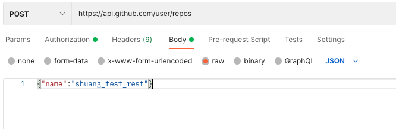

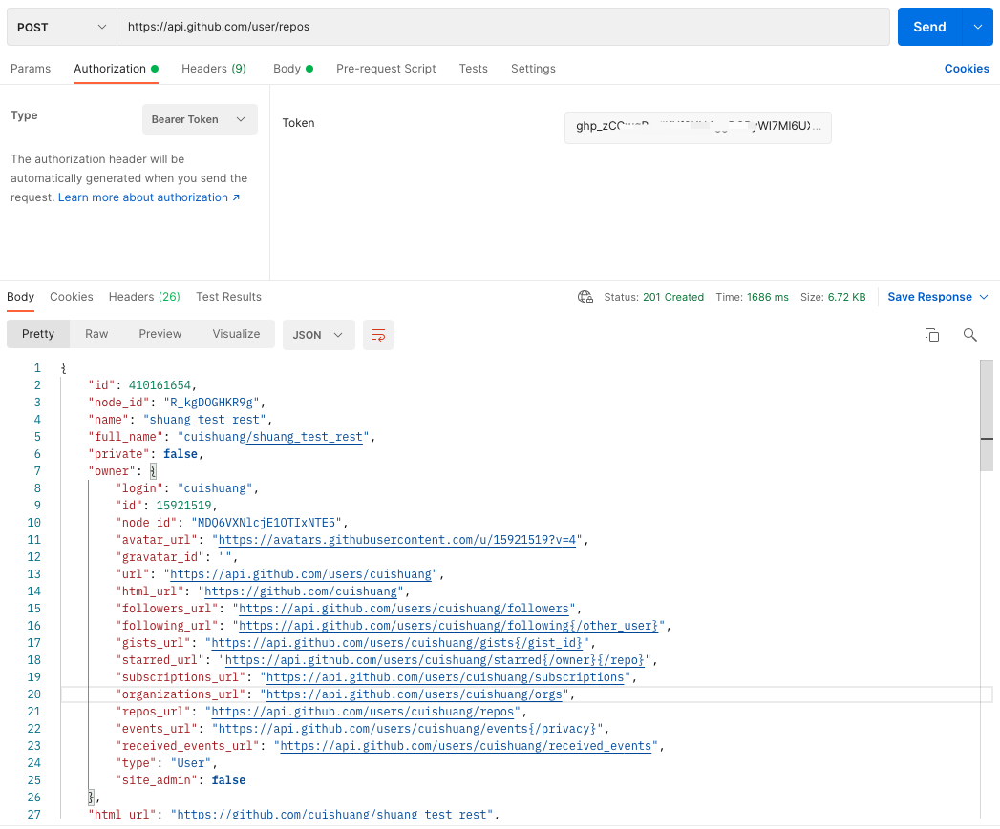

[GET](https://docs.github.com/en/rest/reference/repos#get-a-repository),

[PATCH](https://docs.github.com/en/rest/reference/repos#update-a-repository)和
[DELETE](https://docs.github.com/en/rest/reference/repos#delete-a-repository)类似

 

---

<h3 align="center">
GraphQL
</h3>

- GraphQL的endpoint只有一个

- 所有请求都是POST

 

可以在 [Exploer](https://docs.github.com/en/graphql/overview/explorer)左边写查询，右边显示结果。

查询当前登录的用户名：

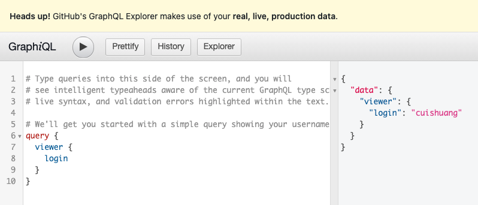

查询Go项目当前的star数：

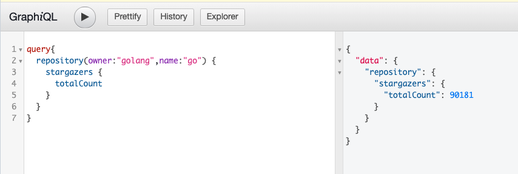

 

GraphQL的endpoint只有一个，即

`https://api.github.com/graphql`

使用Postman：

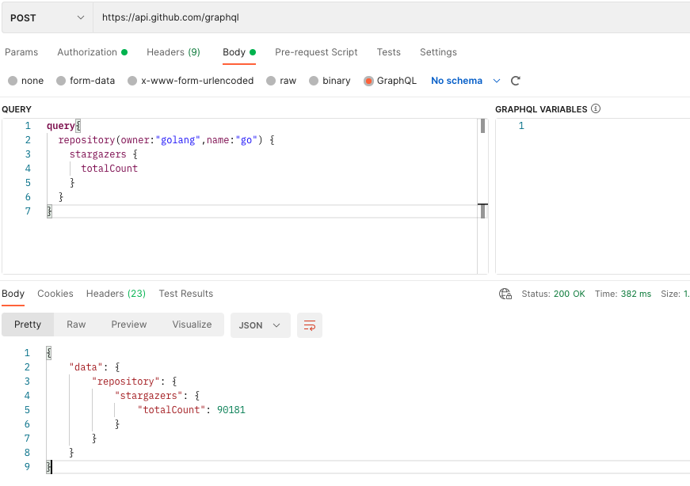

 

使用*query*和*mutation*来区分是查询还是修改

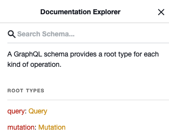

 

<h3 align="center"> 
二者区别
</h3>

- REST一个URI就是一个资源，GraphQL只有一个URI

- REST返回所有的内容，response体积较大，GraphQL可以只返回需要的数据，返回值体积小

GraphQL是一种语言，有自己的语法和类型系统

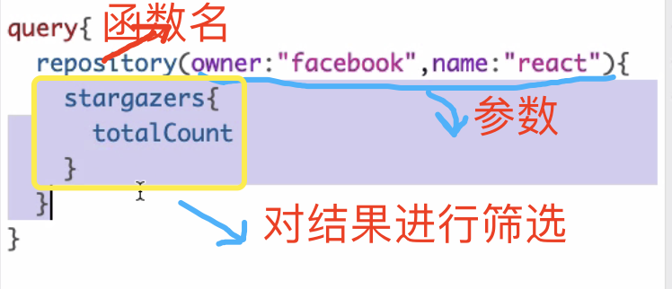

会有错误提示~

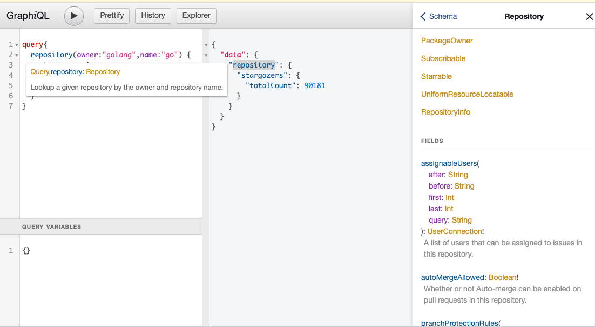

 

**GraphQL的优势：**

- 取你所需要的数据，不多也不少

&nbsp;&nbsp;&nbsp;&nbsp;&nbsp;&nbsp;&nbsp;&nbsp; &nbsp;&nbsp;[n+1问题](https://segmentfault.com/a/1190000039421843)

- nesting(嵌套查询)

&nbsp;&nbsp;&nbsp;&nbsp;&nbsp;&nbsp;&nbsp;&nbsp; &nbsp;&nbsp; 比如想取一个pr的commits、comment、reviews，用REST需要请求四次，然后还需要对返回值进行组装；而用GraphQL则只需要一次请求，拿到的就是需要的数据

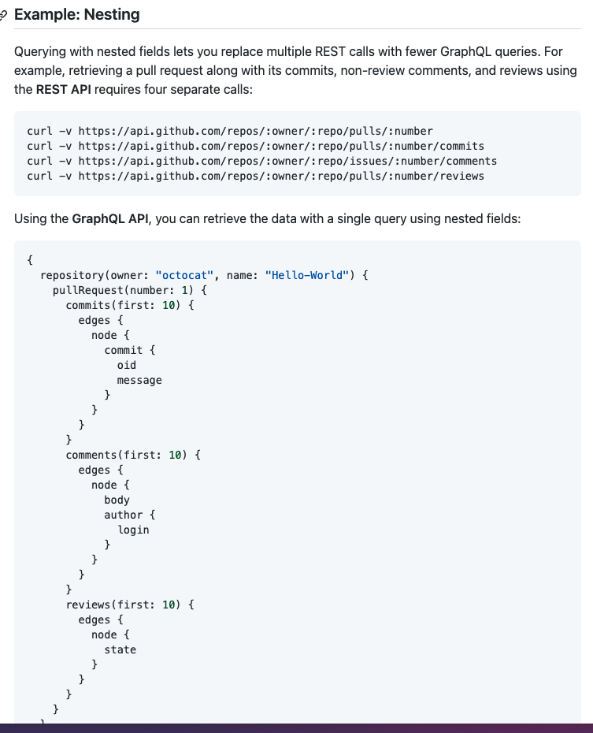

资源孤岛 (REST) vs  Graph（GraphQL）

[graphql-voyager](https://apis.guru/graphql-voyager/)

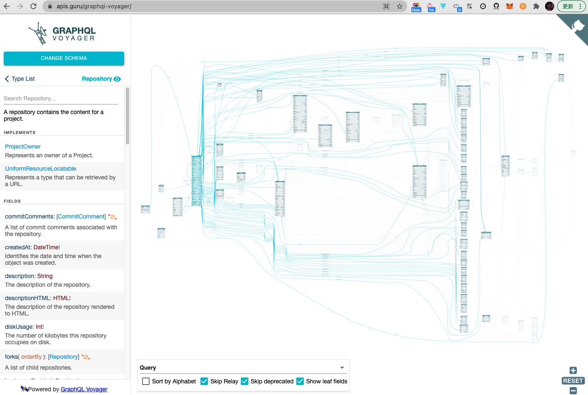

- 强类型（每一个GraphQL的请求发到服务端之后，服务端都会进行校验，不通过会报错）

[Migrating from REST to GraphQL](https://docs.github.com/en/graphql/guides/migrating-from-rest-to-graphql)

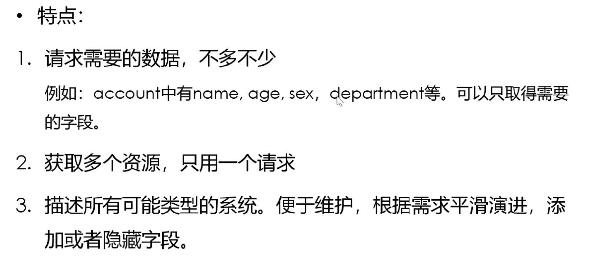

---

参考：

[为什么GraphQL比REST好用？](https://www.bilibili.com/video/BV1f4411A7qA)