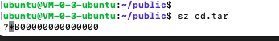
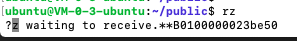
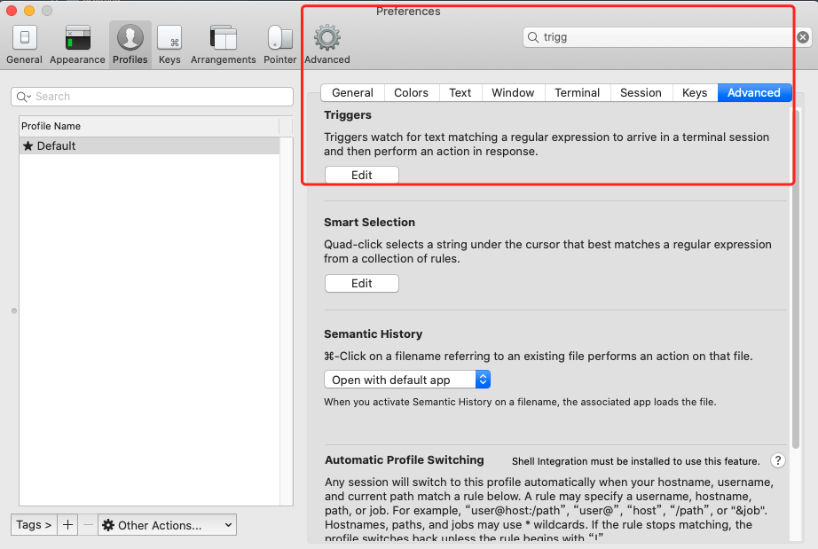

从使用体验上说,**sz/rz**要比**scp**要好得多.但Mac上使用这两个命令需要进行相应配置.








<font size=1>
sz：将选定的文件发送（send）到本地机器

rz：运行该命令会弹出一个文件选择窗口，从本地选择文件上传到Linux服务器
</font>

<br>


### 下载安装lrzsz

<br>

```java
brew install lrzsz
```

<br>

注意设置软链接时,要和当前brew安装的sz/rz的版本一致


```
ln -s /usr/local/Cellar/lrzsz/你所安装的版本/bin/sz
ln -s /usr/local/Cellar/lrzsz/你所安装的版本/bin/rz
```


注意：

新版本homebrew的安装路径为`/opt/homebrew/Cellar/`,不再是`/usr/local/Cellar/`,以上目录需相应修改如下：

```rust
ln -s /opt/homebrew/Cellar/lrzsz/你所安装的版本/bin/sz
ln -s /opt/homebrew/Cellar/lrzsz/你所安装的版本/bin/rz
```


<br>

---


### ~~下载并安装automatic zmoderm for iTerm2~~

### 配置automatic zmoderm for iTerm2


<br>


`cd /usr/local/bin`

新建两个脚本,*iterm2-recv-zmodem.sh*和*iterm2-send-zmodem.sh*

内容如下:

**iterm2-recv-zmodem.sh:**

```java
#!/bin/bash
# 这个脚本来自 github，删掉了一些 ** 言论。

osascript -e 'tell application "iTerm2" to version' > /dev/null 2>&1 && NAME=iTerm2 || NAME=iTerm
if [[ $NAME = "iTerm" ]]; then
	FILE=$(osascript -e 'tell application "iTerm" to activate' -e 'tell application "iTerm" to set thefile to choose folder with prompt "Choose a folder to place received files in"' -e "do shell script (\"echo \"&(quoted form of POSIX path of thefile as Unicode text)&\"\")")
else
	FILE=$(osascript -e 'tell application "iTerm2" to activate' -e 'tell application "iTerm2" to set thefile to choose folder with prompt "Choose a folder to place received files in"' -e "do shell script (\"echo \"&(quoted form of POSIX path of thefile as Unicode text)&\"\")")
fi

if [[ $FILE = "" ]]; then
	echo Cancelled.
	# Send ZModem cancel
	echo -e \\x18\\x18\\x18\\x18\\x18
	sleep 1
	echo
	echo \# Cancelled transfer
else
	cd "$FILE"
	/usr/local/bin/rz -E -e -b --bufsize 4096
	sleep 1
	echo
	echo
	echo \# Sent \-\> $FILE
fi

```
<br>

**iterm2-send-zmodem.sh:**

```java
#!/bin/bash
# 这个脚本来自 github，删掉了一些 ** 言论。

osascript -e 'tell application "iTerm2" to version' > /dev/null 2>&1 && NAME=iTerm2 || NAME=iTerm
if [[ $NAME = "iTerm" ]]; then
	FILE=`osascript -e 'tell application "iTerm" to activate' -e 'tell application "iTerm" to set thefile to choose file with prompt "Choose a file to send"' -e "do shell script (\"echo \"&(quoted form of POSIX path of thefile as Unicode text)&\"\")"`
else
	FILE=`osascript -e 'tell application "iTerm2" to activate' -e 'tell application "iTerm2" to set thefile to choose file with prompt "Choose a file to send"' -e "do shell script (\"echo \"&(quoted form of POSIX path of thefile as Unicode text)&\"\")"`
fi
if [[ $FILE = "" ]]; then
	echo Cancelled.
	# Send ZModem cancel
	echo -e \\x18\\x18\\x18\\x18\\x18
	sleep 1
	echo
	echo \# Cancelled transfer
else
	/usr/local/bin/sz "$FILE" -e -b
	sleep 1
	echo
	echo \# Received $FILE
fi
```

<br>

然后执行

`sudo chmod 777 /usr/local/bin/iterm2-*`

<br>

---

<br>

### 添加iTerm2 trigger

<br>

打开iTerms2->Preferences,搜索`trigger`




然后新添加两行:

<br>

Regular expression | 　　Action |  Parameters  
-|-|-
`\*\*B0100` | Run Silent Coprocess | /usr/local/bin/iterm2-send-zmodem.sh |
`\*\*B00000000000000` | Run Silent Coprocess | /usr/local/bin/iterm2-recv-zmodem.sh |
