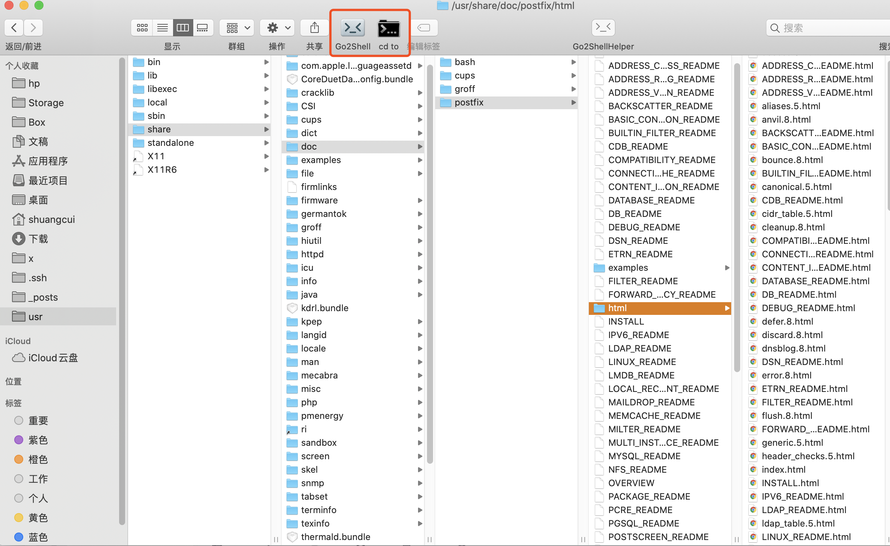
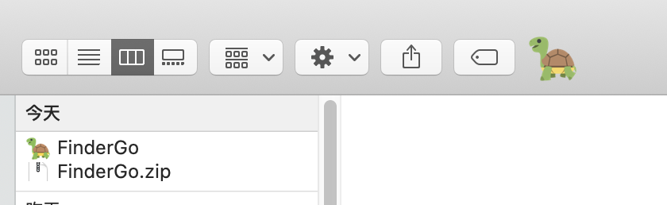

### 在某个文件夹中打开终端

 

如图,想要在终端中到该文件夹,自然而然的办法是`cd /usr/share/doc/postfix/html`, 但其实还有更简洁的办法,即如上安装[Go2Shell](https://zipzapmac.com/Go2Shell)或[cd to](https://lemon.qq.com/lab/app/cdto.html)或[FinderGo](https://github.com/onmyway133/FinderGo)插件. 

(注:最新的系统`Go2Shell`有问题,但`cd to`仍可正常使用)

 

安装步骤如下:

下载后直接解压 
将解压后得到的"Cd To"程序拖拽至"应用程序"文件夹 
在"应用程序"文件夹中找到"Cd To"应用，按住**Command + Option 键**，将应用图标拖拽到Finder（访达）的工具栏上 

 

---

### 在终端中打开某个文件夹

 

**打开当前所在的文件夹:**
`open .` 

---

 

**打开指定的文件夹:**

`open ~`

`open /home/`

`open ~/Downloads/`

`open /usr/share/doc/postfix/html`

