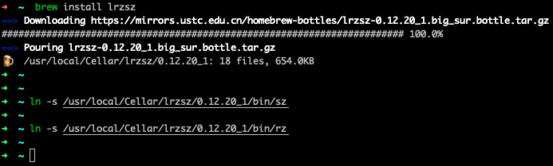
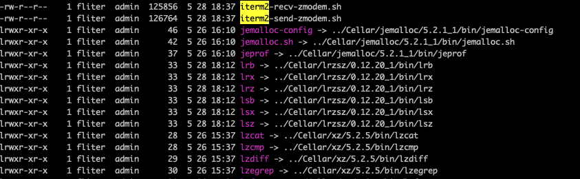
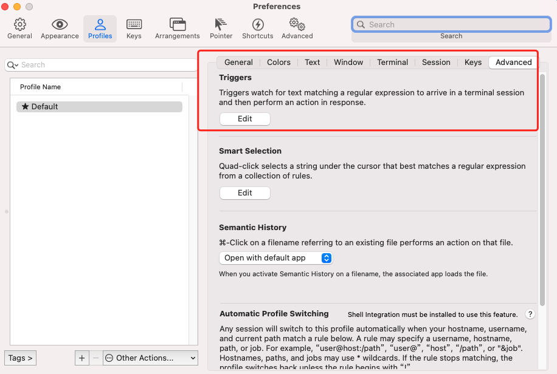
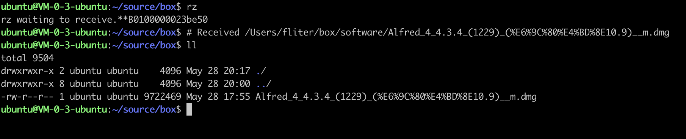
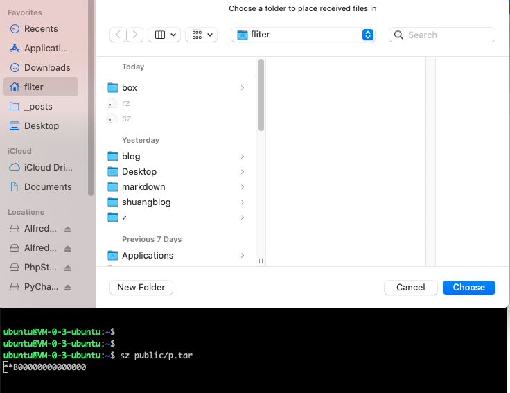

该篇在[Mac使用sz/rz](https://www6.dashen.tech/2019/08/17/Mac%E4%BD%BF%E7%94%A8sz-rz/)进行了部分优化,本质大同小异~

<br>


1. 下载 [iTerm2](https://iterm2.com/#/section/downloads)

<br>


2. 下载 lrzsz

    ```sh
    brew install lrzsz

    ln -s /usr/local/Cellar/lrzsz/0.12.20_1/bin/sz

    ln -s /usr/local/Cellar/lrzsz/0.12.20_1/bin/rz
    ```

     


<br>

3. 下载并安装 automatic zmoderm for iTerm2

    ```sh

    cd /usr/local/bin

    vim iterm2-recv-zmodem.sh

    vim iterm2-send-zmodem.sh

    将 
    
    https://gitee.com/cuishuang/box/blob/master/rz-sz/iterm2-recv-zmodem.sh  
    
    以及
    
    https://gitee.com/cuishuang/box/blob/master/rz-sz/iterm2-send-zmodem.sh
    
    中的内容,复制到以上两个.sh文件中

    sudo chmod 777 /usr/local/bin/iterm2-*

    ```

     


<br>


4. 添加iTerm2 trigger

    打开 iTerm2 --> Profiles --> Open Profiles --> Edit Profiles --> Advanced --> Edit Trigger 

    (可在Advanced页面搜索Edit Trigger)

      

    进行如下配置:


    |  　Regular expression   | Action  | Parameters |
    |  ----  | ----  | -----| 
    | `\*\*B0100`  | Run Silent Coprocess |  /usr/local/bin/iterm2-send-zmodem.sh |
    | `\*\*B00000000000000`  | Run Silent Coprocess | /usr/local/bin/iterm2-recv-zmodem.sh|


<br>

5. 使用


    rz为received,运行该命令会弹出一个文件选择窗口,从本地选择文件上传到远程机器(用于在远程机器上,从本机接受什么文件)

    sz为 send, 将选定的文件由远程机器发送（send）到本地机器

     

    <br>

     