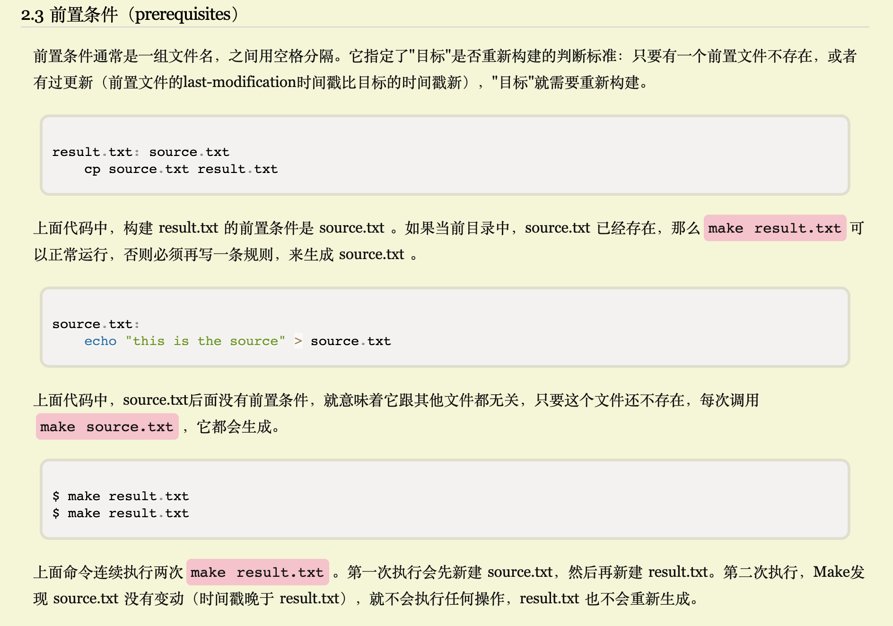
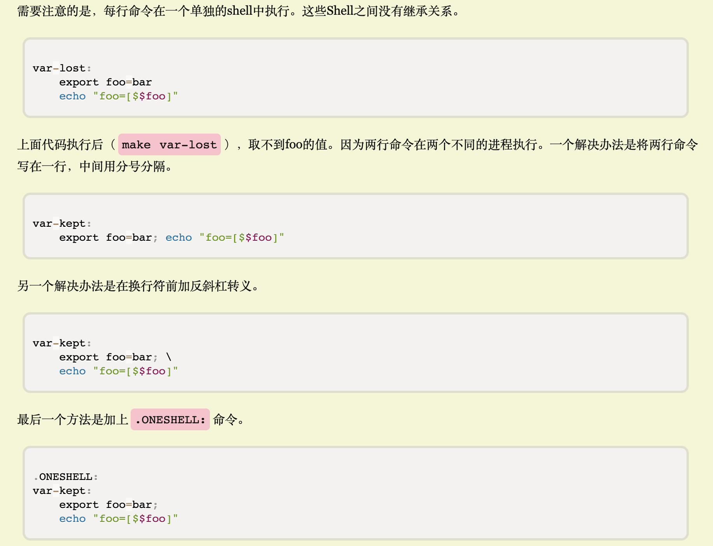
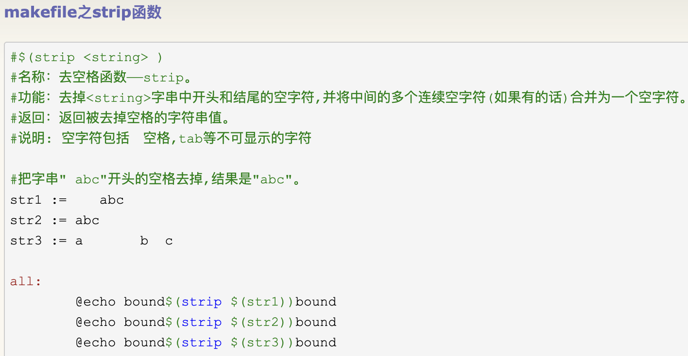

本篇是对[阮一峰-Make 命令教程](https://www.ruanyifeng.com/blog/2015/02/make.html)的学习与记录


<br>

## 基本规则

<br>

### target必不可少

<br>


```go
<target1> :  <前置条件(可选)> 
[tab]  <command1>
[tab]  <command2>

<target2> :  <前置条件(可选)> 
[tab]  <command_x>
[tab]  <command_y>
```

如

```go
clean:
      rm *.txt
clone:
      git clone git@github.com:cuishuang/kit.git
```


一个目标（target）就构成一条规则,执行`make  clean`,则将执行该规则。

如果Make命令运行时没有指定目标，默认会执行Makefile文件的第一个目标，

如对于上面的makefile，`make` 就相当于 `make clean`


<br>

### .PHONY的作用

<br>


如果当前目录中，正好有一个文件叫做*clean*，那么`make clean`命令将不会执行。因为Make发现clean文件已经存在，就认为没有必要重新构建，也就不会执行后面的命令

这时就需要使用`.PHONY`,明确声明clean是"伪目标":


```go
.PHONY: clean
clean:
        rm *.txt
```

声明clean是"伪目标"后，make就不会去检查是否存在一个叫做clean的文件，而是每次运行都执行对应的命令。

像`.PHONY`这样的内置目标名还有不少，可[查看手册](https://www.gnu.org/software/make/manual/html_node/Special-Targets.html#Special-Targets)


<br>

### 前置条件（prerequisites）

<br>





<br>

### 具体命令

<br>

由一行或多行的Shell命令组成

每行命令之前必须有一个tab键。

<font size=1 color="grey">
如果想用其他键，可以用内置变量.RECIPEPREFIX声明。
</font>


<br>


每行命令在一个单独的shell中执行,之间没有继承关系




<br>

---

<br>

## 具体语法

<br>


### 1.注释


<br>


### 2.回声（echoing）


<br>


### 3.通配符


<br>


### 4.模式匹配


<br>


### 5.变量和赋值符


<br>


### 6.内置变量（Implicit Variables）


<br>

**Makefile.defs即Makefile定义的变量,一般会在Makefile头部引入...分开写清晰一些**


LD_FLAGS=-ldflags "-X main.__commit__=$(git_commit)"
是把这个值，注入到main的__commit__变量里


### 7.自动变量（Automatic Variables）


<br>


### 8.判断和循环


<br>


### 9.自己写的函数


<br>


### 10.内置函数


<br>

[Makefile中可用的函数](https://seisman.github.io/how-to-write-makefile/functions.html)

<br>

#### strip





<br>

---

<br>

## 实战一下

<br>


```makefile
.PHONY: all build deploy syncCloud

all:build deploy syncCloud

build:
	hexo g
	echo "----------构建完成----------"


deploy:
	hexo d
	echo "----------部署完成----------"

# 发送到icloud
syncCloud:
	cp -rf /Users/fliter/blog/source/* /Users/fliter/Documents
	echo "----------同步完成----------"

```


<br>

---

<br>

进阶： 

[阮一峰-使用 Make 构建网站](https://www.ruanyifeng.com/blog/2015/03/build-website-with-make.html)

[如何调试MAKEFILE变量](https://coolshell.cn/articles/3790.html)

[跟我一起写 Makefile--陈皓](https://blog.csdn.net/haoel/article/details/2886)