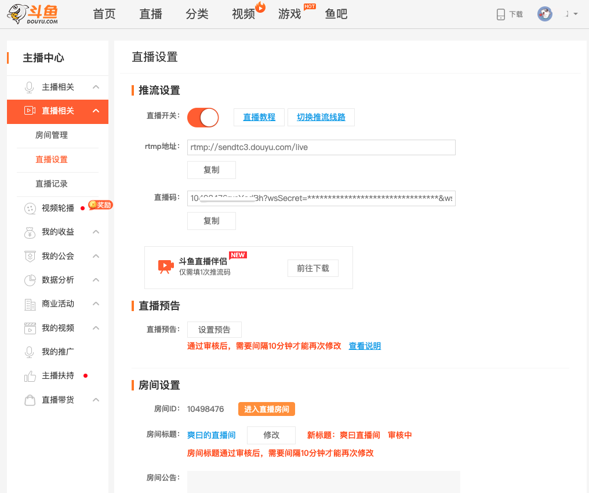
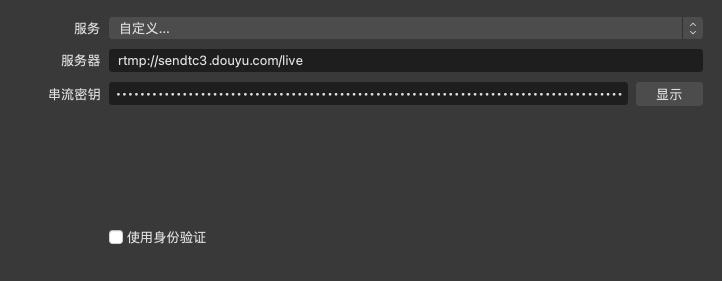
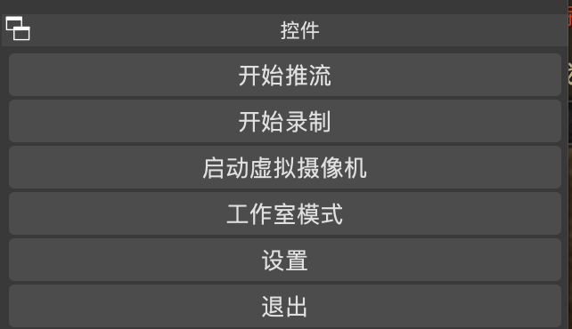
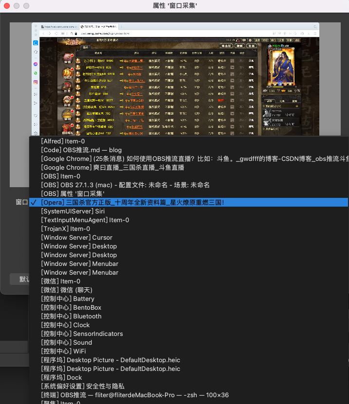

为深入理解rtmp，推流，互动直播，录制，特意尝试了下使用OBS来推流到(各大)直播平台。。

 

以斗鱼为例，申请[成为主播后](https://mp.douyu.com/live/main)，会得到**rtmp地址**和**直播码**，

下载OBS

右下角，设置-推流-自定义:

 

接着设置来源,即想要在直播平台上显示的东西

点击加号，选择 *显示器采集*， （之前版本坑叫*显示捕获*），这样整个屏幕都会被推到直播平台

点击右侧*开始推流*，就会将选定的”来源“（此处即显示器屏幕），推流到斗鱼的房间

使用*窗口采集*，则只会推这个窗口的信息

 

 

还需要再解决下窗口显示不全的问题

 

更多参考：

[OBS推流直播快速上手教程](https://www.bilibili.com/read/cv5380911/)

