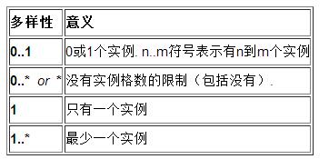
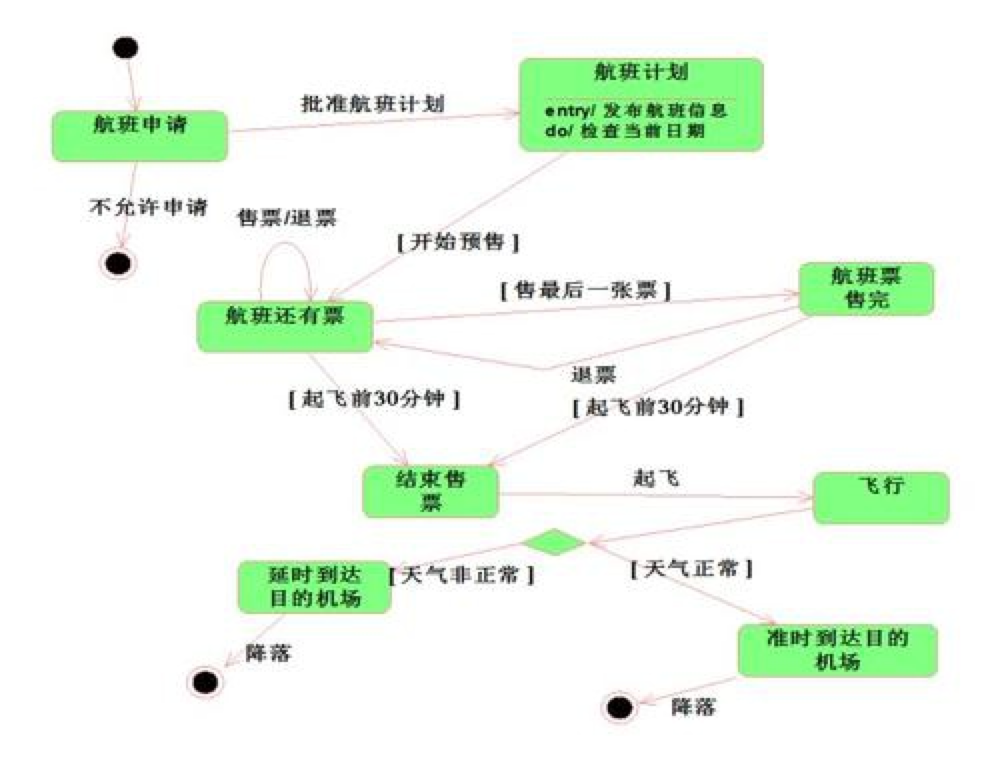

统一建模语言（UML是 Unified Modeling Language的缩写, 是用来对软件系统进行可视化建模的一种语言。UML为面向对象开发系统的产品 进行说明、可视化、和编制文档的一种标准语言。

 

 

共有**9**种图

UML中的图其实不止九种 (相同的图还可能会有不同的名称), 这里的九种图是被普遍认可的基础图, 分别为：用例图、类图、对象图、状态图、构件图、部署图、协作图、交互序列图、活动图。

之前在惠普时,用过**时序图**(即*顺序图*,*交互序列图*)

 

UML图也可分为用例视图、设计视图、进程视图、实现视图和拓扑视图

又可以根据静动分为**静态视图**和**动态视图**

- 静态图分为：用例图，类图，对象图，包图，构件图，部署图

- 动态图分为：状态图，活动图，协作图，序列图

 

一般情况下,又以**类图,状态图,用例图**最为重要

 

### 类图(Class Diagram)

 

类图是使用频率最高的UML图之一

If someone were to come up to you in a dark alley and say, 'Psst, wanna see a UML diagram?' that diagram would probably be a class diagram. The majority of UML diagrams I see are class diagrams.” 

`---` Martin Fowler [《UML Distilled: A Brief Guide to the Standard Object Modeling Language, Third Edition》](https://book.douban.com/subject/1231832/)

“如果有人在黑暗的小巷中向你走来并对你说：‘嘿，想不想看一张UML图？’那么这张图很有可能就是一张类图，我所见过的大部分的UML图都是类图”（《UML精粹：标准对象建模语言简明指南（第3版）》）

[深入浅出UML类图](http://www.uml.org.cn/oobject/201211231.asp)

 

显示了模型的静态结构，特别是模型中存在的类、类的内部结构以及它们与其他类的关系等。那它其实就是用来帮助我们识别出人、事、物和业务的概念，并理清它们的关系的一种方法

如 

>  计算机可以分为笔记本电脑和台式机，现在有主板、硬盘、内存、显示器、键盘、鼠标、无线鼠标、有线鼠标、机械鼠标、光电鼠标、蓝牙鼠标，请画出类之间的关系，不需要写属性，需要假设的地方在图中注明，如假设计算机只有一个显示器

 

#### 类之间的关系

 

类与类之间的关系通常有6种，即

- 依赖关系（Dependency）: 用带箭头的虚线表示，箭头从使用类指向被依赖的类

- 关联关系（Association）: 单向关联用一个带箭头的实线表示，箭头从使用类指向被关联的类; 双向关联用带箭头或者没有箭头的实线来表示
  - 聚合关系 (Aggregation) : 是关联关系的一种，表示整体和部分之间的关系(成员也可以脱离整体而存在)，如学校和老师，~~车子和轮胎~~. 用带空心菱形的实线来表示聚合关系, 菱形指向整体

  - 组合关系 (Composition) : 也是关联关系的一种，是一种比聚合关系还要强的关系(部分对象不能脱离整体对象而单独存在，如人的身体和大脑之间的关系，大脑不能脱离身体而单独存在), 用带实心菱形的实线来表示组合关系，菱形指向整体

- 实现关系（Realization/implements）: 即 接口和实现类之间的关系。类实现了接口中的抽象方法。用带空心三角箭头的虚线来表示实现关系，箭头从实现类指向接口。

- 泛化关系（Generalization/extends）: 也称继承关系, 是父子类之间的继承关系，表示一般与特殊的关系，指定子类如何特殊化父类的特征和行为。 用带空心三角箭头的实线来表示泛化关系，箭头从子类指向父类。

 

 

六种关系中，从弱到强依次是：

依赖关系 < 关联关系 < 聚合关系 < 组合关系 < 实现关系 = 泛化关系

其中,*依赖*和*关联*还区分**单向**和**双向**

 

[六大类UML类图之间的关系](https://segmentfault.com/a/1190000021317534)

[UML类图详解](https://juejin.cn/post/6844903893327937550#heading-2)

---

 

#### 实例

 

 

车的类图结构为`<<abstract>>`，表示车是一个抽象类；

它有两个继承类：小汽车和自行车；它们之间的关系为实现关系，使用带空心箭头的虚线表示；

小汽车为与SUV之间也是继承关系，它们之间的关系为泛化关系，使用带空心箭头的实线表示；

小汽车与发动机之间是组合关系，使用带实心箭头的实线表示；

学生与班级之间是聚合关系，使用带空心箭头的实线表示；

学生与身份证之间为关联关系，使用一根实线表示；

学生上学需要用到自行车，与自行车是一种依赖关系，使用带箭头的虚线表示；

 

实例来自 

[看懂UML类图](https://design-patterns.readthedocs.io/zh_CN/latest/read_uml.html)

[常用的UML建模详解](https://note.youdao.com/web/#/file/WEBe8ba4466b3d1775023be4d1dab9cd6c6/note/A895F3772E37471A96C0B73F97C5C1E6/)

---

 

### 状态(机)图(State Diagram)

 

状态机图描述的是围绕某一事物状态变化的图。它和活动图的区别在于，活动图是描述事物发生的流程，是多个角色参与的，而状态机描述的是事物的状态变化，并没有角色这个概念。

 

 

1、和活动图一样，状态机图也是**只能有一个开始状态，可以有多个结束状态。**

2、状态是通过某一事件来进行变迁的。

3、状态是离散的，且一般用形容词或名词描述。

4、转换也可加上条件，表示分支结构。

如:

>  空调开机进入自检状态，检测不通过进入错误状态并且亮红灯，检测通过默认进入制冷状态，按遥控器模式切换可以在制冷、制热、吹风切换，制冷可以设置温度，并有温度监控程序，室温低于设定温度则停止制冷，高于则开始制冷；制热则反过来；吹风就只能吹风，没有其他功能

---

 

#### 实例

 

 

实心圆表示开始,只能有一个;

"空心套实心圆"表示结束,可以有多个.

圆角矩形里都是**状态**, 

*转移*(即直线箭头)上是动作或返回的状态

 

---

 

### 用例图(Use Case Diagram)

 

描述了作为一个外部观察者,以其视角对系统的印象。

通俗理解, 用例就是软件的功能模块，所以是设计系统分析阶段的起点

强调这个系统是什么而不是这个系统怎么工作。

 

**角色是人状的图标，用例是一个椭圆，通讯是连接角色和用例的线。**

 

#### 用例之间的关系

 

- 包含(include)

- 扩展(extend)

- 泛化(generalization)

[UML—用例图，Use Case](https://www.jianshu.com/p/3cde67aed8e9)

---

 

#### 实例

 

 

[用例图的使用案例与分析](https://blog.csdn.net/ljtyzhr/article/details/45875975)

---

 

在线画图网站:

[VisualParadigm](https://online.visual-paradigm.com/cn/diagrams/templates/software-design/)

[亿图图示](https://www.edrawmax.cn/online/?lang=zh)