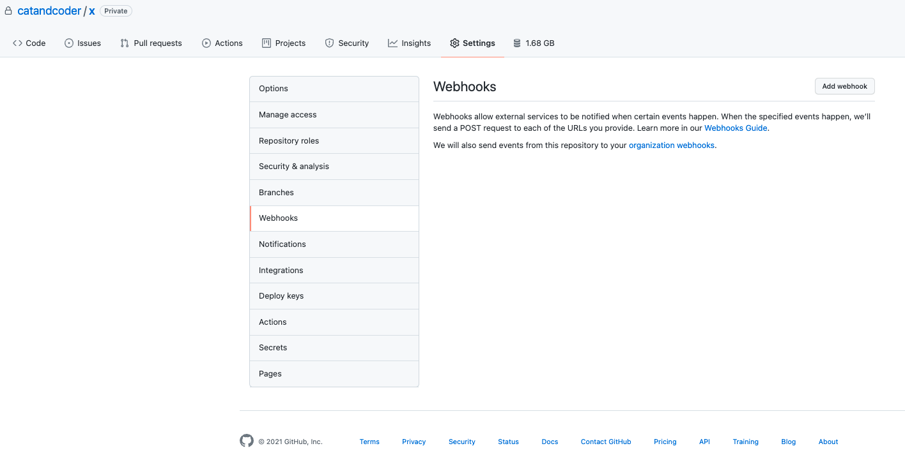
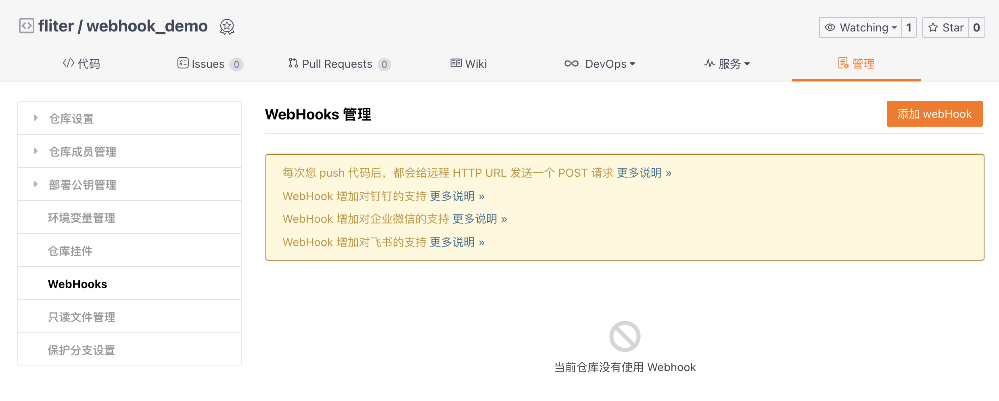
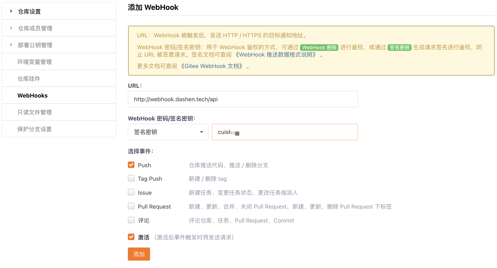
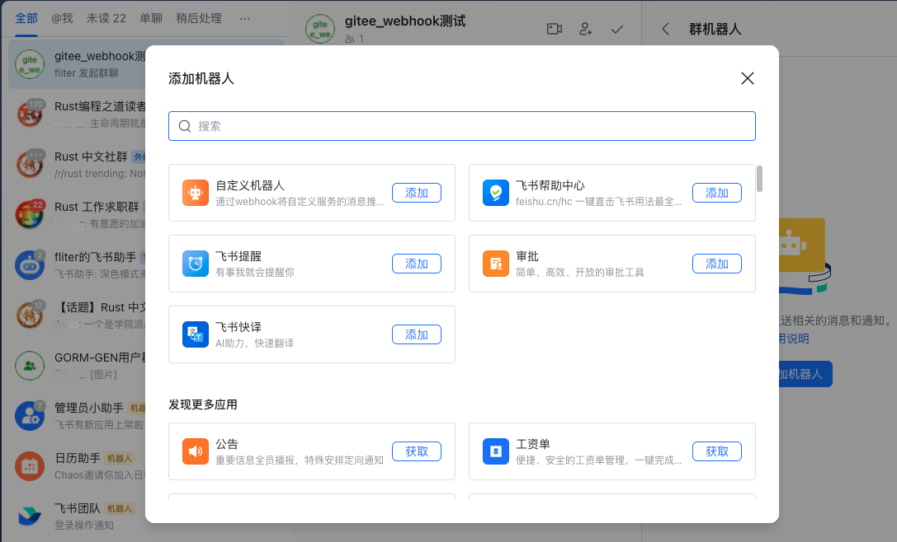
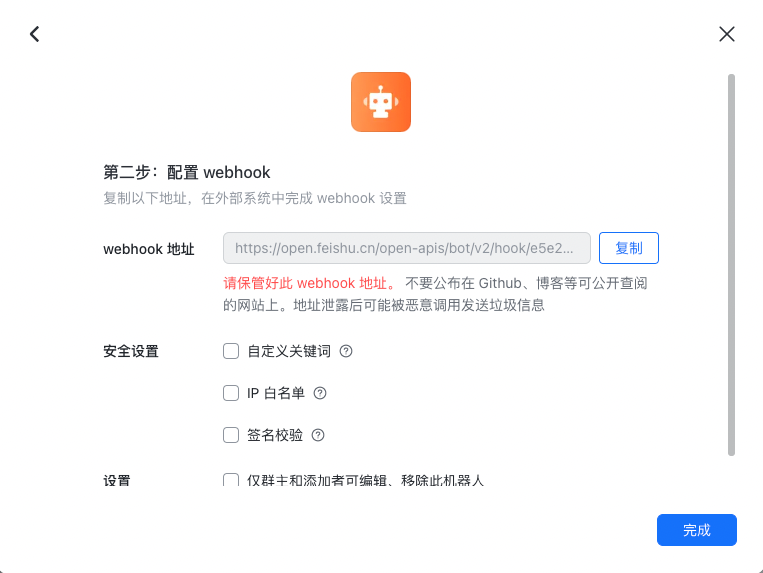
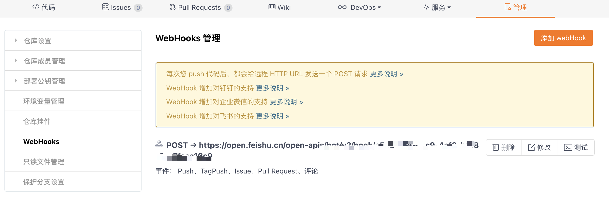
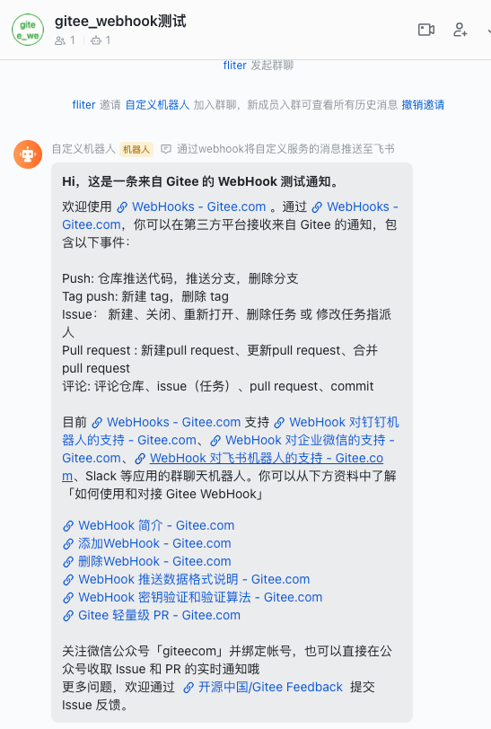
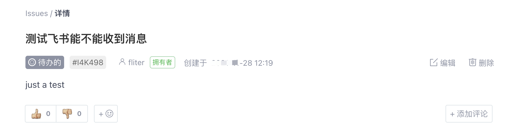
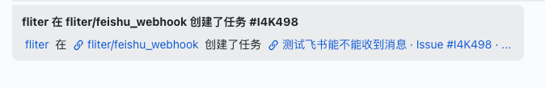

钩子Hooks和回调Callback，是指在执行一系列操作过程中，触发了某个条件，会去执行某项操作。

<font size=1 color="grey">

如在GORM中，想要在执行查询后，上报一下执行的时间,则可以 

```go
db.Callback().Query().After("gorm:query").Register("endRead", completeRead)
```

其中`endRead`为自定义的事件名称，`completeRead`为自定义的触发时要执行的方法

(在GROM中，Hooks仅针对当前场景有效，Callback则针对全局有效)

在日志库 [github.com/sirupsen/logrus]()，redis go客户端[github.com/go-redis/redis/v8]等库中，也都支持钩子/回调

</font>


<br>


Webhook大致与hook类似，一般称为`反向 API`。 和传统的 **客户端请求，服务器响应**相比，客户端提供一个URL，在事件发生时，服务端会向这个配置好的 URL 发送一条信息。 即与`请求-响应`不同,使用 Webhook 你可以实时接受到变化 （原本是主动拉取，现在是被动被push； 印象里支付宝/微信支付等都有类似功能，要求你提供一个接口，支付成功后向该接口push信息）


在github/gitlab/gitee中，**WebHook 用于在项目发生相关事件时通知外部服务器**

（与监听事件、触发器之类的东西类似）


<br>


我写完一篇新博客，执行`make`之后，代码会自动构建并push到github的对应仓库(详见[Makefile书写小结](https://dashen.tech/2019/10/30/makefile%E4%B9%A6%E5%86%99%E5%B0%8F%E7%BB%93/)).

但还需要登录服务器，手动*git push*一下 (为提升速度，没有使用github的pages功能)。

之前有通过脚本，在完成push后自动登录服务器，切换到项目目录进行git push

```sh
#!/usr/bin/expect 
set timeout 30
spawn ssh -l ubuntu 118.xxx.xx.xxx
expect "password:"
send "密码\r"


#interact
#https://blog.csdn.net/houmou/article/details/53102051
expect "Last login:"  
#send "pwd\r"
send "cd 项目目录\r"
#expect "项目目录"
send "git pull\r"

send "pwd\r"
send "exit\r"

expect eof%  
```

<br>

但每次换电脑，需要将公钥上传服务器； 再加上项目目录也有改变。 这两种场景下均需要去修改脚本。


有没有更好的方式呢？ 当探测到有新的push，服务器主动去pull代码？ （其实未必比上面通过脚本的方式好...此处只为试一下webhook这个功能）


github提供了这样的hooks。我提供一个接口，每当有push事件时，这个hooks会去请求所提供的接口。

该接口收到请求，执行方法（切换到项目目录，执行git pull）





<br>


提供一个接口，代码如下：


```go


```


<br>

<br>


另外：

如果用gitee， 还可以集成进钉钉/企业微信/飞书/slack, 无需自己提供接口






以[飞书](https://gitee.com/help/articles/4297#article-header0)为例，














当有事件发生时，







<br>

---

<br>


参考：


[配置git的webhook](https://blog.csdn.net/yanyan42/article/details/85854700)

[什么是 Webhook？](https://www.jianshu.com/p/9829986b4363)

[钩子(hooks)—webhook-使用钩子自动触发部署](https://www.cnblogs.com/jpfss/p/9228229.html)


[gitee-WebHook 推送数据格式说明](https://gitee.com/help/articles/4186#article-header0)

[Gitee WebHook 文档](https://gitee.com/help/categories/40)