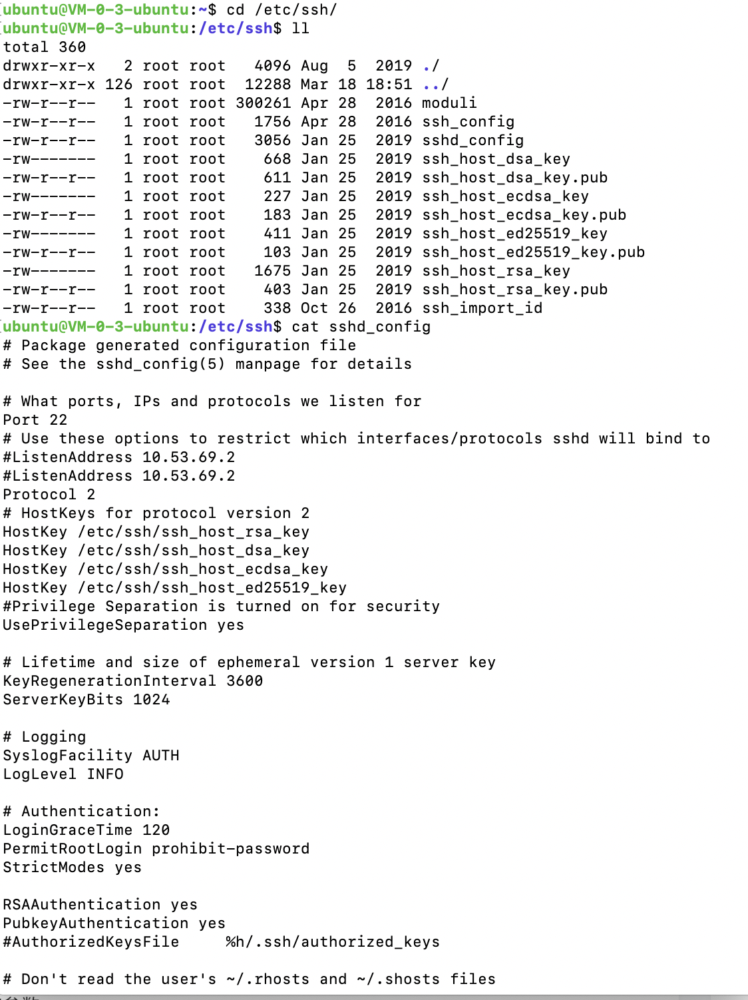
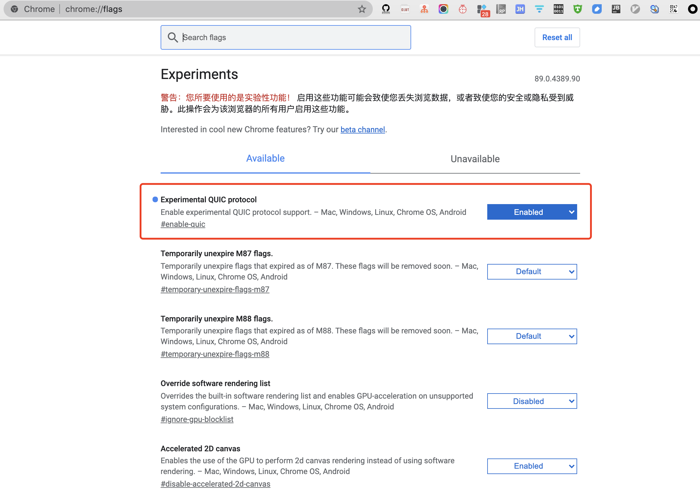
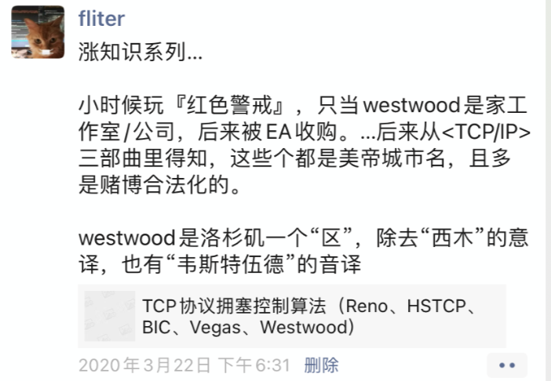
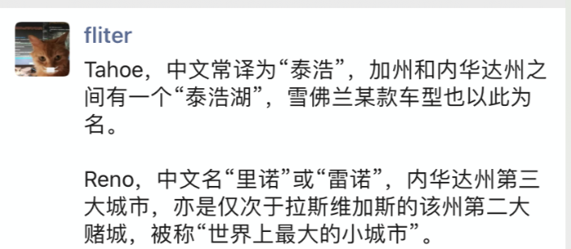
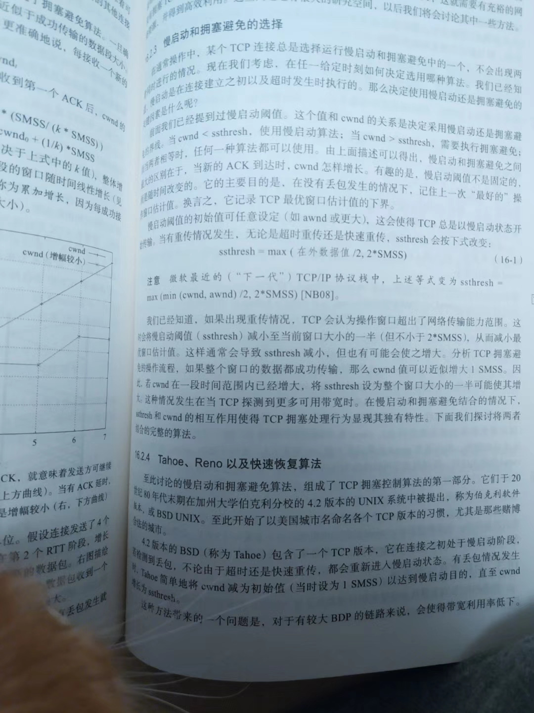

<div align='center' ><font size='4' color="#1E90FF"><b>答读者问</b></font></div>


<br>

### Linux为什么卡住了?


<br>


[解决SSH登录过慢——取消ssh的DNS反解](https://my.oschina.net/u/1413019/blog/537324)





`cat sshd_config | grep -i dns` 发现没有结果,说明这台服务器没有这项配置 (貌似仅 *debian* 服务器才会出现这现象)


<br>


---

<br>

### 像福尔摩斯一样思考


<br>

用 **Wireshark** 排查问题,和侦探破案的思路是一致的


<br>


---

<br>

### 一篇关于VMware的文章


<br>


灵感不是天生的,它来自长期的训练


[ESX/ESXi hosts might experience read or write performance issues with certain storage arrays (1002598)](https://kb.vmware.com/s/global-search/%40uri#q=1002598&t=MoreContent&sort=relevancy)


<br>


---

<br>

### 来点有深度的


<br>

- SACK: 即 Selective ACK.

    使得接收方能告诉发送方哪些报文段丢失，哪些报文段重传了，哪些报文段已经提前收到等信息。根据这些信息TCP就可以只重传哪些真正丢失的报文段。

    [TCP选项之SACK选项概述](https://blog.csdn.net/xiaoyu_750516366/article/details/87870712)


<br>

- [MSS: 最大分段大小 (Maximum segment size)](https://dashen.tech/2020/06/10/%E8%AE%A1%E7%AE%97%E6%9C%BA%E7%BD%91%E7%BB%9C%E4%B8%AD%E5%B8%B8%E8%A7%81%E7%BC%A9%E7%95%A5%E8%AF%8D%E7%BF%BB%E8%AF%91%E5%8F%8A%E7%AE%80%E6%98%8E%E9%87%8A%E8%A6%81/#MSS-%E6%9C%80%E5%A4%A7%E5%88%86%E6%AE%B5%E5%A4%A7%E5%B0%8F-Maximum-segment-size)


<br>


---

<br>

### 三次握手的小知识


<br>

DDoS 的形式有很多种,其中最流行的就是基于三次握手的 SYN flood,其原理是从大量主机发送**SYN**请求给服务器,假装要建立TCP连接.

这些SYN请求可能含有假的源地址,所以服务器响应后永远收不到Ack,就会留下half-open状态的TCP连接.

由于每个TCP连接都会消耗一定的系统资源,如果攻击足够猛烈,此类连接越建越多,服务器的资源就会被耗光,真正的用户访问也会被拒绝.


<br>


可以把 **SYN flood** 看作TCP协议的设计缺陷,有办法可以防御,却无法根除


<br>


---

<br>

### 被误解的TCP


<br>

就像我们不用每天都跟公司算一次工钱,而是攒到月底结算一样,数据接收方也可以累积一些包 才对发送方ACK一次/

至于ACK的频率,不同的操作系统有不同的偏好.


<br>


---

<br>

### 最经典的网络问题


<br>

AIX（Advanced Interactive eXecutive）: IBM基于AT&T Unix System V开发的一套类UNIX操作系统


<br>


愚笨窗口综合症(Silly window syndrome), 也叫 "小包问题"(small packet problem)


<br>

纳格(Nagle)算法


<br>


[TCP Performance problems caused by interaction between Nagle’s Algorithm and Delayed ACK](http://www.stuartcheshire.org/papers/nagledelayedack/)


<br>


---

<br>

### 为什么丢了单子?


<br>

```rust
Appendix A: System Authentication

   The client may wish to identify itself, for example, as it is
   identified on a UNIX(tm) system.  The flavor of the client credential
   is "AUTH_SYS".  The opaque data constituting the credential encodes
   the following structure:

         struct authsys_parms {
            unsigned int stamp;
            string machinename<255>;
            unsigned int uid;
            unsigned int gid;
            unsigned int gids<16>;
         };

```


[rfc 5531](https://www.rfc-editor.org/rfc/inline-errata/rfc5531.html)


<br>


---

<br>

### 受损的帧


<br>


[帧检验序列(FCS)](https://blog.csdn.net/lxm920714/article/details/103274092)

一般使用 `循环冗余算法（CRC）`检测算法来进行检错和纠错


<br>


---

<br>

### 虚惊一场


<br>


延迟确认: 可以省掉四次挥手中的第二个包


[Linux下TCP延迟确认(Delayed Ack)机制导致的时延问题分析](https://cloud.tencent.com/developer/article/1004356)


[TCP/IP还有三次挥手](https://dashen.tech/2019/06/21/TCP-IP%E8%BF%98%E6%9C%89%E4%B8%89%E6%AC%A1%E6%8C%A5%E6%89%8B/)


作为 Wireshark 熟练工,必须能从一端抓到的网络包中推测出另一端的概况,才能分析出那些最复杂的问题.

<br>


---

<br>

### NTLM协议分析


<br>


**NTLM**: NT LAN Manager, Windows NT时代就出现的身份验证协议

已经不够安全,不推荐使用. 推荐 *Kerberos*


<br>


**域控**: 域控制器是指在“域”模式下，至少有一台服务器负责每一台联入网络的电脑和用户的验证工作，相当于一个单位的门卫一样，称为“域控制器（Domain Controller，简写为DC）


<br>


---

<br>

### Wireshark的提示


<br>


- Packet size limited during capture

- TCP Previous segment not captured

- TCP ACKed unseen segment

- TCP Out-of-Order

- TCP Dup ACK

- TCP Fast Retransmission

- TCP Retransmission

- TCP zerowindow

- TCP window Full

- TCP segment of a reassembled PDU

- Continuation to #

- Time-to-live exceeded (Fragment reassembly time exceeded)


<br>

---


<br>


<div align='center' ><font size='4' color="#1E90FF"><b>工作中的Wireshark</b></font></div>


<br>


### 书上错了吗?


<br>


建议初学者两边(数据接收方,数据发送方)同时抓包,对照着看

网络延迟 会导致同样的网络包,在两端体现出不同的顺序.


<br>


---

<br>

### 计算'在途字节数'


<br>

承载量 就是处于运输工具中的货物量，即**已经从源仓库发货，但还没有到达目的地的包裹数量。**

<br>

和运输机类似，网络承载量也可以用已经发送出去，但尚未被确认的字节数来表示。在英文技术文档中，形象地用“bytes in fight”来描述它，我觉得用“在途字节数"来翻译最好。

飞机如果超载了，是会发生严重事故的。而在途字节数如果超过网络的承载能力，也会丢包重传，这就是我们需要计算它的原因。


<br>


---

<br>

### 估算网络拥塞点


<br>

假如把网络路径想象成一条河流。发送方是水源、接收方是入海口，那 **在途字节数** 就是河里的水量。 当水源的流速超过了入海口的流速，河里的水量就会越来越多，直至溢出。所以大致可以认为，**发生拥塞时的在途字节数即是该时刻的网络拥塞点。明白了这一点，估算拥塞点就可以简化成找出拥塞时刻的在途字节数了。**


<br>

每一次拥塞带来的性能影响都很大，即使千分之一的概率都足以导致性能大滑坡


<br>


---

<br>

### 顺便说说LSO


<br>

LSO: Large Segment Offload


<br>


LSO是什么呢？它是为了拯救CPU而出现的一个创意。随着网络进入千兆和万兆时代， CPU的工作负担明显加重了。625MB/s的网络流量大约需要耗费5GHz的CPU，这已经需要一个双核2.5 GHz CPU的全部处理能力了。为了缓解CPU的压力，最好把它的一些工作 *外包（offload）* 给网卡，比如TCP的分段工作。

传统的网络工作方式是这样的：应用层把产生的数据交给TCP层， TCP层再根据MSS大小进行分段（由CPU负责），然后再交给网卡。

**而启用LSO之后，TCP层就可以把大于MSS的数据块直接传给网卡，让网卡来负责分段工作了.**


<br>


---

<br>

### 熟读RFC


<br>

决定客户端发送窗口的因素有两个，分别为网络上的拥塞窗口（Congestion Window，缩写为cwnd）和服务器上的接收窗口。


本案例中的客户端采用了一种不太科学的cwnd算法,服务器上又启用了LRO. 两者分开工作的时候都没有问题,但是配合起来就会导致cwnd上升过慢,从而极大地影响了性能.


<br>

[CWnd](https://baike.baidu.com/item/CWnd/5905400)

[如何理性的调整「rwnd」和「cwnd」的大小](https://blog.csdn.net/lishanmin11/article/details/77165077/)


LRO: Large Receive Offload, 通过将接收到的多个TCP数据聚合成一个大的数据包，然后传递给网络协议栈处理，以减少上层协议栈处理 开销，提高系统接收TCP数据包的能力。
(积累多个TCP包再集中处理)


[关于网卡特性TSO、UFO、GSO、LRO、GRO](https://blog.csdn.net/notbaron/article/details/79837821)


<br>


---

<br>

### 一个你本该解决的问题


<br>


争论TCP和UDP哪个更好,就像每天在吵狮子和老虎谁更厉害一样无聊. 它们俩都是其领域之王,只不过一个适合在草原,另一个适合在森林而已


<br>


---

<br>

### 几个关于分片的问题


<br>

1. 为什么要分片?

20世纪60年代以前，数据通信是依靠电路交换技术的，根本没有分片一说，比如传统电话。由于电路交换的双方要独占链路，所以利用率很低，直到 [Paul Baran](http://www.vsharing.com/k/vertical/2012-1/654333.html)(被称为交换机之父,于2011年去世)和[Donald Davies](https://www.uc23.net/lishi/69870.html)(于2000年去世)发明了分组交换的概念，把数据分割成小包后才实现了链路共享。

**既然要分割，就得先确定一个包的大小，** 有趣的是当时这两位独立发明人都在实验室中选择了*128字节*作为一个传输单位。不过到了20世纪80年代的以太网中，就发展到以*1500字节*作为最大传输单位了，即MTU（Maximum TransmissionUnit）为1500. 刨去20字节的头部，一个IP包最多可以携带 $1500—20—1480$字节的数据。当要传输的数据块超过1480字节时，**网络层** 就不得不把它分片，封装成多个网络包。


[MTU:最大传输单元（Maximum Transmission Unit，MTU）](https://dashen.tech/2020/06/10/%E8%AE%A1%E7%AE%97%E6%9C%BA%E7%BD%91%E7%BB%9C%E4%B8%AD%E5%B8%B8%E8%A7%81%E7%BC%A9%E7%95%A5%E8%AF%8D%E7%BF%BB%E8%AF%91%E5%8F%8A%E7%AE%80%E6%98%8E%E9%87%8A%E8%A6%81/)

[网络相关](https://dashen.tech/2013/04/21/%E7%BD%91%E7%BB%9C%E7%9B%B8%E5%85%B3/)


<br>

2. 发送方是怎样确定分片大小的？


如果经常分析各种环境中的包，会发现有些分片并不是携带1480字节，而是更大或者更小。这是因为有些网络是[Jumbo Frame （巨帧）](https://baike.baidu.com/item/%E5%B7%A8%E5%9E%8B%E5%B8%A7/8723785)或[PPPOE](https://baike.baidu.com/item/PPPOE)类的，它们的MTU并不是1500。


于是问题来了， MTU不一致的两个网络之间要通信怎么办？比如启用巨帧之后的MTU是9000字节，那从发送方出来的包就有9000 字节，万一经过一个MTU只有1500字节的网络设备，还是可能被重新分片甚至丢弃。这种情况下发送方要怎样决定分片大小，才能避免因为MTU不一致而出问题呢？


比较理想的办法是先通过*Path MTU Discovery协议*来探测路径上的最小MTU，从而调节分片的大小。可惜该协议是依靠ICMP来探测的，会被很多网络设备禁用，所以不太可靠。


**总而言之，目前发送方没有一个很好的机制来确定最佳分片大小，所以实施和运维人员配置MTU时必须慎之又慎，尽量使网络中每个设备的MTU保持一致。**  

下一个章节就是一些由于MTU配置出错而导致的问题。

<br>


3. 接收方又是靠什么重组分片的？


每个分片都包含`off=xxx,ID=XXX`的信息，接收方就是依据这两个值，把ID相同的分片按照off值（偏移量）进行重组的. 原理非常简单，唯一的问题是接收方如何判断最后一个分片已经到达，应该开始重组了。


当某个包 包含了一个“More fragments =0”的Flag，表示它是最后一个分片.接收方可以开始重组了。


(有一种网络攻击方式就是持续发送“More fragments”为1的包，导致接收方一直缓存分片，从而耗尽内存。)

<br>


4. TCP是如何避免被发送方分片的？

TCP可以避免被发送方分片，是因为它主动把数据分成小段再交给网络层。

<font color="#20B2AA"><b>最大的分段大小称为MSS （Maximum Segment Size），它相当于把MTU刨去IP头和TCP头之后的大小，所以一个MSS恰好能装进一个MTU中。</b></font>

[MSS: 最大分段大小 (Maximum segment size)](https://dashen.tech/2020/06/10/%E8%AE%A1%E7%AE%97%E6%9C%BA%E7%BD%91%E7%BB%9C%E4%B8%AD%E5%B8%B8%E8%A7%81%E7%BC%A9%E7%95%A5%E8%AF%8D%E7%BF%BB%E8%AF%91%E5%8F%8A%E7%AE%80%E6%98%8E%E9%87%8A%E8%A6%81/#MSS-%E6%9C%80%E5%A4%A7%E5%88%86%E6%AE%B5%E5%A4%A7%E5%B0%8F-Maximum-segment-size)


   <br>


5. 那TCP又是怎样适配接收方的MTU的呢?

TCP建立连接时,必须先进行三次握手,**在前两个握手包中**,双方互相声明了自己的MSS


   <br>


6. 为什么UDP比TCP更适合语音通话？

如果把UDP和TCP想象成两位搬运工，前者的风格就是盲目苦干，搬运过程中丢了东西也不管；而后者却是小心翼翼，丢了多小的东西都要回去捡。假如某个应用环境允许忽视质量，只追求速度，那UDP就是一个更好的选择。语音传输正符合这种情况，因为它最在乎的不是音质，而是延迟

采用UDP传输时，如果有些包丢失，应用层可以选择忽略并继续传输其他包. 由于一个发音会被采样到很多个包中，所以丢掉其中一些包只是影响到了音质，却能保障流畅性。

而采用TCP传输时，出现丢包就一定要重传，重传就会带来延迟。这是TCP与生俱来的特点，即使应用层想忽略丢包都没办法。前文说过TCP的优点是可靠，有丢包重传机制，这个优点在语音传输时就变成了缺点。通话延迟的后果很严重.


<br>


---

<br>

### MTU导致的悲剧


<br>


MTU带来的问题实在太多了

如两个子网的MTU大小不一样. 当客户端发送给服务器的*巨帧*经过路由器时,或者被丢包,或者被分片.  这取决于该巨帧是否在网络层携带了DF(Don't fragment)标志. 如果带了就被丢弃,如果没带就被分片.


当路径中的某个"关卡"的MTU较小时,可能出现这些问题


<br>


---

<br>

### 迎刃而解


<br>

[NIC Teaming](https://blog.csdn.net/lingyanhui/article/details/4608514)


TLB: Transmit Load Balancing, 传输负载平衡

[Linux下多网卡绑定模式详解](https://www.talkwithtrend.com/Article/161065)

[七种网卡绑定模式详解](http://blog.sina.com.cn/s/blog_d83f9fc50102v8fe.html)


*如果说有什么工具能彻底改善工作体验,我的回答毫无疑问是Wireshark*

<br>


---

<br>

### 昙花一现的协议


<br>

Fibre Channel:光纤信道

<br>


---

<br>

### 另一种流控


<br>

比特时间: 发送1比特需要的时间，这种时间单位与数据率密切相关。

quanta:512比特时间

用 *暂停帧* (Pause Frame) 来缓解 拥塞


<br>


---

<br>

### 过犹不及


<br>


(TCP)连接数并非越多越好.当连接数多到足以占满整个链路时,再增加连接就没有意义了,甚至可能带来负面效果:

- 多个连接需要更高的资源成本. 比如连接的建立和断开,以及维护每个连接需要分配的内存,都会消耗服务器的资源,

- 太多连接抢占同一个链路,有可能会增加丢包率.就像用多辆车来运输货物可以加快速度一样,当车辆多到足以引发交通事故时就适得其反了.


<br>


---

<br>

### 治疗强迫症


<br>

*人们处理焦虑的方式各有不同,有些人喝喝咖啡晒晒太阳就觉得岁月静好了.可惜我就做不到这一点,一定要把细节都理清楚了才能治愈,多年下来竟然也'被迫'学了不少知识.*


<br>


---

<br>

### 技术与工龄


<br>

**工龄的确可以累积经验,但不一定能提高多少技能.**

**专业知识容易补,钻研精神却很难养成**


<br>


---

<br>

### 如何科学地推卸责任


<br>


TTL: Time To Live，生存时间值.  该字段指定IP包被路由器丢弃之前允许通过的最大网段数量。TTL是IPv4报头的一个8 bit字段


<br>


---

<br>

### 一个面试建议


<br>


*屋漏偏逢连夜雨,吹牛碰到老熟人*

**能用自己语言表达出来才算真正理解并且记住了. 写作能强迫思考,对于真正有技术含量的东西,你会在写作过程中加深理解,从此就忘不掉了;而技术含量不高的东西,你写个开头自然会停笔.**

<br>


---

<br>


<div align='center' ><font size='4' color="#1E90FF"><b>生活中的Wireshark</b></font></div>


<br>

### 假宽带真相


<br>


中国的宽带服务是以下载速度为计算标准的,**其实上传速度慢很多,上下行带宽严重不对等.**

<br>

[Iperf](https://baike.baidu.com/item/iperf/11067694) 是一个网络性能测试工具。Iperf可以测试最大TCP和UDP带宽性能，具有多种参数和UDP特性，可以根据需要调整，可以报告带宽、延迟抖动和数据包丢失。


[网络性能测试工具iperf详细使用图文教程](https://blog.csdn.net/zm_21/article/details/25868589)


<br>


---

<br>

### 手机抓包


<br>


[安卓抓包测试-之tPacketcapture](https://www.mobibrw.com/2020/28543)


[Network Time Protocol（NTP）](https://baike.baidu.com/item/NTP%E6%9C%8D%E5%8A%A1%E5%99%A8/8633994): NTP服务器【Network Time Protocol（NTP）】是用来使计算机时间同步化的一种协议，它可以使计算机对其服务器或时钟源（如石英钟，GPS等等)做同步化，它可以提供高精准度的时间校正（LAN上与标准间差小于1毫秒，WAN上几十毫秒），且可介由加密确认的方式来防止恶毒的协议攻击。


<br>


---

<br>

### 微博为什么会卡


<br>


---

<br>

### 寻找HttpDNS


<br>


[全局负载均衡（GSLB）的实现方案](https://blog.csdn.net/grace_yi/article/details/89419106)


<br>


---

<br>

### 谁动了我的网络


<br>


---

<br>

### 一个协议的进化


<br>

HTTP协议所导致的网络延迟才是影响上网体验的主要因素,而不是带宽.

<br>

[SPDY](https://zh.wikipedia.org/wiki/SPDY)

[QUIC](https://zh.wikipedia.org/wiki/QUIC): Quick UDP Internet Connections

<br>





*我为这篇文章的长度而抱歉,如果我有足够多的时间,一定会把它写得短一点.*

<br>


---

<br>

### 假装产品经理


<br>


---

<br>

### 自学的窍门


<br>


**在这个信息爆炸的时代,很多行业的门槛已经被网络填平了,有志者皆可跨界入门,经过努力甚至能达到专业水平**


<br>

1. 从浏览权威的百科网站开始

2. 善用搜索引擎

   2.1. 用Google<br>
   2.2. 把关键词换成英文再搜: 不要怕英语不够用,开头也许是有点难,但是慢慢就能适应了.<br>
   2.3. 不要忽视图片搜索的价值.


3. 啃一本大部头: 大部头的买一本足矣,关键是要真的去读.


4. 动手操作: 即学即用


<br>


- 不要收藏了文章而不去读它,那样是在浪费时间

- 多给新人培训: 能把一个技术讲到新手能听懂,比起自己懂就高了一层境界

- 兴趣主导

- 多参加技术圈的交流


<br>


---

<br>


<div align='center' ><font size='4' color="#1E90FF"><b>两个项目</b></font></div>


<br>


### 打造自己的分析工具


<br>


网络文件系统（Network File System，缩写作 NFS）是一种分布式文件系统，力求客户端主机可以访问服务器端文件，并且其过程与访问本地存储时一样.由Sun微系统开发，于1984年发布


[NFS各个版本之间的比较](https://blog.csdn.net/ycnian/article/details/8515517)


<br>

传输层是性能问题的高发区


<br>


tshark 是 Wireshark的命令行形式


<br>


---

<br>

### 创业的点子


<br>


*高延迟为什么会影响性呢？因为它会造成长时间的空等：发完一个窗口的数据量后，发送方就不得不停下来等待接收方的确认。延迟越高，发送方需要等待的时间就越长*


**丢包对性能影响极大,可以说是网络传输的第一大忌**

<br>









[TCP协议拥塞控制算法（Reno、HSTCP、BIC、Vegas、Westwood）](https://blog.csdn.net/wangdd_199326/article/details/79022782)