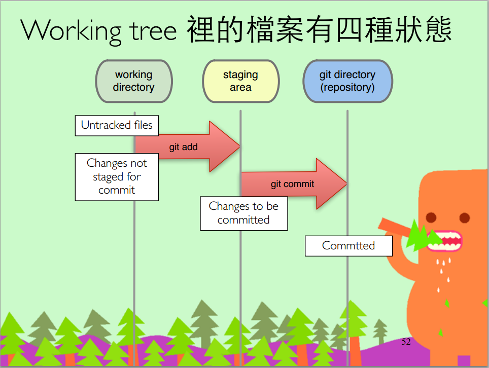
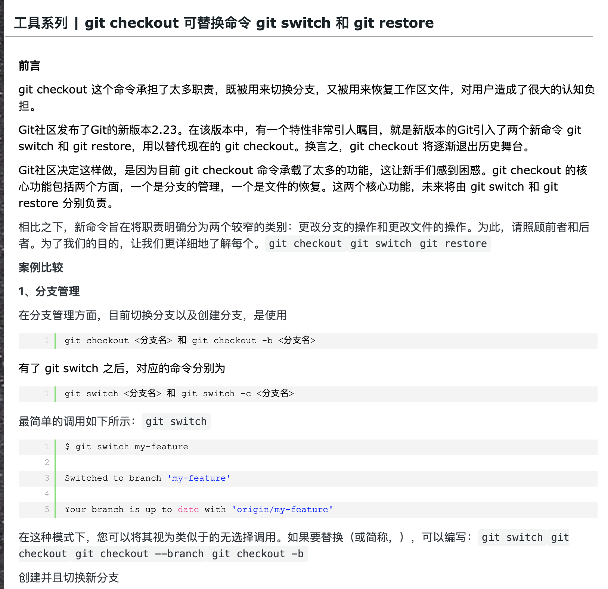

 

 

 

[如何撤销 Git 操作？](http://www.ruanyifeng.com/blog/2019/12/git-undo.html)

 

### 一、撤销提交

 

`git revert HEAD`

 

撤销上次提交. 

(会在当前提交后面，新增一次提交，抵消掉上一次提交导致的所有变化,所有记录都会保留)

 

 

 

 

 

 

---

 

### 二、撤销某次merge

 

`git merge --abort`

 

---

 

### 三、替换上一次提交

 

`git commit --amend -m "新的提交信息"`

 

 

 

可以修改上一次的提交信息

 

 

 

 

 

 

---

 

### 四、从暂存区撤销文件

 

如果不小心使用了`git add`命令, 把一个文件本不想添加到暂存区的文件加到了暂存区，可用下面的命令撤销

`git rm --cached [filename]`

 

---

 

更多:

[Git的撤销和回滚命令总结](https://www.jianshu.com/p/38921d19ba0a)

[恢复GIT不同区域的修改](https://kingofamani.gitbooks.io/git-teach/content/chapter_2/repo.html)

 

