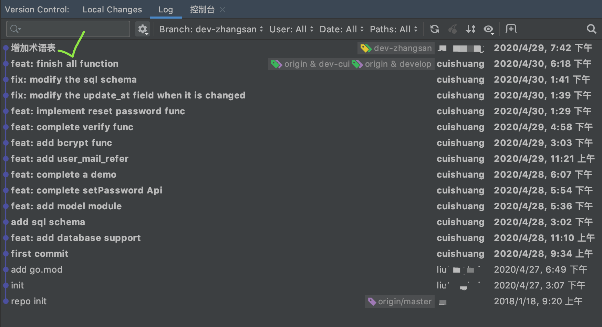
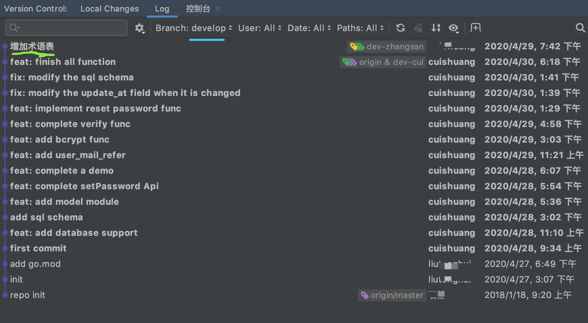

 

[rebase与merge异同与最佳使用场景](http://www.dashen.tech/2015/09/26/rebase%E4%B8%8Emerge%E5%BC%82%E5%90%8C%E4%B8%8E%E6%9C%80%E4%BD%B3%E4%BD%BF%E7%94%A8%E5%9C%BA%E6%99%AF/)

---

这个dev-cui分支从devlop分支切出后,一直都只有我一个人在开发&维护.

假如还有一位同事张三, 在devlop分支切出的分支*dev-zhangsan*上进行开发,他添加了一个**glossary.md**,而后进行了`add & commit`

 

此时项目开发完成,需要将两个分支合并到devlop分支上:

*develop*分支先合并了*dev-cui*,(即切到develop分支, 执行git merge命令)

 

### git merge
接着去合并*dev-zhangsan*,如果使用`git merge`,

绿色表示*dev-cui*分支,紫色表示`dev-zhangsan`,每一个点代表一次提交.

可见出现了分叉,且merge操作会自动有一次commit(此处为**快进式提交**,参看文首链接),见下图:

 

### gir rebase

先回退到`7f8ccb37fdcced4bd4766c8192a6e27fc5f02730`, 

接着切换到*dev-zhangsan*分支, 执行`git rebase develop`,

此刻对于*dev-zhangsan*分支,已经有了*develop*分支的其他提交

 

而后切回*develop*分支,执行`git merge dev-zhangsan`

此时的*develop*分支的提交log为:

 

---

`git rebase`一般称为**变基**或**换基**, [这篇blog](https://blog.csdn.net/endlu/article/details/51605861) 将其称为**衍合**,区别于`git merge`的**合并**

其实`git rebase`后,还是要执行一次`git merge`.

即有个主干分支A,有个次分支B,二者切分后,都有许多次提交. 这时想再合并到一起,且希望commit log是一条直线, 那切到次分支B上,执行`git rebase A`, 这时就基于A,然后把B的改动"拔掉",然后放到最前面.(B的提交历史此时是一条直线)

而后需要切回主干分支A,执行`git merge B`,一定是一个"快进式提交". 此时对于A,它的commit log就也是一条支线了

---

 

> 呃，奇妙的衍合也并非完美无缺，要用它得遵守一条准则：
 
一旦分支中的提交对象发布到公共仓库，就千万不要对该分支进行衍合操作。
 
如果你遵循这条金科玉律，就不会出差错。否则，人民群众会仇恨你，你的朋友和家人也会嘲笑你，唾弃你。
 
在进行衍合的时候，实际上抛弃了一些现存的提交对象而创造了一些类似但不同的新的提交对象。如果你把原来分支中的提交对象发布出去，并且其他人更新下载后在其基础上开展工作，而稍后你又用 git rebase 抛弃这些提交对象，把新的重演后的提交对象发布出去的话，你的合作者就不得不重新合并他们的工作，这样当你再次从他们那里获取内容时，提交历史就会变得一团糟。

