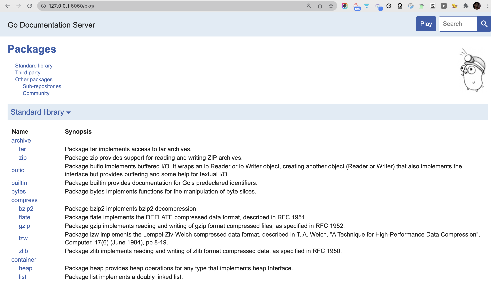

[godoc 命令和 golang 代码文档管理](https://www.jianshu.com/p/b9ce0cbaabd5)

[如何写高大上的 godoc（Go 文档）](https://segmentfault.com/a/1190000020944376)

[Go文档管理](https://www.google.com/search?q=%E9%80%9A%E8%BF%87godoc&newwindow=1&sxsrf=AOaemvJ28DhZ_m9WPdhtiKsZG0bmStakYQ%3A1635865715261&ei=c1SBYZKrD-3B3LUPs_O0aA&oq=%E9%80%9A%E8%BF%87godoc&gs_lcp=Cgdnd3Mtd2l6EAMyBAgjECc6BwgjELADECdKBAhBGAFQpldYpldg4VpoAXAAeACAAeICiAHiApIBAzMtMZgBAKABAcgBAcABAQ&sclient=gws-wiz&ved=0ahUKEwjSsO7W-vnzAhXtILcAHbM5DQ0Q4dUDCA4&uact=5)

 

`godoc -http=127.0.0.1:6060 -play` 或 简写为 `godoc -http=:6060 -play`

Go 秉承 “注释即文档” 的理念，符合 godoc 的文档均从 Go 代码中提取并生成

有需要时再完善即可~

