### 缘起:

<br>

编译下面这段代码时,在Mac上没有什么问题,正常运行,


<details>
<summary>点击查看代码:</summary>

```go
package main

import (
	"bytes"
	"encoding/binary"
	"encoding/json"
	"fmt"
	"log"
	"math/rand"
	"net/http"
	"time"
)

func main() {

	http.HandleFunc("/register", deal) //设置访问的路由

	fmt.Println("1111:", 2222)

	err := http.ListenAndServe(":8088", nil) //设置监听的端口
	if err != nil {
		log.Fatal("ListenAndServe: ", err)
	}

}

func deal(w http.ResponseWriter, r *http.Request) {

	// Golang: 接收GET和POST参数 https://www.cnblogs.com/liuhe688/p/11063945.html
	// 根据请求body创建一个json解析器实例
	decoder := json.NewDecoder(r.Body)
	// 用于存放参数key=value数据
	var params map[string]string

	// 解析参数 存入map
	decoder.Decode(&params)

	name := params["name"]

	rand.Seed(time.Now().UnixNano())

	key := crack(name)

	fmt.Println("name:", name, "    key:", crack(name))

	fmt.Fprintf(w, key) //这个写入到w的是输出到客户端的

}

const (
	rounds    = 12
	roundKeys = 2 * (rounds + 1)
)

func crack(text string) string {

	name := []byte(text)
	length := len(name) + 4
	padded := ((-length) & (8 - 1)) + length
	bs := make([]byte, 4)
	binary.BigEndian.PutUint32(bs, uint32(len(name)))
	buff := bytes.Buffer{}
	buff.Write(bs)
	buff.Write(name)

	var ckName int64 = 0x7a21c951691cd470
	var ckKey int64 = -5408575981733630035
	ck := newCkCipher(ckName)
	outBuff := bytes.Buffer{}

	for i := 0; i < padded; i += 8 {
		bf := buff.Bytes()[i : i+8]
		buf := bytes.NewBuffer(bf)
		var nowVar int64
		if err := binary.Read(buf, binary.BigEndian, &nowVar); err != nil {
			panic(err)
		}

		dd := ck.encrypt(nowVar)

		outBuff.WriteByte(byte(dd >> 56))
		outBuff.WriteByte(byte(dd >> 48))
		outBuff.WriteByte(byte(dd >> 40))
		outBuff.WriteByte(byte(dd >> 32))
		outBuff.WriteByte(byte(dd >> 24))
		outBuff.WriteByte(byte(dd >> 16))
		outBuff.WriteByte(byte(dd >> 8))
		outBuff.WriteByte(byte(dd))

	}
	var n int32
	for _, b := range outBuff.Bytes() {
		n = rotateLeft(n^int32(int8(b)), 0x3)
	}
	prefix := n ^ 0x54882f8a
	suffix := rand.Int31()
	in := int64(prefix) << 32
	s := int64(suffix)
	switch suffix >> 16 {
	case 0x0401:
	case 0x0402:
	case 0x0403:
		in |= s
		break
	default:
		in |= 0x01000000 | (s & 0xffffff)
		break
	}

	out := newCkCipher(ckKey).decrypt(in)

	var n2 int64
	for i := 56; i >= 0; i -= 8 {
		n2 ^= int64((uint64(in) >> i) & 0xff)
	}

	vv := int32(n2 & 0xff)
	if vv < 0 {
		vv = -vv
	}
	return fmt.Sprintf("%02x%016x", vv, uint64(out))
}

type ckCipher struct {
	rk [roundKeys]int32
}

func newCkCipher(ckKey int64) ckCipher {
	ck := ckCipher{}

	var ld [2]int32
	ld[0] = int32(ckKey)
	ld[1] = int32(uint64(ckKey) >> 32)

	ck.rk[0] = -1209970333
	for i := 1; i < roundKeys; i++ {
		ck.rk[i] = ck.rk[i-1] + -1640531527
	}
	var a, b int32
	var i, j int

	for k := 0; k < 3*roundKeys; k++ {
		ck.rk[i] = rotateLeft(ck.rk[i]+(a+b), 3)
		a = ck.rk[i]
		ld[j] = rotateLeft(ld[j]+(a+b), a+b)
		b = ld[j]
		i = (i + 1) % roundKeys
		j = (j + 1) % 2
	}
	return ck
}

func (ck ckCipher) encrypt(in int64) int64 {
	a := int32(in) + ck.rk[0]
	b := int32(uint64(in)>>32) + ck.rk[1]
	for r := 1; r <= rounds; r++ {
		a = rotateLeft(a^b, b) + ck.rk[2*r]
		b = rotateLeft(b^a, a) + ck.rk[2*r+1]
	}
	return pkLong(a, b)
}

func (ck ckCipher) decrypt(in int64) int64 {
	a := int32(in)
	b := int32(uint64(in) >> 32)
	for i := rounds; i > 0; i-- {
		b = rotateRight(b-ck.rk[2*i+1], a) ^ a
		a = rotateRight(a-ck.rk[2*i], b) ^ b
	}
	b -= ck.rk[1]
	a -= ck.rk[0]
	return pkLong(a, b)
}

func rotateLeft(x int32, y int32) int32 {
	return int32(x<<(y&(32-1))) | int32(uint32(x)>>(32-(y&(32-1))))
}

func rotateRight(x int32, y int32) int32 {
	return int32(uint32(x)>>(y&(32-1))) | int32(x<<(32-(y&(32-1))))
}

func pkLong(a int32, b int32) int64 {
	return (int64(a) & 0xffffffff) | (int64(b) << 32)
}
```
</details>


<br>


但到了Linux上,就会报错:

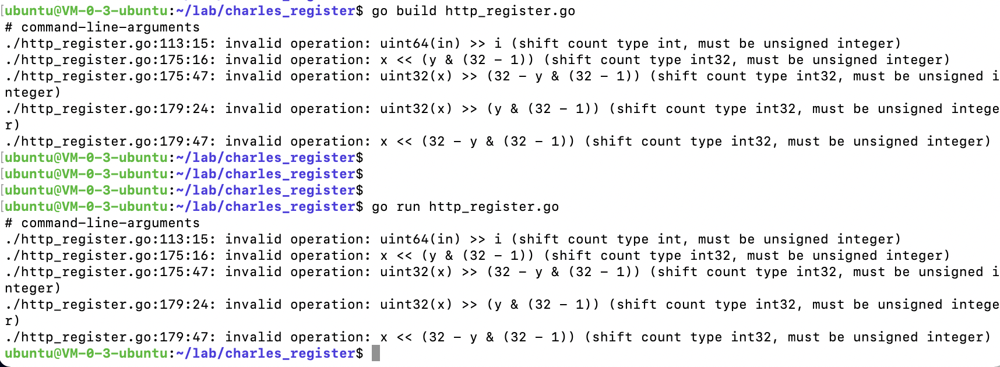 

```go
# command-line-arguments
./http_register.go:113:15: invalid operation: uint64(in) >> i (shift count type int, must be unsigned integer)
./http_register.go:175:16: invalid operation: x << (y & (32 - 1)) (shift count type int32, must be unsigned integer)
./http_register.go:175:47: invalid operation: uint32(x) >> (32 - y & (32 - 1)) (shift count type int32, must be unsigned integer)
./http_register.go:179:24: invalid operation: uint32(x) >> (y & (32 - 1)) (shift count type int32, must be unsigned integer)
./http_register.go:179:47: invalid operation: x << (32 - y & (32 - 1)) (shift count type int32, must be unsigned integer)
```

<br>


而在Mac上进行[交叉编译](https://studygolang.com/articles/14376):


```go
CGO_ENABLED=0 GOOS=linux GOARCH=amd64 go build 文件名.go
```
(如果出现GOROOT blabla之类的,执行*go env -w GO111MODULE=off* )

也没有什么问题

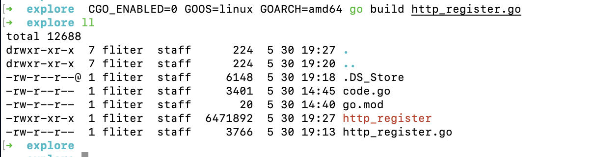 


<br>


导致这种情况的原因,可能因Go版本不同而导致

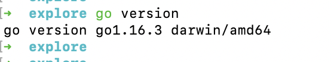 


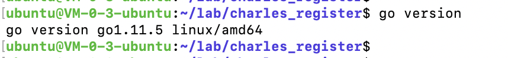

Mac上的Go版本为 1.16, 而Linux上Go版本为 1.11


<br>


---


<br>


### 解决:


<br>

最初想看一下有没有在线的不同Go版本执行工具,无果而终.

想到之前用php时,用过`brew switch`来切换不同的php版本.但搜索之后发现,这个命令被 brew 弃用了.


<br>


之前用过node版本工具`nvm`,于是试图找寻Go有没有类似工具,发现了gvm.

> 安装gvm

```sh
$ bash < <(curl -s -S -L https://raw.githubusercontent.com/moovweb/gvm/master/binscripts/gvm-installer)
```

<br>

> 安装go 1.11

```go
gvm install go1.11
```

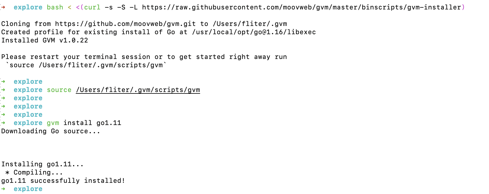


> 选择版本

```go
gvm use go1.11
```

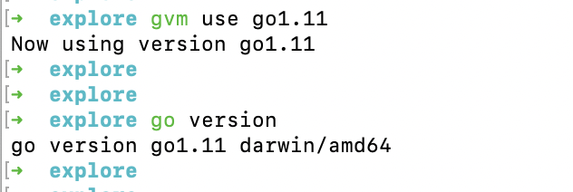


果然已经变为 Go 1.11

<br>


在 Go 1.11 环境下执行,果然出现了和在Linux上Go 1.11下出现的同样错误

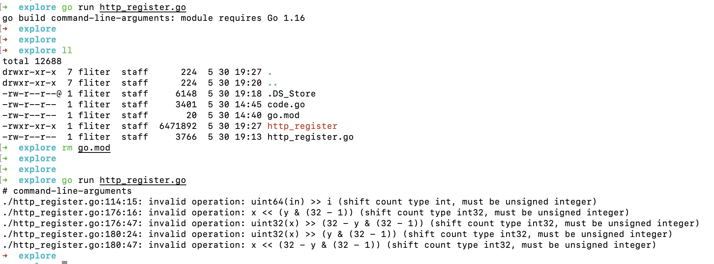


<br>


---


<br>


### gvm更多命令

<br>

> 查看版本

```go
➜ gvm list

gvm gos (installed)

=> go1.11
   system
   ```

<br>


> 查看Go的所有版本 (版本来源于源码中的 tag 标签)


<details>
<summary>点击查看Go所有版本:</summary>

```go
 gvm listall

gvm gos (available)

   go1
   go1.0.1
   go1.0.2
   go1.0.3
   go1.1
   go1.1rc2
   go1.1rc3
   go1.1.1
   go1.1.2
   go1.2
   go1.2rc2
   go1.2rc3
   go1.2rc4
   go1.2rc5
   go1.2.1
   go1.2.2
   go1.3
   go1.3beta1
   go1.3beta2
   go1.3rc1
   go1.3rc2
   go1.3.1
   go1.3.2
   go1.3.3
   go1.4
   go1.4beta1
   go1.4rc1
   go1.4rc2
   go1.4.1
   go1.4.2
   go1.4.3
   go1.5
   go1.5beta1
   go1.5beta2
   go1.5beta3
   go1.5rc1
   go1.5.1
   go1.5.2
   go1.5.3
   go1.5.4
   go1.6
   go1.6beta1
   go1.6beta2
   go1.6rc1
   go1.6rc2
   go1.6.1
   go1.6.2
   go1.6.3
   go1.6.4
   go1.7
   go1.7beta1
   go1.7beta2
   go1.7rc1
   go1.7rc2
   go1.7rc3
   go1.7rc4
   go1.7rc5
   go1.7rc6
   go1.7.1
   go1.7.2
   go1.7.3
   go1.7.4
   go1.7.5
   go1.7.6
   go1.8
   go1.8beta1
   go1.8beta2
   go1.8rc1
   go1.8rc2
   go1.8rc3
   go1.8.1
   go1.8.2
   go1.8.3
   go1.8.4
   go1.8.5
   go1.8.5rc4
   go1.8.5rc5
   go1.8.6
   go1.8.7
   go1.9
   go1.9beta1
   go1.9beta2
   go1.9rc1
   go1.9rc2
   go1.9.1
   go1.9.2
   go1.9.3
   go1.9.4
   go1.9.5
   go1.9.6
   go1.9.7
   go1.10
   go1.10beta1
   go1.10beta2
   go1.10rc1
   go1.10rc2
   go1.10.1
   go1.10.2
   go1.10.3
   go1.10.4
   go1.10.5
   go1.10.6
   go1.10.7
   go1.10.8
   go1.11
   go1.11beta1
   go1.11beta2
   go1.11beta3
   go1.11rc1
   go1.11rc2
   go1.11.1
   go1.11.2
   go1.11.3
   go1.11.4
   go1.11.5
   go1.11.6
   go1.11.7
   go1.11.8
   go1.11.9
   go1.11.10
   go1.11.11
   go1.11.12
   go1.11.13
   go1.12
   go1.12beta1
   go1.12beta2
   go1.12rc1
   go1.12.1
   go1.12.2
   go1.12.3
   go1.12.4
   go1.12.5
   go1.12.6
   go1.12.7
   go1.12.8
   go1.12.9
   go1.12.10
   go1.12.11
   go1.12.12
   go1.12.13
   go1.12.14
   go1.12.15
   go1.12.16
   go1.12.17
   go1.13
   go1.13beta1
   go1.13rc1
   go1.13rc2
   go1.13.1
   go1.13.2
   go1.13.3
   go1.13.4
   go1.13.5
   go1.13.6
   go1.13.7
   go1.13.8
   go1.13.9
   go1.13.10
   go1.13.11
   go1.13.12
   go1.13.13
   go1.13.14
   go1.13.15
   go1.14
   go1.14beta1
   go1.14rc1
   go1.14.1
   go1.14.2
   go1.14.3
   go1.14.4
   go1.14.5
   go1.14.6
   go1.14.7
   go1.14.8
   go1.14.9
   go1.14.10
   go1.14.11
   go1.14.12
   go1.14.13
   go1.14.14
   go1.14.15
   go1.15
   go1.15beta1
   go1.15rc1
   go1.15rc2
   go1.15.1
   go1.15.2
   go1.15.3
   go1.15.4
   go1.15.5
   go1.15.6
   go1.15.7
   go1.15.8
   go1.15.9
   go1.15.10
   go1.15.11
   go1.15.12
   go1.16
   go1.16beta1
   go1.16rc1
   go1.16.1
   go1.16.2
   go1.16.3
   go1.16.4
   release.r56
   release.r57
   release.r58
   release.r59
   release.r60
   release.r57.1
   release.r57.2
   release.r58.1
   release.r58.2
   release.r60.1
   release.r60.2
   release.r60.3
   ```
</details>


<br>


---

<br>


### 其他方案

 <br>

不管对于Python,还是Golang,面对版本问题时,使用PyCharm或GoLand,始终是极好的选择


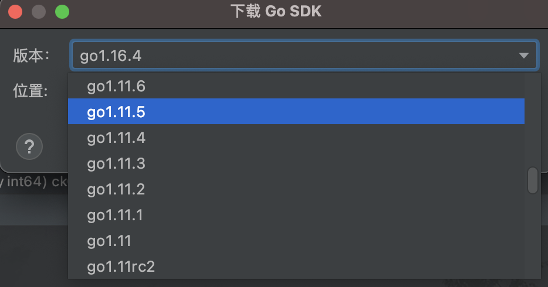


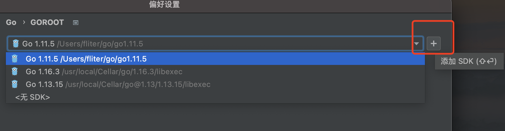


<br>

---

<br>


### 问题解决

<br>

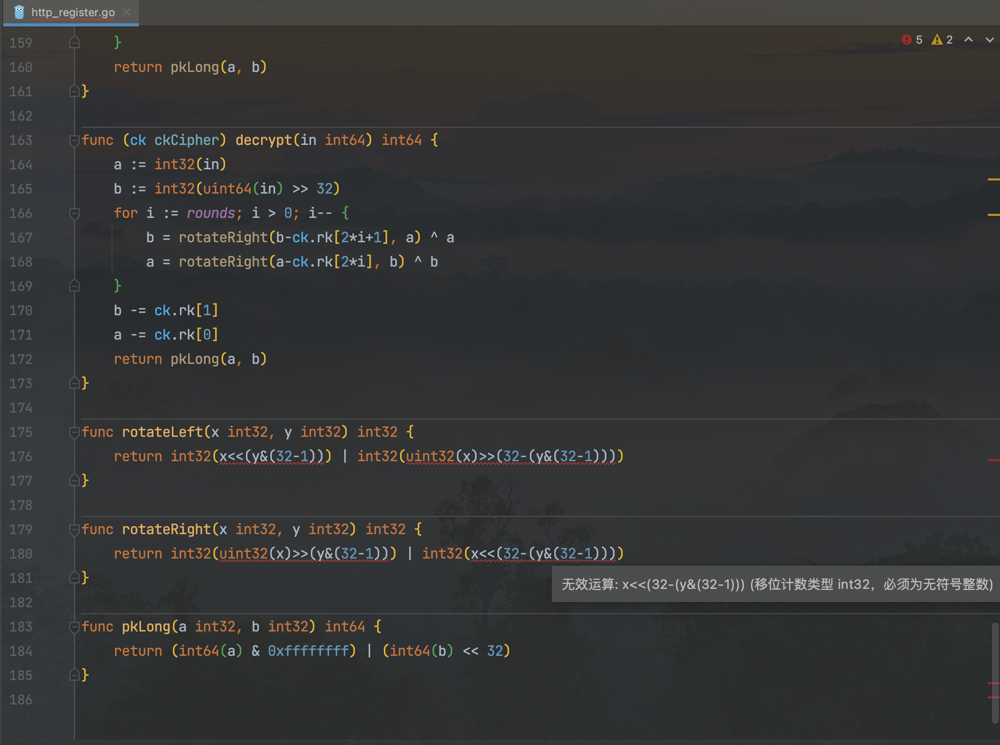


切换为Go 1.11.5版本后,IDE会自动报错


<br>


y为`int32`,将其强制转为`uint32`即可,

i为`int`,将其强制转为`uint`即可.

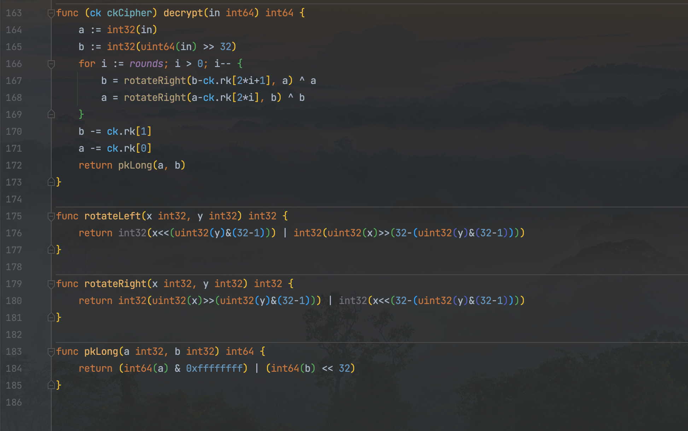


---

<br>


参考:

[如何灵活地进行 Go 版本管理](https://juejin.cn/post/6844903949137346573)


<br>

---