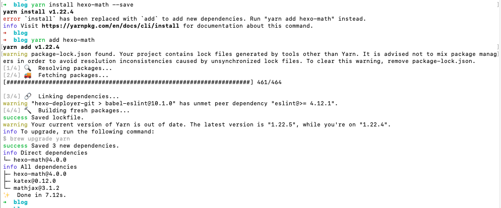
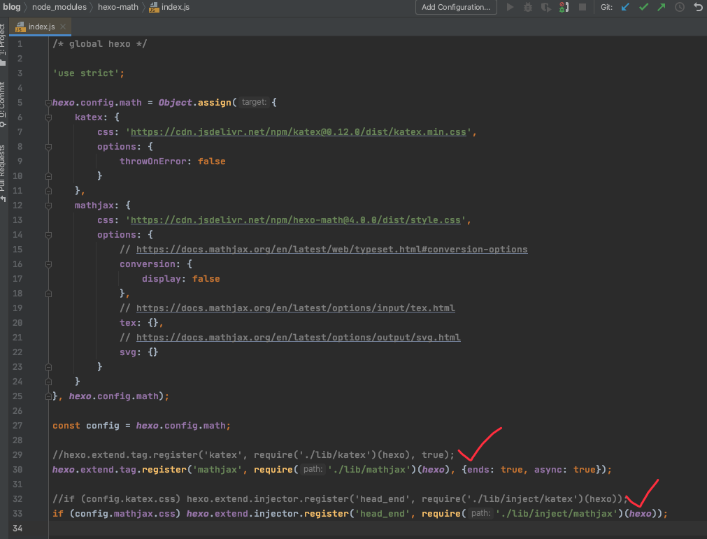
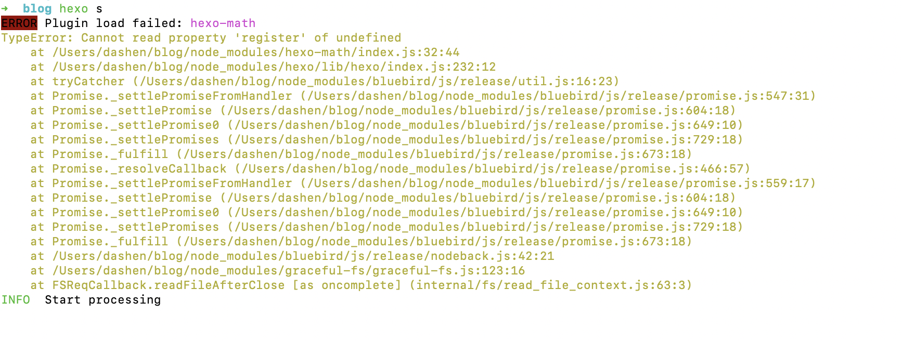

在 [海明校验码](https://dashen.tech/2021/02/15/%E6%B5%B7%E6%98%8E%E6%A0%A1%E9%AA%8C%E7%A0%81/) 这篇博文中,涉及到许多数学公式的插入.原生的Markdown对此支持不够好,但可借助插件,实现 [LaTex](https://dashen.tech/2016/03/21/LaTeX%E4%BD%BF%E7%94%A8%E5%B0%8F%E8%AE%B0/) 那样的效果.


一般常用的是 **mathjax** 和 **katex**


<br>

### 安装

<br>

步骤如下:

<br>


`yarn add hexo-math`




(注: 此时node_module会重新初始化,原来对里面文件做的改动会丢失,如我对[图片的魔改]())

<br>

在全局的 *_config.yml* 文件中,添加

```yaml
math:
  engine: 'mathjax' # or 'katex'
  mathjax:
    # src: custom_mathjax_source
    config:
      # MathJax config
```

<br>

在主题文件夹的 *_config.yml*中,添加(或覆盖为)如下内容

```yaml
# MathJax Support
mathjax:
  enable: true  #true/false.
  per_page: false
  cdn: //cdn.bootcss.com/mathjax/2.7.1/latest.js?config=TeX-AMS-MML_HTMLorMML
```


<br>


另外,将 *node_modules/hexo-math/index.js*文件中, 与`katex`相关的两行注释掉(因为使用了mathjax,没有用katex)




<br>

否则,在构建时,会出现如下报错





<br>

---


<br>


### 使用

<br>

当公式不独占一行时:  `$数学公式$`

独占一行时:        `$$数学公式$$ `


常用语法可参考 [Latex/MathJax/Katex数学公式手册](https://fivecakes.com/math)

<br>


如在 [海明校验码](https://dashen.tech/2021/02/15/%E6%B5%B7%E6%98%8E%E6%A0%A1%E9%AA%8C%E7%A0%81/) 中,


$D_7$ 用 `$D_7$`来表示,即`_`表示下标

$2^{i-1}$ 用 `$2^{i-1}$`来表示, 即`^`表示指数, 指数位置的加减写在`{}`内


<br>


---


<br>


几个不错的在线公式编辑器:

[LaTeX公式编辑器](https://www.latexlive.com/)

[在线LaTeX 公式编辑器](https://www.codecogs.com/latex/eqneditor.php?lang=zh-cn)

<br>


参考:

<br>


[hexo中插入数学公式](http://stevenshi.me/2017/06/26/hexo-insert-formula/)

[结合MathType和MathJax在Hexo博客中插入数学公式](https://zhuanlan.zhihu.com/p/108766968)

[MathJax 数学符号以及公式在 Markdown 中的运用](https://blog.csdn.net/qq_36148847/article/details/79419814)

[KaTeX数学公式整理](https://blog.csdn.net/tonydz0523/article/details/88420049)

[修复Hexo写Mathjax公式多个下标失效的问题](http://kubicode.me/2016/03/16/Hexo/Fix-Hexo-Bug-In-Mathjax/)


