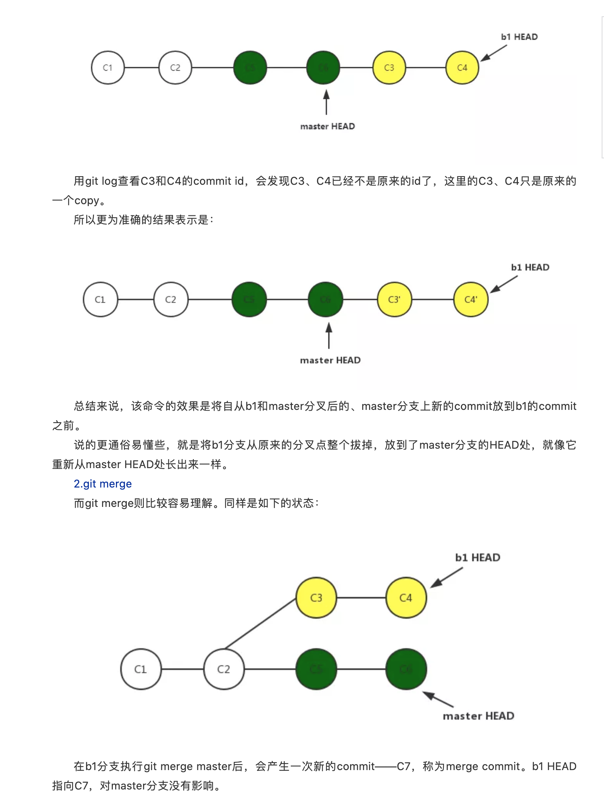

 

使用 `rebase` 所有人就好像都在同一条直线上开发一样，`git log --graph` 看着很舒服;  而使用 `merge` 的log看起来就很乱，有各种分叉，当要合入的分支会特别多时，更是如此.

下游分支更新上游分支内容的时候使用 rebase；

上游分支合并下游分支内容的时候使用 merge；

实战篇 参见: [git:亲测体验rebase与merge]()

---

 

参考:

[从一个问题认识git rebase和git merge](https://mp.weixin.qq.com/s?__biz=MzIzMzk0MDgxNQ==&mid=2247486681&idx=1&sn=083402ebcdf104a3d38d1414c171b4a5&chksm=e8fcbef9df8b37ef8ea98273985d9b79735f2d5f11ffef854a6491bcb58a4d3f6af35642d0df&mpshare=1&scene=1&srcid=1226noWzyjr0EDCuXoSG48yb&sharer_sharetime=1577292471263&sharer_shareid=3dc3d396bdbb4fcfc4f50d6dd1fed6f5&exportkey=AetQWmJbYFXtA8or2OD8G2g%3D&pass_ticket=FLUwDhyyjnG312Sf%2FzVRk7iy0o5mjyjGT7Otp4dvpOec6yXHw3%2BvHFqVO%2B%2FnfvJt#rd)

[逃不掉的merge和rebase](https://mp.weixin.qq.com/s?__biz=Mzg3ODA2MjY1Ng==&mid=2247484648&idx=1&sn=db1921defb7476e5ad044449fc445d2c&chksm=cf1839c7f86fb0d12668776b5b26bdcec7779352664b87aa78327082bb251a44a0cb4637f7b0&mpshare=1&scene=24&srcid=1226sSxMpYEvoNCdJ40rWHTM&sharer_sharetime=1577292436060&sharer_shareid=3dc3d396bdbb4fcfc4f50d6dd1fed6f5&exportkey=Ae3CH4lmjLr1bjMYTxl2dAE%3D&pass_ticket=FLUwDhyyjnG312Sf%2FzVRk7iy0o5mjyjGT7Otp4dvpOec6yXHw3%2BvHFqVO%2B%2FnfvJt#rd)

[深入浅出Git——merge和rebase](https://mp.weixin.qq.com/s?__biz=MzU1NTgxODgwMQ==&mid=2247483723&idx=1&sn=152b6e63e7b266ef020c1ff8d7b3a98a&chksm=fbcfcb15ccb84203d1418dd1d517e6258105b0c0bb7d18a43ff54273fc4cbbc48c0e04a52b57&mpshare=1&scene=1&srcid=1226ljj0zJTzsJgyhBWyzbvb&sharer_sharetime=1577291856324&sharer_shareid=3dc3d396bdbb4fcfc4f50d6dd1fed6f5&exportkey=ARxopuVCoXFGWMoemoizcdo%3D&pass_ticket=FLUwDhyyjnG312Sf%2FzVRk7iy0o5mjyjGT7Otp4dvpOec6yXHw3%2BvHFqVO%2B%2FnfvJt#rd)
