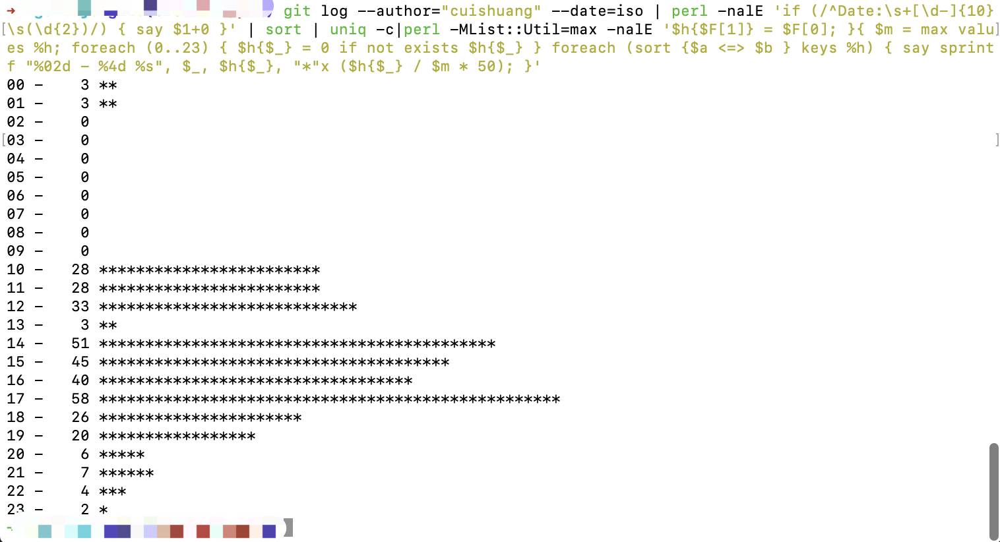

### 雪中送炭


<br>


---


### 锦上添花


<br>

#### 查看某用户一天24小时的提交分布信息


<br>


`git log --author="某个username" --date=iso | perl -nalE 'if (/^Date:\s+[\d-]{10}\s(\d{2})/) { say $1+0 }' | sort | uniq -c|perl -MList::Util=max -nalE '$h{$F[1]} = $F[0]; }{ $m = max values %h; foreach (0..23) { $h{$_} = 0 if not exists $h{$_} } foreach (sort {$a <=> $b } keys %h) { say sprintf "%02d - %4d %s", $_, $h{$_}, "*"x ($h{$_} / $m * 50); }'`


<br>





<br>

---

<br>


#### 查看仓库 commit 前 10 名贡献者


<br>

`git log --pretty='%aN' | sort | uniq -c | sort -k1 -n -r | head -n 1`


<br>


<br>

---

<br>


#### 统计每个人增删的行数

<br>

`git log --format='%aN' | sort -u | while read name; do echo -en "$name\t"; git log --author="$name" --pretty=tformat: --numstat | awk '{ add += $1; subs += $2; loc += $1 - $2 } END { printf "added lines: %s, removed lines: %s, total lines: %s\n", add, subs, loc }' -; done`

<br>


<br>


---


<br>


#### 查看在当前仓库的上的个人代码量


<br>


`git log --author="cuishuang" --pretty=tformat: --numstat | awk '{ add += $1; subs += $2; loc += $1 - $2 } END { printf "added lines: %s, removed lines: %s, total lines: %s\n", add, subs, loc }' `


<br>


<br>


---


<br>

#### 查看某用户在当前仓库上 周一-周五，周六周日提交的占比情况


<br>

`git show|head -1; git log --author='cuishuang' --format="%H %ai" | perl script.pl`


script.pl如下:

```perl
#!/usr/bin/perl

# This script is made to show graphs with git commit time made on workweek vs weekend
#
# The desription of this script and results of its usage is avaliable at:
# https://ivan.bessarabov.com/blog/famous-programmers-work-time-part-2-workweek-vs-weekend
#
# usage:
#
#   git log --author="Sebastian Riedel" --format="%H %ai" | perl script.pl
#


use strict;
use warnings FATAL => 'all';
use utf8;
use open qw(:std :utf8);
use feature qw(say);

use List::Util qw(max sum);
use Time::Local;

my %workweek;
my %weekend;

sub is_saturday_or_is_sunday {
    my ($yyyy_mm_dd) = @_;

        my ($year, $month, $day) = split /-/, $yyyy_mm_dd;

        my $timestamp = timegm(
                0,
                0,
                0,
                $day,
                $month - 1,
                $year,
        );

        my $wday = [gmtime($timestamp)]->[6];

        return $wday == 0 || $wday == 6;
}

while (my $line = <>) {

    # 181971ff7774853fceb0459966177d51eeab032c 2019-04-26 19:53:58 +0200

    my ($commit_hash, $date, $time, $timezone) = split / /, $line;
    my ($hour, $minute, $second) = split /:/, $time;

    $hour += 0;

    if (is_saturday_or_is_sunday($date)) {
        $weekend{$hour}++;
    } else {
        $workweek{$hour}++;
    }
}

my $max = max(values(%workweek), values(%weekend));

my $format = "%6s   %6s %-30s  %6s %-30s",

say '';
say sprintf $format, 'hour', '', 'Monday to Friday', '', 'Saturday and Sunday';

foreach my $hour (0..23) {
    $workweek{$hour} //= 0;
    $weekend{$hour} //= 0;
    say sprintf $format,
        sprintf('%02d', $hour),
        $workweek{$hour},
        '*' x ($workweek{$hour} / $max * 25),

        $weekend{$hour},
        '*' x ($weekend{$hour} / $max * 25),
        ;
}

my $total_commits_workweek = sum(values %workweek);
my $total_commits_weekend = sum(values %weekend);
my $total_commits = $total_commits_workweek + $total_commits_weekend;

say '';
say sprintf $format,
    'Total:',
    $total_commits_workweek,
    sprintf('(%.1f%%)', $total_commits_workweek * 100 / $total_commits),
    $total_commits_weekend,
    sprintf('(%.1f%%)', $total_commits_weekend* 100 / $total_commits),
    ;

say '';

```


---

<br>

参考:

<br>

[git commit 提交历史的一些有趣统计](https://maiyang.me/post/2020-08-18-git-commit-history-stat-hour/)

[Ten Useful Git Log Tricks](https://hackernoon.com/ten-useful-git-log-tricks-7nt3yxy)


