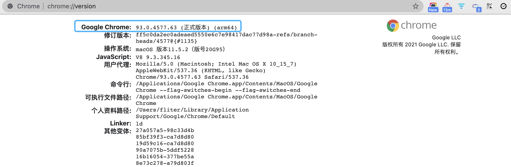

想要爬取[这个网站](https://www.mingyantong.com/)的内容，先使用了Chrome[Web Scraper插件](https://sspai.com/post/55496) 的Element Click功能[来获取分页数据](https://sspai.com/post/56718),但发现几次请求后就出现错误。


使用Go实现了该功能，获取每一页html内容，而后通过字符串匹配得到想要的信息，但发现这个网站会封禁IP&对内容加盐...


不想折腾IP代理池，而直接使用 WEB自动化工具 *Selenium*,早前就见到过测试同学有使用，正好借此契机，也体验一下。


Selenium对Firefox支持较好。

另需要安装所用系统对应的[geckodriver](https://github.com/mozilla/geckodriver/releases)来驱动Firefox。将解压后的二进制文件所在的位置加到系统路径下。


`juzi.py`
```python
# !/usr/bin/env python
# encoding: utf-8

from selenium import webdriver
from lxml import etree

def get_content():
    for i in range(1, 5):
        url = "https://www.mingyantong.com/writer/%E5%BC%A0%E7%88%B1%E7%8E%B2?page={}".format(i)

        browser = webdriver.Firefox()
        browser.get(url)

        html = browser.page_source
        html = etree.HTML(html, etree.HTMLParser())
        juzi_list = html.xpath('//div[@class="view-content"]//div')

        for juzi in juzi_list:
            content = juzi.xpath('./div/div/a[@class = "xlistju"]/text()')

            author = juzi.xpath('./div/div[@class="xqjulistwafo"]/a/text()')

            book = juzi.xpath('./div/div[@class="xqjulistwafo"]/span/a/text()')

            all_content = {
                "content": content,
                "author": author,
                "book": book,
            }
            if not (content == [] and author == [] and book == []):
            #print(content,author,book)
            #print(all_content)
            if len(book) == 0 :
                print(content[0])
                print()
            else:
                print(content[0] + "---<" + book[0] + ">")
                print()


if __name__ == '__main__':
    get_content()

```

调整页码，执行`python3 juzi.py > result.txt`即可~


<br>


注: 请求频率太快，也会被该网站的防爬策略识别并封禁。建议增加适当的time.Sleep

<br>

---

<br>


若使用`browser = webdriver.Chrome()`，需安装Chrome的驱动，
方法如下：

[解决selenium.common.exceptions.WebDriverException: Message: ‘chromedriver‘](https://blog.csdn.net/weixin_44318830/article/details/103339273)




<br>

关于selenium，更多操作可参考

[python selenium --browser 操作](https://www.cnblogs.com/saryli/p/5182811.html)