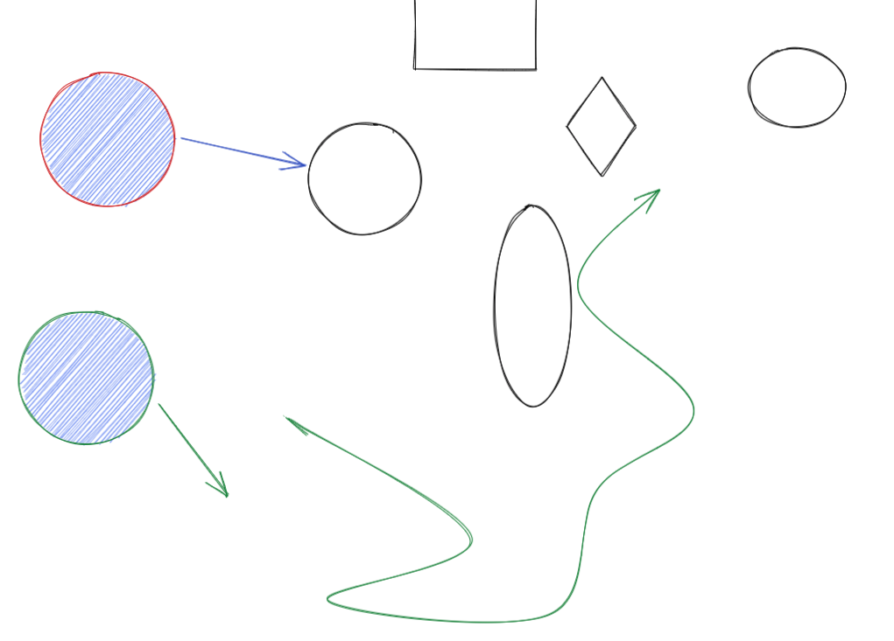
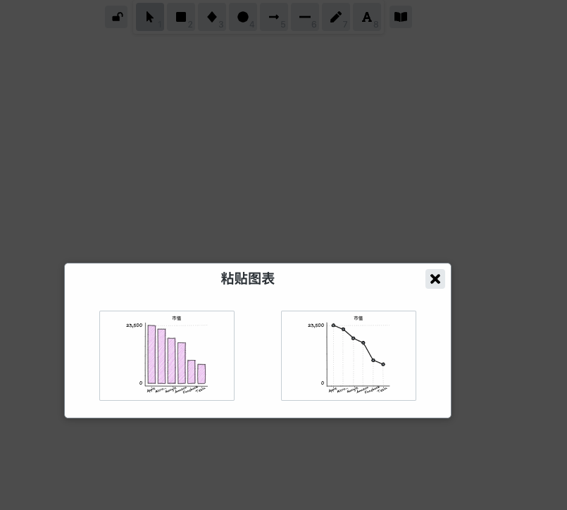

## [Figma](https://www.figma.com/files/recent?fuid=984799578680849227)

<br>


### [入门及基础使用](https://www.bilibili.com/video/BV1Bz4y1R7tm)

R： 画矩形

O： 画圆形

L： 画直线


更多[快捷键](https://figmachina.com/articles/figma-shortcut.html)

[史上最全 Figma 快捷键](https://figmacn.com/post/all-figma-shortcuts)

<br>


### 使用Figma制作动画

<br>

安装[Motion](https://www.figma.com/community/search?model_type=public_plugins&q=Motion)插件


> Motion is an animation tool which helps you to bring your design to life. Want to make some interactions in UI, add some stunning effects or animate some character for a mobile game? Try Motion :)


https://www.uifig.com/1130.html


https://www.bilibili.com/video/BV1XK411571d


https://www.bilibili.com/video/BV1fb411e7jB?from=search&seid=12320258080689178519


https://www.bilibili.com/video/BV1eg41137Ks?from=search&seid=1860190642853483436


https://www.bilibili.com/video/BV1sf4y197cL?from=search&seid=10428694504513297000


https://qcrao.com/2021/06/10/out-of-tech/


<br>


更多阅读：

[我为什么推荐 Figma](https://zhuanlan.zhihu.com/p/136830640)

[曹大带我学 Go（6）—— 技术之外](https://mp.weixin.qq.com/s/OHljMca3k7m__puOUCrrtA)


<br>

---


<br>

## [Excalidraw](https://excalidraw.com/)

<br>

[其代码开源](https://github.com/excalidraw/excalidraw)


快捷键：

按住`shift`可以画出 **正方形**和**正圆形**


按住 `option`再拖拽某个图形 可以进行复制


按住 `A`,可以画箭头


一直点击，最后按`esc`，可以画出曲线或折线




<br>

还可以将excel的数据生成图表(目前仅支持两列数据)


```excel
公司	市值
Apple	23500
Microsoft	22000
Google	18300
Amazon	16500
Facebook	9400
Tesla	7740
```


复制，而后在网页上进行粘贴，会自动弹出：





<br>


对多个图形的操作：


<br>


点击*浏览库*可查看其他人分享的图像：


点击 `➡️ Add to Excalidraw`,可以添加到自己的库里


<br>


目前暂不支持中文的手写体


支持中文的手写体的[开源实现](https://github.com/mebtte/excalidraw)：


地址: https://excalidraw.mebtte.com/


<br>

参考：

[风靡硅谷的白板工具 Excalidraw ｜开源 + 手绘 = 快乐加倍](https://www.bilibili.com/video/BV1Mq4y1o75P)

