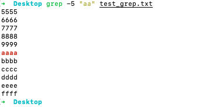
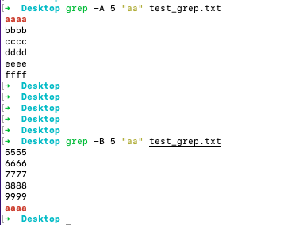

### 命令行里的复制/粘贴命令

<br>

Mac： 可使用自带的pbcopy和pbpaste命令 来实现复制粘贴

Linux： 需安装xclip/xsel


<br>


使用：


pbcopy < /Users/fliter/xxxxxxx/xxxx/logs/servicedebug.202110280800 

pbpaste > service_log.txt  


<br>


### grep查找关键字所在行以及其上下几行


<br>


*test_grep.txt*：

```shell
1111
2222
3333
4444
5555
6666
7777
8888
9999
aaaa
bbbb
cccc
dddd
eeee
ffff
gggg
hhhh
iiii
jjjj
kkkk
llll
mmmm
nnnn
oooo
pppp
qqqq
rrrr
ssss
tttt
uuuu
vvvv
wwww
xxxx
yyyy
zzzz
```

<br>


打印匹配行的**前后**5行:

`grep -5 "aa" test_grep.txt ` 或  `grep -C 5 "aa" test_grep.txt`




<br>


打印匹配行的**后**5行:

`grep -A 5 "aa" test_grep.txt `

<br>


打印匹配行的**前**5行


`grep -B 5 "aa" test_grep.txt`




<br>


### iTerm2快捷键设置


https://cnbin.github.io/blog/2015/06/20/iterm2-kuai-jie-jian-da-quan/