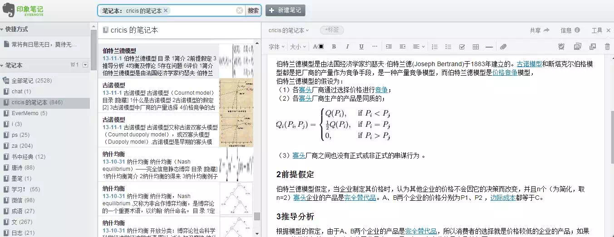
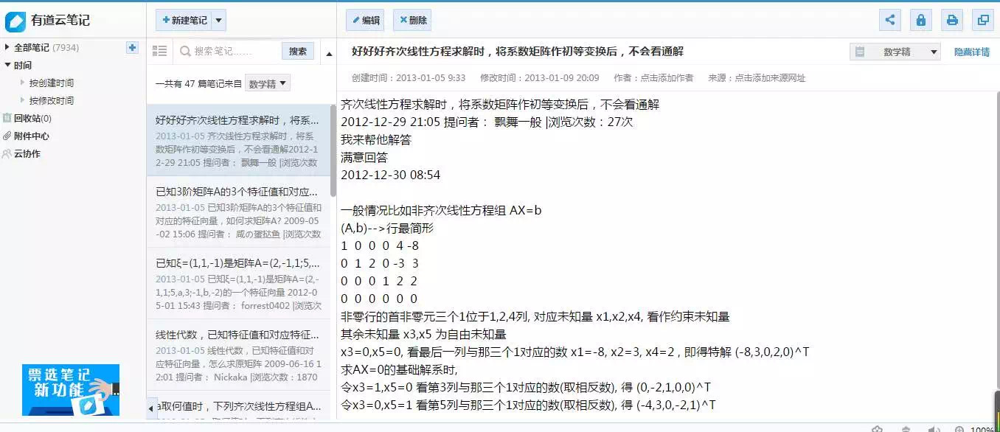
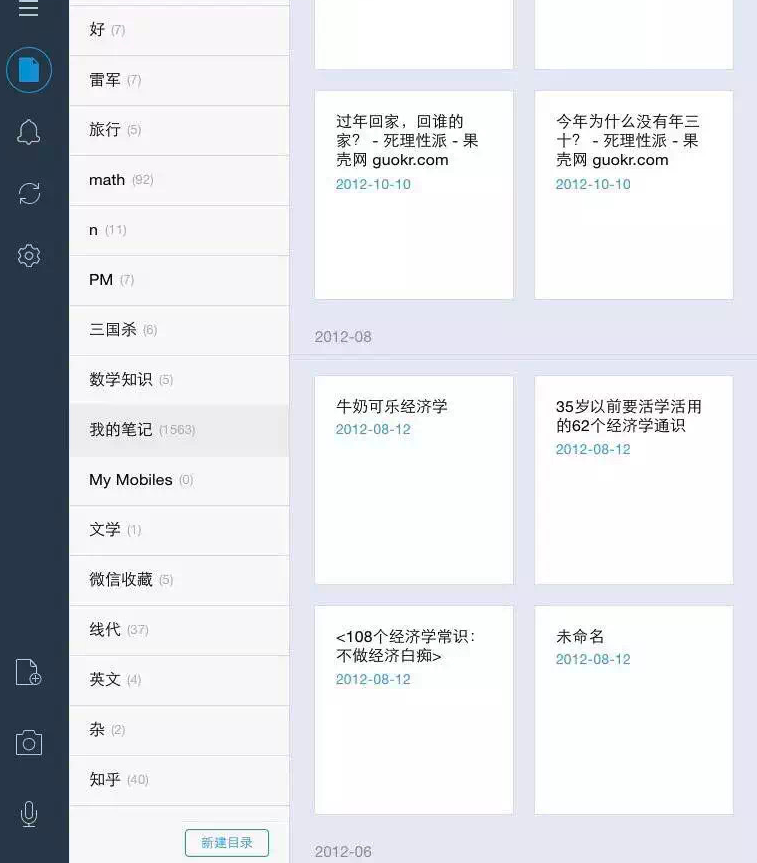
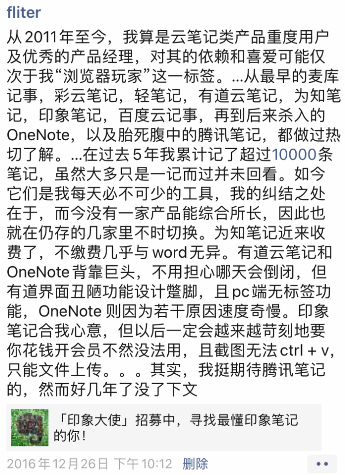

毕业在即，整理四年旧物，足迹，笔记。除去曾嗜用一时的轻笔记，云笔记，彩云笔记，麦库记事，仅目前最常用的为知，有道，印象加在一起，就超过10000条笔记`----`换言之，四年里平均每天创建十条笔记。大致翻看，占比最多的是经济学尤其与地理历史人文结合在一起的区域经济，这大概就是即便对方是领域内的巨擘耆宿，也不惧与其坐而论道，面不赤红心不乱跳。除去初生牛犊不怕虎的莽劲，还有脑中并不太逊色于ta的数据作为支撑。

在过去没有互联网和搜索引擎的时代，做学问遇到显学问题，多要不耐其烦投身卷帙浩繁的书卷，费时费力。而今，已经早不是能学与不能学，而是想学与不想学的时代。在相当多的领域，一个有兴趣的孩子通过善用网络所获取的知识和掌握的技能，绝不会逊色最知名教授课上兴趣索然的学生。这一点，在以后会更为清晰明了。

此刻你我正经逢的互联网时代，被人称为是自500年前地理大发现后又一次世界范围的"connect"。作为勉强的第一代“互联网原住民”，除去阅历尚浅的年少轻狂，也确乎存在迥然于父辈这般大小时的一些特质，只不过，它被一句代际之间无论现在还是以后都必然的“生活水平提高”所覆盖，背后正默默发生正悄悄改变固有生活方式，只发仞于一代或几代的变革，却被忽略`----`当00后这群原汁原味的原住民长大我这个年纪，或如听过长尾理论，无事耐下性子看完索然寡味的<世界是平的>，<未来是湿的>，以及可堪经典的<失控>，对以上这段有些绕口的话所表达的意思，也许会多些认同。

早在大学之初对国内BAT三巨头有过这样的比较：它们的主业，即搜索引擎，电子商务还是即时通讯，哪一个对人的改变大一些？是改变人获取信息方式的“百度一下你就知道”，还是让商业地产不寒而栗快递业方兴未艾的电子商务，或者让运营商暴利锐减的即时通讯？相信多数人的答案会是和其原配夫人一般形影不离的淘宝和qq，极少是缺少用户黏性如同情人的百度。及至后来开始在自己感兴趣的几个并不高深的“显学”领域开疆拓土，对我而言答案坚定地变成了搜索引擎。

后来周鸿祎磨剑8年，携so.com欲雪旧恨，在so.com上线的前几天，有句首页金句让我深深赞同，**“如果我们能妥善地利用搜索，则实在是已经改变了世界”。**

当然，无论是上万条的笔记或是上T的资料，单单而言还只是一个数字，还只是纯浪费时间并无价值。我确无翻看旧时笔记的习惯，但翻看几篇，那天发生何事，多历历浮于脑中，更莫说已浏览过一遍的笔记资料。这个带给我无尽烦恼的特质，终于在这里有了小小的让人稍觉欣慰之处。