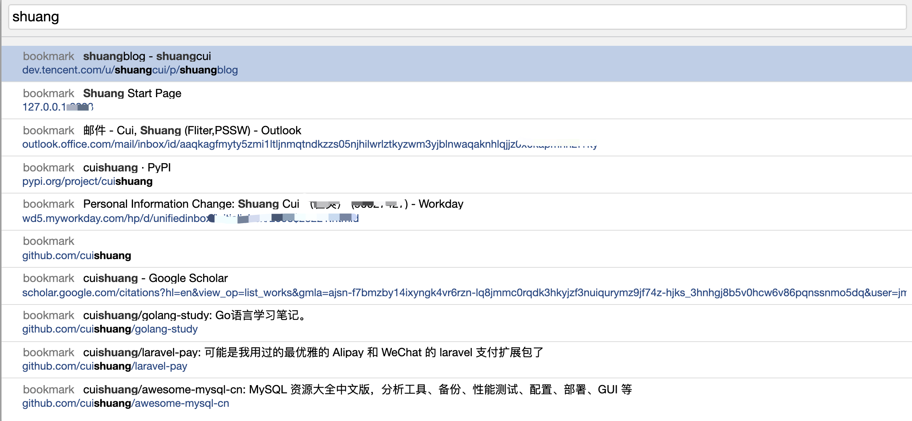
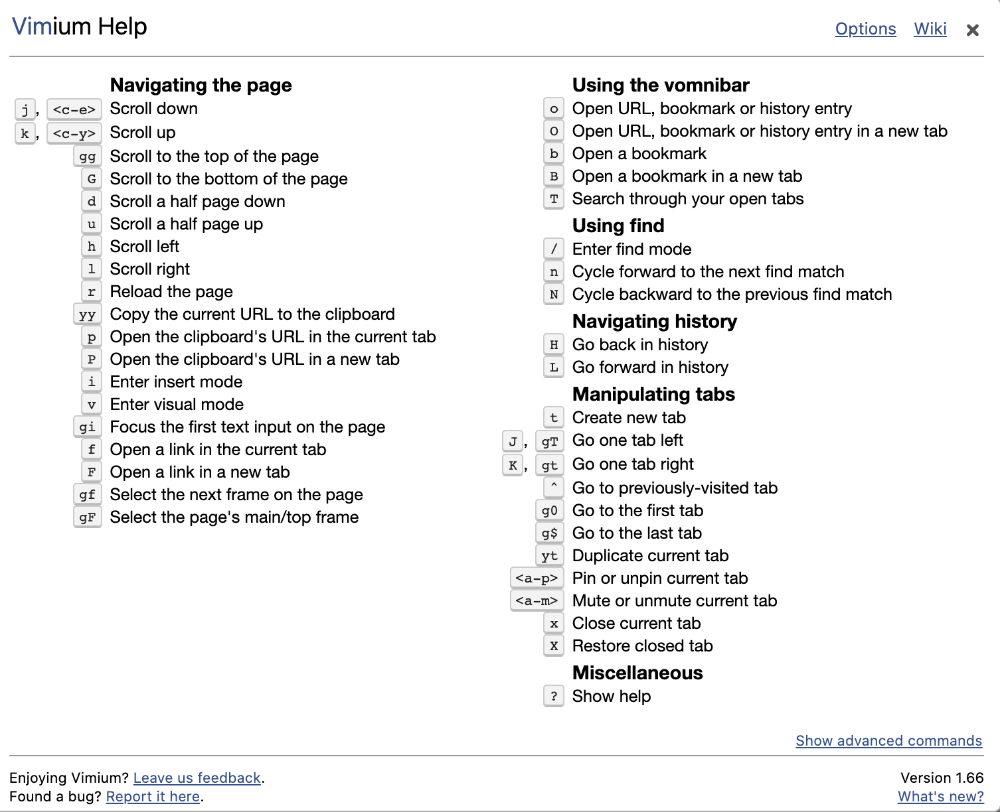
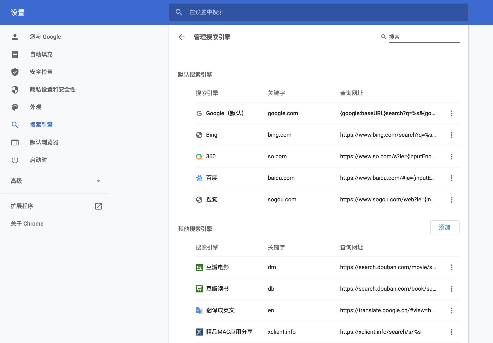
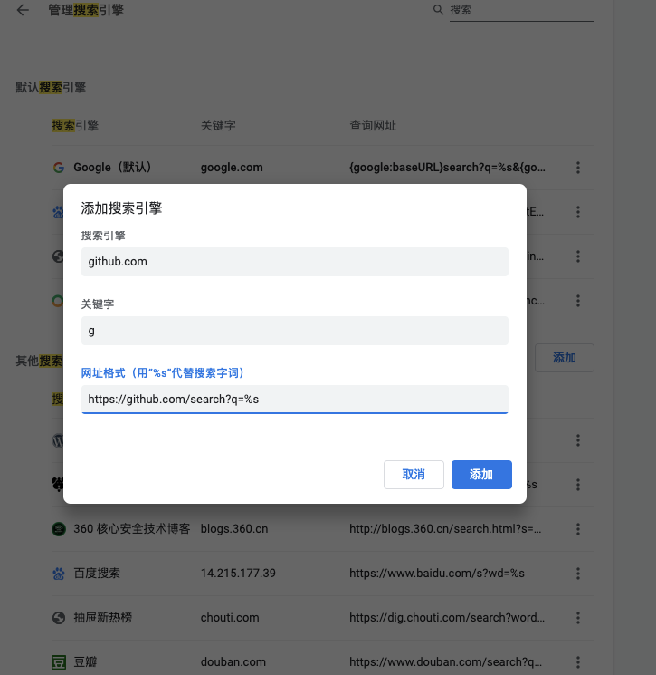
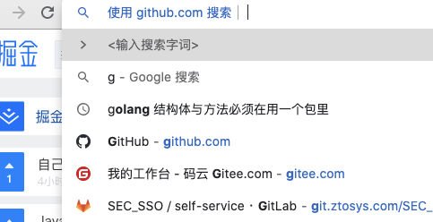
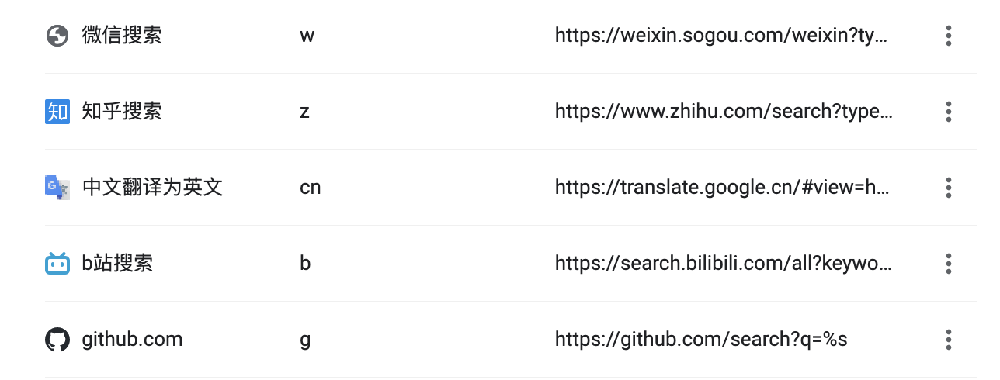

### 快速搜索浏览器收藏夹中的内容

 

安装**Vimium**插件, 而后键入`shift+b`, 即可搜索

 

 `shift+/` 可以查看**Vimium**的全部命令

 

---

 

### 配置快捷操作

 

 

在地址栏输入*g*,而后敲击`Tab`键, 即可在github中进行搜索

同理,根据配置,

键入*b*而后`Tab`,则可使用B站搜索

键入*w*而后`Tab`,则可使用微信搜索

键入*z*而后`Tab`,则可使用知乎搜索

键入*cn*而后`Tab`,则可将中文翻译为英文

---

 

### 谷歌tips

 

#### 必须包含或不能包含某关键字

 

- 在标题中必须要出现xxxx这个关键字:

    `intext: xxxx`

- 排除掉某个网站的内容:

    `A -B`  搜索包含A但不包含B的结果

    如 `xxxx -csdn.net`,搜索xxxx关键字,但排除点csdn.net的内容

    如 `天涯明月刀 -游戏`, 那就是只搜索电视剧或小说,不搜索游戏

 

---

#### `filetype:`指定搜索的文件类型

 

可以指定搜索的文件类型,如

`filetype:pdf go语言`, 其他搜索引擎也支持.

 

借鉴一下同行简历:

`filetype:pdf 简历 go开发`

 

如果点击后发现是404,可在地址栏加一个`cache:`, 谷歌可能会有缓存

 

---

 

#### `site:xxx网站` 站内搜索

 

 

---

 

#### 只从 `.edu` 结尾的网站上找寻要的内容

 

`inurl:edu 电气电子`

`inurl`指令用于搜索查询词出现在url 中的页面.

百度和谷歌都支持该指令。

 

---

 

#### 其他匹配符

 

`""`为完全匹配

`*`为模糊匹配

 

---

 

参考:

[搜索技巧1](https://note.youdao.com/web/#/file/WEBed5ff496808cface41cac852ee522ba6/note/WEB609beff14c0ae28bfcccba0ddce2369e/)

[搜索技巧2](https://note.youdao.com/web/#/file/WEBed5ff496808cface41cac852ee522ba6/note/WEB833dbf1ad29a6dcc4de5dccc3ac0cd6f/)