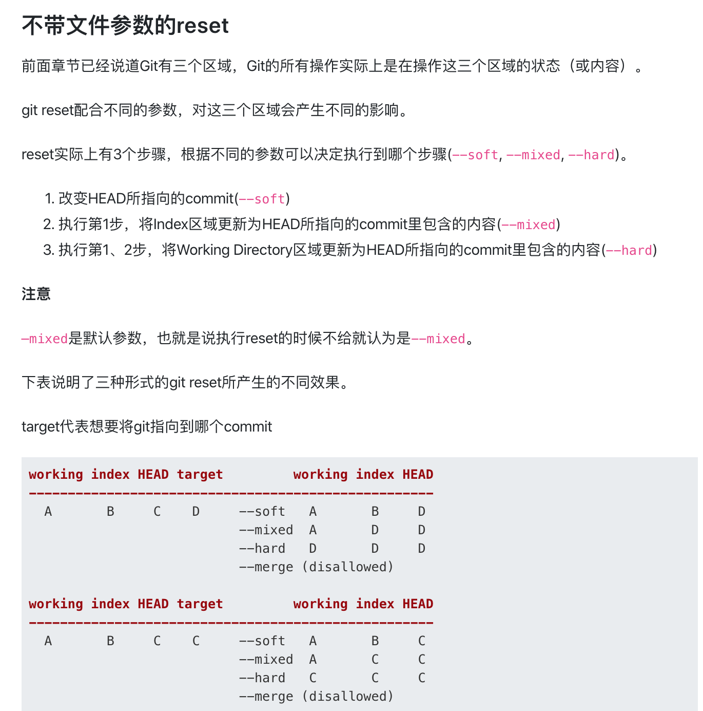
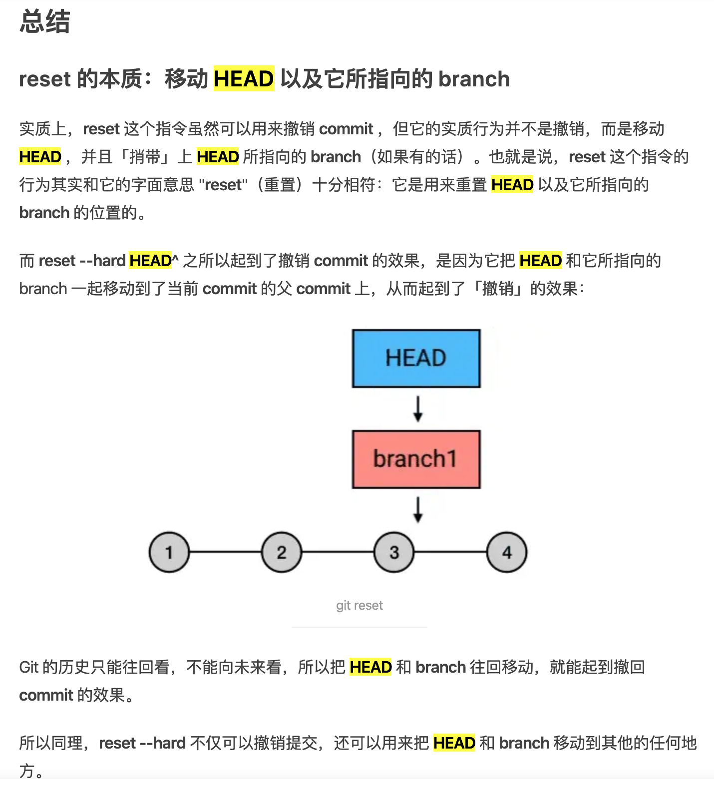
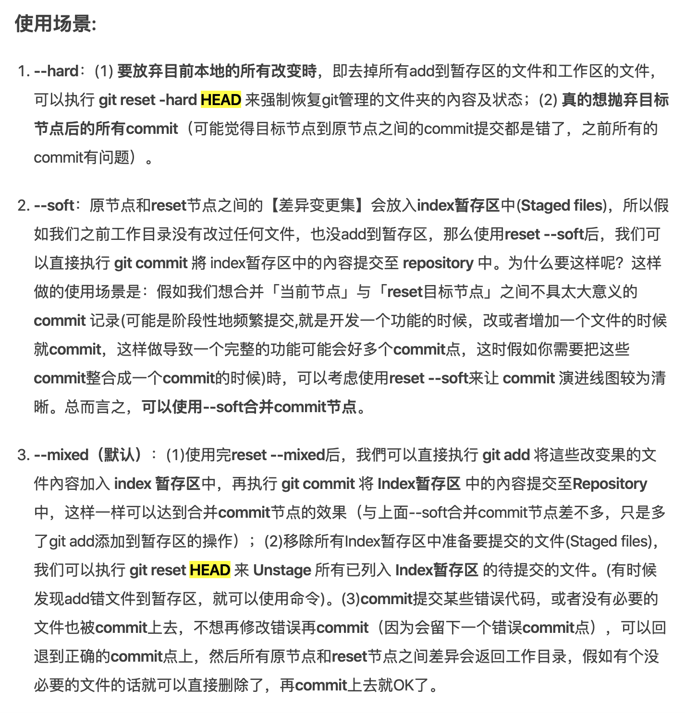
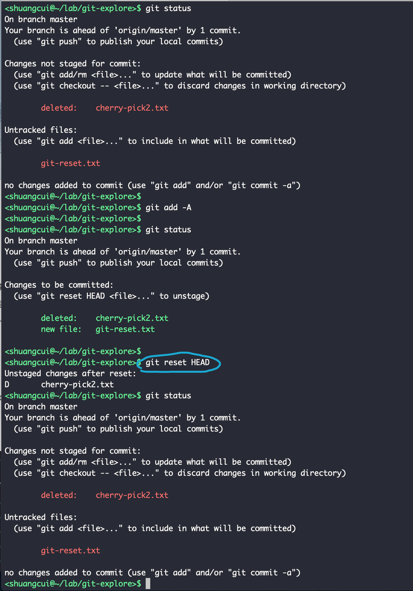
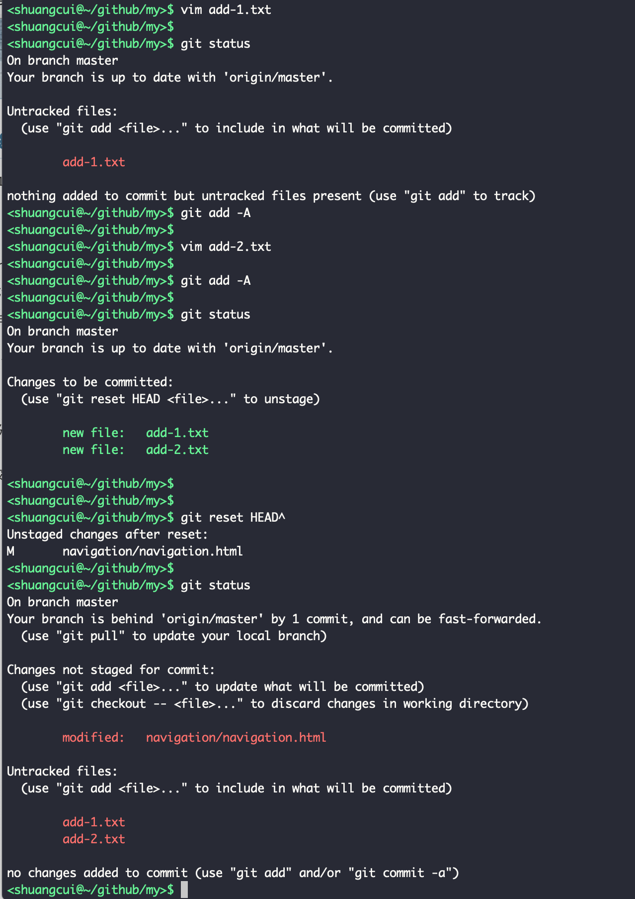
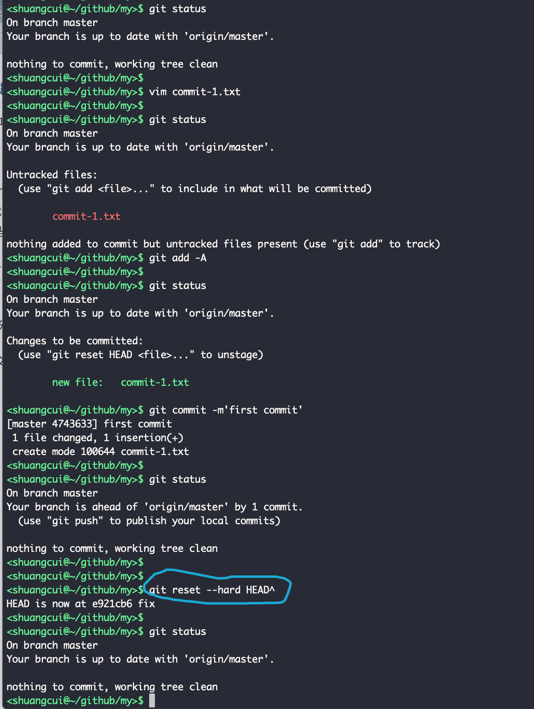
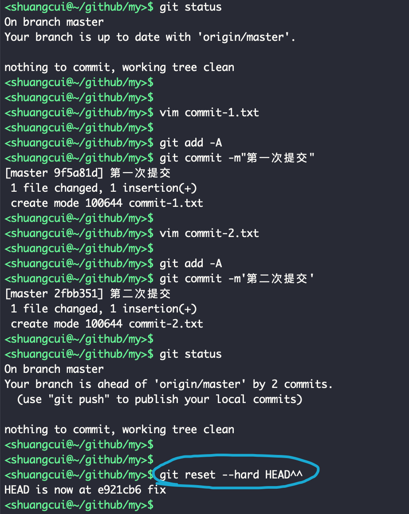
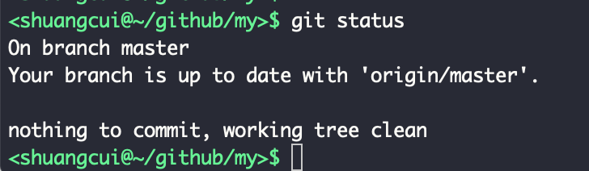

 

### 简介

 可以将Git分为三个区域: 

  1、工作区（working directry）: 即项目目录  

   2、暂缓区（stage/index.也称暂存区,缓存区等） : 使用git add命令将文件从`工作区`加入`暂存区`,只有该区域的文件才可以被commit 

   3、(提交的)历史记录区（history/HEAD） :  指向最近一次commit  

**Git的所有操作就是对这三个区域的状态（或内容）的操作。**

 

---

`git reset` 有3个可选参数: --soft,--mixed(默认),--hard,三者用法如下:

--hard 会清空工作目录和暂存区的改动, 而 --soft则会保留工作目录的内容，并把因为保留工作目录内容所带来的新的文件差异放进暂存区。 

如果不加参数，那么默认使用 --mixed 参数: 保留工作目录，并清空暂存区。也就是说，工作目录的修改、暂存区的内容以及由 reset 所导致的新的文件差异，都会被放进工作目录。简而言之，就是「把所有差异都混合（mixed）放在工作目录中」。

 

所以, 想要三个区域全部变为某次commit之后的状态,可以先 `git log`, 获取那次commit的id,然后 `git reset --hard commitId`

 

想将`git add`的文件从`暂缓区`移除,  
使用`git reset HEAD`, 
`git reset (--mixed) HEAD xxx文件`,则是将某个文件从`暂缓区`移除

 

---

### 实际使用:

 撤销本次的 `git add`

- git reset  HEAD

撤销本次及上次的`git add`

- git reset  HEAD^

 

---

撤销最近一次`git commit`(提交历史区/暂存区/工作区全部移除)

- git reset --hard HEAD^

撤销最近两次`git commit`(提交历史区/暂存区/工作区全部移除)

一定程度上, 使用HEAD^可以省去`git log`查看具体commitId的操作

---

### 参考 && 值得一看

[git的reset和checkout的区别](https://segmentfault.com/a/1190000006185954)

[Git Reset 三种模式](https://www.jianshu.com/p/c2ec5f06cf1a)

[Git 三大区域的操作分析](https://blog.csdn.net/a13590394462/article/details/74857360)