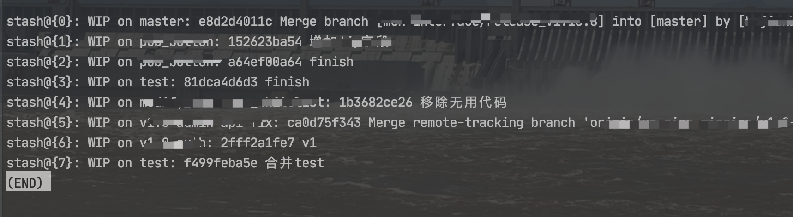
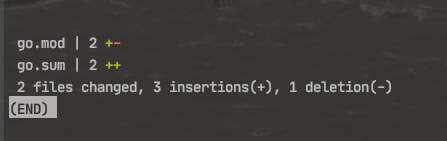
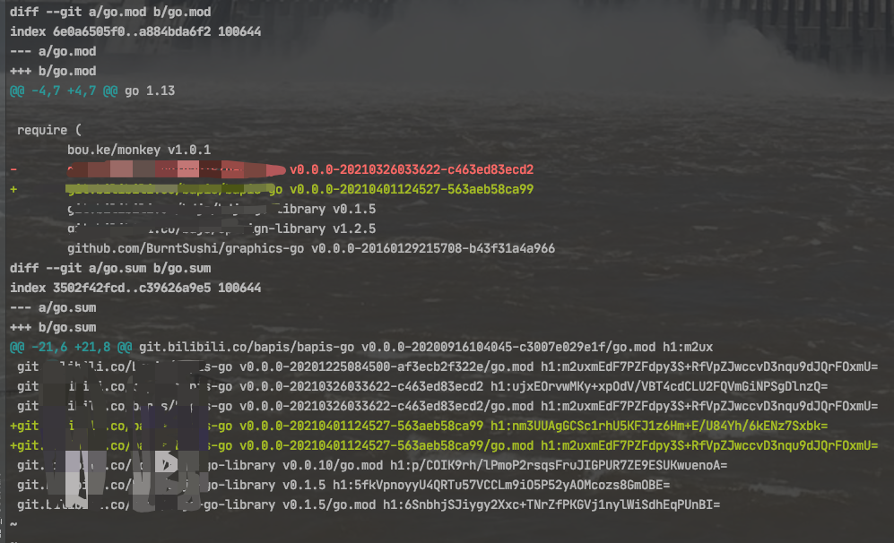

```
stash	

英[stæʃ] 美[stæʃ]
v.	存放; 贮藏; 隐藏;
n.	一批贮藏物;
[例句]She has a fortune stashed away in various bank accounts.
她有一大笔钱存在几个不同的银行账户下。
```

<br>

当多人协作,在同一分支上进行开发. 同事push了我需要用到的新代码,我本地有未提交的(如还是半成品无法通过编译)的代码,直接`git pull`会失败,此时可用`git stash`进行"暂存"


<br>

### **1. git stash save "save message"**  : 

<br>

执行存储时，添加备注，方便查找，只用 **git stash** 也可以，但查找时不方便识别。


<br>


### **2. git stash list**  ：


<br>

列表查看所有的"stash"




<br>


### **3. git stash show** ：


<br>

显示做了哪些改动，默认show第一个存储,如果要显示其他存贮，后面加 *stash@{$num}*，如第二个 `git stash show stash@{1}`




<br>

### **4. git stash show -p** : 


<br>

显示第一个存储的改动，如果想显示其他存存储，命令：*git stash show  stash@{$num}  -p* ，如第二个：`git stash show  stash@{1}  -p`




<br>


### **5. git stash apply** :

<br>

应用某个存储,但不会把存储从存储列表中删除，默认使用第一个存储,即*stash@{0}*，如果要使用其他，`git stash apply stash@{$num}` ， 比如第二个：git stash apply stash@{1} 


<br>


### **6. git stash pop** ：

<br>

恢复之前缓存的工作目录，将缓存堆栈中的对应stash删除，并将对应修改应用到当前的工作目录下,默认为第一个stash,即*stash@{0}*，如果要应用并删除其他stash，命令：*git stash pop stash@{$num}* ，如应用并删除第二个：`git stash pop stash@{1}`

<br>


### **7. git stash drop stash@{$num}** ：


<br>


丢弃stash@{$num}存储，从列表中删除这个存储

<br>


### **8. git stash clear** ：


<br>


删除所有缓存的stash


<br>


---

<br>

参考:

[git stash 用法总结和注意点](https://www.cnblogs.com/zndxall/archive/2018/09/04/9586088.html)