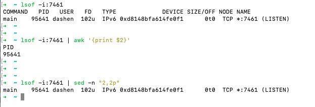

### 根据某个端口,杀死该进程

<br>


运行某个Go程序,该项目没有设置监听信号而退出,导致用`Commamd+C`退出无效.每次只能打开`活动监视器`,搜到二进制文件的名称,执行强制退出.


另外知道该程序监听的端口,`lsof -i:端口`可知其pid, 再执行`kill -9 pid`,则可退出.

现在想一行命令搞定这个事




<br>


`lsof -i:端口号 | sed -n "2,2p" | awk '{print $2}'`

这样就可以得到该端口对应进程的pid.


<br>


<font size=1 color="grey">
其中, 如 sed -n '5,7p',是列出第 5-7 行.  

对于 **sed -n 'a,bp'**,如果b`<`a,则只列出第a行

</font>

<br>

执行 

`lsof -i:1210 | sed -n "2,2p" | awk '{print $2}' | xargs kill -9`
则可实现杀死占用该端口的进程

<font size=1 color="grey">

"xargs 是一个强有力的命令,它能够捕获一个命令的输出,然后传递给另外一个命令

之所以能用到这个命令,关键是由于很多命令不支持管道符 |　管道来传递参数，而日常工作中又有这个必要，所以就有了xargs命令 ​​​​"

</font>


<br>

### 查看使用频率前十的命令

<br>


> history | awk '{CMD[$2]++;count++;}END { for (a in CMD)\
print CMD[a] " " CMD[a]/count*100 "% " a;}' | grep -v "./" \
| column -c3 -s " " -t | sort -nr | nl | head -n10

<br>

```go
     1	1883  35.026%     git
     2	718   13.3557%    cd
     3	654   12.1652%    c
     4	375   6.97545%    go
     5	329   6.11979%    ll
     6	163   3.03199%    gr
     7	121   2.25074%    pwd
     8	101   1.87872%    hexo
     9	96    1.78571%    p3
    10	84    1.5625%     open
```

<br>


### 下载整站

<br>

`wget -r -p -np -k http://URL`

-r 递归下载
-p 下载html里面所有的图片
-np 不要追溯到父目录（可能是为了避免重复下载）
-k 相对路径转换为绝对路径


<br>
