### Cockpit: Linux 服务器的 Web 控制台

<br>

对于Ubuntu系统:

`sudo apt-get install cockpit`

<br>

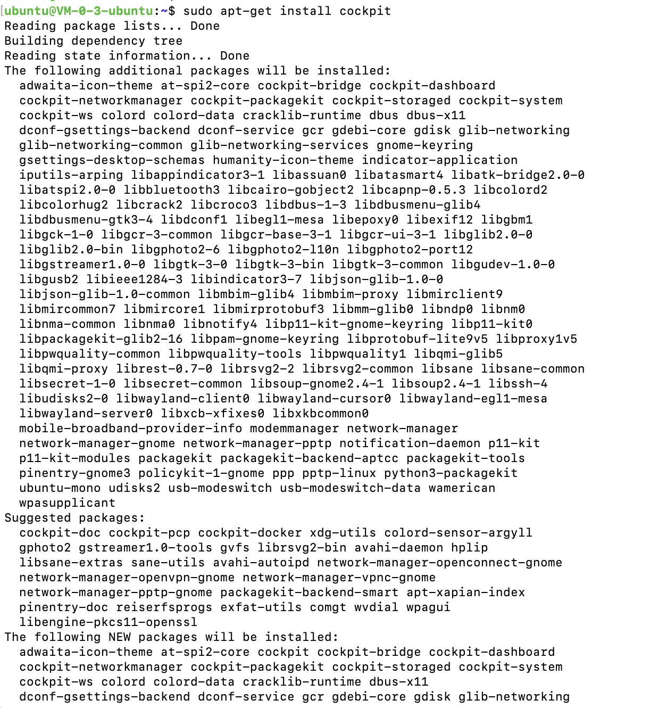

[其他Linux发行版的安装方法](https://cockpit-project.org/running.html)

<br>


使用:

机器的ip:9090


需先配置一下服务器的安全组


还可能会出现浏览器安全级别过高,而出现警告,以FireFox为例:(也可直接点击*接受风险并继续*)


可参考此[修改方法](https://blog.csdn.net/qq_42063091/article/details/86627697) -2

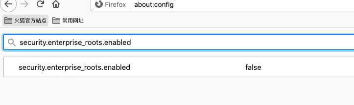


用户名和密码与服务器用户名和密码相同


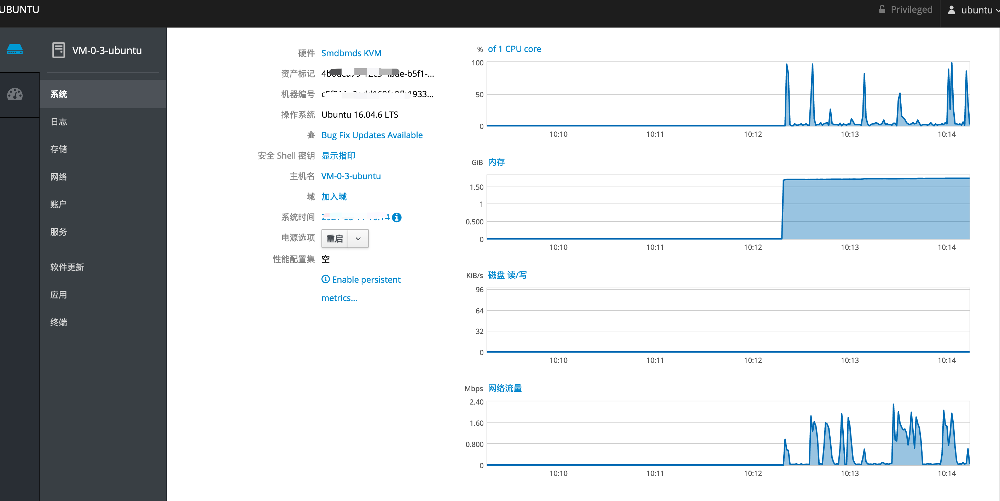

<br>


[Linux管理工具Cockpit安装及使用](https://www.kclouder.cn/howtocockpit/)


<br>

---


<br>


### gping， 带图形界面的ping命令


<br>

[Install 💿 Usage 🎷](https://github.com/orf/gping)


`cargo install gping`


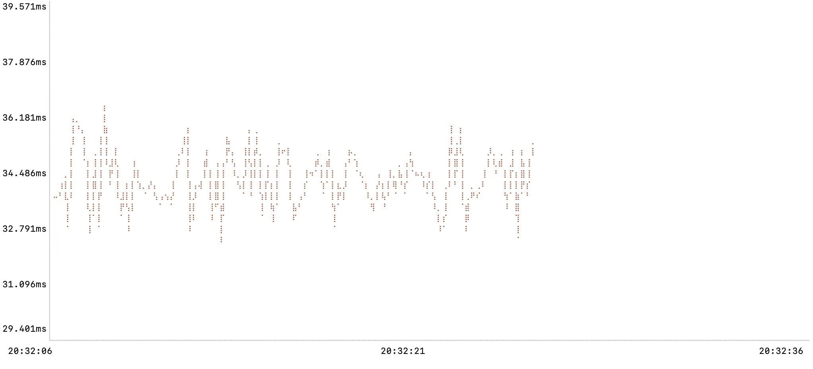

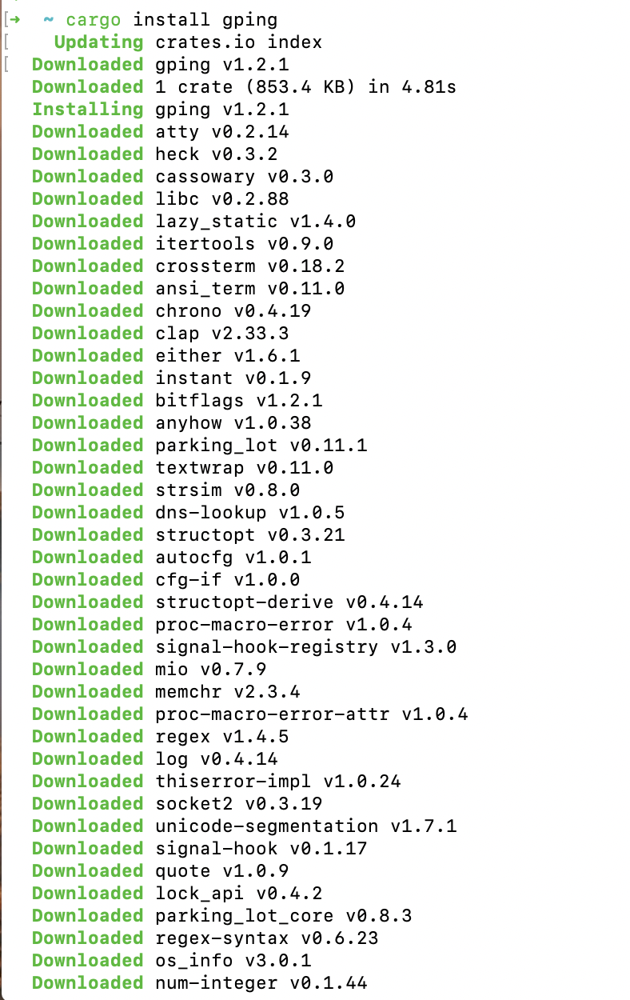

<br>

---


<br>


### lazykube, k8s 终端可视化管理器


<br>

`brew install tnk-studio/tools/lazykube`

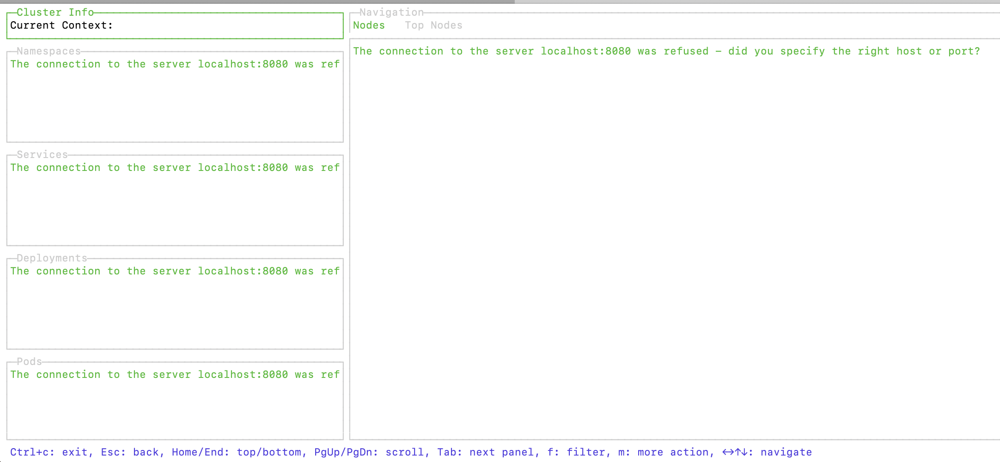

<br>

---


<br>


### [duf, 磁盘空间占用统计工具](https://github.com/muesli/duf)


<br>


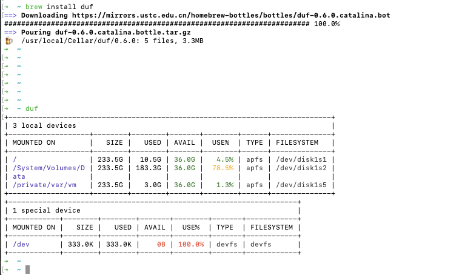


<br>

---


<br>


### [Broot, 比ls更强大的命令行目录树浏览工具](https://dystroy.org/broot/)


<br>

`brew install broot`


<br>


**broot**

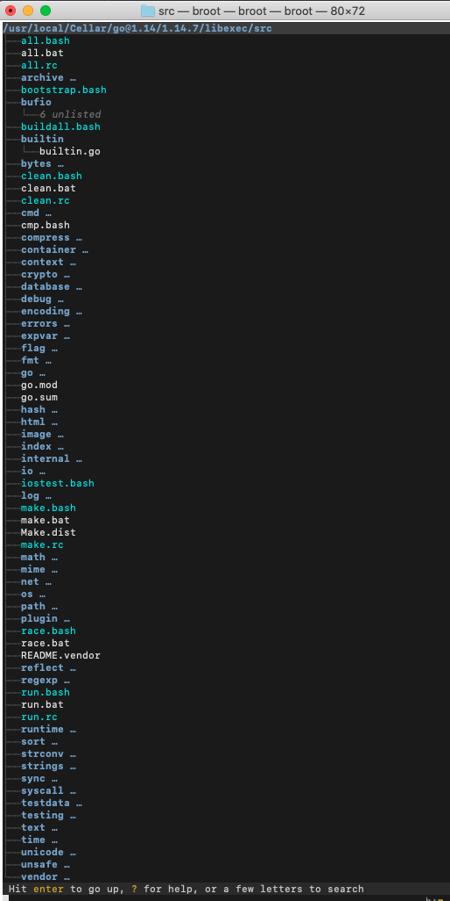


<br>

---


<br>


### [vs, Google搜索词关联关系图谱](https://github.com/anvaka/vs)


<br>


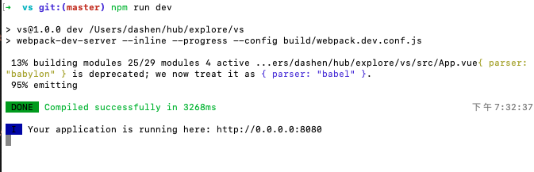

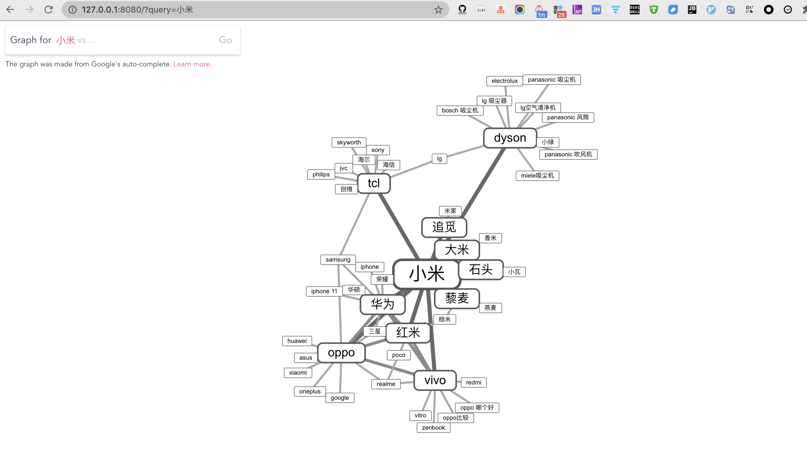

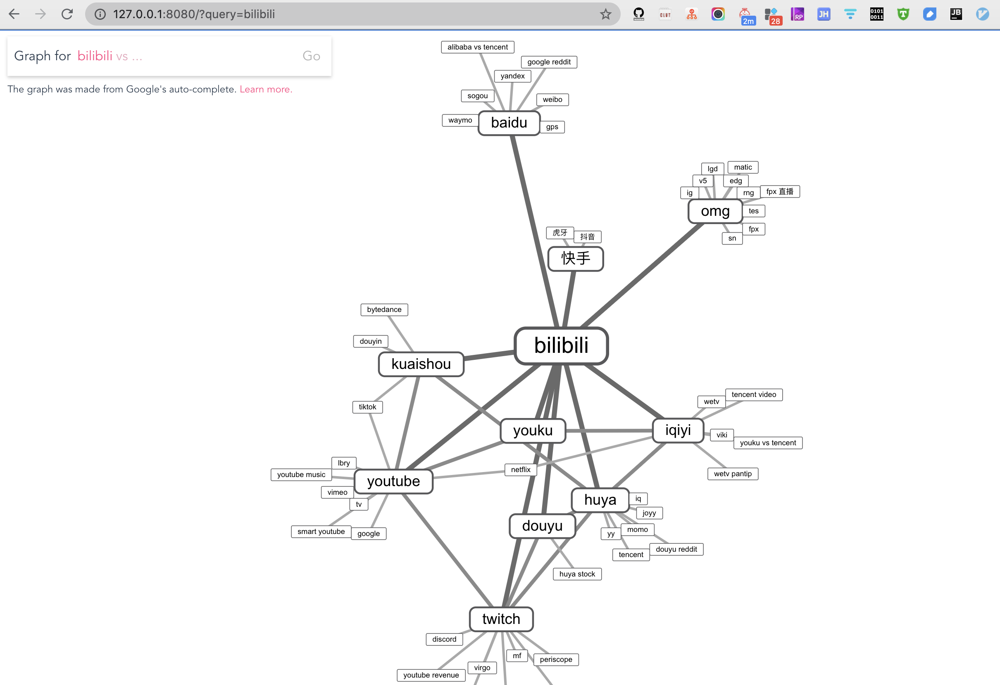


<br>

---


<br>


### [cloc, 代码行数统计工具](https://github.com/AlDanial/cloc)


<br>


可以用于压缩文件（如zip tar等），包括空行和特殊字符的处理与统计，生成多种格式的结果。安装简单且轻量，对于阅读源码，分析项目代码的场景非常实用。

`brew install cloc `

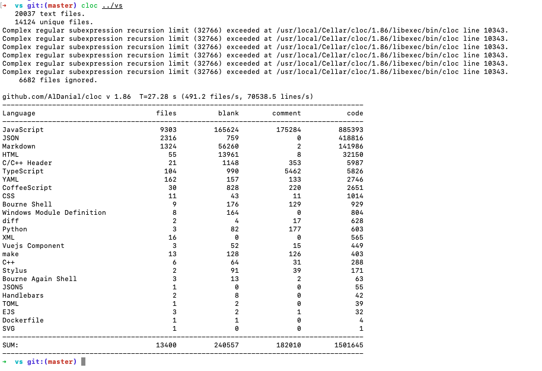

<br>

---


<br>


### [Git quick statistics, 针对Git 仓库的命令行统计工具](https://lukasmestan.com/git-quick-stats/)


<br>

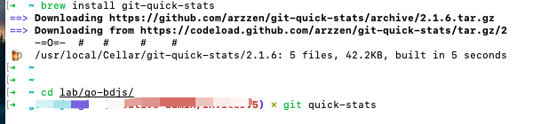

`brew install git-quick-stats`

<br>

`git quick-stats`

<br>


我还曾配置过两个alias

```shell
gcount='git shortlog -sn'
sn='git shortlog -sn'
```

在某个Git仓库下,执行*sn*,就可以得到该仓库的提交者及提交记录数


<br>


---


<br>

### [EnvPane - 图形终端形式查看环境变量](https://github.com/hschmidt/EnvPane)


<br>

---


<br>


### [Cocoa Rest Client, 类似 Postman 但更简洁](https://github.com/mmattozzi/cocoa-rest-client/releases)


<br>

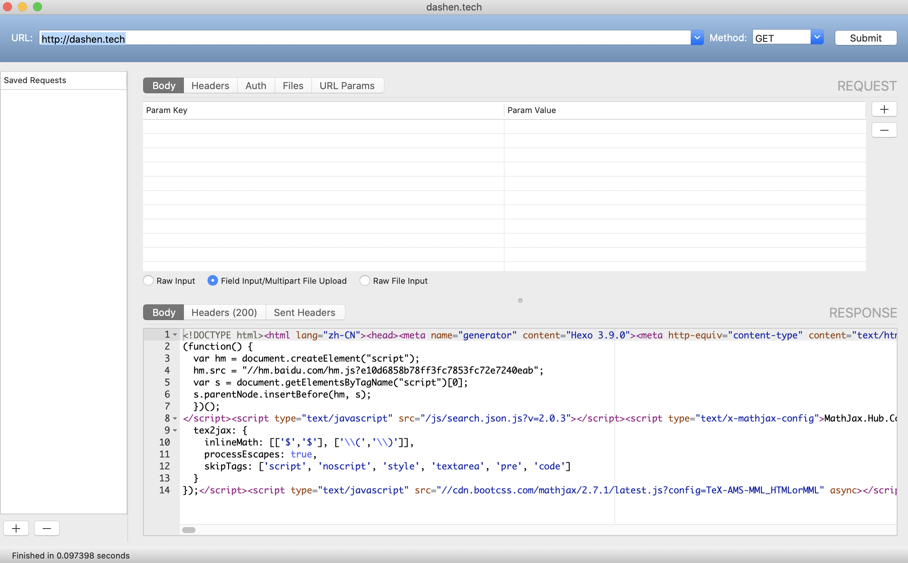


<br>

### [Sloth, lsof 命令的图形界面](https://github.com/sveinbjornt/Sloth)


<br>

---


<br>


Mac 系统的桌面应用，显示当前所有正在运行的进程、打开的文件和系统连接（socket），基本上就是 lsof 命令的图形界面。


`brew install --cask sloth`


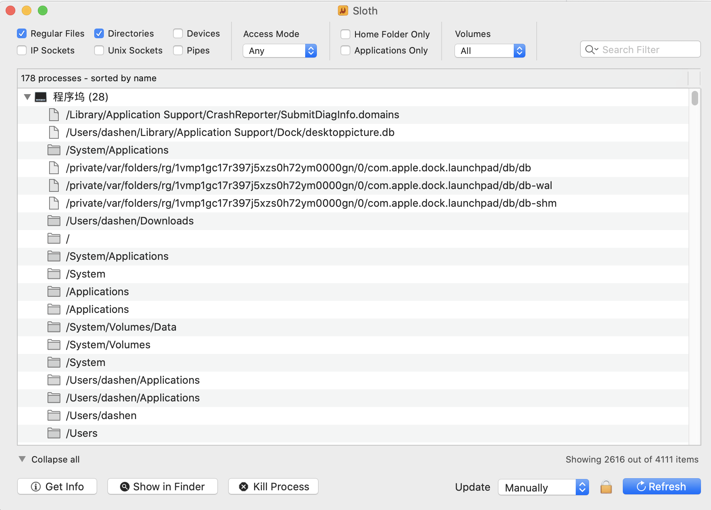


<br>

---


<br>


### [Marp, 将 Markdown 文档转成幻灯片](https://yhatt.github.io/marp/)


<br>


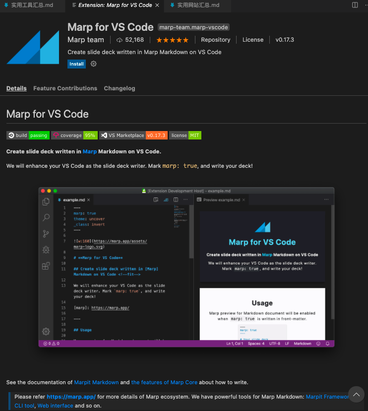


<br>

---

<br>


### [RCT](https://github.com/xaecbd/RCT)

<br>


一个通过解析 rdb 文件对 redis 内存结构分析的一站式平台


<br>

---

<br>


### [Pock](https://github.com/pock/pock)

<br>


把 Mac 电脑的  Dock 放到 TouchBar 的工具

[Toch Bar废物利用系列](https://www.oschina.net/p/pock)


<br>


<br>

---

<br>


### [Convert images to LaTeX](https://mathpix.com/)

<br>

将 数学公式 OCR 转为 LaTex 代码的桌面软件


<br>

---

<br>


### [Motrix](https://motrix.app/zh-CN/)

<br>


一款桌面端下载工具，支持下载 HTTP、FTP、BT、磁力链、百度网盘等资源。

<br>

---

<br>


### [git_curate](https://github.com/matt-harvey/git_curate)

<br>

当项目 Git 仓库有很多分支，忘记了哪些分支有用哪些没有，而不敢贸然删除，这个工具可以显示每个分支的详细情况，以及是否已经合并了，帮助判断是否应该删除这个分支


<br>

---

<br>


### [ModHeader](https://www.cnblogs.com/cc11001100/p/9788683.html)

<br>

Chrome插件,可以自定义HTTP请求头或者是重写响应头


<br>

---

<br>


### [Rooster for Chrome](https://www.jb51.net/softs/613490.html)

<br>

Chrome插件,可以实时展示访问时间统计图表,类似 *Web Timer*


<br>

---

<br>


### [git icdiff](https://qii404.me/2016/01/22/icdiff.html)

<br>

更好用的 *git diff*

`brew install icdiff`

<br>

可以配置下别名


`vim ~/.zshrc`

```shell
alias diff='git icdiff'
```

`source ~/.zshrc`


diff


<br>

---

<br>


### [gum](https://github.com/gauseen/gum)

<br>

一个命令行的 Git 用户管理器，适合需要不同身份，向不同仓库提交代码的情况。


[Git 多用户配置](https://blog.csdn.net/yuanlaijike/article/details/95650625)


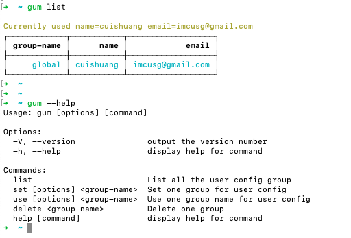


<br>

---

<br>


### [BookmarkHub](https://github.com/dudor/BookmarkHub/blob/main/README_cn.md)

<br>

一个浏览器插件，可以跨浏览器进行书签同步，数据存储在 GitHub Gist


<br>

---

<br>


### [ojoy](https://ojoy.zaps.dev/)

<br>

一个网页图像工具，可以放大图片的同时，还保持同样的清晰度。


