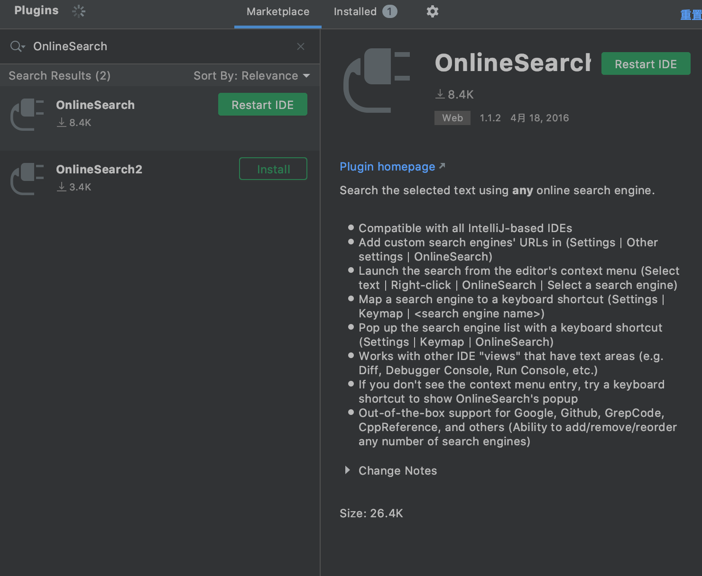
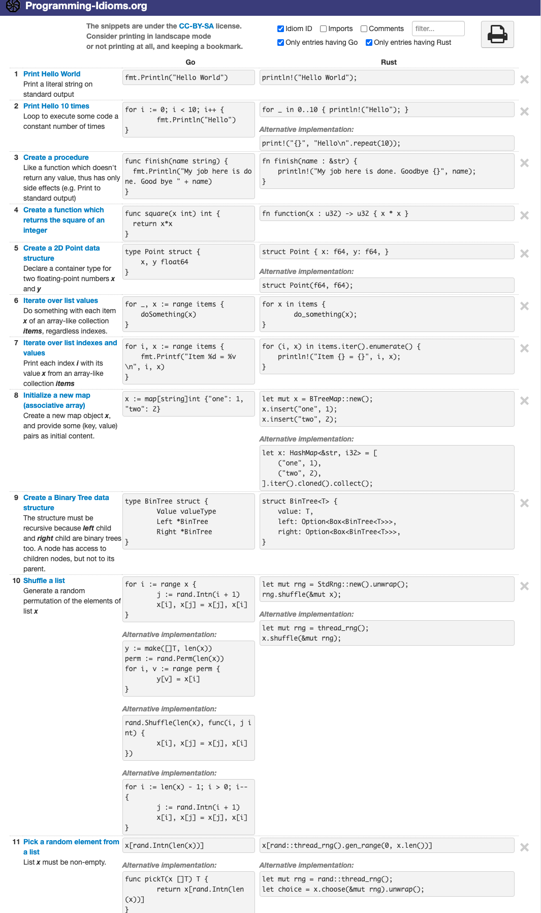

### codelf,变量命名神器

 

[在线版](https://unbug.github.io/codelf/)

可以键入一个中文,看在其他开源项目中,怎样命名

[github地址](https://github.com/unbug/codelf)

[中文wiki](https://github.com/unbug/codelf/wiki)

 

支持多款编辑器, 可以在Jetbrains系列IDE中,插件市场搜索`OnlineSearch`

 

---

 

### Programming-Idioms,对比两个语言的语法

 

[在线地址](https://programming-idioms.org/about#about-block-cheatsheets)

会把这两门语言在非常典型的应用场景的使用方法和区别罗列出来,
可以很容易的基于已经掌握的一门语言去学习另外一门新语言

 

---

 

### libhunt,库对比功能

 

包括不同语言之间,和同一语言之间

[在线地址](https://www.libhunt.com)

更多可参见

[选择困难?试试libhunt](https://dashen.tech/2020/07/14/%E9%80%89%E6%8B%A9%E5%9B%B0%E9%9A%BE-%E8%AF%95%E8%AF%95libhunt/)

 

---

 

### 一些不错的技术站点

 

[thoughtworks的技术雷达](https://www.thoughtworks.com/cn/radar)

[美团技术团队](https://tech.meituan.com/)

[淘宝数据库内核月报](http://mysql.taobao.org/monthly/)

 

参考:

[五个对程序员来说极具价值的小众网站](https://www.bilibili.com/video/BV1hK411M7er)

 

---

 

### 编程语言都有中央包存储库吗？

 

[Does every programming language have a central package repository?](https://codelani.com/posts/does-every-programming-language-have-a-central-package-repository.html)

 

---

 

### Bash 命令的可视化解释工具

 

[ExplainShell.com](https://www.explainshell.com/)

遇到复杂的 Bash 命令，可以输入到这个网站，查看该命令的解释

 

---

 

### [数据结构可视化](https://www.cs.usfca.edu/~galles/visualization/Algorithms.html)

 

收集各种数据结构，并将它们用可视化的形式表现出来。

 

---

 

### [How old is it](https://howoldisit.glitch.me/)

 

可以查询各种技术存在了多久，用来供 HR 招聘时了解，有些技术岗位要求N年经验是不现实的。

 

---

 

### [Visu Algo](https://visualgo.net/zh)

 

各种算法的动态演示网站,很赞

 

---

 

### [Paste to Markdown](https://euangoddard.github.io/clipboard2markdown/)

 

粘贴到该窗口的任何文本内容，都会自动转为 Markdown 格式

 

---

 

### [ScreenDump](https://screendump.techulus.com/)

 

在线截屏工具。只要输入网址，就会显示各种设备的网页截屏。

 

---

 

### [I love IMG](https://www.iloveimg.com/)

 

提供各种在线的图像编辑工具，比如图像缩放、压缩、裁剪、水印等

 

---

 

### [Benchmarks Game](https://benchmarksgame-team.pages.debian.net/benchmarksgame/)

 

27种 常用编程语言的两两性能对比

 

---

 

### [curl-to-Go](https://mholt.github.io/curl-to-go/)

 

将 cURL 转为Golang代码 (Postman有相同功能)

 

---

 

### [goquery](github.com/PuerkitoBio/goquery)

 

[网页解析利器](http://www.zzvips.com/article/64311.html),可用于爬取网页

