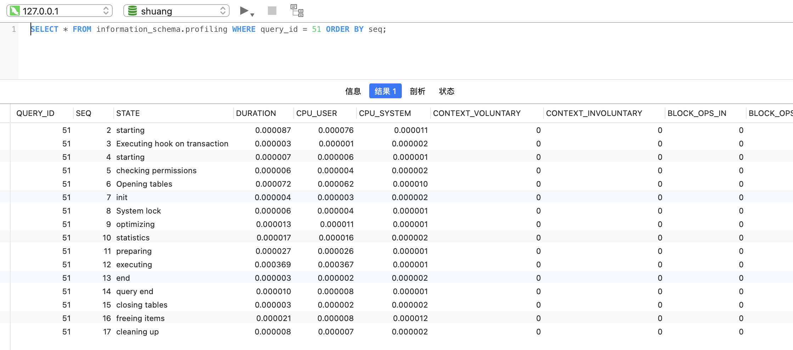

## <font color="#000080">关于profiling(性能分析，或特征分析与实践追踪)</font>

<br>

[go性能分析工具--profiling](https://dashen.tech/2016/04/22/go%E6%80%A7%E8%83%BD%E5%88%86%E6%9E%90%E5%B7%A5%E5%85%B7-profiling/)


```java
profiling
英[ˈprəʊfaɪlɪŋ]
美[ˈproʊfaɪlɪŋ]
n.	(有关人或事物的)资料搜集;
v.	扼要介绍; 概述; 写简介;
[词典]	profile的现在分词;

[例句]You need to provide only two special profiling functions.
您只需要提供两个特殊的分析函数即可。
```


profiling这词比较难翻译,有译成`画像`,我将其译为**资料收集、剖析研究**, 用于对程序*指标或特征的分析*，很多软件中都内置或有第三方的profiling工具，如Linux(比较知名的如[Perf](https://dashen.tech/2020/02/06/perf%E4%BD%BF%E7%94%A8%E6%B5%85%E6%9E%90/))，MySQL，JAVA，Go等。

<br>


<font size=1 color="grey">
如 以MySQL为例：

1. 开启profiling参数

`set profiling=1;`


2. 执行Query语句

`select * from products where id < 100 `


3. 获取系统中保存的所有Query的profile概要信息

`show profiles;`


4. 针对单个Query获取详细的profile信息

`SELECT * FROM information_schema.profiling WHERE query_id = 3 ORDER BY seq;`



[MySQL之profiling性能分析（在5.6.14版本被丢弃）](https://www.cnblogs.com/afeige/p/10896254.html)

</font>

<br>


在Go中，最常使用pprof(及其内置的火焰图)进行特征分析，使用trace进行事件追踪


<font size=1 color="grey">

pprof 更擅长去查看程序效率，比如查看谁占用内存时间长，谁的协程阻塞了等等

trace 则是程序在运行期间的信息追踪，通过可视化的方式来查看这期间程序到底做了什么，以及了解 GC 对程序的影响等等

这两套工具配合起来，更快发现问题，解决问题

</font>


推荐 [Golang 性能分析工具简要介绍](https://mp.weixin.qq.com/s/c8SnrA2auVtrWb-kmBopLg)

<br>


## <font color="#000080">pprof</font>


<br>


[pprof](https://github.com/google/pprof)是Google推出的分析工具，该工具在Go安装时已存在。并且Go 1.10之后的版本，pprof工具直接支持火焰图


<font size=1 color="grey">


[Go 1.10 的pprof的工具将直接支持火焰图](https://colobu.com/2017/11/22/new-pprof-UI/)

</font>


<br>


其使用方式有两种，一种是通过[net/http/pprof]()，在http中收集样本，另一种是和、用[runtime/pprof]()，直接在代码需要分析的位置嵌入分析函数


详细使用方式可参考 [煎鱼-Golang 大杀器之性能剖析 PProf](https://segmentfault.com/a/1190000016412013)

<br>


获取程序在30s内占用CPU的情况：`curl http://IP:port/debug/pprof/profile?seconds=30 -o profile_cui.out`

获取所有协程堆栈信息：`curl http://IP:port/debug/pprof/groutine -o groutine_cui.out`

获取堆内存使用情况： `curl -o heap_cui.out http://IP:port/debug/pprof/heap `


<br>

### 堆内存分析


<br>

#### 命令行交互形式


<br>

`curl http://IP:port/debug/pprof/heap -o heap_cui.out`

而后

`go tool pprof heap_cui.out`

(或直接两条命令合二为一 `go tool pprof http://IP:port/debug/pprof/heap `)


默认类型为*inuse_space*,代表去分析正在使用的内存


<font size=1 color="#FF69B4">

<br>

heap.out可以显示4种不同类型： alloc_objects, alloc_space, inuse_objects, inuse_space

其中alloc_objects和inuse_objects分别代表已被分配的对象和正在使用的对象的数量，前者是累计值，不考虑对象释放的情况。

<br>

默认分析inuse_space类型，但要切换分析的类型也很简单, 如想分析alloc_objects情况，只需要输入alloc_objects并回车即可

</font>


<details>
<summary>交互命令有很多，可通过help查看:</summary>

```go
(pprof) help
  Commands:
    callgrind        Outputs a graph in callgrind format
    comments         Output all profile comments
    disasm           Output assembly listings annotated with samples
    dot              Outputs a graph in DOT format
    eog              Visualize graph through eog
    evince           Visualize graph through evince
    gif              Outputs a graph image in GIF format
    gv               Visualize graph through gv
    kcachegrind      Visualize report in KCachegrind
    list             Output annotated source for functions matching regexp
    pdf              Outputs a graph in PDF format
    peek             Output callers/callees of functions matching regexp
    png              Outputs a graph image in PNG format
    proto            Outputs the profile in compressed protobuf format
    ps               Outputs a graph in PS format
    raw              Outputs a text representation of the raw profile
    svg              Outputs a graph in SVG format
    tags             Outputs all tags in the profile
    text             Outputs top entries in text form
    top              Outputs top entries in text form
    topproto         Outputs top entries in compressed protobuf format
    traces           Outputs all profile samples in text form
    tree             Outputs a text rendering of call graph
    web              Visualize graph through web browser
    weblist          Display annotated source in a web browser
    o/options        List options and their current values
    q/quit/exit/^D   Exit pprof

  Options:
    call_tree        Create a context-sensitive call tree
    compact_labels   Show minimal headers
    divide_by        Ratio to divide all samples before visualization
    drop_negative    Ignore negative differences
    edgefraction     Hide edges below <f>*total
    focus            Restricts to samples going through a node matching regexp
    hide             Skips nodes matching regexp
    ignore           Skips paths going through any nodes matching regexp
    intel_syntax     Show assembly in Intel syntax
    mean             Average sample value over first value (count)
    nodecount        Max number of nodes to show
    nodefraction     Hide nodes below <f>*total
    noinlines        Ignore inlines.
    normalize        Scales profile based on the base profile.
    output           Output filename for file-based outputs
    prune_from       Drops any functions below the matched frame.
    relative_percentages Show percentages relative to focused subgraph
    sample_index     Sample value to report (0-based index or name)
    show             Only show nodes matching regexp
    show_from        Drops functions above the highest matched frame.
    source_path      Search path for source files
    tagfocus         Restricts to samples with tags in range or matched by regexp
    taghide          Skip tags matching this regexp
    tagignore        Discard samples with tags in range or matched by regexp
    tagshow          Only consider tags matching this regexp
    trim             Honor nodefraction/edgefraction/nodecount defaults
    trim_path        Path to trim from source paths before search
    unit             Measurement units to display

  Option groups (only set one per group):
    granularity      
      functions        Aggregate at the function level.
      filefunctions    Aggregate at the function level.
      files            Aggregate at the file level.
      lines            Aggregate at the source code line level.
      addresses        Aggregate at the address level.
    sort             
      cum              Sort entries based on cumulative weight
      flat             Sort entries based on own weight
  :   Clear focus/ignore/hide/tagfocus/tagignore

  type "help <cmd|option>" for more information
```
</details>


比较常用的有以下命令：


<font color="#FFA54F">top：</font>

会以flat列从大到小的顺序排序。flat代表当前函数统计的值。*inuse_space*模式下，就是当前函数分配的堆区正在使用的内存大小；

cum则是一个累积的概念，指当前函数及其调用的一系列函数flat的和。flat只包含当前函数的栈帧信息，不包括其调用函数的。cum字段正好可以弥补这一点。

flat%和cum%分别表示flat和cum字段占总字段的百分比。


<font color="#FFA54F">可以使用 `top -cum`，根据cum进行排序； </font>

<font color="#FFA54F">可使用`list 函数名称`列出函数信息; </font>

<font color="#FFA54F">可使用`tree`打印出函数的调用链</font>


<br>

#### 可视化形式

<br>

在安装graphviz的前提下，可以的命令行中输出`web`，即可在浏览器中展示


<br>

或直接通过

`go tool  pprof   --http :9091  heap_cui.out`


选择 **Top**，则如上命令行


可以点击Cum或Flat进行排序


<br>

点击 **Graph**，则即默认的调用图


其中：

- 节点颜色：

    - 红色代表累计值cum为正，且很大
    - 绿色代表累计值cum为负，且很大
    - 灰色代表累计值cum可忽略不计


- 节点字体大小：

    - 较大的字体表示较大的当前值
    - 较小的字体表示较小的当前值


- 边框颜色：

    - 当前值较大并且为正数时为红色
    - 当前值较小并且为负数时为绿色
    - 当前值接近0时为灰色


- 箭头大小：

    - 箭头越粗代表当前的路径消耗了越多的资源
    - 箭头越细代表当前的路径消耗了越少的资源


- 箭头线型：

    - 虚线箭头表示两个节点之间的某些节点已被忽略，为间接调用
    - 实线箭头表示两个节点之间为直接调用


<br>


点击 **Flame Graph**，则为火焰图


可点击进行放大


- 最上方的root框代表整个程序的开始，其他框都代表一个函数
- 火焰图每一层的函数都是平级的，下层函数是其对应的上层函数的子函数
- 函数调用栈越长，火焰就越高
- 框越长，颜色越深，代表当前函数占用CPU时间越久
- 可单击任何框，查看该函数更详细的信息


<br>


点击 **Peek**，则为函数调用关系


<br>


点击 **Source**，则为对应的源码文件


<br>


点击 **Disassemble**，则为总的内存数

<br>

可点击SAMPLE切换要分析的类型


<br>


<br>

### 协程栈分析

<br>


除 堆内存分析，协程栈分析也使用较多。 分析协程栈有两方面作用：

1. 查看协程数量，看协程是否泄露

2. 查看当前大量的协程在执行哪些函数，判断当前协程是否健康


<br>


引入[net/http/pprof]()，然后启一个goroutine来监听端口

```go
package main

import (
	"log"
	"net/http"
	_ "net/http/pprof"
	"time"
)

func main() {

	go func() {
		log.Println(http.ListenAndServe(":6060", nil))
	}()

	a := make(chan int)
	for {
		time.Sleep(time.Second)
		go func() {
			<-a
		}()
	}

}
```


运行以上代码，同时 `go tool pprof http://localhost:6060/debug/pprof/goroutine ` 


<br>


当前协程有33个，大部分都在runtime.gopark函数中(gopark是协程休眠函数)

通过tree查看函数调用链，发现协程阻塞，是调用runtime.chanrecv函数以表明通道正在等待接收导致


<br>


同样可以使用web命令，在浏览器查看调用关系：


<br>


也可以使用 `go tool  pprof   --http :9091 pprof.goroutine.001.pb.gz `,可视化查看各种信息


<br>

### base基准分析

<br>

除了查看协程栈帧数据，goroutine profile 还可用来排查协程泄露。

通过对比协程的总数，可以大概评估出程序是否陷入泄露状态。

pprof提供了强大的工具，用来对比前后特征文件的区别。


下面使用`-base`标志，后面跟两个基准特征文件:


同样支持web指令


<br>

### mutex堵塞分析

<br>


和block类似，mutex主要用于查看锁争用导致的休眠时间。有助于排查锁争用导致的CPU利用率不足问题(不经常使用)


```go
package main

import (
	"log"
	"net/http"
	_ "net/http/pprof"
	"runtime"
	"sync"
)

func main() {

	go func() {
		log.Println(http.ListenAndServe(":6060", nil))
	}()

	var mu sync.Mutex
	var items = make(map[int]struct{})
	runtime.SetMutexProfileFraction(5)

	for i := 0; i < 1000000*1000000; i++ {
		go func(i int) {
			mu.Lock()
			defer mu.Unlock()
			items[i] = struct{}{}
		}(i)
	}
}
```

运行以上代码，同时 `go tool pprof http://localhost:6060/debug/pprof/mutex` 


同样支持web指令


<br>

### CPU分析

<br>


获取程序在30s内占用CPU的情况：curl http://IP:port/debug/pprof/profile?seconds=30 -o profile_cui.out


或 `go tool pprof http://localhost:6060/debug/pprof/profile?second=30`


<br>

### **火焰图分析**

<br>

参见上面内容


 <br>

 <br>


---

<br>


## <font color="#000080">trace</font>

<br>


在pprof分析中，可以知道一段时间CPU占用、内存分配、协程堆栈信息。这些消息都是一段时间内数据的汇总，但并没有提供整个周期内发生的事件，如 指定的goroutine何时执行、执行了多长时间、什么时刻陷入了阻塞、什么时刻解除了阻塞、GC如何影响单个goroutine的执行、STW中断花费的时间是否太长等。


Go 1.5之后推出了trace工具，提供了指定时间内程序发生的事件的完整信息，包括：


- 协程的创建、开始和结束
- 协程的阻塞`---`系统调用、通道、锁
- 网络I/O相关事件
- 系统调用事件
- 垃圾回收相关事件


(源码在[runtime/trace.go]())

<br>

收集trace文件的方式和收集pprof特征文件差不多，都有两种方式


详细使用方式可参考 [煎鱼-Golang 大杀器之跟踪剖析 trace](https://segmentfault.com/a/1190000019736288)


收集：

`curl http://IP:port/debug/pprof/trace?seconds=30 -o trace_cui.out`


分析：

`go tool  trace  trace_cui.out `


之后会自动打开浏览器：


<br>


### View trace

<br>


其中最复杂，信息最丰富的是第一个 **View trace** 选项，显示整个执行周期的完整事件


<br>


1. 时间线：可使用如下快捷键浏览时间轴

- `w`快捷键可以放大图像

- `s`快捷键可以缩小图像

- `a`快捷键可以左移图像

- `d`快捷键可以右移图像

<br>

2. Goroutines：显示每个时间点正在运行的goroutine数量，及可运行(等待调度)的goroutine数量。存在大量可运行的goroutine，可能表明调度器繁忙。


<br>

3. 堆: 显示执行期间的内存分配情况，对于查找内存泄露及检查每次runtime GC释放的内存很有用处。

<br>

4. 操作系统线程： 显示正在使用的操作系统线程及被系统调用阻塞的线程数

<br>

5. 显示每个逻辑处理器

<br>

6. 显示协程和事件，表明协程何时开始，何时结束，以及结束的原因

`w`放大，选中某一位置：


- Title: 协程的名字

- Start: 协程开始的事件

- Wall Duration: 协程持续时间

- Start Stack Trace: 协程开始时的栈追踪

- End Stack Trace:  协程结束时的栈追踪

- Event(s): 协程产生的事件信息


<br>


### Goroutine analysis选项

<br>


点击一处进入详情，可看到每个goroutine的id，以及执行时间，网络等待时间，因同步而锁定的时间，因系统调用锁定的时间，调度等待时间，GC清扫时间，GC暂停时间


<br>


### 之后的四处profile选项

<br>

都是一个调用关系及时间图


 - Network blocking profile选项: 用调用关系图展示网络阻塞的情况
 
 - Synchronization blocking profile 选项: 同步阻塞耗时情况，使用调用关系图来展示
 
 - Syscall blocking profile选项: 系统调用阻塞耗时情况，使用调用关系图来展示
 
 - Scheduler latency profile 选项: 调度器延迟耗时情况，使用调用关系图来展示


<br>

### User-defined tasks、User-defined regions


<br>

用户自定义 trace 的 tasks/用户自定义 trace 的 region


 Go 1.11 版本中引入的特性，trace 可以添加我们自定义的内容，用来快速跟踪想要看到的代码块的耗时点


<br>

### Minimum mutator utilization


<br>

用一个曲线图来展示 GC 对程序的影响情况，可以用来分析和判断是否要对 GC 做优化


大约1.2ms后,程序才获得到 cpu 使用(在这之前GC 做了 STW) 。


如果曲线随着时间增加依然不高，说明 GC 负担比较重，占用更多系统资源，这个时候需对 GC 做优化

<br>

曲线图右侧的几个选项：

- System：整个系统的利用率

- Per-goroutine：每一个协程的利用率

- STW：Stop the word，表示所有协程同时暂停，在做 GC 的时，是会 STW

- Backgroud workers：GC 的协程，会消耗 25% 的利用率，在 GC 的时候，会以后台方式执行

- Mark assisst：GC 要减慢内存分配速度时，会分配 goroutine 来做标记

- Sweep：回收在 GC 之间未使用的内存

- Show percentiles：除了最基本数据外，还显示 mutator 利用率的百分比


<br>


---


<br>

### trace 使用场景


<br>


#### 分析延迟问题

<br>

如某个接口预期200ms执行完，但却用了2s。


当程序中重要的协程长时间无法运行，可能带来延迟问题。协程长时间无法得到执行，可能因为系统调用被阻塞，通道/互斥锁上被阻塞，协程运行时代码(如GC)阻塞。这些都可以通过trace来查看。


<br>


#### 诊断不良并行性

<br>

如预期使用全部CPU，使用trace后发现，只有一个CPU在跑~

<br>

---


<br>

关于trace，还可参考 [go trace 剖析 go1.14 异步抢占式调度](https://mp.weixin.qq.com/s/Wp15aOLeYhZYla275TzISw)


<br>

更多参考：


[Go调优神器trace介绍](https://studygolang.com/articles/9693)


[Tony Bai - 通过实例理解Go Execution Tracer](https://tonybai.com/2021/06/28/understand-go-execution-tracer-by-example/)


[性能调优 - trace](https://swsmile.info/post/golang-trace/)


<br>

---


<br>


其他第三方profiling工具：

[鸟窝-[译]使用 bcc/BPF 分析 go 程序](https://colobu.com/2017/09/22/golang-bcc-bpf-function-tracing/)

[鸟窝-[译] Go 可视化性能分析工具](https://colobu.com/2017/03/02/a-short-survey-of-golang-pprof/)

[鸟窝-调试利器：dump goroutine 的 stacktrace](https://colobu.com/2016/12/21/how-to-dump-goroutine-stack-traces/)

文中部分工具已经out...


<br>


Go官方博客:

[Diagnostics](https://go.dev/doc/diagnostics#tracing)

(这里认为Profiling和Tracing是同级。我这里把Profiling看成是Tracing的上一级）

[Profiling Go Programs](https://go.dev/blog/pprof)

[Go pprof官方文档](https://pkg.go.dev/runtime/pprof)

部分译文：

[译文 Go 高性能系列教程之二：性能评估和分析](https://zhuanlan.zhihu.com/p/378001444)

[译文 Go 性能工具小抄](https://zhuanlan.zhihu.com/p/381658335)

[原创分享 Go 高性能系列教程：读懂 pprof 生成的报告](https://zhuanlan.zhihu.com/p/376448431)


<br>

更多可参考：

[奇伢-全面的整理：golang 调试分析的高阶技巧](https://mp.weixin.qq.com/s/SvzMEdhxHfI9hYU62r1C7g)

[曹大-Go 应用优化指北](https://mp.weixin.qq.com/s/KFT1hw02Zih1TMMlDWztCQ)

[曹大-pprof 和火焰图](https://xargin.com/pprof-and-flamegraph/)

[鸟窝-[译]Go性能分析工具工具和手段](https://colobu.com/2019/05/22/profilinggo/)


[性能分析方法论](https://www.zenlife.tk/performance-analysis.md)


[李文周的博客](https://www.liwenzhou.com/posts/Go/performance_optimisation/)


[使用 pprof 和火焰图调试 golang 应用](https://cizixs.com/2017/09/11/profiling-golang-program/)


[ Golang -CPU 性能、内存分析调试方法汇总](https://gocn.vip/topics/10054)


[golang pprof 的使用调试 cpu，heap，gc,逃逸](https://blog.csdn.net/fwhezfwhez/article/details/85684311)


<br>

---

<br>

go tool 可选的那些参数


