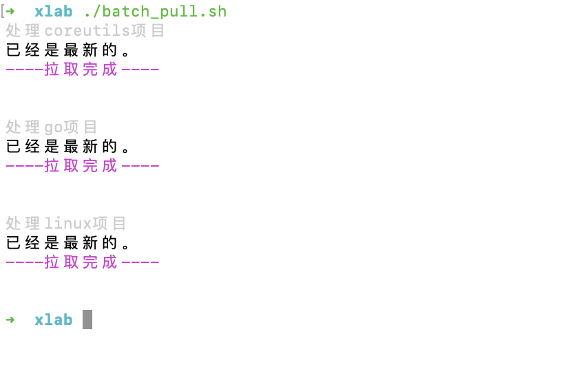

文件夹下有几十个git仓库，想全部更新, 但不想手工 `cd xx` && `git pull`。 写脚本批量更新之

效果如下：


```sh
#!/bin/bash

for i in *;
do
if [ -d $i ];then # 如果$i为目录
#echo "处理"$i"项目"; #添加颜色
echo -e "\033[37m处理"$i"项目\033[0m" 
cd $i;
git pull
#pwd
echo -e "\033[35m----拉取完成----\033[0m"  
echo -e "\n"
cd ../
fi

done
```





---

<br>


shell系列合集:

[用shell批量修改文件名](https://dashen.tech/2019/05/17/%E7%94%A8shell%E6%89%B9%E9%87%8F%E4%BF%AE%E6%94%B9%E6%96%87%E4%BB%B6%E5%90%8D/)

[根据条件关闭软件](https://dashen.tech/2019/07/31/%E6%A0%B9%E6%8D%AE%E6%9D%A1%E4%BB%B6%E5%85%B3%E9%97%AD%E8%BD%AF%E4%BB%B6/)

[统计命令汇总](https://dashen.tech/2021/01/10/%E7%BB%9F%E8%AE%A1%E5%91%BD%E4%BB%A4%E6%B1%87%E6%80%BB/)