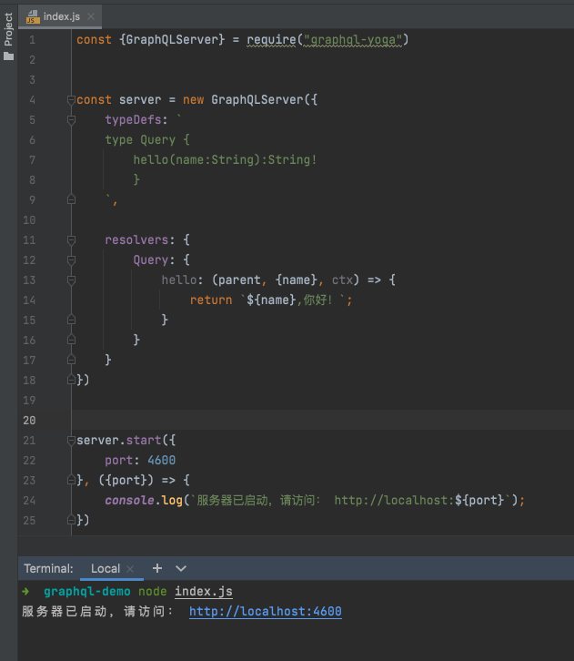
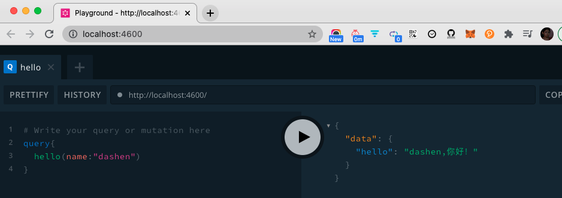
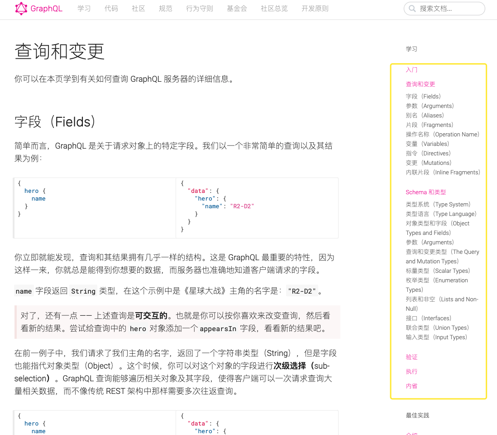

### js版

<br>

GraphQL在 NodeJS 服务端中使用最多


安装`graphql-yoga`:

> npm install graphql-yoga


<br>

新建`index.js`:


```js
const {GraphQLServer} = require("graphql-yoga")


const server = new GraphQLServer({
    typeDefs: `
    type Query {
        hello(name:String):String!
        } 
    `,

    resolvers: {
        Query: {
            hello: (parent, {name}, ctx) => {
                return `${name},你好！`;
            }
        }
    }
})


server.start({
    port: 4600
}, ({port}) => {
    console.log(`服务器已启动，请访问： http://localhost:${port}`);
})

```

<br>




**node index.js** 运行

点击链接 进入playground：


```sql
query{
  hello(name:"dashen")
}
```





参考自 [5分钟快速搭建一个Graphql服务器](https://www.bilibili.com/video/BV1db41137BT)

<br>

---


<br>

### Golang版

<br>

[入门教程](https://graphql.cn/learn/)

[Go常用的GraphQL服务端库](https://graphql.cn/code/#go)





[graphql-go/graphql](https://github.com/graphql-go/graphql)项目的demo:


([文档点此](https://pkg.go.dev/github.com/graphql-go/graphql))

```go
package main

import (
	"encoding/json"
	"fmt"
	"log"

	"github.com/graphql-go/graphql"
)

func main() {
	// Schema
	fields := graphql.Fields{
		"hello": &graphql.Field{
			Type: graphql.String,
			Resolve: func(p graphql.ResolveParams) (interface{}, error) {
				return "world", nil
			},
		},
	}
	rootQuery := graphql.ObjectConfig{Name: "RootQuery", Fields: fields}
	schemaConfig := graphql.SchemaConfig{Query: graphql.NewObject(rootQuery)}
	schema, err := graphql.NewSchema(schemaConfig)
	if err != nil {
		log.Fatalf("failed to create new schema, error: %v", err)
	}

	// Query
	query := `
		{
			hello
		}
	`
	params := graphql.Params{Schema: schema, RequestString: query}
	r := graphql.Do(params)
	if len(r.Errors) > 0 {
		log.Fatalf("failed to execute graphql operation, errors: %+v", r.Errors)
	}
	rJSON, _ := json.Marshal(r)
	fmt.Printf("%s \n", rJSON) // {"data":{"hello":"world"}}
}

```

执行输出 

`{"data":{"hello":"world"}} `


<br>


基于此项目的实践，参考

[Graphql Go 基于Golang实践](https://www.jianshu.com/p/16719baa1713)

[代码](https://github.com/gopherteam/graphql-server-go)


<br>

---

<br>


参考：

[GraphQL中文社区](https://graphql.cn/)