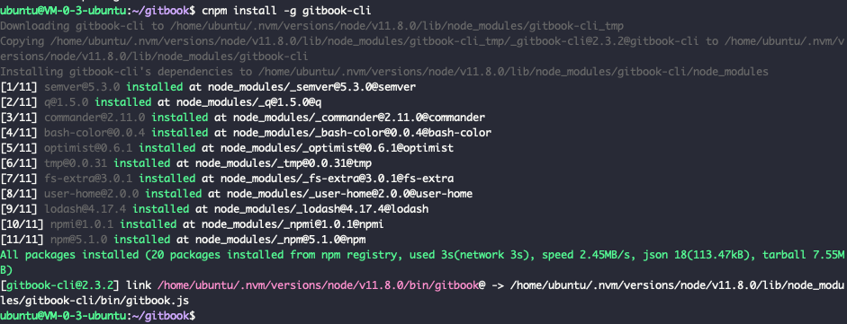
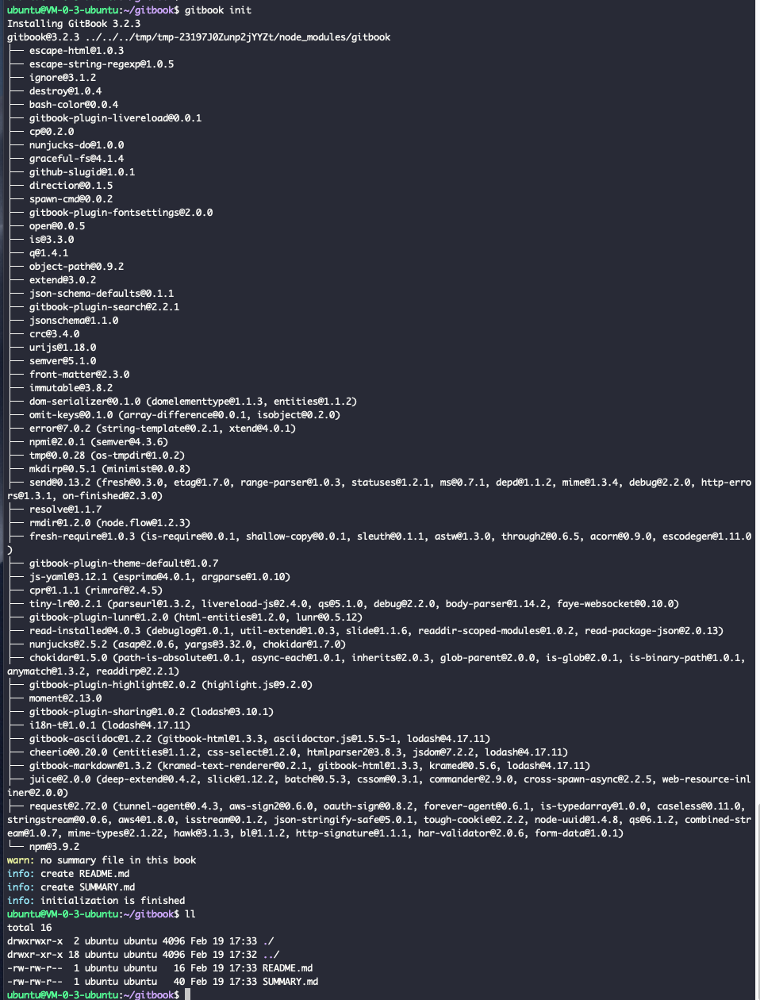
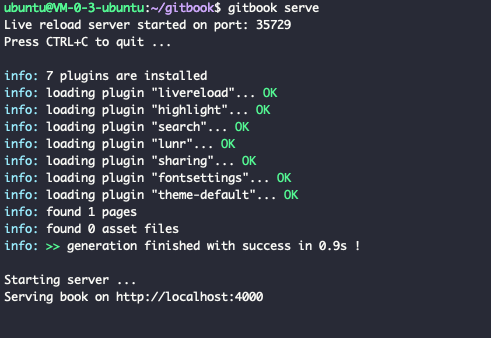
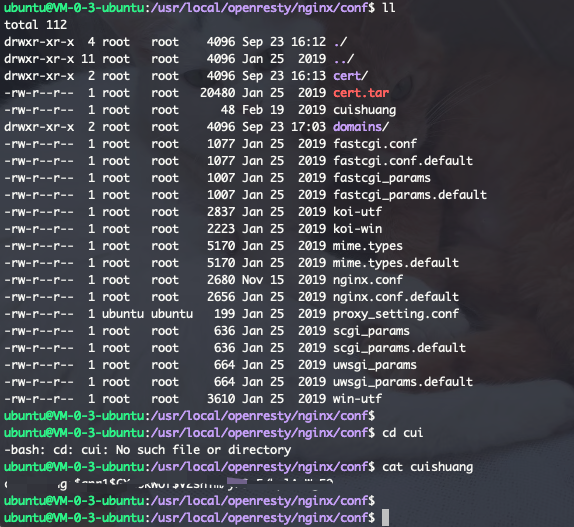
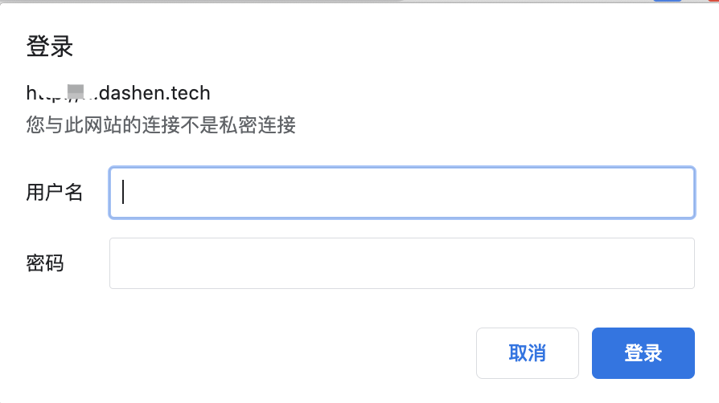

当年跟着H哥时,使用gitbook作为文档工具.

维护一个文档项目,提交到gitlab,做好配置后,会将markdown自动重新构建为新的页面.

<br>

### <font color="#E6E6FA"> 搭建gitbook</font>

<br>







<br>


该步骤相对较简单,无甚好写.可参考

[搭建gitbook 和 访问权限认证 &和git仓库(github或者公司的gitlab)关联](https://note.youdao.com/web/#/file/recent/note/WEBb2ce256f196e084991d3ed6db8bace2e/?search=gitbook)


<br>

---

<br>

### <font color="#E6E6FA"> 利用nginx添加 权限认证</font>

<br>

像公司内部文档,不希望对外公开,但也不想局限于仅内网可访问. 可利用nginx的认证模块,实现简单的账号密码登陆.


<br>


**安装 mini-httpd**

<br>


```shell
sudo apt-get install mini-httpd
```

而后执行

`
sudo htpasswd -bc conf/domains/随意设置一个文件名称如cuishuang  你想要设置的登陆账号  你想设置的登陆密码
`




<br>

如下:

```bash
  location / {
	    root /home/ubuntu/gitbook/_book;
	    index index.html;
	    auth_basic     "爽哥提示:请输入账号和密码";
	    auth_basic_user_file  cuishuang; #nginx认证文件目录,即上文中设置的文件的绝对或相对路径
	    try_files $uri $uri/ =404;
         }
```

<br>

最终的conf文件如下:

```bash
    server {
        listen       80;
        server_name  gitbook.dashen.tech;  #server_name不要加http或https

        access_log  /var/log/gitbook.access.log  main;
        error_log  /var/log/gitbook.error.log;

        location / {
	    root /home/ubuntu/gitbook/_book;
	    index index.html;
	    auth_basic     "爽哥提示:请输入账号和密码";
	    auth_basic_user_file  cuishuang; #nginx认证文件目录,即上文中设置的文件的绝对或相对路径
	    try_files $uri $uri/ =404;
         }

         error_page   500 502 503 504  /50x.html;
         location = /50x.html {
             root   html;
         }

     }
```

<br>


重启nginx, 然后访问.



<br>

输入正确的用户名和密码后,即可进入并正常使用