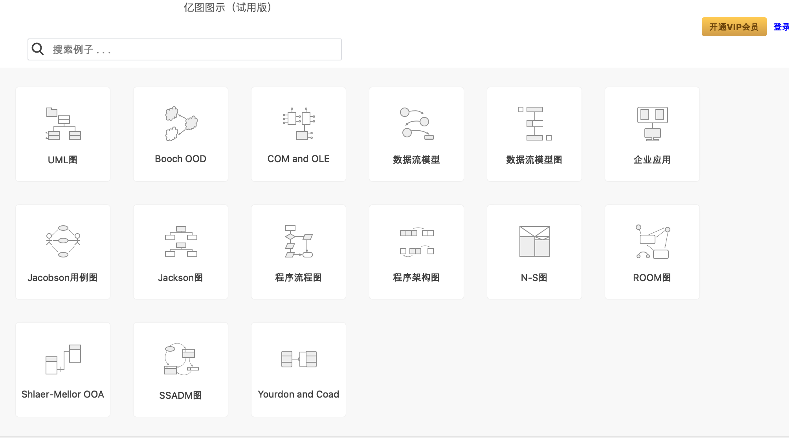
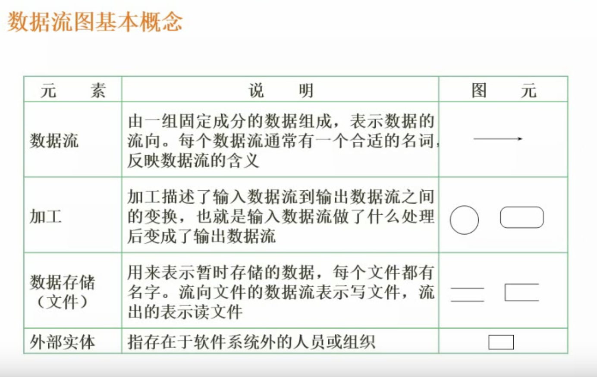
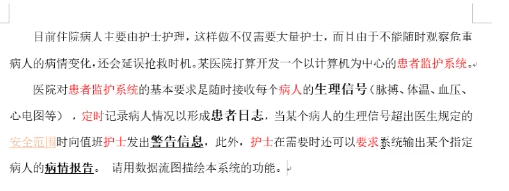
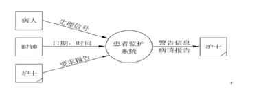
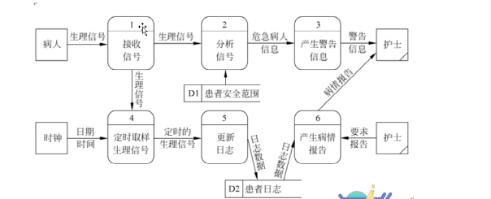
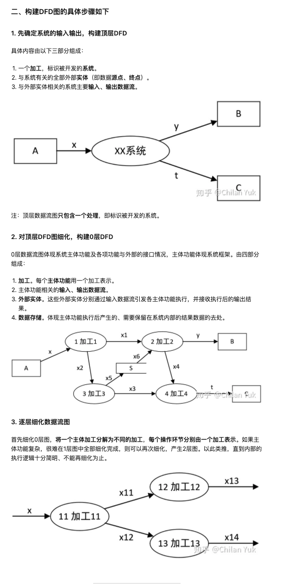
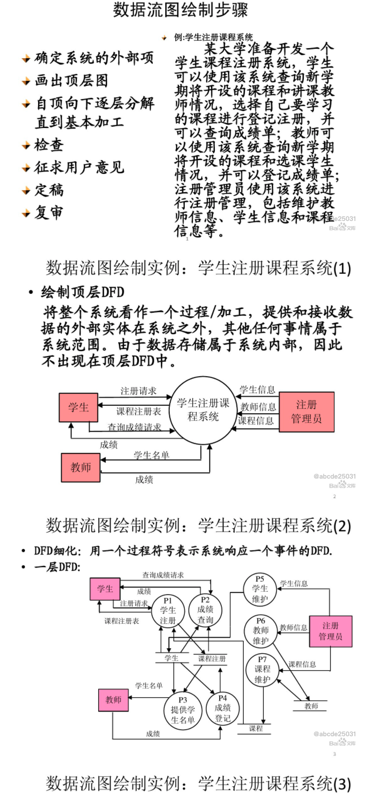
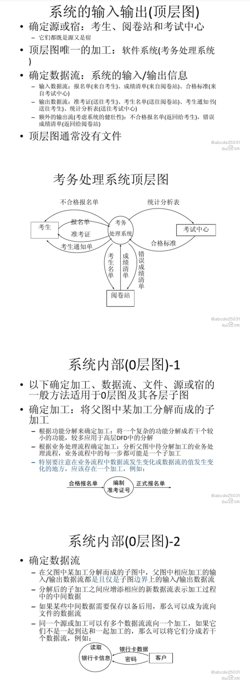
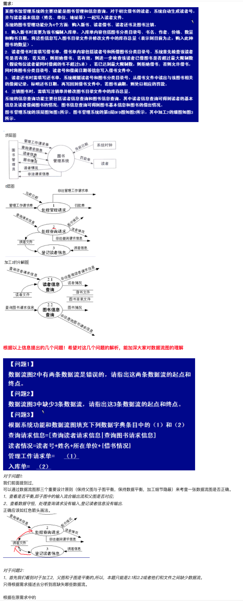

[数据流图](https://baike.baidu.com/item/%E6%95%B0%E6%8D%AE%E6%B5%81%E5%9B%BE)（Data Flow Diagram, DFD）是结构化系统分析方法的主要表达工具，数据流图主要是为了说明在一个项目中，数据的处理与流动情况。

(UML图是面向对象分析方法的表达工具；

DFD（数据流图）是面向数据流的设计方法（本质也是一种流程图）；

[UML图、DFD数据流、NS流程图有什么区别？](https://www.zhihu.com/question/60248777))

 

---

### 基本语法:

 

数据流图里的符号极为简单，只有四个：

1）外部实体；

2）处理(即加工)；

3）连线(即数据流)；

4）数据存储

这四个符号也有两种。一种是Yourdon & Coad法，另一种是Gane & Sarson法。只是略有不同而已

加工 一般用**圆形或圆角矩形**来标识

 

---

### 绘制步骤:

 

1.确定系统的输入输出

2.由外向里画系统的顶层数据流图

3.画加工的内部

4.画子加工的分解图

5.对数据流图和加工进行编号

[软件工程-数据流图](https://www.bilibili.com/video/BV167411y7Jm)

 

---

### 案例:

 

 

顶层图都很简单:

出现两次及以上的实体,矩形框的右下角加一个斜线

 

0层图:

 

---

更多详细:

[(软考(下午第二题)——数据流图](https://www.bilibili.com/video/BV1Jt411d7nR)

考察很稳定~容易拿高分

 

---

### 经典Demo:

 

记忆如下几个经典demo:

---

 

参考:

[软件工程961-分层数据流图的画法](https://blog.csdn.net/zhaohongfei_358/article/details/109284635)

[数据流图案例](https://blog.csdn.net/baidu_38634017/article/details/88430847)

[图书订购与考务系统DFD数据流图](https://wenku.baidu.com/view/bcb3af25af45b307e87197e5.html)

[考务系统的分层数据流图实例](https://wenku.baidu.com/view/e277f6737fd5360cba1adbdc.html)

[数据流图DFD画法](https://blog.csdn.net/turkeyzhou/article/details/5143820)

[结构化——数据流图](https://zhuanlan.zhihu.com/p/149291955)

[谷歌图片-考务管理数据流图顶层图](https://www.google.com/search?newwindow=1&sxsrf=ALeKk03-rlhy8HPPx8ONFbjQmyMIQKdmxw:1608193986522&source=univ&tbm=isch&q=%E8%80%83%E5%8A%A1%E7%AE%A1%E7%90%86%E6%95%B0%E6%8D%AE%E6%B5%81%E5%9B%BE%E9%A1%B6%E5%B1%82%E5%9B%BE&sa=X&ved=2ahUKEwi4mK-6zdTtAhXHF4gKHdpjBZEQ7Al6BAgFEAo&biw=1800&bih=996)

---

 

几个不错的在线画图网站:

[亿图图示](https://www.edrawmax.cn/online/?lang=zh)

