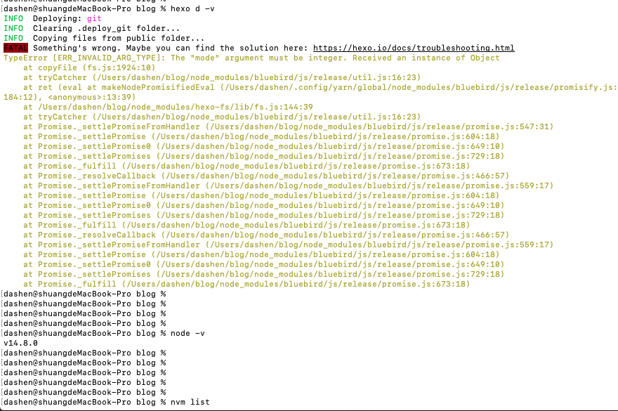
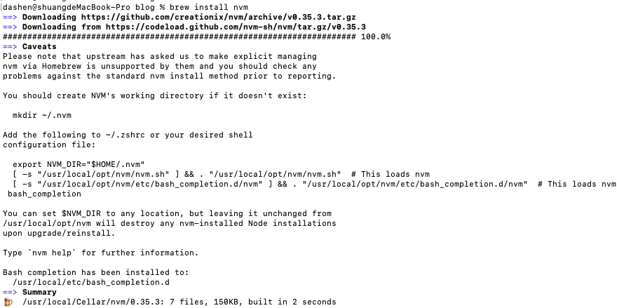
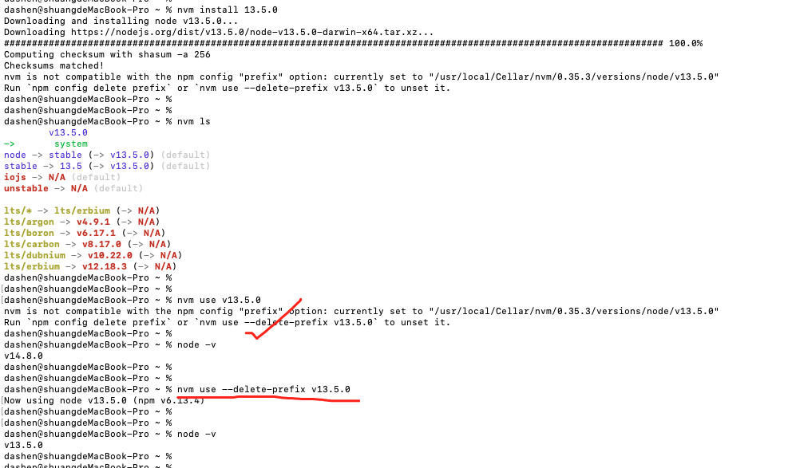

### 1.起

<br>

将原机器的博客目录打包,通过scp等方式传到新机器

<br>

---

<br>

### 2.承

<br>

新机器安装brew,并用brew安装node&npm

**使用 `npm install hexo` 安装hexo**


<br>

---

<br>

### 3.转

<br>


将博客解压

进行编辑后,使用`hexo g`生成静态文件.

(还要将新机器的公钥,贴在github/gitee的设置里)


在`hexo d` 进行部署时,可能会出现错误,如图




[搜索可知](http://www.coldcrack.me/2020/07/07/Node14+Hexo/),是因为此时node版本为14+(原机器node版本为v13.5.0),而hexo版本较低,可通过升级hexo解决.

<br>


~~但因为有轻松控制node版本的nvm,降低node的版本显然更容易~~



~~将`source /usr/local/opt/nvm/nvm.sh` 写入.zshrc或bash_profile~~

<br>




~~可参考 [MAC系统使用Homebrew安装nvm](https://www.jianshu.com/p/bdbc51fa8ce6)~~

~~[nvm与npm配置“前缀”选项不兼容](https://www.jianshu.com/p/8338d6969000)~~


<br>

比较好的解决流程是:

- (卸载掉已安装的node和nvm), 使用传统方式安装nvm(因为默认写入的路径对于zsh有误)

- 再执行`nvm install 13.5.0`


<br>

此时再`hexo d`可成功执行


注意:node版本的切换仅对当前命令行窗口有效,可配置全局生效

---

<br>

### 4.合

<br>


<br>


图片独立部署在gitee上.记得修改**node_modules**文件夹中*hexo-asset-image*中的index.js,替换为如下:

```javascript
'use strict';
var cheerio = require('cheerio');

// http://stackoverflow.com/questions/14480345/how-to-get-the-nth-occurrence-in-a-string
function getPosition(str, m, i) {
    return str.split(m, i).join(m).length;
}

hexo.extend.filter.register('after_post_render', function(data) {
    var config = hexo.config;
    if (config.post_asset_folder) {
        var link = data.permalink;
        var beginPos = getPosition(link, '/', 3) + 1;
        // In hexo 3.1.1, the permalink of "about" page is like ".../about/index.html".
        var endPos = link.lastIndexOf('/') + 1;
        link = link.substring(beginPos, endPos);

        var toprocess = ['excerpt', 'more', 'content'];
        for (var i = 0; i < toprocess.length; i++) {
            var key = toprocess[i];

            var $ = cheerio.load(data[key], {
                ignoreWhitespace: false,
                xmlMode: false,
                lowerCaseTags: false,
                decodeEntities: false
            });


            //新增
            var newLink = data.permalink;
            var infoArr = link.split("/")
            var year = infoArr[0]
            var month = infoArr[1]


            $('img').each(function() {
                // For windows style path, we replace '\' to '/'.
                var src = $(this).attr('src').replace('\\', '/');
                if (!/http[s]*.*|\/\/.*/.test(src)) {
                    // For "about" page, the first part of "src" can't be removed.
                    // In addition, to support multi-level local directory.
                    var linkArray = link.split('/').filter(function(elem) {
                        return elem != '';
                    });
                    var srcArray = src.split('/').filter(function(elem) {
                        return elem != '';
                    });
                    if (linkArray[linkArray.length - 1] == srcArray[0])
                        srcArray.shift();
                    src = srcArray.join('/');


                    //region 爽哥调试用
                    // var fs = require("fs");
                    //
                    // console.log("准备写入文件");
                    // fs.writeFile('input.txt', '我是通过fs.writeFile写入文件的内容',  function(err) {
                    //     if (err) {
                    //         return console.error(err);
                    //     }
                    // });
                    //
                    //
                    // fs.writeFile('input123.txt', newLink[0],  function(err) {
                    //     if (err) {
                    //         return console.error(err);
                    //     }
                    // });
                    //
                    //
                    // fs.writeFile('input456.txt', newLink[1],  function(err) {
                    //     if (err) {
                    //         return console.error(err);
                    //     }
                    // });
                    //
                    //
                    //
                    // fs.writeFile('input789.txt', newLink.toString(),  function(err) {
                    //     if (err) {
                    //         return console.error(err);
                    //     }
                    // });
                    //
                    // fs.writeFile('input000.txt', infoArr,  function(err) {
                    //     if (err) {
                    //         return console.error(err);
                    //     }
                    // });
                    //
                    //
                    //
                    //
                    // fs.writeFile('input9999.txt', year,  function(err) {
                    //     if (err) {
                    //         return console.error(err);
                    //     }
                    // });
                    //
                    //
                    // fs.writeFile('input99990000.txt', month,  function(err) {
                    //     if (err) {
                    //         return console.error(err);
                    //     }
                    // });


                    // console.log("shuangge1:",newLink[0])
                    // console.log("shuangge2:",newLink[1])
                    //   if (newLink[0] > "2020" && newLink[1] > "05") {

                    //endregion


                    // 有朝一日码云倒闭,还可以用下面这行代码快速换回github的图片
                    // $(this).attr('src', '/' + link + src);

                    // 下面这行为码云的博客图片地址,后来仓库容量超过了1G,注释掉这行,用下面的办法
                    //$(this).attr('src', 'https://geekblog.gitee.io/' + link + src);

                    // 2020.06.01新增,解决gitee仓库超过1G问题;使图片分开存储

                    //if (year >= "2018" && month > "03") {
                    if (year >= "2018" || year == "2015") {
                        $(this).attr('src', 'http://geekblog.gitee.io/blog-img/' + link + src)

                    } else {
                        $(this).attr('src', 'https://geekblog.gitee.io/' + link + src);
                    }


                }
            });
            data[key] = $.html();
        }
    }
});

```

