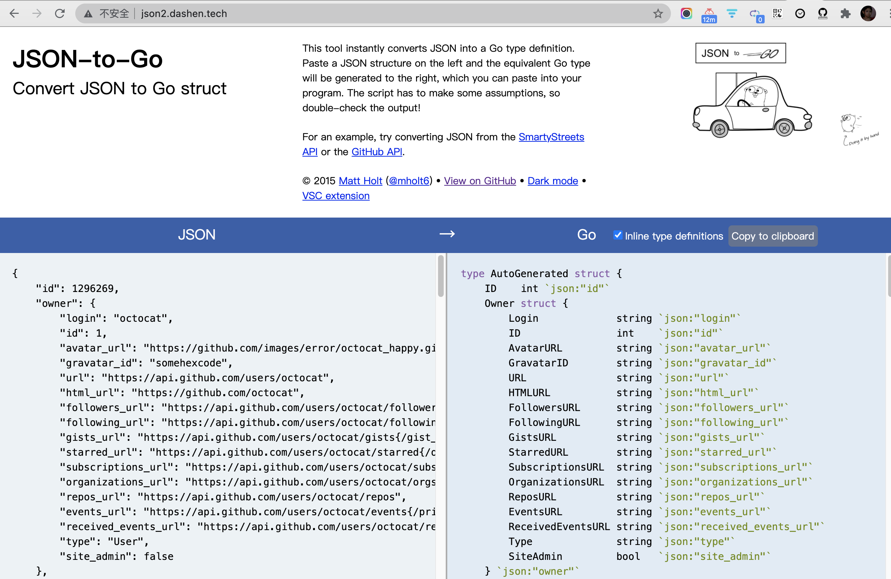

### [JSON-to-Go](http://json2.dashen.tech/)

<br>


Convert JSON to Go struct


右键网页另存为，会将html文件和js文件夹拷贝到本地。

将其上传服务器，改一下资源文件夹的名字，以及html文件里引用的地址。然后添加nginx配置

项目在`/home/ubuntu/tools/json2go`目录下，nginx配置为`tool_json2to.conf`


发现没有像预期中的，查看错误日志


```nginx
2021/07/07 21:16:53 [crit] 18652#0: *45152 stat() "/home/ubuntu/tools/json2go/static/common.js" failed (13: Permission denied), client: 120.xxx.xxx.xx, server: json2.dashen.tech, request: "GET /static/common.js HTTP/1.1", host: "json2.dashen.tech", referrer: "http://json2.dashen.tech/"
2021/07/07 21:16:53 [crit] 18652#0: *45152 stat() "/home/ubuntu/tools/json2go/static/common.js" failed (13: Permission denied), client: 120.xxx.xxx.xx, server: json2.dashen.tech, request: "GET /static/common.js HTTP/1.1", host: "json2.dashen.tech", referrer: "http://json2.dashen.tech/"
```


资源请求失败


执行 `chmod -R 777 static/`， 如预期正常显示





<br>


---


<br>

### [在线json解析](http://json.dashen.tech/)


<br>

路数如上，项目在`/home/ubuntu/tools/json`目录下，nginx配置为`tool_json.conf`


并在nginx配置文件里给其添加访问认证(设置后需要输入账号密码才可访问该资源)

<br>


---


<br>