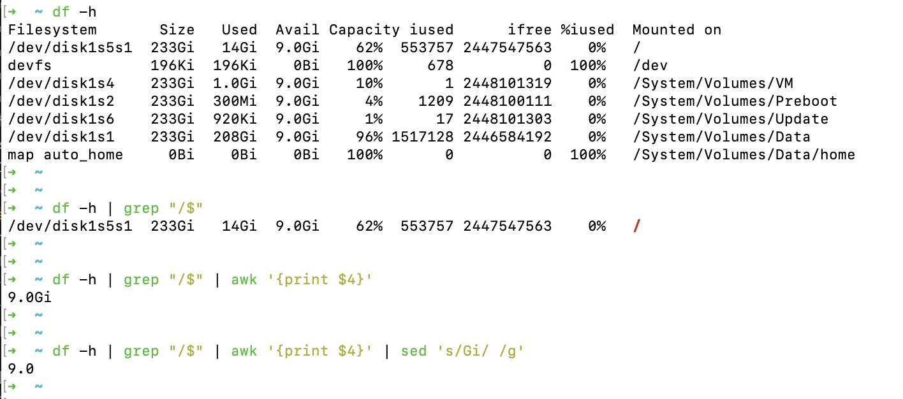

使用下载工具时，经常出现磁盘空间已满，无法下载的情况。 

使用shell写一个监控，每2分钟执行一次。判断当前磁盘的空间，低于2G时，关闭下载软件。


<br>


### 获取空间大小

<br>

```ru
➜  ~ df -h                                                
Filesystem       Size   Used  Avail Capacity iused      ifree %iused  Mounted on
/dev/disk1s5s1  233Gi   14Gi  9.0Gi    62%  553757 2447547563    0%   /
devfs           196Ki  196Ki    0Bi   100%     678          0  100%   /dev
/dev/disk1s4    233Gi  1.0Gi  9.0Gi    10%       1 2448101319    0%   /System/Volumes/VM
/dev/disk1s2    233Gi  300Mi  9.0Gi     4%    1209 2448100111    0%   /System/Volumes/Preboot
/dev/disk1s6    233Gi  920Ki  9.0Gi     1%      17 2448101303    0%   /System/Volumes/Update
/dev/disk1s1    233Gi  208Gi  9.0Gi    96% 1517128 2446584192    0%   /System/Volumes/Data
map auto_home     0Bi    0Bi    0Bi   100%       0          0  100%   /System/Volumes/Data/home
```


<br>

可通过 

`df -h | grep "/$" | awk '{print $4}' | sed 's/Gi/ /g'`

获取当前磁盘的剩余空间





<br>

详细可参考 [linux三剑客](https://dashen.tech/2017/02/17/linux%E4%B8%89%E5%89%91%E5%AE%A2%E4%B9%8Bawk-%E5%BF%8C%E6%B1%82%E5%85%A8%E5%B0%BE%E5%A4%A7%E4%B8%8D%E6%8E%89-%E7%AE%80%E6%98%8E%E5%AE%9E%E7%94%A8%E7%89%88/)


<br>


---

<br>

### 获取下载软件的pid并关闭

<br>

通过

`ps -ef | grep /Applications/Thunder.app/Contents/MacOS/Thunder |  grep -v grep | cut -c 7-15`

可得到pid。

<br>

使用

`ps -ef | grep /Applications/Thunder.app/Contents/MacOS/Thunder |  grep -v grep | cut -c 7-15 | xargs kill -9`

关闭该进程。


命令详解 参见 [批量kill掉包含某个关键字的进程](https://www.cnblogs.com/adolfmc/p/11977007.html)


<br>


---

<br>

### 写成shell脚本，并配置定时任务

<br>

#### shell脚本

<br>

```ru
#!/bin/bash


spareDisk=$(df -h | grep "/$" | awk '{print $4}' | sed 's/Gi/ /g')

echo '当前剩余空间'$spareDisk'GB'

#echo "scale=0; ($spareDisk - 2)" | bc 


safeDisk=$(echo "scale=0; ($spareDisk - 2)/1" | bc)

echo '当前空间离2GB还剩'$safeDisk'GB'


if [ $safeDisk -gt 0 ]
then
    echo '安全'
else
    ps -ef | grep /Applications/Thunder.app/Contents/MacOS/Thunder |  grep -v grep | cut -c 7-15 | xargs kill -9
    echo '空间不足，已关闭软件'
fi

```


<br>


#### 配置crontab


<br>


**crontab -e**

`*/3 * * * * /Users/xxxxx/kill.sh > space_check.log`


每3分钟检查一次~


<br>


参考：


[Linux bc 命令](https://www.runoob.com/linux/linux-comm-bc.html)

bc 命令是任意精度计算器语言，通常在linux下当计算器用。

scale=2 设小数位，2 代表保留两位:

```sh
$ echo 'scale=2; (2.777 - 1.4744)/1' | bc
1.30
```

(/1是为使精确到小数点后2位生效)

