全文参考自 [阮一峰-命令行通配符教程](http://www.ruanyifeng.com/blog/2018/09/bash-wildcards.html)

 

通配符早于正则表达式出现,可以看作是原始的正则表达式. 其功能没有正则那么强大灵活,而胜在简单和方便.

 

### - 字符

 

切回上一个路径/分支

如图:

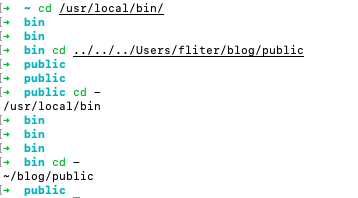 

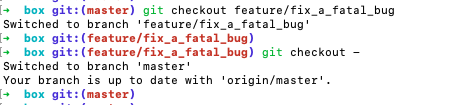 

 

---

 

### !!

 

代表上一个命令, 如图:

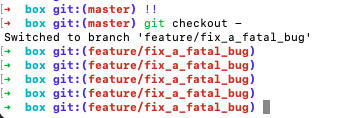 

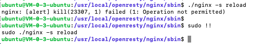 

[Linux中“!"的神奇用法](https://www.cnblogs.com/bianchengzhuji/p/10170315.html)

在zsh下, !3,表示history中的第3个命令

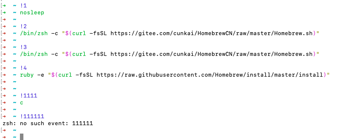 

 

---

 

### ?

 

?字符代表单个字符;

如果想匹配两个字符,就需要??

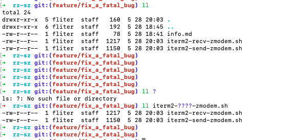 

 

---

 

### *

 

*代表任意数量的字符(包括空字符)

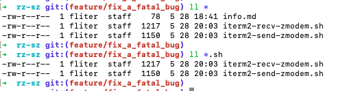 

想要列出某个文件夹下所有子目录里的.png文件,可使用

`ls */*.png`

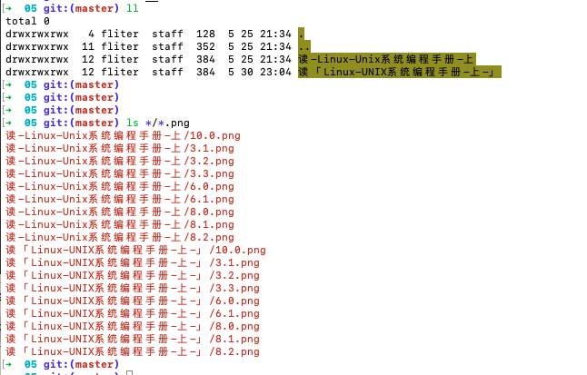 

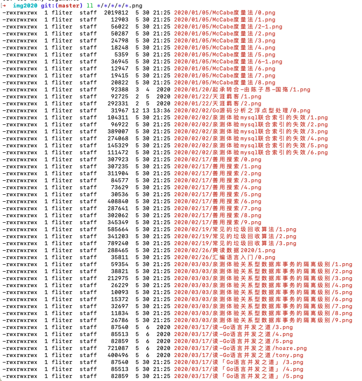 

 

---

 

### [...]

 

[...]匹配方括号之中的任意一个字符, 如[aeiou]可以匹配五个元音字母

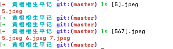 

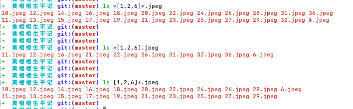 

[start-end]表示一个连续的范围

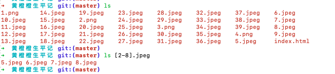 

 

---

 

### [^...] ~~和 [!...]~~

 

[^...]和[!...]表示匹配不在方括号里面的字符（不包括空字符）, 这两种写法等价
(对zsh不适用)

 

 

---

 

### {...}

 

{...} 表示匹配大括号里面的所有模式,模式之间使用逗号分隔

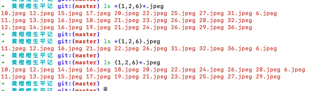 

 

---

 

### {start..end} 

 

{start..end}会匹配连续范围的字符

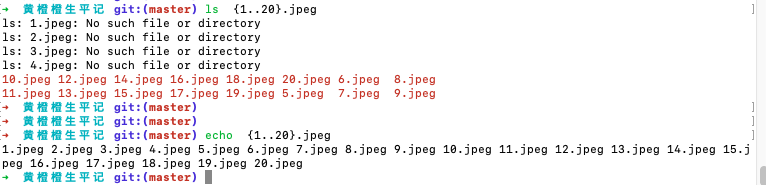 

可以组合出复杂的匹配模式

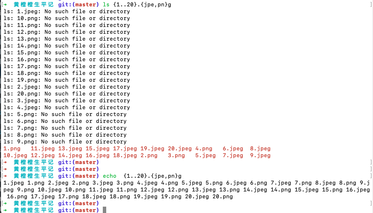 

 

---

 
