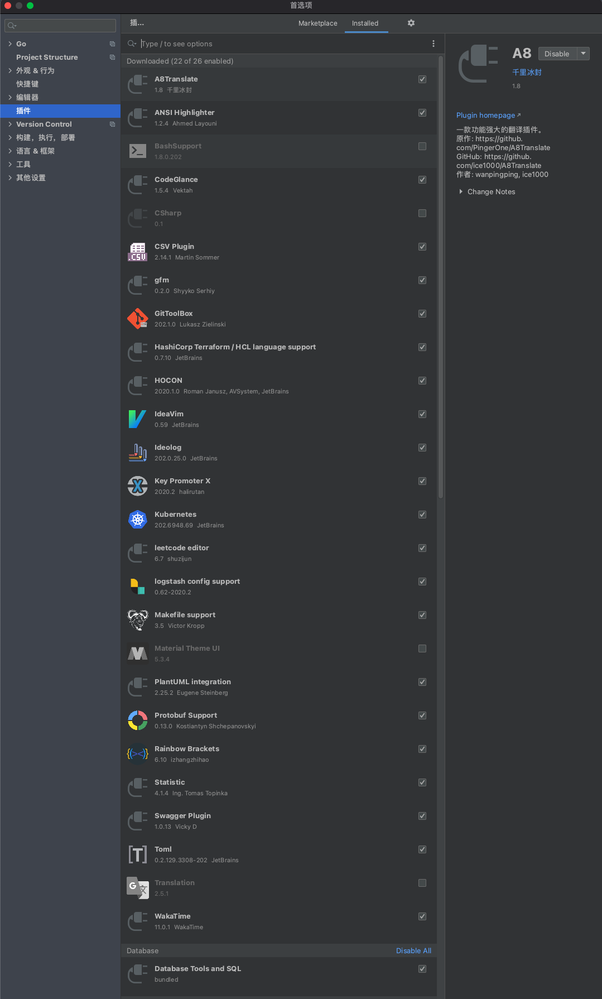
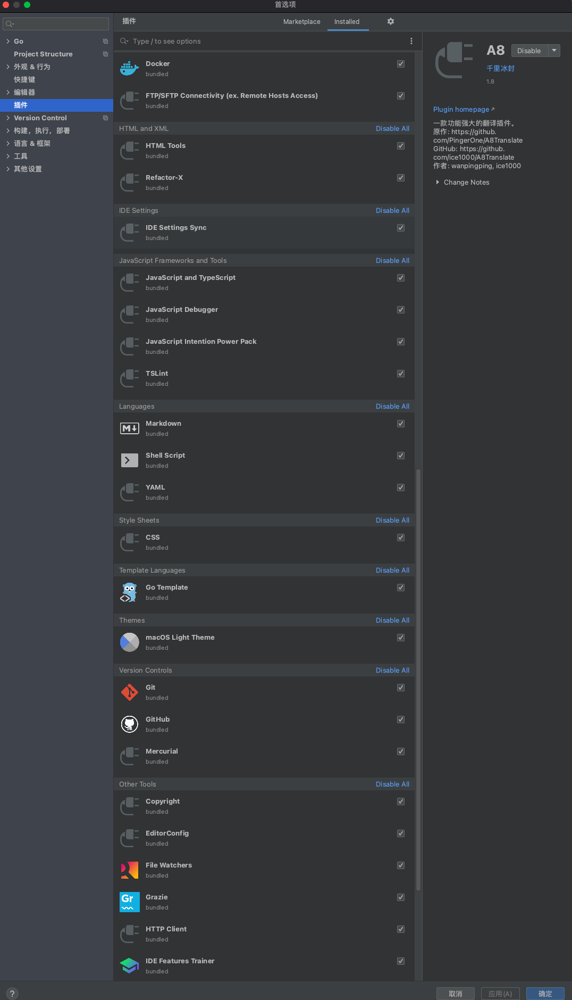
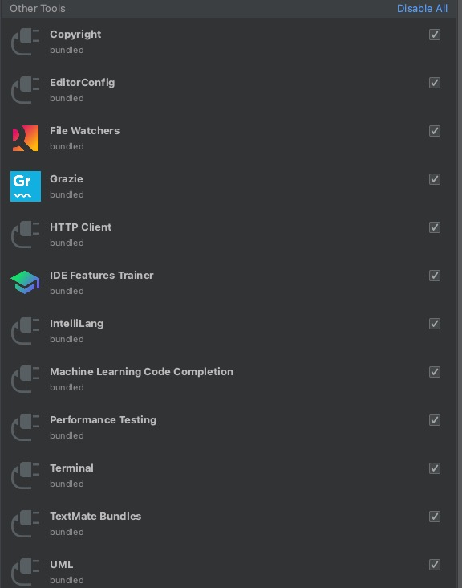
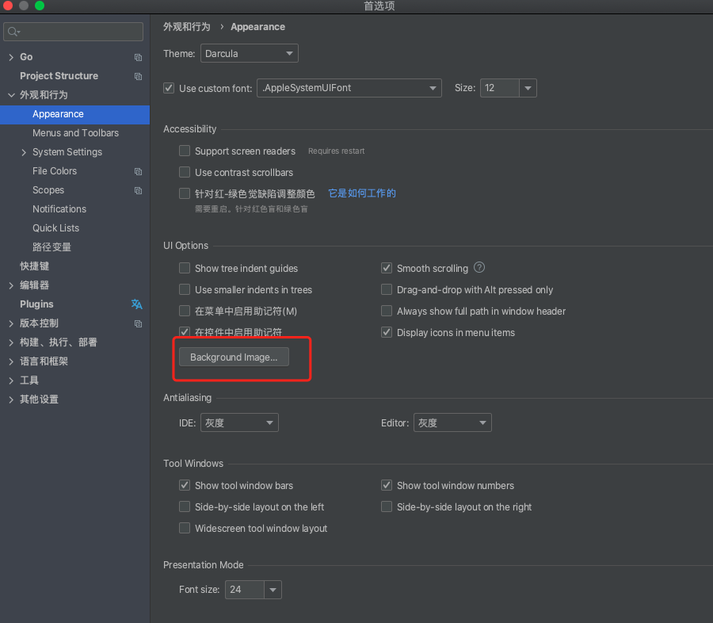
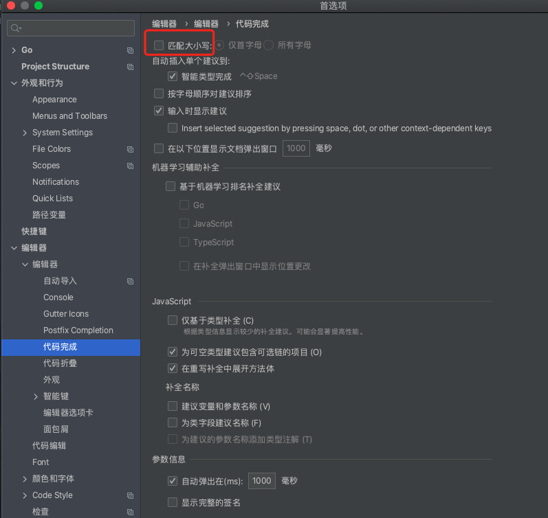
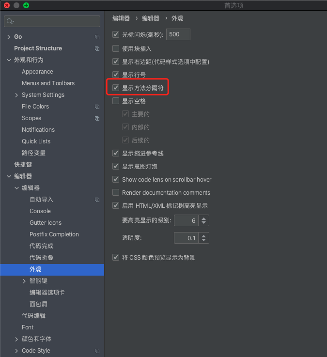

### 曾装过的一些插件:

 

 

 

 

 

---

 

### 强烈推荐:

 

#### Rainbow Brackets

 

如 彩虹括号 其名,可以使层层嵌套的`{}`,`()`显示为不同的色彩,对服务端开发,这个插件不要太有用

---

 

#### WakaTime 

 

可以记录在每种编程语言,每个项目上花费的时间.

该插件同时支持VSCode,iTerm2,甚至是Chrome,Word等

更多可参考其 [官网](https://wakatime.com/)

[统计代码的网站](https://note.youdao.com/web/#/file/recent/note/WEBfaa5d9c24332903561dcc9ad22182f03/?search=WakaTime)

---

 

#### CodeGlance 

 

可以使IDE右侧,出现像 *Sublime* 那样的全局预览

---

 

#### IDE本身的几处功能/设置 

 

1. 在此选一张意境高远望之心旷神怡的图片作为背景
 

 

2. 勾掉 *匹配大小写*, 这样在搜索时,不会区分关键词的大小写
 

 

3. 勾选 * 显示方法分隔符*, 这样每个func之间,便会出现一条分隔线
 

 

另外,还有几个tips,如 可以设置全局软换行.

双击shift可以搜索全部,在解决git冲突时,可以非常方便跳到相应文件,而不用一层层地点击

 

---

### 建议安装:

 

#### Key Promoter X

 

会提示某个操作有快捷键

 

---

 

#### Chinese(Simplified) Language Pack EAP

 

比较便捷的IDE汉化方案

 

---

 

#### GitToolBox

 

安装之后,在代码中会显示某一行提交的时间和人员信息

 

---

 

#### Material Theme UI

 

一系列 *有些花里胡哨* 的主题

 

---

 

#### Statistic

 

统计语言种类和代码行数,类似命令行工具cloc

 

---

