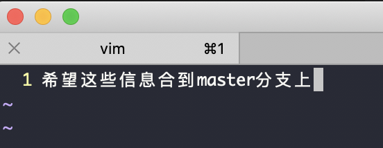

 

git cherry-pick可以理解为”挑拣”提交，它会获取X分支的某次提交，并作为一个新的提交引入到Y分支上。 当我们需要在本地合入其他分支的提交时，如果我们不想对整个分支进行合并，而是只想将某一次提交合入到本地当前分支上，那么就要使用git cherry-pick了。

从master分支切出一个新分支dev_cui,两个分支各自向前.
 

dev_cui分支上进行了三次提交,分别为commit1,commit2,commit3, 

第一次提交:

 

第二次提交:

 

第三次提交:

 

现在我想把dev_cui分支的第二次提交commit2合并到master上:

三次提交的commit id为:

commit1 :`9dfaaab44715d1cc27bbbab638863e5076cb5a5e` 
commit2 :`298b7346dc77387e20ac892ff5ec548813f714a3` 
commit3 :`cb0e1872c60286cf243aec01a064a4a75193a28a`
 

切换到master分支,执行  `git cherry-pick 298b7346dc77387e20ac892ff5ec548813f714a3`

因为master分支没有改动,故而将dev_cui分支的某次提交合入master不会发生冲突,这是最简单的情况.

当master也发生了修改,且修改的文件,和这次要合入的commit改动的是同一个时,就会出现冲突,情况要复杂一些.